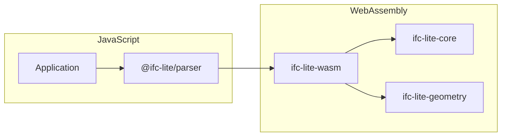

# WASM Bindings API

API documentation for the WebAssembly bindings.

## Overview

IFClite provides WebAssembly bindings for high-performance parsing and geometry processing in the browser.



## Loading the WASM Module

### Automatic Loading

The TypeScript packages handle WASM loading automatically:

```typescript
import { IfcParser } from '@ifc-lite/parser';

// WASM is loaded automatically
const parser = new IfcParser();
await parser.parseColumnar(buffer);
```

### Manual Loading

For custom setups:

```typescript
import init, { IfcAPI } from '@ifc-lite/wasm';

// Initialize WASM
await init();

// Or with custom URL
await init('/path/to/ifc-lite_bg.wasm');

// Create API instance
const api = new IfcAPI();
```

## IfcAPI Class

Main entry point for WASM functionality.

### Constructor

```typescript
class IfcAPI {
  constructor();
}
```

### Methods

The methods below reflect the real `IfcAPI` surface (see `packages/wasm/pkg/ifc-lite.d.ts`). There is no single `parse()` call: scanning, geometry, and export are separate entry points.

#### Entity Scanning

SIMD-accelerated scanners that return entity references for the data-model layer to decode.

```typescript
scanEntitiesFast(content: string): any;         // all entities, from a decoded string
scanEntitiesFastBytes(data: Uint8Array): any;   // all entities, straight from bytes (no TextDecoder)
scanGeometryEntitiesFast(content: string): any; // only entities that carry geometry
```

**Example:**
```typescript
const api = new IfcAPI();
const text = await fetch('model.ifc').then(r => r.text());
const entities = api.scanEntitiesFast(text);
```

#### Geometry Pipeline

Geometry is produced in two phases: a pre-pass over the file, then one or more batched mesh-production calls.

```typescript
buildPrePassOnce(data: Uint8Array): any;
buildPrePassStreaming(
  data: Uint8Array,
  onEvent: (event: unknown) => void,
  chunkSize: number,
  disabledTypeNames: string[] | null,
  skipTypeGeometry: boolean,
): any;

// jobsFlat is [id, start, end] triples from the pre-pass; the trailing args
// carry unit scale, RTC offset, void keys, and styles (see the .d.ts).
processGeometryBatch(
  data: Uint8Array,
  jobsFlat: Uint32Array,
  unitScale: number,
  /* rtcX, rtcY, rtcZ, needsShift, void + style + material args */
): MeshCollection;
```

`processGeometryBatchInstanced` (returns an IFNS instancing shard as a `Uint8Array`) and `processGeometryBatchPartitioned` (returns a `PartitionedBatch`) are variants of the same call. Each returned `MeshCollection` exposes `length`, `get(i)` / `takeMesh(i)`, and RTC offsets (see Data Types).

To avoid re-copying the file bytes on every batch, call `setSourceBytes(data)` once and then use the `FromSource` twins, which read the held bytes and are byte-for-byte identical to the legacy calls:

```typescript
setSourceBytes(data: Uint8Array): void;
processGeometryBatchFromSource(jobsFlat, unitScale, /* same trailing args */): MeshCollection;
processGeometryBatchPartitionedFromSource(jobsFlat, unitScale, /* ... */): PartitionedBatch;
```

#### Export

Each exporter takes the raw IFC bytes (or already-produced meshes) and returns a `Uint8Array`.

```typescript
exportGlb(content, includeMetadata, hidden, isolated, hiddenTypesCsv, lit?): Uint8Array;
exportGlbFromMeshes(/* flattened MeshData buffers */): Uint8Array;
exportKmz(glb, latitude, longitude, altitude, xAxisAbscissa, xAxisOrdinate, name): Uint8Array;
exportObj(content, includeNormals, hidden, isolated): Uint8Array;
exportCsv(content, mode, delimiter, includeProperties): Uint8Array;
exportJson(content, pretty, includeProperties, includeQuantities): Uint8Array;
exportJsonld(content, context, includeProperties, includeQuantities, pretty, included): Uint8Array;
exportIfcx(content, onlyKnownProperties, pretty): Uint8Array;
exportStep(content, schema, included, mutationsJson): Uint8Array;
exportMerged(concatenated, lengths, schema): Uint8Array;
exportHbjson(content, name): Uint8Array;
```

**Example:**
```typescript
const obj = api.exportObj(ifcContent, true, new Uint32Array(), new Uint32Array());
const hbjson = api.exportHbjson(ifcContent, 'my_model');
```

`exportGlb` fails closed: when the visible mesh set is empty it throws an `Error` whose message starts with `NO_RENDER_GEOMETRY` rather than returning an empty GLB.

#### Other Parsing

```typescript
extractProfiles(content: string, modelIndex: number): ProfileCollection;
parseGridLines(content: string): Float32Array;                        // flat line-list vertices
parseGridAxes(content: string): GridAxisCollection;                   // axes with tags
parseAlignmentLines(content: string): Float32Array;
parseSymbolicRepresentations(content: string): SymbolicRepresentationCollection;
diagnoseGeometry(content: Uint8Array): any;                           // CSG / opening diagnostics
```

#### Diagnostics and Tuning

```typescript
getPipelineDiagnostics(): any;
getMemory(): any;

setEntityIndex(ids: Uint32Array, starts: Uint32Array, lengths: Uint32Array): void;
setMergeLayers(enabled: boolean): void;
setSkipSmallCuts(on: boolean): void;
setRectParamFastPath(enabled: boolean): void;
setTessellationQuality(level?: string | null): void;
setComputeGeometryHashes(tolerance?: number | null): void;
setReferencedRepmaps(ids: Uint32Array): void;
setMappedInstancePlan(sourceIds: Uint32Array): void;
setInstantiatedTypeIds(ids: Uint32Array): void;
setMaterialLayerIndex(/* per-element layer buildup columns, see the .d.ts */): void;
clearPrePassCache(): void;
```

#### Getters

```typescript
readonly version: string;   // build version string
readonly is_ready: boolean; // true once the API is initialized
```

### Other Exported Classes

Beyond `IfcAPI` and the mesh types below, the module exports `ClashSession` / `ClashRunResult` (native clash detection over ingested mesh buffers), `GridAxisCollection` / `GridAxisJs` (parsed grid axes), `ProfileCollection` / `ProfileEntryJs`, `PartitionedBatch`, `MeshOutlineJs`, `SpacePlateHandle` (interactive space-sketch topology), and the `Symbolic*` classes (`SymbolicRepresentationCollection`, `SymbolicPolyline`, `SymbolicCircle`, `SymbolicText`, `SymbolicFillArea`). See `packages/wasm/pkg/ifc-lite.d.ts` for their full definitions.

## Data Types

### MeshCollection

Returned by `processGeometryBatch`. Holds the batch's meshes plus RTC and totals.

```typescript
class MeshCollection {
  readonly length: number;
  get(index: number): MeshDataJs | undefined;      // clones (non-destructive)
  takeMesh(index: number): MeshDataJs | undefined; // moves out (read-once, faster)
  hasRtcOffset(): boolean;
  readonly rtcOffsetX: number;
  readonly rtcOffsetY: number;
  readonly rtcOffsetZ: number;
  readonly totalVertices: number;
  readonly totalTriangles: number;
  readonly buildingRotation: number | undefined;
  readonly diagnostics: any;
  // Geometry-diff hashes, populated when setComputeGeometryHashes() is on
  readonly geometryHashIds: Uint32Array;
  readonly geometryHashValues: BigUint64Array;
  readonly geometryHashCount: number;
}
```

### MeshDataJs

A single triangulated mesh. All typed arrays are copied to JS on access.

```typescript
class MeshDataJs {
  readonly expressId: number;
  readonly ifcType: string;           // e.g. "IfcWall"
  readonly positions: Float32Array;   // xyz triplets
  readonly normals: Float32Array;     // xyz triplets
  readonly indices: Uint32Array;      // triangle indices
  readonly uvs: Float32Array;         // uv pairs (empty when untextured)
  readonly color: Float32Array;       // [r, g, b, a]
  readonly origin: Float64Array;      // per-element local-frame origin (metres)
  readonly vertexCount: number;
  readonly triangleCount: number;
  readonly geometryClass: number;     // 0 = occurrence, 1 = orphan type, 2 = instanced type

  // Optional capture of the local frame (undefined when not captured)
  readonly localBounds: Float32Array | undefined;   // object-space AABB [minX..maxZ]
  readonly localToWorld: Float64Array | undefined;  // resolved placement, row-major 4x4

  // Surface textures (empty / false when untextured)
  readonly hasTexture: boolean;
  readonly textureRgba: Uint8Array;   // decoded RGBA8 bytes (width*height*4)
  readonly textureWidth: number;
  readonly textureHeight: number;
  readonly textureRepeatS: boolean;
  readonly textureRepeatT: boolean;
  readonly shadingColor: Float32Array | undefined;  // authored SurfaceColour, when distinct
}
```

### Pre-pass Streaming Events

`buildPrePassStreaming` invokes its callback with one of:

```typescript
type PrePassEvent =
  | { type: 'meta'; unitScale: number; rtcOffset: [number, number, number]; needsShift: boolean; buildingRotation?: number }
  | { type: 'jobs'; jobs: Uint32Array }   // [id, start, end] triples
  | { type: 'complete'; totalJobs: number }
  // Auxiliary events — carry data the pre-pass already computed so callers can
  // skip a second file scan. Consumers that only need geometry jobs can ignore
  // them. Each shape below lists its principal fields; the styles / columns
  // events also carry additional material-plumbing arrays (see
  // `geometry-parallel.ts`).
  | { type: 'entity-index'; ids: Uint32Array; starts: Uint32Array; lengths: Uint32Array }
  | { type: 'styles'; styleIds: Uint32Array; styleColors: Uint8Array; voidKeys: Uint32Array; voidCounts: Uint32Array; voidValues: Uint32Array }
  | { type: 'prepass-columns'; referencedRepmaps: Uint32Array; instantiatedTypeIds: Uint32Array; mliElementIds: Uint32Array };
```

The auxiliary events (`entity-index`, `styles`, `prepass-columns`) carry the scanned entity index, style colours, and pre-pass column data. Type the callback against the full union above so exhaustive handling does not silently miss them.

## Error Handling

WASM functions surface failures as standard JavaScript `Error` objects (a Rust `Result::Err` is mapped across the boundary). Wrap calls that can fail:

```typescript
try {
  const glb = api.exportGlb(content, true, new Uint32Array(), new Uint32Array(), '');
} catch (error) {
  if (error instanceof Error) {
    console.error('Export error:', error.message);
  }
}
```

### Sentinel Messages

Some boundaries fail closed with a sentinel-prefixed message so callers can distinguish an expected empty result from a real failure. For example, `exportGlb` throws an `Error` whose message starts with `NO_RENDER_GEOMETRY` when the visible mesh set is empty, instead of returning a structurally valid but empty GLB.

## Performance Tips

### 1. Stream the Pre-pass for Large Files

```typescript
// Good: stream jobs as the file is scanned (time-to-first-geometry drops sharply)
api.buildPrePassStreaming(bytes, onEvent, 512, null, false);

// Avoid on very large files: a single blocking pre-pass over the whole file
api.buildPrePassOnce(bytes);
```

### 2. Read Each Mesh Once

```typescript
// Good: takeMesh moves the mesh out (one fewer vertex-data copy per mesh)
const meshes = api.processGeometryBatch(bytes, jobsFlat, unitScale /* ... */);
for (let i = 0; i < meshes.length; i++) {
  const mesh = meshes.takeMesh(i);
  if (mesh) uploadMesh(mesh);
}
```

### 3. Release Memory

```typescript
// Clean up when done
api.free();
```

## Browser Compatibility

| Feature | Chrome | Firefox | Safari | Edge |
|---------|--------|---------|--------|------|
| WebAssembly | 57+ | 52+ | 11+ | 16+ |
| WASM SIMD | 91+ | 89+ | 16.4+ | 91+ |
| Streaming | 61+ | 58+ | 15+ | 16+ |
| Threads | 74+ | 79+ | 14.1+ | 79+ |

## Module Size

The built artifacts land in `packages/wasm/pkg/` (`ifc-lite_bg.wasm` binary plus `ifc-lite.js` glue). `scripts/build-wasm.sh` targets a 1100 KB budget for the single-thread bundle and warns when the binary exceeds it (`wasm-opt` is disabled in the crate's wasm-pack profile). The threaded bundle is built separately and carries no budget. Sizes vary by build profile and target.

## Building from Source

```bash
# Install wasm-pack
cargo install wasm-pack

# Build WASM module
cd rust/wasm-bindings
wasm-pack build --target web --out-name ifc-lite --release

# Output files
# pkg/ifc-lite.js
# pkg/ifc-lite_bg.wasm
# pkg/ifc-lite.d.ts
```

### Build Targets

| Target | Output | Use Case |
|--------|--------|----------|
| `web` | ES modules | Modern browsers |
| `bundler` | CommonJS | Webpack/Rollup |
| `nodejs` | Node.js | Server-side |
| `no-modules` | Global | Script tag |
