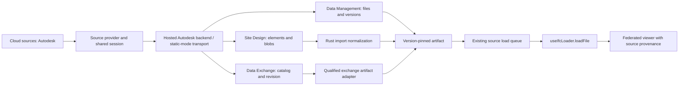

# Autodesk cloud sources: research and delivery plan

Status: cloud-source workflows and native import implementations delivered locally on 2026-10-04. The Railway gateway and Windows worker are running qualification builds, and the maintainer confirmed real preview sign-in. The merged production rollout, public viewer activation and account-backed source-import acceptance remain pending.

## Current implementation

The viewer registers `@ifc-lite/source-autodesk`, with public PKCE configuration or the same-origin `apps/autodesk-service` gateway. It browses account projects/folders, separates exchanges, resolves Docs project/folder and Site Design links, remembers sites per identity, offers file/proposal history selection, and displays resource/fidelity details. Downloads use the canonical loader with pinned revision checks, preparation/download progress, updates and cancellation. Hosted tokens remain server-side; static tokens remain in memory.

The hosted service includes an immutable Forma element/blob acquisition adapter and the `rust/cloud-import` native IFCX converter. It preserves child-key occurrences, GLB/element coordinate transforms, geometry, color/opacity and source properties. Projected SRID/reference-point placement enters the existing viewer georeference/federation path. Visible terrain volume meshes use the same path. Textures, vertex colors and 2D terrain overlays are disclosed limitations; skins/morph targets and physical graph/extrusion representations without a volume mesh fail explicitly.

`apps/autodesk-exchange-worker` compiles against Autodesk Data Exchange SDK 8.0.0 for Windows/.NET 8. It exports native IFC using the signed-in user's token on stdin, in an isolated process/workspace, and checks Docs version and SDK snapshot before/after export. The SDK's whole-exchange API does not take a revision parameter: historical versions are reference-only, and changed/current-version mismatch exports are refused. This constraint supersedes earlier speculative historical whole-exchange export proposals below.

Offline checks exercise real binary GLB → Rust → IFCX parser behavior, source/session invariants, UI version selection, Rust workspace tests/Clippy, and SDK compilation/workspace guards. These establish local behavior, not account provisioning, live SDK export fidelity, or production readiness on an untested Autodesk project. The Windows and Linux native-contract CI lanes require no Autodesk credentials.

Deployment artifacts provide a single-instance Linux Forma service plus Caddy HTTPS/static viewer gateway. The [Railway runbook](https://github.com/LTplus-AG/ifc-lite/blob/main/deploy/autodesk/railway.md) targets a separate Autodesk service in the existing ifc-lite-server production project, leaving rooms, sharing and database services unchanged. A Vercel viewer can use a fixed same-origin rewrite to that service. Session-owned imports return 202 before conversion, use short status polls and download a pinned, single-use artifact; two slots bound conversion, retained artifacts and downloads. Railway health checks use unauthenticated `/healthz` without creating sessions or calling Autodesk, and the service honors the injected PORT. Railway hosts Docs/Forma; the delivered exchange executable still requires Windows, and an authenticated remote Windows job transport now connects it to the Railway gateway. Full three-source deployment runs the Node service and both native executables on Windows behind the viewer's same-origin HTTPS proxy. The bounded in-memory session store signs users out on restart; horizontal replicas require a shared store/refresh coordinator. One deployment APS application registration is required even though all data access uses end-user Autodesk accounts. The isolated Railway service and port-3002 hostname are provisioned with settings read back; the backend is now running, with APS variable presence verified; frontend activation and live authenticated acceptance remain open.

The remaining qualification items are account-backed source-versus-import geometry/property/coordinate checks, regional download-host verification, appearance/overlay coverage from real Forma fixtures, and SDK IFC fidelity checks on real exchanges. See [first setup](https://github.com/LTplus-AG/ifc-lite/blob/main/deploy/autodesk/first-setup.md), [provider setup](https://github.com/LTplus-AG/ifc-lite/blob/main/packages/source-autodesk/README.md), [service setup](https://github.com/LTplus-AG/ifc-lite/blob/main/apps/autodesk-service/README.md), [the converter](https://github.com/LTplus-AG/ifc-lite/blob/main/rust/cloud-import/README.md) and [the SDK worker](https://github.com/LTplus-AG/ifc-lite/blob/main/apps/autodesk-exchange-worker/README.md).

### Local verification evidence

- The native contract in `apps/autodesk-service/test/native.test.ts` sends a binary GLB through the executable and real IFCX parser, checking repeated selectable occurrences, transformed positions, projected placement, shared blob acquisition and anonymous signed downloads. The fixture exercises implementation invariants; it is not a model from an Autodesk account.
- `rust/cloud-import/src/tests.rs` checks materials/properties/transforms, missing/cyclic references, deep chains and excessive queued repeated instances. Root Rust workspace tests and strict all-target Clippy pass.
- Mounted viewer tests exercise revision selection surviving catalog refresh, current-only exchange exports, preparing/download progress and cancellation, failed sign-out retaining the confirmed identity, and IFCX placement entering the existing model store. The source/component run passed 289 viewer tests; provider, service and IFCX runs passed 12, 32 and 206 tests respectively. The six background-job service tests exercise asynchronous job ownership, cancellation/sign-out, revision checks, capacity while streaming, health checks and the real provider-to-service polling protocol.
- The SDK 8.0.0 worker builds with the locked NuGet graph. Its eight offline snapshot/workspace checks pass; no live SDK export was performed.
- The Linux Docker image builds with the production Node package and release Rust converter. The operational HTTPS probe against the packaged image behind Caddy passes unsigned API routing, secure host-only session cookies, CSRF rejection, anonymous authorization rejection, callback isolation/no-store headers and installed proposal importer declarations; the container runs as UID 1000. No placeholder credentials were sent to Autodesk.
- Railway rollout changes pass root typecheck (3,398 test files), root lint, the 32-service/12-provider tests, module/test-wiring/API/license gates and documentation sample/generated/readme checks. Railway deployment `0f8d4363-76a5-44ab-b294-f464506fd356` is successful. Live HTTPS checks pass health, unsigned sessions/cookies, CSRF, unauthorized proxy rejection, PKCE URL/callback, cancellation and sign-out; no Autodesk calls were made. The first deployment failed a mismatched health-check port, corrected by explicit PORT=3002. APS app variable presence is verified without displaying values; account-backed login remains unverified.
- Remote exchange protocol tests exercise the actual gateway adapter and worker handler, including a real Node HTTP server, strong bearer authentication, delegated identity, fixed HTTPS origin/redirect refusal, cancellation/shutdown, revision mismatches, invalid IFC, byte limits and one-time claims. The test exporter returns a controlled IFC fixture; no live SDK export or Windows host deployment is claimed.
- A manual release workflow packages a hosted viewer and Windows Node/Rust/SDK stack for the exact Git revision; its YAML and both Autodesk workflows pass actionlint 1.7.12 locally, but the Windows release bundle has not yet been built by that workflow.
- A fresh Vercel/WASM build is deployed at https://ifc-lite-lwua0l5jj-ltplus.vercel.app. Its actual Cloud Sources panel shows the Autodesk row and Sign in action; its API rewrite returns the unsigned Railway session and its static callback security headers pass. Production Vercel has the hosted build flag ready, but public activation and authenticated sign-in/source geometry remain unverified. The maintainer registered the exact additional APS callback; the gateway now temporarily uses the preview origin, and actual browser authorization-start succeeds. Restore the canonical origin before public activation.

Reproduce with root `pnpm typecheck`, `pnpm lint`, `cargo test --workspace`, and `cargo clippy --workspace --all-targets -- -D warnings`. Build the converter, then run `TEST_FORMA_CONVERTER="$PWD/target/debug/ifc-lite-cloud-import" pnpm test --env-mode=loose --filter=@ifc-lite/autodesk-service --filter=@ifc-lite/source-autodesk --filter=@ifc-lite/ifcx`. Build the image with `docker build -f apps/autodesk-service/Dockerfile -t ifclite-autodesk:local .`; build the Windows worker and run its self-test as documented in its README. Account-dependent release acceptance below remains open.

## Outcome and scope

Add an Autodesk connection to **Cloud sources**, with **Files**, **Site Design**, and **Data Exchanges** entry points. Users sign in once with their Autodesk account, browse the resources they can access, and load a pinned version into the existing viewer. Loaded models retain source identity and offer an explicit update action.

Core delivery covers Forma Data Management (Docs/ACC/BIM 360 file workflows), as implemented by Bonsai Viewer, and Data Exchange, as requested separately and explored in the corrected rendering-app reference. Forma Site Design (sites/proposals/terrain) is part of the required complete delivery, with a separate import qualification stage. These are different services under related branding; their API identifiers and permissions are not interchangeable. Release in stages, but mark the overall feature complete only after all three product areas pass their acceptance criteria.

Full support here means complete read/import/update workflows across the three cloud sources. The source integration is read-only. Creating exchanges, publishing edits to Autodesk, running paid translation/analysis jobs, and continuous background synchronization are separate features. Importing a Revit file as if it were IFC is not supported. The Data Exchange entry point must eventually load geometry and properties; account sign-in plus a metadata browser is an intermediate delivery, not completion.

## Complete support and completion criteria

All three product areas are required. Every Load action must produce a native viewer model with a documented fidelity report. “Full” describes the cloud-source workflow and qualified representation set; it does not imply implementing every Autodesk product API or reconstructing authoring-tool semantics absent from an exchange.

| Area | Required workflow | Completion evidence |
| --- | --- | --- |
| Connection | One Autodesk sign-in; restore; verified user identity; account switching through disconnect/reconnect; re-authentication; sign-out; deployment/admin setup help | Successful login under production headers, expired-session recovery, and no stale account data after switching |
| Forma Data Management | Authorized hubs/projects, lazy folders, paging, supported-format files, pasted links, recents/favourites, versions, native download/load, explicit updates | Real source files and two revisions; historical selection returns the historical artifact; large/paged folders remain usable |
| Data Exchange | Folder/link discovery, identifier resolution, properties/units/classifications, exact revision, complete geometry artifact, native selection/federation, explicit refresh | Real authoring-tool exchange at two revisions with independently checked identities, geometry, properties, units and placement |
| Forma Site Design | Site-link entry/saved sites, regional context, proposals, geometry and terrain, element properties/instances, revision provenance, native federation/update | Real proposals including repeated instances and transformed terrain; control points and source object counts explain any exclusions |
| Viewer integration | Standard load queue, model tree, entity picking/highlighting, property panel, hide/isolate/section, supported measurements and local export, source details | Same workflows pass with one model and mixed-source federation; exported data identifies normalization limitations |
| Lifecycle | Retry/cancel, preserve current model on failed update, reconnect deleted/inaccessible sources, clear account caches, user-controlled local artifact removal | Failure injection leaves no partial registered model, false success, wrong revision, or cross-account result |

Direct `.rvt` ingestion, exchange creation, cloud uploads/edit publication, Autodesk issue/document workflows, analytics/analysis services, and automatic background synchronization are separate product scopes. Revit-origin Data Exchanges are required; an unsupported RVT row offers a supported exchange/IFC route where resolvable. Preserve imported models for offline inspection after disconnect while clearly indicating that cloud access has ended.

### Import fidelity contract

Before enabling a representation, record whether it preserves source element/occurrence IDs, geometry, transforms, units, material appearance, classifications, typed properties, hierarchy and CRS. Record omitted or approximated data per artifact and show a concise **Import details** report. A source that exposes no data for a field is distinguishable from an importer that failed to read it.

For Site Design, inventory every encountered representation from real fixtures. Implement buildings, terrain, meshes and procedural/graph representations needed by those qualified fixtures; unknown physical representations block an unqualified complete import. Offer an explicitly labelled partial load only after the user sees the exclusions. Do not silently select one mesh variant, omit terrain, or manufacture IFC attributes.

A Data Exchange property panel cannot depend on live requests with unrelated latest revisions. Acquire geometry and properties from the same pinned snapshot; export them together or join them by verified stable source IDs before registration. Preserve upstream values and units, and document every inferred IFC class. Geometry-only previews remain distinct from a complete load.

## Recommended deployment and authentication architecture

For hosted full support, use a small **Autodesk backend for the viewer**: it handles OAuth and fixed upstream operations while parsing, geometry and rendering stay browser-first. Browser OAuth BCP recommends a backend-for-frontend for sensitive/business applications; this fits confidential BIM data and the potential exchange worker. This is an architectural recommendation, not a claim that Autodesk requires a backend. [RFC 10017, section 6.1](https://www.rfc-editor.org/rfc/rfc10017.html#section-6.1)

| Deployment | Session and requests | Product availability |
| --- | --- | --- |
| Hosted production / self-hosted with backend | Confidential authorization code + PKCE; tokens encrypted server-side; opaque HttpOnly Secure session cookie; fixed-operation APS gateway and authorized artifact streaming | All three sources once their imports qualify; service owns exchange jobs |
| Static self-hosted | Registered public client + PKCE; session-only token storage by default; direct allowlisted APS requests and qualified narrow relays if configured | Directly qualified files/sites; exchanges only when a supported direct path or explicitly configured secure service exists |

Each deployment chooses one auth mode at startup. Do not silently fall back between modes or switch from user authorization to an app principal. One provider/session abstraction keeps the same browser UX. Static mode is a supported deployment profile, not a production escape route around backend authorization.

Hosted implementation requirements:

- Exact HTTPS callback registration, cryptographic state, PKCE S256, short-lived single-use transactions bound to the initiating session, and fixed/allowlisted return locations. Callback carries success/transaction status to the UI, never Autodesk tokens. Remove code/state from the visible URL and serve the callback with no-store/referrer protection.
- Opaque host-only session cookie, session rotation on login/account change, idle/absolute expiry, and CSRF protection for sign-in initiation, sign-out and job mutations. Validate Origin and use the framework’s established CSRF mechanism; SameSite alone is not the entire defense.
- Backend token refresh is single-flight per session across service replicas; handle upstream refresh-token replacement atomically. Expired/invalid sessions return a typed re-authentication response. Disconnect invalidates the session and outstanding jobs and revokes upstream credentials where supported.
- Encrypt tokens at rest, keep secrets in deployment secret storage, redact upstream auth/error payloads, and retain no tokens in browser storage or model metadata. Backend requests are fixed product operations, never arbitrary URL/header proxies.
- Scope the cookie-authenticated transport to this configured host-owned adapter. `PluginContext.fetch` continues to omit cookies. Define a typed optional host service capability or inject the adapter during built-in registration; do not expose browser cookies or generic privileged fetch to third-party providers.
- Stream bounded artifact bytes with backpressure. The browser does not need Autodesk tokens or signed URLs in hosted mode. Avoid buffering whole large models in a serverless function; deploy artifact streaming and conversion on infrastructure with appropriate duration/memory limits.

Public-client requirements follow OAuth security BCP: authorization code + PKCE, exact callbacks, no secret, verified state, guarded refresh concurrency and upstream rotation or sender constraint where refresh tokens are issued. If that protection cannot be verified, do not promise remembered unattended sessions. PKCE does not make browser token storage immune to injected scripts. [RFC 9700](https://www.rfc-editor.org/rfc/rfc9700.html)

### Operational boundaries

Configure the hosted service and regional artifact storage explicitly, with access checks on every job/status/artifact request. Conversion workers receive only the delegated authorization needed for that job through a supported SDK extension. They do not expose a token-return endpoint. Backend and worker service authentication are independent of opaque browser job IDs.

Before release, measure model acquisition/normalization/load memory and duration on small, typical and large real resources. Set request/job/byte/occurrence/triangle limits from those measurements, document them in deployment configuration, and show actionable errors. Use bounded retries with jitter and Retry-After for eligible reads; never automatically repeat OAuth codes or non-idempotent job creation. An idempotency key prevents duplicate conversion charges/work after retries.

Keep cached artifacts private, revision- and adapter-version-specific, with access revalidation, retention limits and atomic publication. User sign-out removes session data/jobs; **Remove local downloads** separately clears retained snapshots. Logs expose safe error codes/correlation IDs, timings and counts; support exports exclude model payloads, names, tokens and signed URLs by default. Deploy behind HTTPS with the repository’s current CSP/COOP/COEP contract and test changes against WASM/worker loading.

## What was inspected

Local baseline: `73070c2d67c2a0507e6bc5492c090f2df3736881`.

| Existing component | Reuse and implication |
| --- | --- |
| `packages/plugin-api/src/types.ts` | `FileSourceProvider`, `SourceAuth`, paging, full file references, capability declarations, and source tags already exist. |
| `packages/oauth-pkce/src/` | Authorization requests, code exchange, refresh, state validation, and a callback channel already exist. Reuse rather than copy. |
| `packages/source-dropbox/`, `packages/source-msgraph/` | Reference implementations for interactive auth, runtime response decoding, revision history, and credential-free downloads. |
| `apps/viewer/src/services/sources/` | Registration, provider storage, host/network allowlists, relays, and bounded GET/HEAD retries. |
| `apps/viewer/src/components/sources/` | Provider rows, settings, paginated project/folder browsing, favourites, download status, and auth UI. |
| `apps/viewer/src/lib/sources/` | Account-owned catalog caches, revision watches, serialized loads, and replacement-model synchronization. |
| `apps/viewer/src/hooks/useIfcLoader.ts` | Canonical format dispatch already accepts IFC, IFCX, GLB and other supported formats. Every Autodesk load must reach `loadFile(file, target)`. |

Measured gaps in the current code:

- `sourceCatalogPaging.ts`, `useSourceFileSearch.ts`, and `syncSourceModel.ts` pass IFC-family filename filters. Adding only a provider would hide GLB and non-file resources.
- `download()` returns bytes while the host uses the listing name for the `File` and records the listing revision. Both batch loading and sync omit `revisionId` from their download requests. A resource changing after listing can therefore produce bytes whose provenance names an older revision. Pin the requested revision before introducing conversion.
- The source UI reports byte downloads, but an exchange may first require preparation/conversion. Download completion is also distinct from successful model registration.
- Capabilities are provider-wide. An Autodesk connection mixes ordinary files, exchange exports and proposals with different historical-download/search support. Item/collection overrides are needed to avoid offering unsupported actions.
- GLB loading currently builds an entity-less synthetic store (`viewerModelIngest.ts`). A plain GLB preview cannot satisfy Data Exchange property inspection or Forma element provenance.
- The auth hook maintains state per provider row. Keep one Autodesk connection/session owner so product tabs do not independently refresh or sign out.

## Comparison with the corrected implementation

The user corrected the original link to [LTplus-AG/ifc-ai-rendering](https://github.com/LTplus-AG/ifc-ai-rendering). Inspected its `main` at `43bb7f29d4856fa0e9f5bf2b533c683d7c6074f7` through authorized GitHub access. It is private; findings below describe implementation behavior without reproducing credentials or private model identifiers. The originally linked agentic-bim-team contains no Autodesk integration and is no longer the integration reference.

The corrected app has a real APS integration: Next.js auth/callback routes, server-set HttpOnly token cookies, refresh, account/project/folder browsing, link/URN paste, user-owned recent models, exchange lookup and an Autodesk Viewer component. The user reports it works; this research inspected its code but did not run its authenticated deployment.

The decisive import distinction is in `components/aps-browser.tsx`: successful derivative lookup emits `viewer:<derivativeUrn>`. `components/autodesk-viewer.tsx` loads Autodesk's Viewer SDK and calls `Document.load`/`loadDocumentNode` on the default viewable. This explains how it can display cloud models without exporting IFC or decoding Data Exchange assets into its own model store. Its separate `lib/aps-exchange-loader.ts` expects generic mesh arrays or a GLTF binary; the inspected code does not establish that this fallback receives actual exchange geometry in production.

| Concern | Corrected rendering app | Proposed cloud-source integration |
| --- | --- | --- |
| Authentication | Full-page confidential-client OAuth; state cookie; HttpOnly access/refresh cookies | Hosted server-side OAuth with PKCE and an opaque session; static deployment uses public-client PKCE; full-tab fallback preserves browsing state |
| Navigation | Modal with hubs/projects/folders, breadcrumbs, pasted links and recent items | Existing Cloud sources panel with the same useful entry paths, incremental paging and source-kind labels |
| Recent items | Stored for the signed-in Clerk user | Account-scoped local favourites/recent resources; no extra product login required |
| Rendering | Derivative resolves to Autodesk Viewer | Native ifc-lite model artifact with selectable entities, properties and federation |
| Direct exchange fallback | Tries several endpoint/payload interpretations | One documented, revision-pinned import path with runtime decoding |
| Regions | Lookup tries US and EMEA | Explicit resource region with user-visible correction |
| Completion | Autodesk viewable loads | ifc-lite model registers with correct upstream revision and import report |

Keep these observed UX ideas: one connect action, connected identity, resumable browsing after login, paste-link shortcut, breadcrumbs, recent resources and immediate loading after deliberate selection. Add a pasted Docs/exchange link entry beside Browse in the first release; it is not only a Site Design feature. Resolve URL → project/item/exchange/version through one bounded, documented resolver and show what will load before submission. Validate known hosts and exact resource forms, rather than a loose `urn` regex.

Specific implementation differences to address:

- Auth state uses `Math.random()` in the old auth route; use the existing cryptographic PKCE/state generator.
- The old callback and cookie manager are a confidential-server flow and depend on Next.js. Copying those routes into a static/browser viewer would not work. Keep secrets server-only if selecting a service flow.
- Folder/hub routes return the first `data` array and do not return continuation metadata. Implement visible cursor paging, with bounded traversal.
- The direct resolver tries both regions, multiple filters and hard-coded project fallbacks. Replace this with explicit region/context and documented identifier relationships; no tenant-specific IDs in the provider.
- The exchange and viewer-token routes can fall back from user tokens to client credentials. Browsing/importing private user data must retain the user's identity or report sign-in required, rather than switch principals.
- The Viewer component returns a captured token and a fixed 3600-second lifetime to each token callback. Obtain current tokens with their real remaining lifetime if a future Autodesk preview is added.
- Upstream errors and response fragments appear in logs/redirect URLs. Use bounded diagnostics without authorization data, model identifiers or arbitrary upstream bodies.
- The direct loader has permissive `any` payload extraction and creates raw Three.js meshes. Replace it with runtime schemas, source identity and the canonical native load path.

An optional **Open in Autodesk** link can reuse the viewing workflow as a convenience. Embedding a second viewer is not necessary to deliver cloud sources, and its presence would not complete native import. No code was copied from the private reference, whose README declares a proprietary license.

## Bonsai Viewer: primary IfcOpenShell reference

Inspected IfcOpenShell's current default branch `v0.9.0` at `d1d6a6b78da37038e3841055c747332aa14d0f82`. The relevant implementation is `src/bonsaiviewer-autodesk/`, with the host in `src/bonsaiviewer/modules/connectors/`. This is the reference requested by the user. Earlier inspection of the older WASM/Pipeline web entry points did not cover this connector.

Bonsai Viewer is a native Qt/C++ application here. Its Autodesk connector is a separate Rust/FLTK binary discovered through `connector.json` and kept alive over newline-delimited JSON-RPC. The manifest calls it **Autodesk Forma**. Its implemented APS surface is Data Management/OSS: hubs → projects → top folders → paginated folder contents → item tip/storage → signed S3 download. Model selection accepts `.ifc`, `.ifcview`, `.rdb`, and `.rdbview`; `.ifcfed` is a cloud-hosted federation/project file. No Site Design sites/proposals/terrain calls or Autodesk Data Exchange geometry/GraphQL implementation were found in the inspected connector. The branding supports interpreting Forma primarily as **Forma Data Management**; Data Exchange remains a separate qualification task.

| Behavior in Bonsai | Adopt or adapt for ifc-lite |
| --- | --- |
| Settings accept a public APS client ID and localhost callback port; sign-in opens the system browser, uses cryptographic state + PKCE S256, and exchanges codes without a secret. Tokens refresh with an expiry margin and live in the OS keychain. | Reuse existing browser PKCE. Hosted users receive a configured app ID and static HTTPS callback; local TCP listeners/keychains are desktop mechanisms. Show the actual Autodesk user identity. |
| Picker has Sign In, hub choice, project list, lazily opened folder tree, multi-model selection and an Open action enabled only for valid selections. A stored token starts hub loading automatically. | Restore the connection, select account → project, load children on demand, and allow multi-select in the existing source browser. Reject stale responses after context switches. |
| Signed storage downloads omit the bearer token; progress reports bytes and an optional total. | Keep authenticated APS and credential-free signed-download transports separate. Show truthful progress and actionable per-item errors. |
| Cloud pointers identify connector/hub/project/item; pull resolves current tip and returns native paths plus revision/author/date metadata. | Persist source identity and actual loaded revision, then use `useIfcLoader.loadFile`. Stage and swap updates through the existing model engine. |
| Model cache directories hash project/item/resolved-version; cloud project files have adjacent origin manifests. | Separate stable source identity from revision-specific artifacts; include account and region in persistent cache boundaries. |
| Save/Save As creates storage, performs signed multipart upload, then creates an item/version. | Keep write-back outside this read-only release and request read scopes only. |

### Differences that matter for this plan

- **Revision pinning:** protocol examples include `version_id`, but the Rust `Source` struct has no version field and `resolve_scripted_model` calls `get_item(...?include=tip)`. It resolves latest and uses that revision for caching. This does not establish historical-version support. Honor the selected revision and distinguish **Load this version** from **Load latest**.
- **Account identity/scopes:** settings display the client ID as “Signed in as”; this is application configuration, not user identity. Default scopes are `data:read data:write data:create` because the connector uploads. Show verified account identity and avoid write/create scopes for our read-only source.
- **Cancellation:** closing progress joins the download worker without aborting the transfer. Our Cancel should abort supported operations and reject late model registration. The localhost callback accepts one request without an overall accept deadline; browser sign-in needs explicit timeout/cancel and late-callback protection.
- **Cache completeness:** downloads write directly to their final file, and subsequent pulls trust existence. Interrupted writes can leave partial artifacts treated as cached. Publish persistent artifacts only after completion/validation, using an atomic commit or completion marker.
- **Failure/context handling:** scripted pulls log per-item failures and return `null`. Keep distinguishable deleted/access/transfer errors and Retry in browser rows. Bound/validate paging and apply responses only to their owning account/project/session/request generation.

These are source-review findings, not live defect reproductions. Upstream APS tests use local HTTP fixtures, auth tests inject callback/token seams, and RPC smoke tests launch the binary. The workflow runs fmt/clippy/tests, which do not establish live Autodesk sign-in or model fidelity. No upstream binary was built or authenticated during this research. The connector declares LGPL-3.0-or-later and host files carry GPL notices; no code was copied.

Implementation evidence: [auth](https://github.com/IfcOpenShell/IfcOpenShell/blob/d1d6a6b78da37038e3841055c747332aa14d0f82/src/bonsaiviewer-autodesk/src/auth.rs), [APS browsing](https://github.com/IfcOpenShell/IfcOpenShell/blob/d1d6a6b78da37038e3841055c747332aa14d0f82/src/bonsaiviewer-autodesk/src/aps/browse.rs), [transfers](https://github.com/IfcOpenShell/IfcOpenShell/blob/d1d6a6b78da37038e3841055c747332aa14d0f82/src/bonsaiviewer-autodesk/src/aps/transfer.rs), [picker](https://github.com/IfcOpenShell/IfcOpenShell/blob/d1d6a6b78da37038e3841055c747332aa14d0f82/src/bonsaiviewer-autodesk/src/ui/browse.rs), [settings](https://github.com/IfcOpenShell/IfcOpenShell/blob/d1d6a6b78da37038e3841055c747332aa14d0f82/src/bonsaiviewer-autodesk/src/ui/settings.rs), [pull/refresh](https://github.com/IfcOpenShell/IfcOpenShell/blob/d1d6a6b78da37038e3841055c747332aa14d0f82/src/bonsaiviewer-autodesk/src/connector.rs), [cache](https://github.com/IfcOpenShell/IfcOpenShell/blob/d1d6a6b78da37038e3841055c747332aa14d0f82/src/bonsaiviewer-autodesk/src/cache.rs), [progress](https://github.com/IfcOpenShell/IfcOpenShell/blob/d1d6a6b78da37038e3841055c747332aa14d0f82/src/bonsaiviewer-autodesk/src/ui/progress.rs), [protocol](https://github.com/IfcOpenShell/IfcOpenShell/blob/d1d6a6b78da37038e3841055c747332aa14d0f82/src/bonsaiviewer/docs/connectors/cloud_sync_protocol.rst), [tests](https://github.com/IfcOpenShell/IfcOpenShell/blob/d1d6a6b78da37038e3841055c747332aa14d0f82/src/bonsaiviewer-autodesk/tests/aps.rs), [workflow](https://github.com/IfcOpenShell/IfcOpenShell/blob/d1d6a6b78da37038e3841055c747332aa14d0f82/.github/workflows/test-bonsaiviewer-autodesk.yml).

This comparison strengthens the direct-file path: **Autodesk account → Forma Data Management files → native ifc-lite model load**. It does not establish a browser-decodable Data Exchange artifact or remove the separate exchange export feasibility gate below.

## Verified Autodesk facts and their design consequences

### Authentication and access

APS supports a public desktop/mobile/SPA application type using PKCE. The browser must not contain a client secret. Its authorization and token endpoints are `/authentication/v2/authorize` and `/authentication/v2/token` on `developer.api.autodesk.com`. Use authorization code + PKCE with an exact registered callback; choose the client registration for the deployment architecture below. [Autodesk application types](https://aps.autodesk.com/blog/new-application-types)

Docs/Data Exchange access requires both the user's permission and authorization of the APS application in the target account. Account-admin **Custom Integrations** setup is a separate prerequisite from successful user login. Explain this when a signed-in user sees no expected projects; do not immediately sign them out. [Autodesk provisioning guide](https://get-started.aps-dev.autodesk.com/)

Start with `data:read` and `user-profile:read` for browsing and the account identity. Confirm the identity endpoint and its scope against current documentation in the live spike. Add `data:search` only if implementing a service that requires it. Do not request write/create/admin/bucket-management privileges merely to browse. Product selection on the APS application and OAuth scopes are separate setup requirements. [Official authentication SDK scope definitions](https://github.com/autodesk-platform-services/aps-sdk-node/tree/main/authentication)

### Forma Data Management files

The published exchange-container sample demonstrates the file hierarchy: hubs → projects → top folders → folder contents. This provides a practical Docs browse path using Data Management rather than account-administrator endpoints. [Official container tutorial](https://github.com/autodesk-platform-services/data-exchange-samples/tree/main/1.Access_Exchange_Container)

Use item versions and their storage relationships to download actual supported source files. Obtain a signed download URL using OSS Direct-to-S3 APIs, then fetch it without an Autodesk bearer token. Preserve opaque URNs exactly; use explicit decoders for the storage relationship. Do not use deprecated OSS v1 download paths. [Direct-to-S3 migration](https://aps.autodesk.com/blog/data-management-oss-object-storage-service-migrating-direct-s3-approach), [OSS v1 deprecation](https://aps.autodesk.com/blog/object-storage-service-oss-api-deprecating-v1-endpoints)

### Forma Site Design

Current reference documentation identifies the Site Design API as beta. The old Project API is deprecated in favour of the Site API. There is a get-site endpoint, but the inspected HTTP index does not provide a general list-all-sites endpoint. Therefore first release should offer **Paste a Forma site link**, plus previously saved sites, rather than claim complete site discovery. This is an inference from the documented surface. [HTTP reference](https://aps.autodesk.com/en/docs/forma/v1/reference/http-reference/)

The proposal endpoint is `GET /forma/proposal/v1alpha/proposals`, requires user context and `data:read`, takes `authcontext`, and pages with `cursorState`/`pagination.nextUrl` (limit at most 100). `X-Ads-Region` distinguishes US and EMEA; US is the default. Always set the chosen region explicitly. [List proposals](https://aps.autodesk.com/en/docs/forma/v1/reference/http-reference/proposal-listproposals-GET/)

Read a site via `GET /forma/site/v1alpha/sites/{siteId}`. The response includes parent project identity, hub, coordinate-system SRID/reference point and a WGS84 reference point. Resolve site and project/authcontext explicitly; do not assume their identifiers are the same. [Get site](https://aps.autodesk.com/en/docs/forma/v1/reference/http-reference/site-getsite-GET/), [Auth context](https://aps.autodesk.com/en/docs/forma/v1/working-with-forma/authcontext/)

Read referenced element data and its representation blobs using the Elements API. The get-blob endpoint explicitly allows a 302 redirect. This conflicts with the current authenticated host fetch policy, which refuses redirects; test it early. An opaque browser redirect cannot safely be turned into a signed download URL by client code. [Get blob](https://aps.autodesk.com/en/docs/forma/v1/reference/http-reference/element-getblob-GET/)

Regions are separate data locations and belong to resource identity. Parse known `.com`/`.eu` site links into region; preserve region in bookmarks, requests and artifact identity. Do not silently retry a European resource in the US. [Forma regions](https://aps.autodesk.com/en/docs/forma/v1/working-with-forma/regions/)

### Data Exchange

GraphQL exposes exchange discovery, elements, classifications, properties, reference properties and units. Its IDs differ from Data Management IDs; use documented `alternativeIdentifiers` instead of decoding IDs by guesswork. A viewable URN is not an IFC download. [Explorer and queries](https://autodesk-platform-services.github.io/aps-dx-graphql-tutorial/explorer/home/)

REST samples expose exchange containers, paginated assets/relationships, snapshots and revisions. Those are structured data, not proof that every geometry binary is browser-decodable. The older sample even notes limitations in correlating Docs versions with snapshot revisions. Never choose a snapshot by timestamp proximity. [Data retrieval](https://github.com/autodesk-platform-services/data-exchange-samples/tree/main/2.Access_Data), [Revision sample](https://github.com/autodesk-platform-services/data-exchange-samples/tree/main/4.IdentifyVersionDifference)

The latest material changes the available implementation path: Data Exchange .NET SDK reached GA on September 9, 2026, and supports whole-exchange IFC export. The current console sample uses `DownloadCompleteExchangeAsIFC`. IFC export is an SDK capability; no equivalent supported browser HTTP export endpoint was verified in this research. [GA announcement](https://aps.autodesk.com/blog/autodeskr-data-exchange-net-sdk-reaches-general-availability), [IFC export sample](https://github.com/autodesk-platform-services/aps-dataexchange-console/blob/main/src/ConsoleConnector/Samples/DownloadExchange/DownloadExchangeAsIfcSample.cs)

SDK v8 documentation explicitly targets Windows. Its default setup launches an interactive OAuth flow, which cannot be used unchanged in a hosted worker. A production SDK export route needs a Windows worker and a supported non-interactive way to use the initiating user's authorization. Both are feasibility gates, not assumptions. [SDK getting started](https://aps.autodesk.com/en/docs/dx-sdk/v8.0.0/developers_guide/getting-started/)

The product page still describes GraphQL as beta/read-only, while the official tutorial includes exchange-creation mutations. Limit this release to reads; verify the actual schema, entitlement and regional support with the registered app instead of inferring availability from either description. Older tutorial prerequisites mention AMER/EMEA and Revit 2024+; treat those as a test case, not a universal restriction on today's connectors. [Product page](https://aps.autodesk.com/data-exchange-cover-page), [Prerequisites](https://autodesk-platform-services.github.io/aps-dx-graphql-tutorial/prerequisites/home/), [Mutation tutorial](https://autodesk-platform-services.github.io/aps-dx-graphql-tutorial/mutation/home/)

## Proposed UX

### Connect

The provider row reads **Autodesk**, with supporting text **Forma files, sites and Data Exchanges**. Primary action: **Sign in with Autodesk**. The hosted deployment supplies its configured APS application; its client secret and tokens remain server-side. Ordinary users do not need to create an APS application, paste a token, or enter a client secret.

Unconfigured deployments show **Autodesk connection is not configured** and a setup-help link before sign-in. A static self-hosting administrator can configure a public app ID and exact callback URL in advanced settings; hosted administrators configure server-side credentials. The app ID is deployment configuration, not an account credential.

Open an empty same-origin popup synchronously from the click, subscribe to the callback channel, then start the selected deployment’s authorization transaction and navigate it. This avoids relying on user activation surviving preference reads and hashing. Use `/oauth/autodesk/callback` with the same static callback routing in Vite and production.

During sign-in show **Complete sign-in in the Autodesk window**, **Cancel**, and a retry action if blocked. COOP severs popup observation: the existing callback channel documents why `popup.closed` cannot determine cancellation. Cancel invalidates the pending attempt/state and rejects any late result. Test a full-tab fallback with a short-lived stored verifier and return location; never serialize the workspace into the callback URL.

On success show account identity and **Browse**. One Autodesk session serves all three entry points. Sign-out means disconnecting Autodesk from this viewer; it does not silently log the person out of other Autodesk applications. Clear tokens, account-owned catalogs, active download jobs and identity-scoped favourites from the visible session. Keep already loaded models available as local snapshots with a disconnected source badge.

### Browse and choose

```text
Cloud sources
  Autodesk                         Connected · Alex
  [Files] [Site Design] [Data Exchanges]      [Disconnect]

Files / Data Exchanges
  [Paste an Autodesk model or exchange link] [Open link]
  Account → Project → Folder
  [Search this location]                     [Refresh]
  Name                 Kind          Version       Action
  Architecture.ifc     IFC           v12           Select
  West wing            Data Exchange rev …         Select
  Structure.rvt        Revit                       Unsupported

Site Design
  [Paste a Forma site link]                  [Add site]
  Saved sites · Europe / United States
  Site → Proposals
  Option B             Proposal      revision …    [Details]
  Details: included geometry, terrain choice, coordinate system,
           unsupported representations, source revision

  2 selected                               [Load selected]
```

Use existing breadcrumbs, favourites, load queue and per-model update controls. Hide unnecessary file-area/folder steps for a proposal collection; introduce collection presentation hints rather than hard-code Autodesk IDs into the generic browser.

For Files and Data Exchanges, select the account before the project or group projects by account; do not drain all accounts just to draw the first project screen. Only immediate children load initially. Ignore responses from previous account/project/folder request generations. Paging remains visible and cancellable. Search says whether it covers the loaded page, folder, or project; local filtering never masquerades as complete server-side search.

For Site Design, accept only documented Autodesk site-link hosts/forms and validate the parsed identifier. Offer an advanced site ID + region input if link formats are ambiguous. Saved sites are explicitly a personal list, not all accessible sites. Display region and resolve the resource before saving it.

Show native resource names, not invented `.ifc` extensions on exchange/proposal rows. The generated artifact filename is separate metadata. Exchange details include source application/view when available, element count when cheap, revision, and import availability. Proposal details include named options for proposal geometry and terrain; ensure context shared by several proposals is not accidentally loaded several times.

### Load, update and recover

Progress phases: **Preparing model → Downloading → Loading geometry → Loaded**, with byte progress only where the total is known. A conversion may show element progress if measured, otherwise a spinner. Never manufacture a percentage. All phases support cancellation where the underlying operation permits it; late results are rejected after cancellation/disconnection.

One failed selection does not discard other selections. Rows keep an actionable per-item error and **Retry**. Completion is acknowledged after model registration, and clicking the loaded row reveals the model. Preserve source kind, source revision and import limitations in its details.

Updates remain explicit: **Update available**, **Load latest**, and **View versions** where supported. Stage the replacement through the existing serialized load-and-swap mechanism. Preserve the current model on failed conversion/parsing and preserve placement/user labels and supported tags on successful replacement. Verify current placement preservation rather than assume the existing implementation covers it. Do not promise stable selections across replacement: use upstream element/occurrence identity to remap only where proven.

| State | User-facing response |
| --- | --- |
| Login denied/cancelled | Return to signed-out state with Retry; do not erase the workspace. |
| Token expired/revoked | Sign in again; preserve chosen location and loaded snapshots. |
| Signed in, expected projects absent | Explain user membership and admin integration setup; Copy setup instructions and Refresh. |
| 403 or wrong region | Resource access diagnostic; offer region correction without repeated cross-region requests. |
| No exchanges | Explain that an exchange must exist upstream; no automatic creation. |
| Unsupported Revit/geometry representation | Describe supported import choices and allow Open in Autodesk. |
| Conversion unavailable | Keep discovery useful, disable Load with the exact reason; feature remains incomplete. |
| Throttled | Bounded retry with visible waiting; retain location and selections. |
| Deleted/moved resource | Keep the loaded snapshot and mark source unavailable. |
| Offline | Mark saved catalog data stale; never present it as a live permission check. |

Use existing localization catalogues, keyboard focus/selection patterns, live status announcements and narrow-panel layouts. Avoid developer diagnostics in normal rows; expose a bounded, token-free support code/details panel when needed.

## Architecture and import decisions



### Package and source contract

Add `@ifc-lite/source-autodesk` with one `AutodeskProvider`, one manifest name (`autodesk`), and one session owner per configured client ID/deployment; its hosted adapter restores identity through the backend and its static adapter uses the shared PKCE utilities. Split auth, API clients, runtime decoders, identity/addressing, Docs, Site Design and exchange operations into modules. Match existing provider Vitest/conformance conventions. No React/store imports in the provider package.

Keep `FileSourceProvider` as the host boundary: each selected resource eventually yields a supported import artifact. Use opaque, versioned provider IDs carrying enough routing context (resource kind, region, hub/project/site identifiers) for a saved reference to resolve without an account-wide crawl. Do not put tokens, signed URLs or mutable cursor state into those IDs. Source identity is upstream identity; artifact hashes and adapter version are separate.

Make additive contract changes only for demonstrated consumers:

- Optional resource kind and artifact filename/format, with provider-independent display hints. Files retain their existing defaults.
- Optional per-resource/collection support for history, historical load, search scope, and discovery mode. Existing provider-level capabilities remain the default.
- Optional operation-phase callback alongside existing byte progress.
- A defined pinned-revision contract: pass the selected/current revision on download; return an error if it cannot be honoured. If resolution happens inside the provider, return authoritative artifact provenance rather than let the host stamp stale listing metadata. Choose one approach for every provider call site; preferred first implementation is explicit revision pinning.

Update catalog, search, download, sync, favourites and source-tag handling together. In particular, replace duplicated IFC-only filters with one host/provider-compatible format policy. Generated resources are selected by kind/import support, not a filename glob. Do not introduce a parallel Autodesk scene-registration path.

### Files

Implement hub/project paging and direct folder listing. Preserve the native folder/item/version URNs and their context. Resolve a specific item's version to storage, request a signed URL, and stream the file with the existing progress helper. Regenerate an expired signed URL for that same version rather than silently falling back to latest.

Start with formats the existing cloud loader actually supports and tests. IFC/IFCX/GLB are the initial set; adding other existing local formats requires including them in the shared policy and verifying their source tags/update path. Native Revit items are visibly unsupported in the Files path. Data Exchanges originating from Revit are a separate supported resource once their export path qualifies.

### Site Design

Resolve a site and region, list proposals, pin a proposal revision URN, and fetch its referenced immutable elements and representation blobs. Model revision identity is the complete root URN; occurrence identity additionally includes the child-key path. Decode response/link schemas from documented forms, not guessed URL conventions.

Recommended artifact is IFCX containing tessellated geometry, source properties, occurrence identity and georeference. Qualify the current IFCX schema/parser for these fields before implementing the writer. Use the existing GLB loader only for an explicitly labelled geometry preview or terrain artifact; its entity-less store cannot supply proposal properties.

New Autodesk normalization belongs in Rust, shared by native and wasm consumers. The current IFCX reader/writer is in `packages/ifcx`; no existing Rust IFCX importer was found. Establish a Rust normalization/serialization boundary that emits the supported artifact schema, consumed by that existing loader, rather than assume a Rust IFCX module already exists. TypeScript handles OAuth/HTTP, cancellation and transport. Geometry transforms, IFC type mapping and export serialization are domain logic. Use supported public Rust/IFCX facilities where available; add a small import module rather than recreate these operations in viewer components.

The geometry contract follows Autodesk's [element specification](https://aps.autodesk.com/en/docs/forma/v1/working-with-forma/element-system/forma-element-specification/) and [placement guide](https://aps.autodesk.com/en/docs/forma/v1/working-with-forma/placing-geometry/): GLB node transforms apply in Y-up, then conversion to Forma Z-up, then ancestor/child transforms in Z-up. The resulting artifact's coordinate convention is explicit, and the loader applies its normal viewer conversion once.

Fetch/cache each immutable element and blob once, but emit each child-path occurrence with its own accumulated transform. Traverse iteratively, with path-scoped cycle detection and an output/work budget. A global visited set for emitted geometry would drop legitimate repeated floors/buildings. Bound nodes, occurrences, bytes and triangles; report truncation/failure explicitly. Deduplicate alternative representations so `volumeMesh` and `semanticMesh` do not double-render one object.

Preserve projected reference point, SRID and vertical meaning. If complete coordinate mapping is unavailable, mark placement unverified and let the user align it; never silently invent a CRS. Use real survey/control points to test federation, including a site whose elevation is nonzero. Unknown categories stay explicit source classifications or `IfcBuildingElementProxy`; do not invent IFC semantics or property aliases.

The first Site Design increment qualifies volumeMesh buildings plus terrain. Complete delivery adds every supported representation required by the agreed real-resource fixture matrix; this first increment alone does not complete Site Design. Non-mesh representations (e.g. terrain shapes and graph buildings) need an explicit support matrix and visible import report. A skipped physical object prevents an unqualified “complete proposal” claim. GLB textures/material extensions also need qualification against the current opaque-texture limitation.

### Data Exchange

Use Data Management folder discovery and/or documented GraphQL queries to find exchanges and resolve identifiers. Prefer GraphQL for property inspection/filtering, REST for supported version/container access. Check GraphQL `errors` even on HTTP 200; reject partial responses when required identity/revision fields are absent. Capture and pin the actual supported schema/region in the implementation evidence.

Preferred first complete import path: **whole-exchange IFC export**, because it reaches the existing Rust parsing/geometry pipeline. Before committing to service infrastructure, prove whether a supported HTTP export exists for the app/region. Do not reverse-engineer undocumented SDK endpoints into a production browser client.

If the only supported path is SDK v8, add a separately deployed Windows export worker. The worker is an adapter around Autodesk's format conversion; IFC domain parsing and geometry remain in this repo's Rust crates. It must use an approved token/hosting-provider extension that accepts the initiating user's authorization without launching a second desktop login. Confirm that the export can pin the chosen revision and retains identity, units, properties, colours and location. If it cannot, this path does not qualify.

Proposed service interface (our API, not Autodesk endpoints): start a conversion from a fully qualified exchange reference plus revision; read status; cancel; fetch the resulting IFC artifact. Job IDs are not authorization. Bind every job/status/artifact request to the initiating session; do not leave public model download URLs. Cache only by account/access boundary + region + exchange + revision + exporter version, and recheck permission before serving a cached artifact.

The ordinary browser source fetch deliberately omits cookies. A session-authenticated conversion service therefore needs an explicit host-owned transport; do not globally change `ctx.fetch` to forward app cookies. If short-lived user access tokens are forwarded instead, document that trust boundary and never forward refresh tokens or include either in logs/job metadata. The recommended hosted backend owns the user session and delegated tokens and authorizes worker jobs. Static public-client PKCE can cover qualified Files/Site Design paths; it cannot imply access to a hosted conversion worker.

Use bounded jobs, cancellation, short retention, session-owned temporary storage, and deployments in the requested data region. Vercel functions cannot run a Windows SDK worker. Define worker ownership, operations and cost before enabling exchange Load in the hosted deployment. Verify licensing/redistribution and actual metering; no price or free-tier promise is established here.

If SDK export is unsuitable, the alternative is supported REST geometry/assets plus a Rust IFCX normalizer, but only after proving all required binaries/transforms can be decoded. Metadata-only GraphQL plus an Autodesk viewable cannot substitute for a property-aware ifc-lite import. Choose one qualified implementation path and remove exploratory alternatives.

### Networking, session and provenance

Test CORS for token, identity, catalog, elements, blob downloads and signed URLs from the actual viewer origin with its COOP/COEP headers. Success in curl is not browser evidence. Hosted APS requests pass through the fixed-operation backend adapter; static-mode requests use the host allowlist directly.

For a blob that returns a redirect inaccessible to browser code, use a narrow same-origin relay: fixed upstream paths, explicit destination validation, strip bearer credentials before following a cross-host signed redirect, bounded response sizes, no arbitrary URL proxy. Register the route consistently in dev, production and `CONFIGURED_RELAY_ROUTES`. Do not relax the authenticated redirect rule for every provider. Avoid broad S3/CloudFront host wildcards until observed regional download hosts justify the precise public allowlist.

Reuse token refresh single-flight and sign-out invalidation. The existing manager's protection is per instance/page; test simultaneous Autodesk tabs and add a narrowly scoped cross-tab refresh/session coordination mechanism if needed. Hosted tokens remain server-side. Static-mode tokens are session-only by default; remembered browser tokens require explicit opt-in and verified upstream refresh protection. Do not advertise localStorage as encrypted storage.

Cache catalogs/favourites against the Autodesk account as well as provider/resource context. Redact model/site names, free text, tokens, authorization codes and signed URLs from analytics and support logging. The viewer's existing scrubber remains the boundary. Source tags record the actual loaded revision; a conversion artifact additionally records conversion version and completeness. Signed URLs are transient, never persisted in bookmarks.

## Delivery sequence and stopping criteria

Stack related PRs against one scoped feature issue when needed to stay reviewable. The user has requested this work; the issue records that charter and its acceptance conditions. No GitHub issue or PR was created during this research.

| Step | Concrete deliverable | Exit evidence |
| --- | --- | --- |
| 0. Qualify APIs and imports | Registered deployment-specific app; session/CORS/COOP probe; Docs IFC download; Forma proposal + blobs; exchange export path decision | Live runs, exact scopes/regions, supported import matrix, and a chosen exchange architecture. Stop adding infrastructure if token injection/revision/export cannot be proved. |
| 1. Contract and auth | Additive resource/progress/pinning support; Autodesk provider registration, deployment configuration and callback; one session; popup cancel/fallback | Mounted UX tests and a real login → identity → disconnect recording under production headers. |
| 2. Files | Account/project/folder paging, supported files, pinned historical download, progress and source tag | Real IFC uploaded by an authoring tool loads with correct revision and participates in one-model/N-model federation. |
| 3. Data Exchange | Exchange browsing/details/link resolver, qualified conversion artifact, revision pinning, session-isolated jobs when needed | Real Revit-origin exchange loads geometry + properties; updated and historical revisions verified independently. |
| 4. Site Design | Saved-site entry, region resolution, proposal revisions, Rust normalization, terrain and import report | Real repeated-instance/terrain proposal matches Autodesk screenshots and control-point measurements; selections/properties/source identities verified. |
| 5. Release qualification | Error recovery, localization/accessibility, setup docs, operation/retention policy and evidence | Acceptance checklist below passes; published package docs/changesets/API snapshots match; deployment supports every enabled Load action. |

Dependencies: step 1 follows step 0; steps 2–4 depend on the contract/auth work and each source's qualified import. Step 5 closes the feature only when all three required product scopes work. Files can ship first, but must not be presented as completion of Data Exchange/Site Design.

Expected touched areas: new `packages/source-autodesk/`; `packages/plugin-api/` for additive contract changes; `packages/oauth-pkce/` only for proven shared auth requirements; viewer registration, source browser, format policy, progress, sync and identity caches; static callback, Vite/production routes; Rust IFCX/import modules and regenerated wasm bindings when needed. The hosted Autodesk backend is a separate service boundary; a Windows worker is an additional deployable only if the qualified exchange path requires it. Keep production modules within the repo's size rules.

### Reviewable implementation slices

Use the scoped feature issue as the acceptance charter; record upstream uncertainties as explicit tasks. Apply the repository's ready/unqueued and issue-queue rules to implementation PRs. Stack related slices when appropriate and keep each review focused, with its own behavior evidence.

| Slice | Implementation boundary | Depends on | Reviewer evidence |
| --- | --- | --- | --- |
| A. API/fidelity qualification | Redacted live response fixtures; deployment registration; current schema/region matrix; exchange artifact decision; real-model inventory | Available APS app/account/resources | Actual authorized browser/service runs and artifact comparison; decisions recorded before production conversion work |
| B. Source contract | Additive resource kind, import availability/artifact format, phase progress, capability overrides; pin revision in batch and sync; shared format policy | A's concrete contract needs | Existing providers stay compatible; race test proves selected bytes/revision remain aligned |
| C. Hosted session/service | OAuth start/callback/restore/disconnect, fixed-operation routing, session/CSRF/token storage/refresh, private artifact transport | A | Real sign-in/refresh/disconnect and session-isolation failure tests; deployment setup works |
| D. Autodesk provider/auth UX | Pure provider clients/decoders/refs; host adapter; static PKCE profile; one connection row and callback/fallback; identity and setup guidance | B, C for hosted mode | Mounted login/popup/cancel states and recorded production-header login; no tokens returned by hosted endpoints |
| E. Data Management | Lazy hub/project/folder paging, version storage/download, pasted Docs links, unsupported rows, recents/favourites | D | Real supported files and historical versions; expired signed URL retry retains revision |
| F. Exchange catalog | Documented exchange recognition/ID mapping, region, details/properties schema, snapshots/history capabilities and pasted links | D, A | Real exchange resolves without tenant-specific fallbacks; properties tied to selected snapshot |
| G. Exchange native import | Chosen supported export adapter; authorized jobs if necessary; fidelity report, native load/update | F, A's export decision | Real authoring-tool geometry/properties/units/source identity; two revisions and failed-update preservation |
| H. Site Design catalog | Site link resolver, saved sites, explicit region/authcontext, proposal paging/details/revisions | D, A | Actual sites/proposals; no false complete-site enumeration; correct regional access errors |
| I. Site Design native import | Rust normalization + supported IFCX artifact; representation adapters, terrain, materials, occurrence identity and georeference | H, A's representation inventory | Independently checked geometry/control points/repeated instances and explicit unsupported report |
| J. Integrated release | Mixed federation, update/reconnect/local snapshot management, keyboard/mobile UX, deployment docs/operations | E, G, I | Acceptance matrix passes for all three sources; existing sources pass regression checks |

B and C can progress independently after qualification. Files, exchange catalog and Site Design catalog share D; their import work then follows each qualified artifact path. Release Files as an honest milestone if useful, and keep the complete-support issue open through J. If a supported exchange geometry path fails qualification, record that external limitation and pursue the supported alternative; do not replace native import with an embedded Autodesk viewer and declare completion.

### Runtime state and data contracts

Connection state is **unconfigured → disconnected → connecting → connected → reauthentication required**, with explicit cancellation/error transitions. A successful identity restore does not imply access to a hub. Empty catalog/access provisioning errors remain connected states with setup help. Session/account generation invalidates all in-flight catalog/download/job results.

Resource state is **selected → resolving pinned revision → preparing artifact → downloading → loading → registered**. Cancel/failure can occur in every active phase. Registration alone sets Loaded. Retry reuses the selected revision unless the user explicitly chooses latest. Update stages a replacement and commits only after complete model registration; a revision discovered while preparing does not silently replace the user's choice.

Define these contract invariants before naming public exports:

- A qualified resource reference is versioned, opaque and round-trippable, carrying kind + region + required hub/project/site/container/item identity. It contains no user tokens, signed URLs or listing cursors.
- Import availability distinguishes supported, setup-required, unavailable-in-this-deployment and unsupported-representation. History listing and historical loading are separate capabilities.
- A prepared artifact records its source reference, actual pinned revision/snapshot, format, safe filename, adapter version, checksum where available, and fidelity report. Geometry/property revision mismatch is an error, never a warning on a successful complete import.
- A typed error includes a stable code, safe user message, retry eligibility and optional safe correlation ID. Categories include sign-in-required, denied, app-not-provisioned where distinguishable, wrong-region, not-found/deleted, revision-unavailable, unsupported, throttled, network, cancelled, limit-exceeded, conversion-failed and invalid-artifact. Do not claim to distinguish upstream 403 causes without evidence.
- Artifact/cache completion is separate from listing metadata. Validate bytes and commit completion before reuse; a failed/cancelled attempt cannot create a valid cache entry. No generic provider can bypass the canonical model loader.

These are design contracts, not additions already made to the published API. Extend `FileSourceProvider` additively or add a narrowly scoped optional preparation method only where the concrete consumer requires it. Avoid an Autodesk-only duplicate of the generic load queue.

### UX acceptance details

The Autodesk connection presents three product tabs and remembers the active product/location through sign-in. On narrow screens, account/project/folder browsing uses one navigable pane; on wider screens it can use a two-pane layout. Provide keyboard navigation, visible focus, labelled progress, status announcements, escape/close behavior, and accessible error/retry actions using existing viewer primitives.

Use **Browse**, **Paste link**, **Recent**, and **Favourites** consistently. Show supported items as selectable and unsupported items with a concise reason/action. Keep selection through paging; disclose selected count and estimated size when known. Details show revision, source kind, location/region and import limitations before loading. Do not ask ordinary hosted users for an APS client ID or callback port.

A **Check for updates** action checks loaded source references only, respects service rate limits, and shows available revisions without automatically downloading. Removed access leaves the current loaded snapshot usable. Disconnect explains that loaded local snapshots remain, and offers a separate local-data removal action. Reconnecting with another account never inherits the previous account's catalogs/jobs or silently reauthorizes its source references.

## Acceptance and validation

Provider tests must exercise decoded upstream responses, paging/cursor loops, qualified refs, filtered-but-empty pages, historical versions, expired signed links, malformed GraphQL replies, rate limits and aborts. Include the Bonsai comparison cases: historical revision versus latest, interrupted cache writes, stale project responses, and cancelled progress without late registration. Run the existing `source-fixture` conformance suite. Auth tests cover denied/blocked/cancelled callbacks, wrong state, expiry, refresh-vs-disconnect, multiple consumers/tabs, account change and late conversion/download completion.

Mount the real viewer components using `apps/viewer/src/test/` support. Exercise sign-in/configuration states, site-link paste, region correction, account/project/folder paging, supported/unsupported rows, multi-selection, favourites, staged progress, retry and update failures. These are behavioral tests; do not assert on source text or mock return-value tautologies.

Import invariants: no dropped repeated instances; composed transforms match known points; colours/units/properties survive; stable source occurrence identity survives an unchanged revision; geometry/properties are from one revision; malicious cycles and acyclic fan-out terminate with a diagnostic; byte/triangle limits act and report; cancellation leaves no staged model or orphan job. Test both one loaded model and a federation of N, including overlay-allocated entities where applicable.

Required live acceptance artifacts:

- A real Autodesk sign-in and successful refresh/disconnect run under production isolation headers; include popup blocking/cancellation and account switching.
- A real supported Docs IFC and an older version, with upstream version IDs compared to stored source tags.
- A real Forma site/proposal with terrain, repeated elements, nontrivial transforms and georeference, compared to Autodesk and measured control points.
- A real Data Exchange from Revit or another actual authoring connector, two revisions, element/property comparison, and screenshots of both upstream and ifc-lite geometry.
- Failure evidence for missing integration/project access, unsupported representations, throttling, cancelled conversion and a failed replacement preserving the original model.

Account-dependent tests run with controlled credentials in an explicitly wired protected environment; fixture-based tests skip missing downloaded fixtures with the standard instruction. Redacted sample payloads can be committed when authorized; model fixtures follow `tests/models/manifest.json`, never invented as proof of a live service.

Run TS validation through root `pnpm typecheck` / `pnpm test` (Turbo), plus relevant E2E and lint checks. Rust normalization changes require `cargo test --workspace` and `cargo clippy --workspace --all-targets -- -D warnings`, applicable wasm-contract tests, bindings regeneration and determinism/parity updates when outputs change. New gates/tests must be wired in workflows. Published package changes require changesets and intentional API surface updates; setup and source-use guides land with the feature.

Current main ruleset was read during research: required contexts include `Build + WASM + Rust + Node`, `Issue queue`, `PR review signal`, and committed-reference parity. Re-read the ruleset/workflow path gates for each implementation PR; this is a dated measurement, not a replacement for repository policy.

For changes in performance-sensitive Rust/geometry/wasm paths, follow the perf ledger and interleaved base-versus-branch worker-pool probes, including output identity. Record the verdict/lesson in the repo. Also measure complete source acquisition/conversion/load and peak memory separately; do not label a faster HTTP response as a geometry performance win. No benchmark or API performance result was measured in this planning task.

## Live qualification still requiring evidence

1. Which exact upstream file/exchange exercised the working rendering app, so its native-import replacement can be compared against the same resource; the corrected repository has now been inspected.
2. Which real test resources are available; an APS app and preview callback are configured, and real preview login is confirmed by the maintainer. Project availability remains uncertain and no actual source import has been qualified.
3. Regional availability and live browser download CORS/redirect behavior; site/project link parsing and immutable project/hub authorization contexts are implemented against the published contracts.
4. Real exchange export using the delivered Windows SDK worker and delegated auth. SDK compilation and offline guards pass; its current-version-only whole-exchange constraint is enforced.
5. Export fidelity (source IDs, classes, property units, colours, CRS) and GLB representation/material support.
6. Hosted worker region, operations, retention, licensing and metering if the SDK route is selected.

The implementation and deployment configuration are available for this qualification. These remaining account-backed checks prevent claiming production-qualified imports or complete appearance/representation fidelity.

Review regressions (#6824): equal placements propagated by IFCX inheritance are accepted, conflicting coordinates still fail, layered/overlay composition returns the effective projected placement, and validation runs before final extraction completion/timing. All 206 IFCX tests and root typecheck pass after these fixes.
