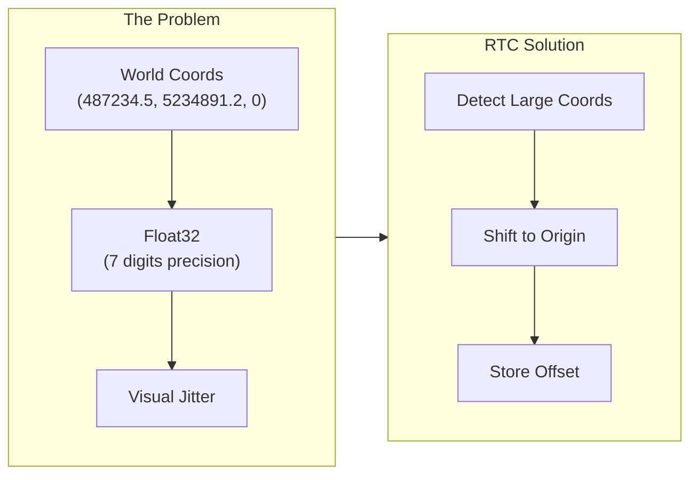
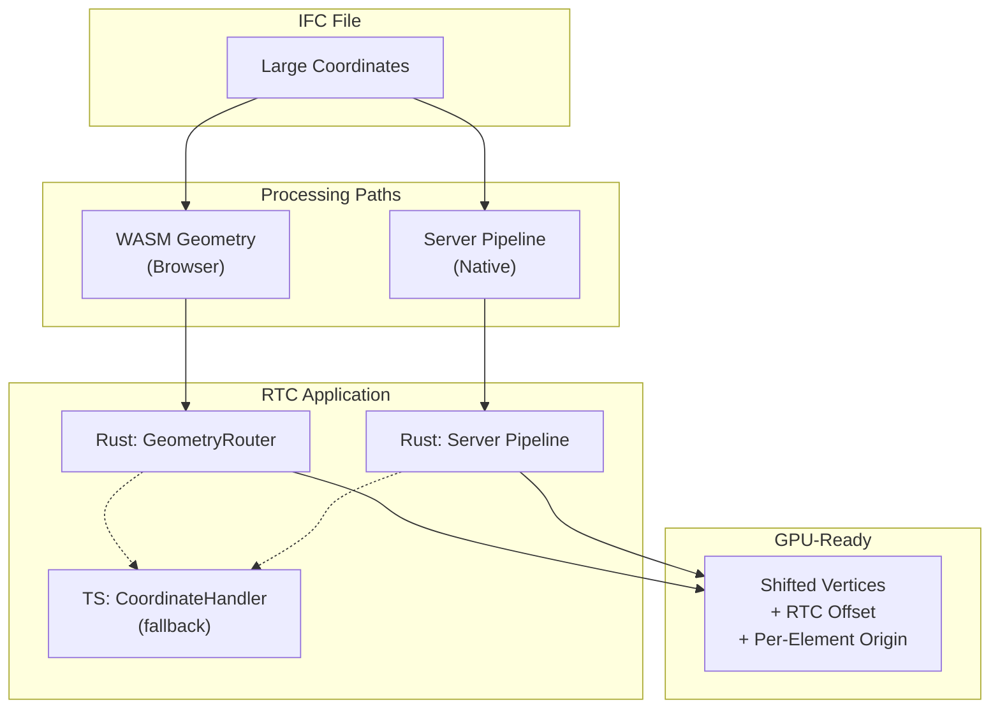

# Coordinate Handling & RTC (Relative To Center)

This document explains how IFClite handles large world coordinates to prevent floating-point precision issues during rendering.

## The Problem

Some IFC models incorrectly embed large world coordinates directly in geometry:

```
Building corner at: (487234.567, 5234891.234, 0.0)
```

**Important**: Large coordinates do NOT mean a model is georeferenced! Proper georeferencing in IFC is done via `IfcMapConversion` and `IfcProjectedCRS`, which store transformation parameters separately while keeping geometry in a local coordinate system with small values.

Large coordinates in geometry are a **bad practice** that has unfortunately become common. They cause rendering issues:

| Issue | Description |
|-------|-------------|
| **Float32 Precision** | GPU uses 32-bit floats with ~7 significant digits. Coordinates like `5234891.234` lose precision in the fractional part |
| **Visual Jitter** | Small movements in camera cause vertices to "snap" between representable values, creating flickering |
| **Z-fighting** | Near/far plane calculations break down at large distances from origin |
| **Picking Errors** | Ray-triangle intersection fails due to precision loss |



## RTC (Relative To Center) Solution

RTC shifts all geometry to be centered near the origin, storing the offset for later reconstruction:

```
Original:  (487234.567, 5234891.234, 0.0)
RTC Offset: (487000.000, 5235000.000, 0.0)
Shifted:   (234.567, -108.766, 0.0)  ← GPU-friendly!
```

### Thresholds

| Constant | Value | Purpose |
|----------|-------|---------|
| `LARGE_COORD_THRESHOLD` | 10,000m (10km) | Triggers RTC shift detection |
| `NORMAL_COORD_THRESHOLD` | 10,000m | Max expected coordinate after RTC |
| `MAX_REASONABLE_COORD` | 10,000,000m | Reject obviously corrupt values |

## Architecture Overview

RTC is applied at different layers depending on the parsing path:



## Rust Layer (WASM & Server)

### GeometryRouter

The `GeometryRouter` (`rust/geometry/src/router/`, RTC logic in `rtc_offset.rs`) handles RTC:

```rust
impl GeometryRouter {
    /// Detect RTC offset by sampling placement translations of
    /// geometry-bearing elements (scan-based paths)
    pub fn detect_rtc_offset_from_first_element<T>(
        &self,
        content: &T,
        decoder: &mut EntityDecoder,
    ) -> (f64, f64, f64);

    /// Same detection over pre-collected geometry jobs (avoids re-scanning);
    /// None = no usable samples (distinct from "no shift needed")
    pub fn detect_rtc_offset_from_jobs(
        &self,
        jobs: &[(u32, usize, usize, IfcType)],
        decoder: &mut EntityDecoder,
    ) -> Option<(f64, f64, f64)>;

    /// Set RTC offset - all subsequent transforms will apply this
    pub fn set_rtc_offset(&mut self, offset: (f64, f64, f64));

    /// Check if RTC offset is active
    pub fn has_rtc_offset(&self) -> bool;
}
```

### RTC Detection Logic

Detection is sample-based, not first-element-wins:

1. Scan for entities whose class carries geometry (`has_geometry_by_name`, schema-driven).
2. Sample each element's placement translation, up to 50 usable samples (elements that abstain, such as origin-placed axis-only representations, do not consume the budget).
3. Take the per-axis **median** of the samples.
4. If any median axis exceeds 10 km (`LARGE_COORD_THRESHOLD_METERS`), that centroid becomes the RTC offset; otherwise the offset is `(0, 0, 0)`.

Using the median of many samples instead of the first element makes detection robust against a single outlier element parked at a survey point.

### Consistent Per-Mesh Application

**Critical**: RTC must be applied consistently to ALL vertices in a mesh. The decision is made once per mesh, tracked by an explicit flag rather than re-derived from coordinate magnitudes:

```rust
// rust/geometry/src/router/transforms/mesh_world.rs (abridged)
let rtc = self.rtc_offset;
// Apply RTC once per mesh; `rtc_applied` guards against double-shifting
// meshes that already went through an RTC-aware path (e.g. CSG operands).
let needs_rtc = self.has_rtc_offset() && !mesh.rtc_applied;
// Resolve the offset ONCE from `needs_rtc`: (0, 0, 0) when the shift must not
// be applied, so the subtraction below is a no-op for already-anchored meshes.
let (rx, ry, rz) = if needs_rtc { rtc } else { (0.0, 0.0, 0.0) };

for chunk in mesh.positions.chunks_exact_mut(3) {
    let point = Point3::new(chunk[0] as f64, chunk[1] as f64, chunk[2] as f64);
    let t = transform.transform_point(&point); // full f64 transform
    chunk[0] = (t.x - rx) as f32;
    chunk[1] = (t.y - ry) as f32;
    chunk[2] = (t.z - rz) as f32;
}
if needs_rtc {
    mesh.rtc_applied = true;
}
```

**Why per-mesh, not per-vertex?** If some vertices in a mesh get RTC applied and others don't, the mesh becomes corrupted with vertices at wildly different scales.

## Per-Element Local-Frame Origin

RTC removes the model-wide offset, but a building placement of a few hundred metres is still enough to degrade f32: one ULP at 220 m is about 15 um, which can collapse adjacent vertices of finely tessellated geometry into degenerate needles. To prevent this, meshes carry a **per-element origin**:

```typescript
// MeshData (packages/geometry/src/types.ts)
// Per-element local-frame origin (metres): world position of vertex i =
// origin + positions[3i..3i+3].
origin?: [number, number, number];
```

The framed transform path (`mesh_world.rs`) transforms every vertex in f64, tracks the AABB, and then stores positions relative to an AABB-derived origin so the f32 payload stays small. `origin` is `[f64; 3]` on the Rust side (`MeshData.origin`). Every world-space consumer (raycasting, measurement, export, snapping) must fold `origin` back in; normals are translation-invariant and unaffected. The renderer relativizes all batches against a shared scene-level origin and expresses it as a translation in the model matrix, so the GPU only ever sees small local coordinates.

## TypeScript Layer (Fallback)

### CoordinateHandler

`packages/geometry/src/coordinate-handler.ts` provides TypeScript-side coordinate handling as a fallback when WASM doesn't apply RTC:

```typescript
class CoordinateHandler {
    // Thresholds
    private readonly NORMAL_COORD_THRESHOLD = 10_000;   // 10km
    private readonly MAX_REASONABLE_COORD = 10_000_000; // 10,000km

    // State
    private wasmRtcDetected: boolean = false;
    private activeThreshold: number;
    private originShift: Vec3 = { x: 0, y: 0, z: 0 };

    /**
     * Process meshes incrementally for streaming.
     * Detects if WASM already applied RTC by checking coordinate ranges.
     */
    processMeshesIncremental(batch: MeshData[]): void;

    /**
     * Coordinate info during (nullable) and after streaming
     */
    getCurrentCoordinateInfo(): CoordinateInfo | null;
    getFinalCoordinateInfo(): CoordinateInfo;
}
```

### WASM RTC Detection

The TypeScript layer detects if WASM already applied RTC:

```typescript
processMeshesIncremental(batch: MeshData[]): void {
    // Check first batch for WASM RTC
    if (!this.wasmRtcDetected) {
        let smallCoordCount = 0;
        let totalVertices = 0;

        for (const mesh of batch) {
            for (let i = 0; i < mesh.positions.length; i += 3) {
                if (Math.abs(mesh.positions[i]) < this.NORMAL_COORD_THRESHOLD) {
                    smallCoordCount++;
                }
                totalVertices++;
            }
        }

        // If >80% vertices are within threshold, WASM applied RTC
        if (smallCoordCount / totalVertices > 0.8) {
            this.wasmRtcDetected = true;
            // Use stricter threshold for bounds calculation
            this.activeThreshold = this.NORMAL_COORD_THRESHOLD;
        }
    }
}
```

### Threshold Consistency

**Critical**: The same threshold must be used for bounds calculation AND vertex cleanup:

```typescript
processMeshesIncremental(batch: MeshData[]): void {
    // Set threshold based on WASM RTC detection
    this.activeThreshold = this.wasmRtcDetected
        ? this.NORMAL_COORD_THRESHOLD
        : this.MAX_REASONABLE_COORD;

    // Use same threshold for bounds...
    const batchBounds = this.calculateBounds(batch, this.activeThreshold);

    // ...and for vertex cleanup
    for (const mesh of batch) {
        this.shiftPositions(mesh.positions, this.originShift, this.activeThreshold);
    }
}
```

## API Reference

### WASM APIs

The RTC offset is computed once by the pre-pass and then applied by every
geometry batch. There is no separate "GPU geometry" entry point — meshes come
out of `processGeometryBatch` already shifted into RTC-local coordinates.

#### buildPrePassOnce

```typescript
const pre = api.buildPrePassOnce(bytes);

// pre.needsShift  — true when the model has large coordinates needing RTC
// pre.rtcOffset   — Float64Array [x, y, z] origin to subtract (or undefined)
if (pre.needsShift && pre.rtcOffset) {
    console.log('RTC origin:', pre.rtcOffset[0], pre.rtcOffset[1], pre.rtcOffset[2]);
}
```

#### processGeometryBatch

The pre-pass RTC offset and `needsShift` flag are passed straight into each
batch call, so positions returned by `collection.get(i)` are already
RTC-shifted (subtract was applied in WASM):

```typescript
const collection = api.processGeometryBatch(
    bytes, jobs, pre.unitScale,
    pre.rtcOffset?.[0] ?? 0, pre.rtcOffset?.[1] ?? 0, pre.rtcOffset?.[2] ?? 0,
    pre.needsShift,
    pre.voidKeys, pre.voidCounts, pre.voidValues,
    pre.styleIds, pre.styleColors,
    // ... plus optional plane-angle scale and material palette arguments
);
```

### TypeScript APIs

#### CoordinateHandler

```typescript
import { CoordinateHandler } from '@ifc-lite/geometry';

const handler = new CoordinateHandler();

// Process streaming batches
for (const batch of batches) {
    handler.processMeshesIncremental(batch);
}

// Get final coordinate info
const info = handler.getFinalCoordinateInfo();
if (info) {
    console.log('Origin shift:', info.originShift);
    console.log('Original bounds:', info.originalBounds);
    console.log('Shifted bounds:', info.shiftedBounds);
}

// Reset for new file
handler.reset();
```

#### CoordinateInfo Structure

```typescript
interface CoordinateInfo {
    originShift: Vec3;        // Shift applied to vertices
    originalBounds: AABB;     // Bounds in original coordinates
    shiftedBounds: AABB;      // Bounds after shift (GPU coordinates)
    hasLargeCoordinates: boolean; // True if RTC shift was needed
}
```

**Note**: `hasLargeCoordinates` indicates the model had coordinates requiring RTC shift. This is NOT the same as being georeferenced - proper georeferencing uses `IfcMapConversion`.

## Usage Patterns

### Pattern 1: Streaming via GeometryProcessor

The high-level `@ifc-lite/geometry` processor surfaces the RTC offset as a
stream event before the first batch, then yields RTC-shifted meshes:

```typescript
const geometry = new GeometryProcessor();
await geometry.init();

for await (const event of geometry.processStreaming(buffer)) {
    if (event.type === 'rtcOffset') {
        // Store for coordinate conversion back to world space
        setRtcOffset(event.rtcOffset);
    } else if (event.type === 'batch') {
        // Meshes already have RTC applied
        renderer.addMeshes(event.meshes);
    }
}
```

### Pattern 2: Server Streaming

When using server-side parsing:

```typescript
const response = await fetch('/api/parse', { body: file });

// Server applies RTC and returns shifted meshes + offset
const { meshes, coordinateInfo } = await response.json();

// coordinateInfo.origin_shift contains RTC offset
const rtcOffset = {
    x: coordinateInfo.origin_shift[0],
    y: coordinateInfo.origin_shift[1],
    z: coordinateInfo.origin_shift[2]
};

// Original bounds = shifted bounds + offset
const originalBounds = {
    min: {
        x: meshes.bounds.min.x + rtcOffset.x,
        y: meshes.bounds.min.y + rtcOffset.y,
        z: meshes.bounds.min.z + rtcOffset.z
    },
    max: {
        x: meshes.bounds.max.x + rtcOffset.x,
        y: meshes.bounds.max.y + rtcOffset.y,
        z: meshes.bounds.max.z + rtcOffset.z
    }
};
```

### Pattern 3: Converting Back to World Coordinates

For measurements, export, or display:

```typescript
function toWorldCoordinates(localPoint: Vec3, rtcOffset: Vec3): Vec3 {
    return {
        x: localPoint.x + rtcOffset.x,
        y: localPoint.y + rtcOffset.y,
        z: localPoint.z + rtcOffset.z
    };
}

// Example: Display measurement in world coordinates
const localStart = getMeasurementStart();
const localEnd = getMeasurementEnd();

const worldStart = toWorldCoordinates(localStart, rtcOffset);
const worldEnd = toWorldCoordinates(localEnd, rtcOffset);

const distance = Math.sqrt(
    Math.pow(worldEnd.x - worldStart.x, 2) +
    Math.pow(worldEnd.y - worldStart.y, 2) +
    Math.pow(worldEnd.z - worldStart.z, 2)
);
```

## Debugging

### Common Issues

| Symptom | Likely Cause | Solution |
|---------|--------------|----------|
| Meshes at wrong position | RTC offset not applied consistently | Ensure all paths use same RTC offset |
| Vertices scattered wildly | Per-vertex RTC decision | Fix to per-mesh decision |
| Some meshes at origin | Threshold mismatch | Use consistent threshold for bounds and cleanup |
| Jittery rendering | RTC not applied | Check if `hasRtcOffset` returns true |

### Logging RTC Status

```typescript
// In WASM path
const pre = api.buildPrePassOnce(bytes);
if (pre.needsShift && pre.rtcOffset) {
    console.log('[RTC] WASM detected offset:', Array.from(pre.rtcOffset));
}

// In TypeScript path
const info = handler.getCurrentCoordinateInfo();
console.log('[RTC] Handler info:', {
    wasmDetected: handler.wasmRtcDetected,
    originShift: info?.originShift,
    hasLargeCoordinates: info?.hasLargeCoordinates
});
```

## Implementation Checklist

When adding a new geometry processing path:

- [ ] Detect large coordinates using `detect_rtc_offset_from_first_element` or equivalent
- [ ] Apply RTC uniformly to entire mesh (not per-vertex decisions)
- [ ] Use consistent thresholds (10km normal, 10M max)
- [ ] Surface RTC offset to callers via callbacks/return values
- [ ] Include RTC offset in completion stats
- [ ] Document which layer applies RTC (Rust vs TypeScript)
- [ ] Handle originalBounds reconstruction if only shifted bounds available

## Related Documentation

- [Rendering Pipeline](rendering-pipeline.md) - WebGPU rendering architecture
- [Geometry Pipeline](geometry-pipeline.md) - Overall geometry processing
- [Data Flow](data-flow.md) - How data moves through the system
- [API Reference: WASM](../api/wasm.md) - WASM API details
