# Data Flow

Detailed data flow through the IFClite system.

## Complete Data Flow

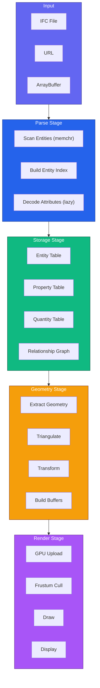

## Parsing Data Flow

### Token Flow

Tokenization happens lazily, per entity, when attributes are decoded (the scan itself never builds tokens):

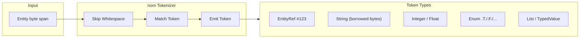

### Entity Parsing

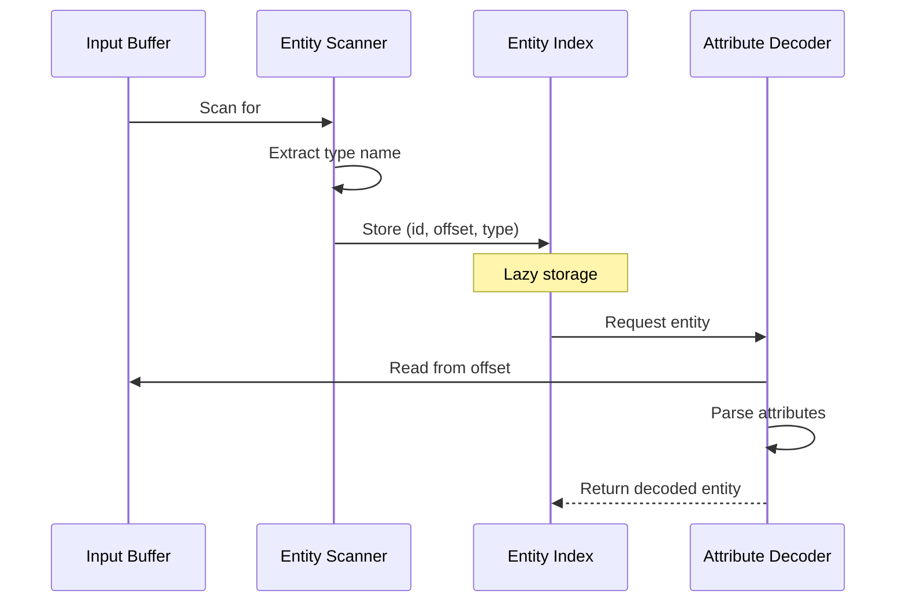

### Memory Layout

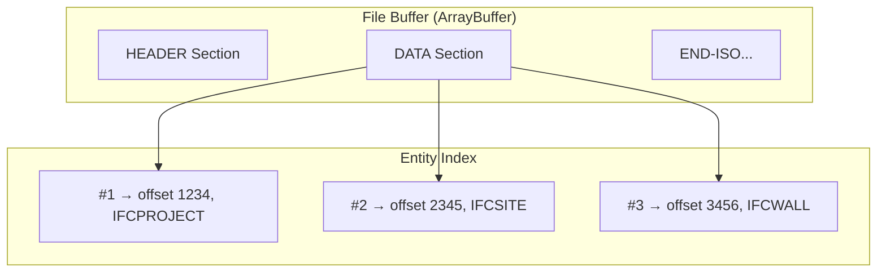

## Storage Data Flow

### Columnar Tables

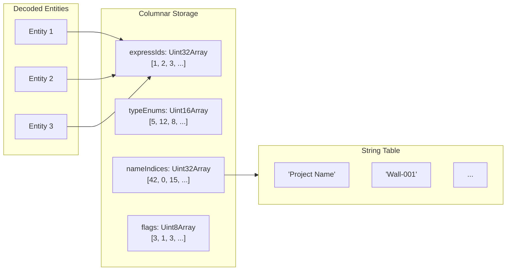

### Relationship Graph

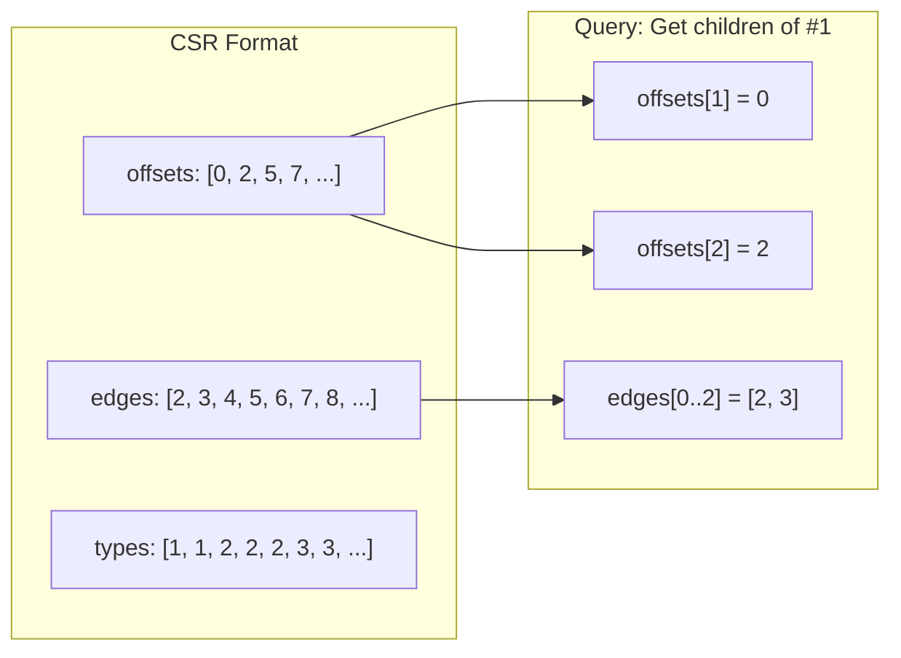

## Geometry Data Flow

### Processing Pipeline

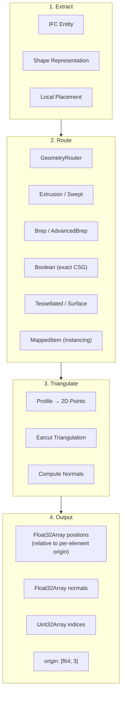

### Coordinate Transformation

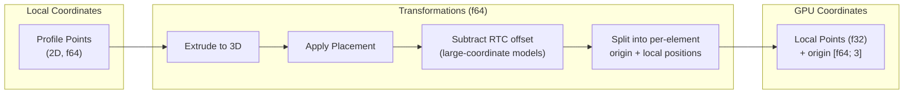

All placement math runs in f64 on the CPU; only the final per-element local positions are stored as f32, with the world-magnitude translation kept in the f64 `origin`. See [Coordinate Handling](coordinate-handling.md).

## Render Data Flow

### Buffer Upload

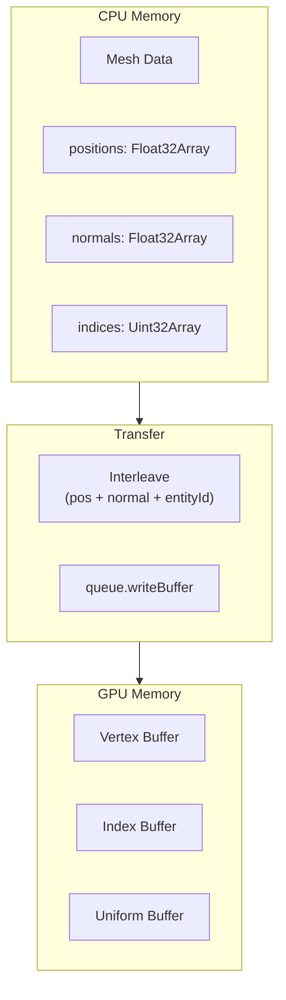

### Render Pass

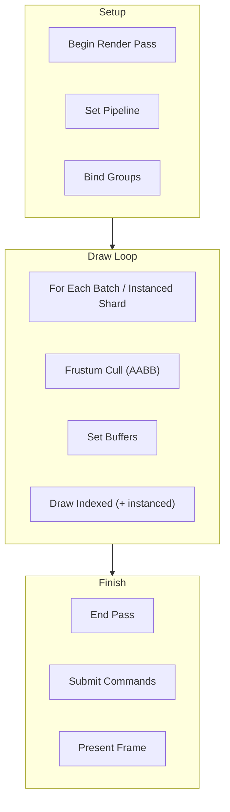

### Frame Timeline

```mermaid
gantt
    title Frame Timeline (16.67ms @ 60fps)
    dateFormat X
    axisFormat %L ms

    section CPU
    Update Camera    :a1, 0, 1
    Frustum Cull     :a2, 1, 2
    Update Uniforms  :a3, 2, 3
    Build Commands   :a4, 3, 5

    section GPU
    Vertex Shader    :b1, 5, 8
    Rasterization    :b2, 8, 12
    Fragment Shader  :b3, 12, 15
    Present          :b4, 15, 17
```

## Query Data Flow

### Fluent Query

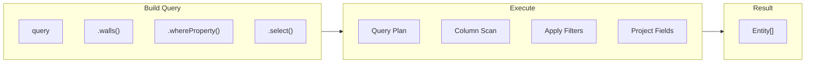

### SQL Query

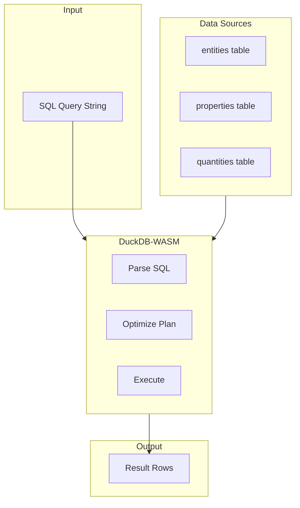

## Export Data Flow

Exporters are implemented in Rust (`rust/export`: glTF/GLB, STEP/IFC, IFC5/IFCX, CSV, JSON, OBJ, KMZ, HBJSON, Parquet, and more) and surfaced through the WASM API and the CLI. The TypeScript `@ifc-lite/export` package hosts the browser-side orchestration (merged export, schema conversion, change sets).

### glTF Export

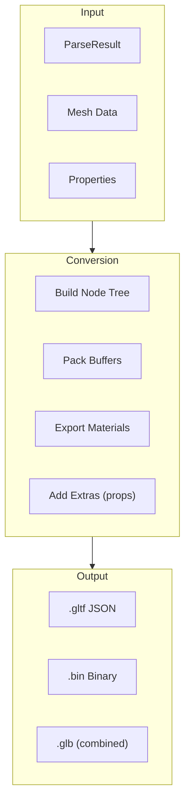

## Data Size Estimates

| Stage | Data Size (50MB IFC) | Notes |
|-------|---------------------|-------|
| File Buffer | 50 MB | Original file |
| Entity Index | ~2 MB | Just offsets + types |
| Columnar Tables | ~5 MB | Deduped, compact |
| Relationship Graph | ~1 MB | CSR format |
| Geometry Buffers | ~20 MB | Triangulated meshes |
| GPU Buffers | ~20 MB | Mirrors CPU |

## Multi-Model Federation Data Flow

When multiple IFC files are loaded, each model is assigned a unique ID offset by the `FederationRegistry`:

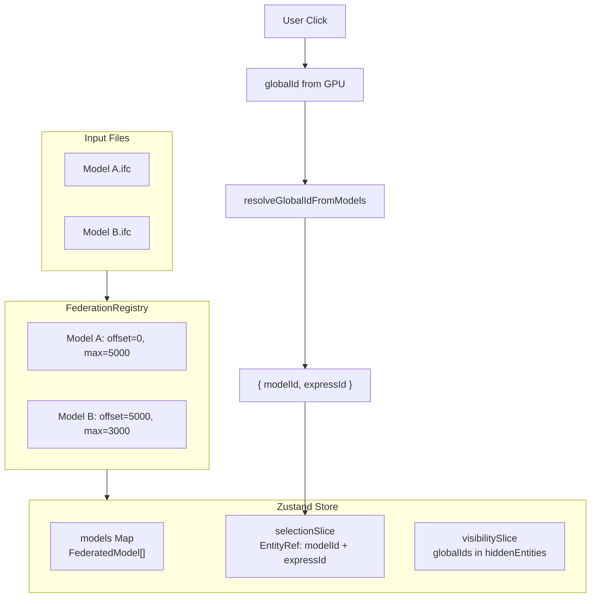

All mesh geometry uses **global IDs** (`expressId + offset`) for the GPU pick buffer, while the application logic uses **EntityRef** (`{ modelId, expressId }`) for unambiguous references.

## Mutation Data Flow

Property editing flows through the `MutablePropertyView` overlay:

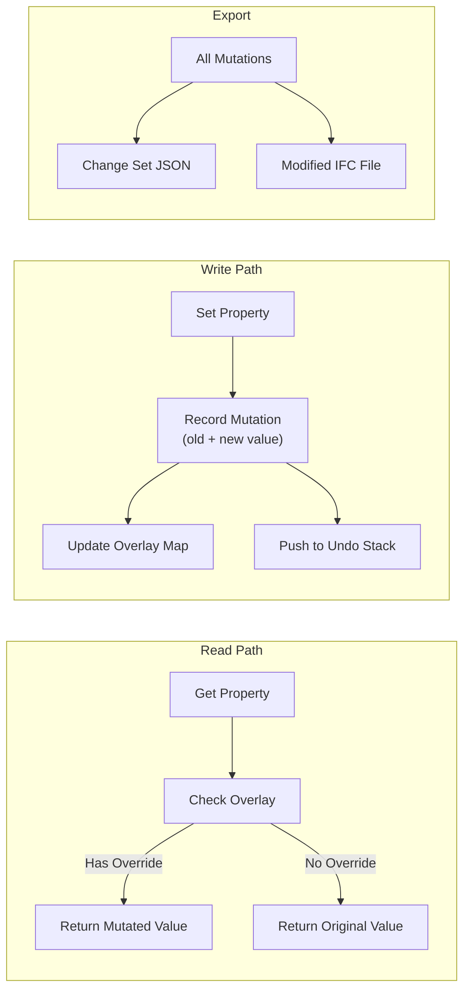

## Next Steps

- [Parsing Pipeline](parsing-pipeline.md) - Parser details
- [Geometry Pipeline](geometry-pipeline.md) - Geometry details
- [Rendering Pipeline](rendering-pipeline.md) - Renderer details
- [Federation Architecture](federation.md) - Multi-model federation details
