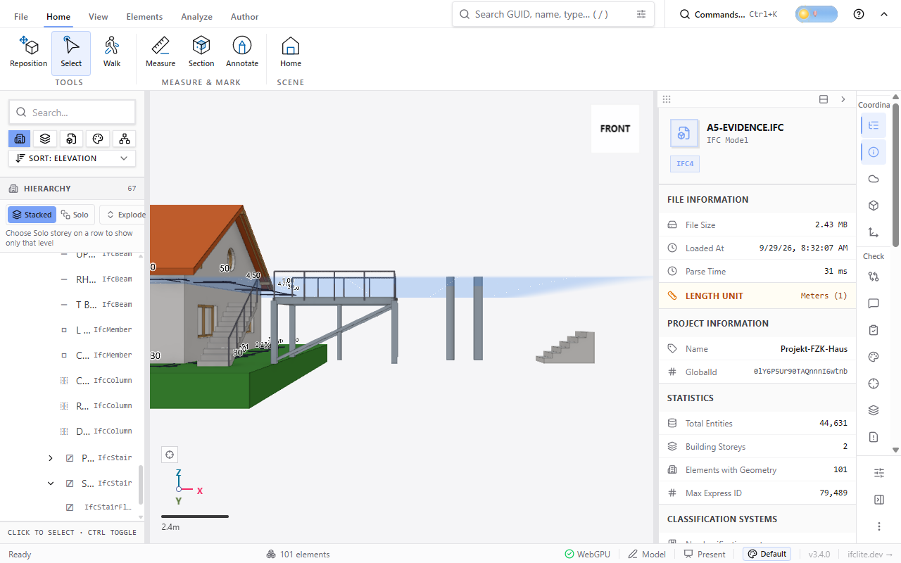
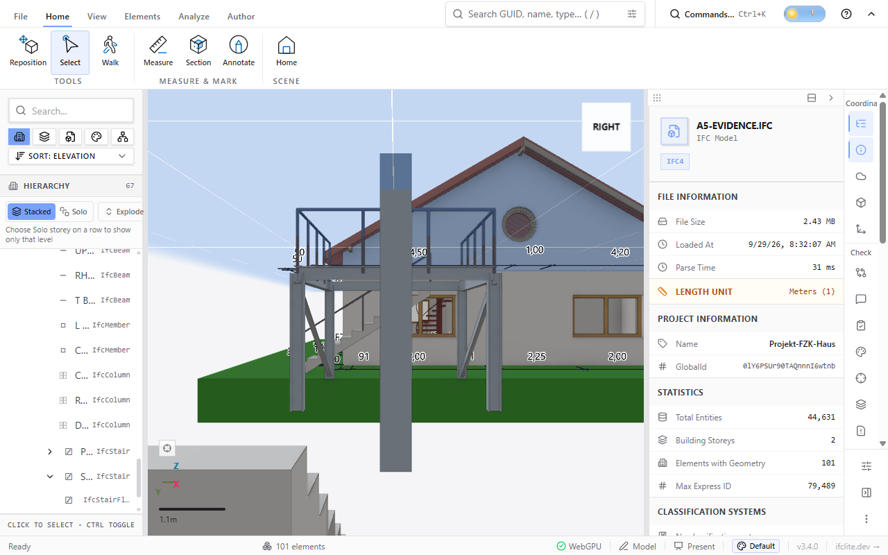

# In-store stair, railing and profiled members (#6232 A5)

AC20-FZK-Haus with elements added through the in-store builders on the
Erdgeschoss storey (`resolveSpatialAnchor` then `addStairToStore`,
`addRailingToStore`, and `addBeamToStore` / `addColumnToStore` /
`addMemberToStore` with a `Profile`). The result was exported with
`StepExporter` and reloaded in the viewer (Windows Chrome, WebGPU).

- A steel platform: HEB (I) columns, then I, U, rectangular-hollow and T
  beams, with L and C braces.
- A railing around three sides of the platform, with posts every 1 m.
- A waisted 12-riser stair with a sloped railing along its pitch.
- A solid 6-riser stair, a circular column, a circular-hollow column and a
  default rectangular column.

The hierarchy panel lists each IfcStair with its IfcStairFlight part.

