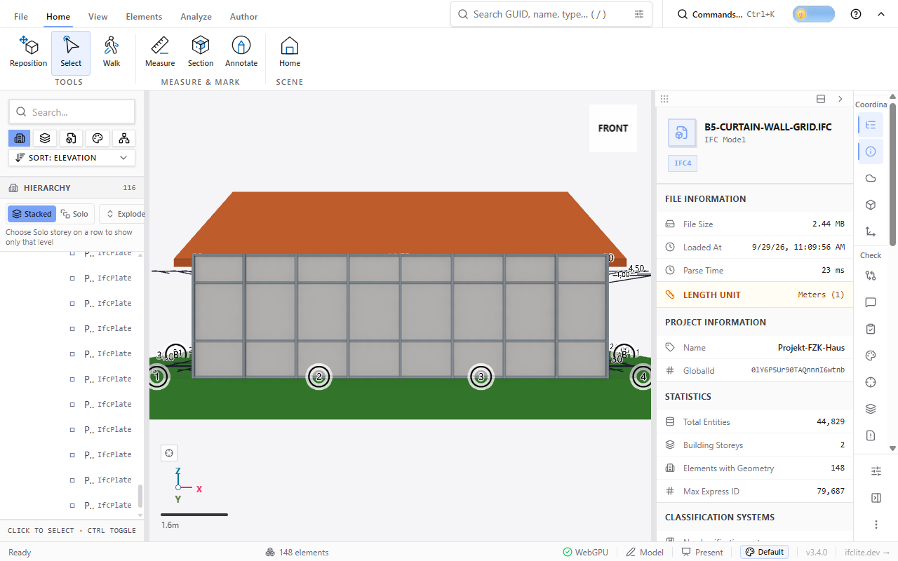
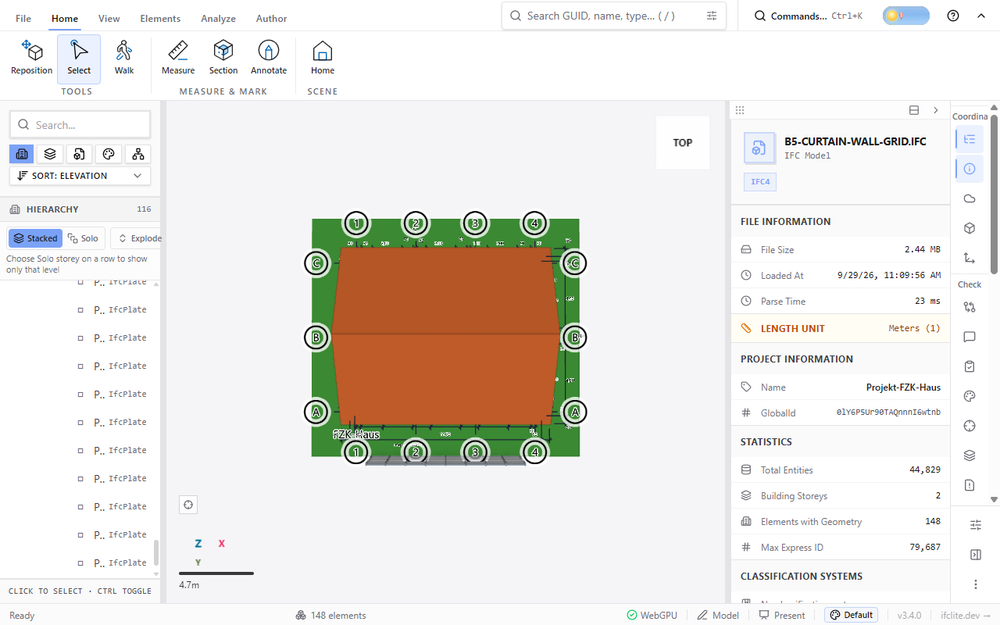
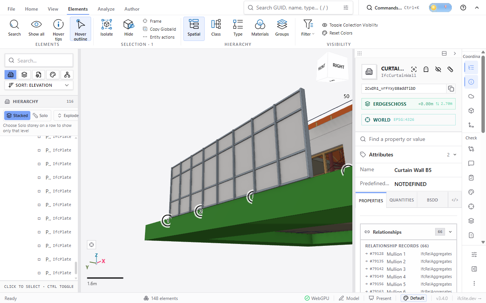

# In-store curtain wall and grid (#6232 B5)

AC20-FZK-Haus with elements added through the in-store builders on the
Erdgeschoss storey (`resolveSpatialAnchor`, then `addCurtainWallToStore` and
`addGridToStore` with `rectangularGridAxes`). The result was exported with
`StepExporter` (IFC4) and reloaded in the viewer (Windows Chrome, WebGPU).

- A 10 m x 3 m curtain wall in front of the house: 8 equal bays, rows split at
  0.9 m and 2.3 m, 60 x 180 mm mullions, 60 x 120 mm transoms, 28 mm panels.
  It is one IfcCurtainWall aggregating 9 mullion and 32 transom IfcMembers
  (MULLION) and 24 IfcPlate panels (CURTAIN_PANEL).
- A rectangular grid over the house: U axes 1-4 every 4 m, V axes A-C every
  5 m, 1.5 m overhang, drawn by the viewer's IfcGrid overlay.

