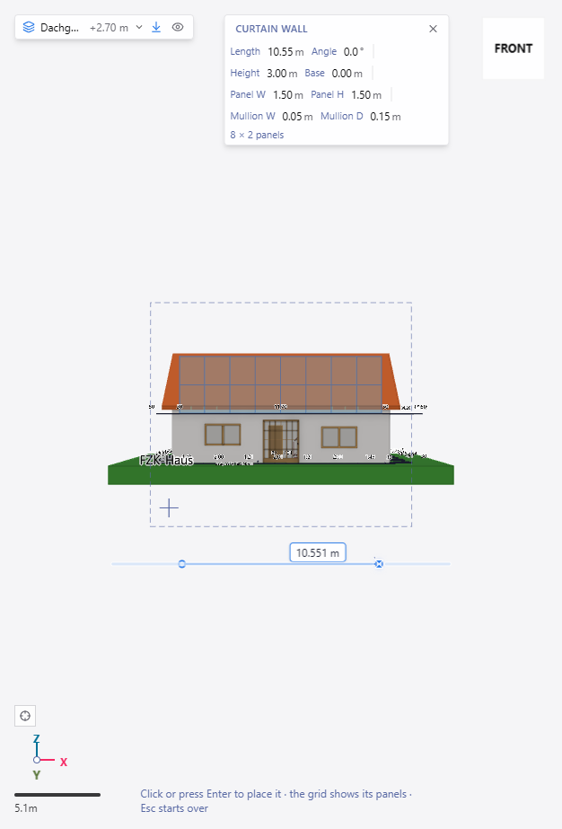
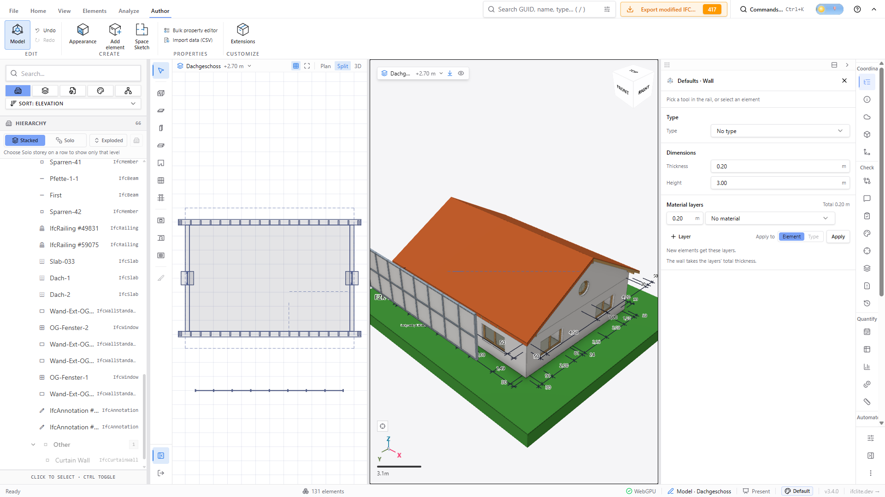
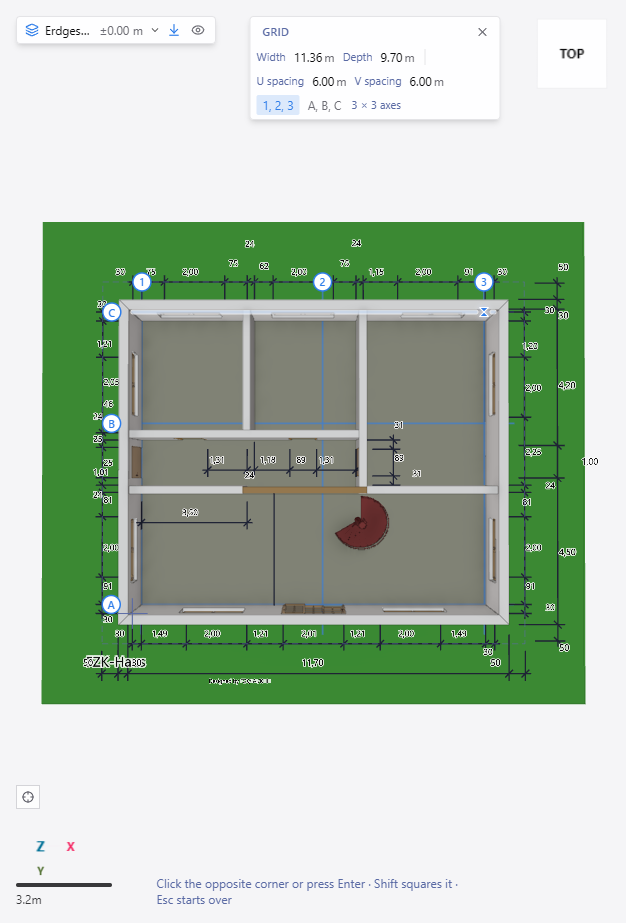
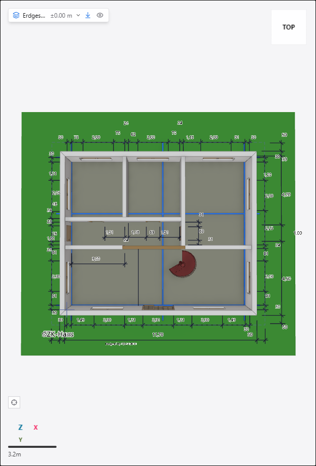
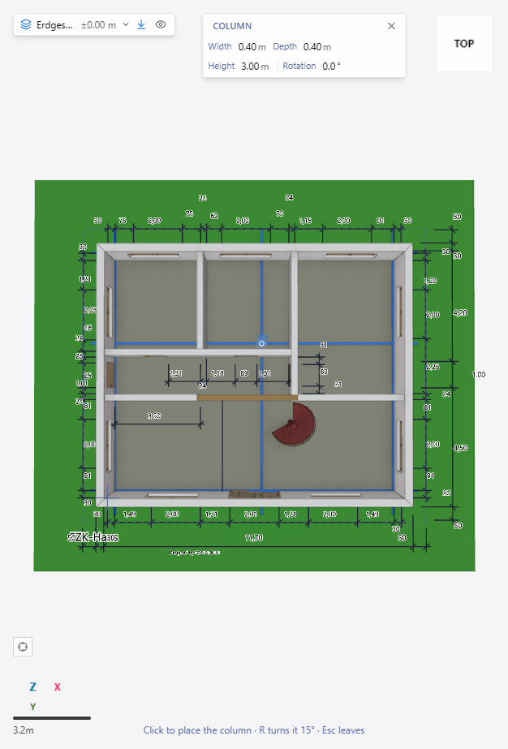

# Curtain Wall and Grid tools (#6232 D3)

AC20-FZK-Haus in the Model workspace (Windows Chrome, real GPU, WebGPU), driven
with the real mouse.

- Curtain wall on the upper storey (Dachgeschoss): Shift+U, two clicks. The
  bar sets Height, Base, Panel W / Panel H and the Mullion section; the ghost is
  `curtainWallLayout`'s real mullions, transoms and panels. The commit writes an
  IfcCurtainWall aggregating its IfcMember and IfcPlate parts as one undo step,
  and every part is re-meshed.
- Grid on the ground storey: Shift+G, two corners. Tag bubbles 1, 2, 3 across and
  A, B, C down show before the second click; the placed grid is drawn from its
  axes (a design grid is lines, so it has its own overlay channel).
- Column snapped to a grid crossing: the design-grid snap source offers axes and
  crossings; the crossing shows the grid glyph and the column lands on it.

Independent final integration review (#6511) reproduced authored grid strips remaining visible after the global IFC Grid toggle was switched off. The authored overlay now consumes the same visibility gate as file grid axes, including the embedding host’s `IfcGridAxis` hide list. Mounted tests use one and two independently parsed models with overlapping local express IDs, verify hide/show and host-hide precedence, and preserve exact redraw keys and uploads to replacement renderers.
