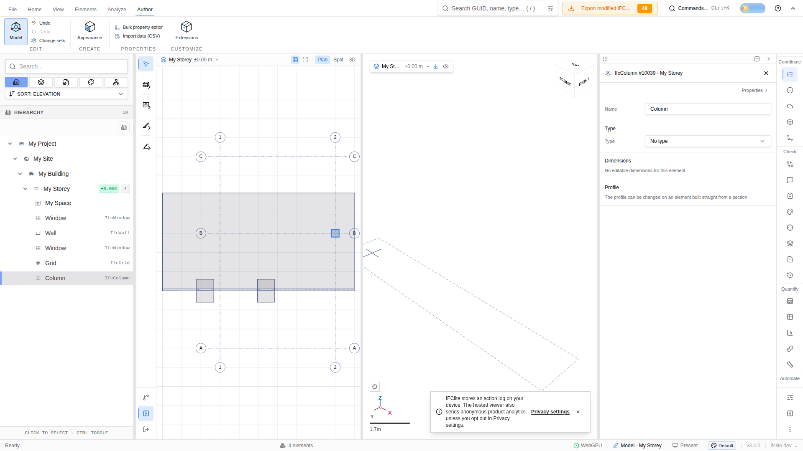

# Persisted grid column binding (#6232)

Chrome opened the unmodified Bonsai `hello-wall.ifc` sample (79,592 bytes;
SHA-256 `0ab20f4ea355ea9aa4fade7264b97ee9f9929addfa3961b2437c4381bd674014`)
through the viewer's canonical file input. Actual pointer clicks in Author →
Model → Create → Grid authored grid #10021 with five axes. Shift+C and an
actual pointer click at the displayed 2/B crossing created column #10039.
Its ObjectPlacement is a local child of IfcGridPlacement #10024, whose
IfcVirtualGridIntersection #10023 retains actual axes #10005 and #10013.
The original Bonsai sample does not contain this authored grid or column.

Calling the public viewer `translateEntity` action moved the grid one metre
along IFC X. The real remesh worker replaced the column mesh: its centre in
viewer Y-up coordinates changed from `[8, 1.5, -3]` to `[9, 1.5, -3]`.
Those coordinates include the mesh's double precision origin, since its
Float32 positions are centred. The displayed plan column and axes moved
with it. Actual ribbon Undo returned the mesh centre to X=8; Redo restored
X=9. The unchanged imported building provides a visible reference.

The actual Export modified IFC dialog downloaded the saved model. A page
reload followed by opening that downloaded file through the canonical file
input retained IfcGridPlacement #10024 and the moved column centre
`[9, 1.5, -3]`, with nine native meshes. IDs, bounds, file hashes, pointer
coordinates and source/runtime provenance are recorded in
[browser-observations.json](./browser-observations.json).

This is functional 2D plan and native geometry evidence. The browser used
Google SwiftShader's software WebGPU fallback. The 3D pane did not show
solid bodies in these captures, so they do not establish successful 3D
raster output or hardware performance. The own temporary Chrome profile
was closed in `finally`. Chrome was the authorized fallback after two T3
preview connection timeouts.

Separate native-WASM tests cover all three supported schemas, metre and
millimetre units, translated/rotated and intermediate frames, malformed
owner refusal, nested grid dependencies and whole versus remesh mini IFC.
Mounted native movement tests cover one and two models, relative/absolute
moves, rotations, continuing batches, and Undo/Redo. This followup leaves
the parent modelling charter open for its remaining readiness audit.
