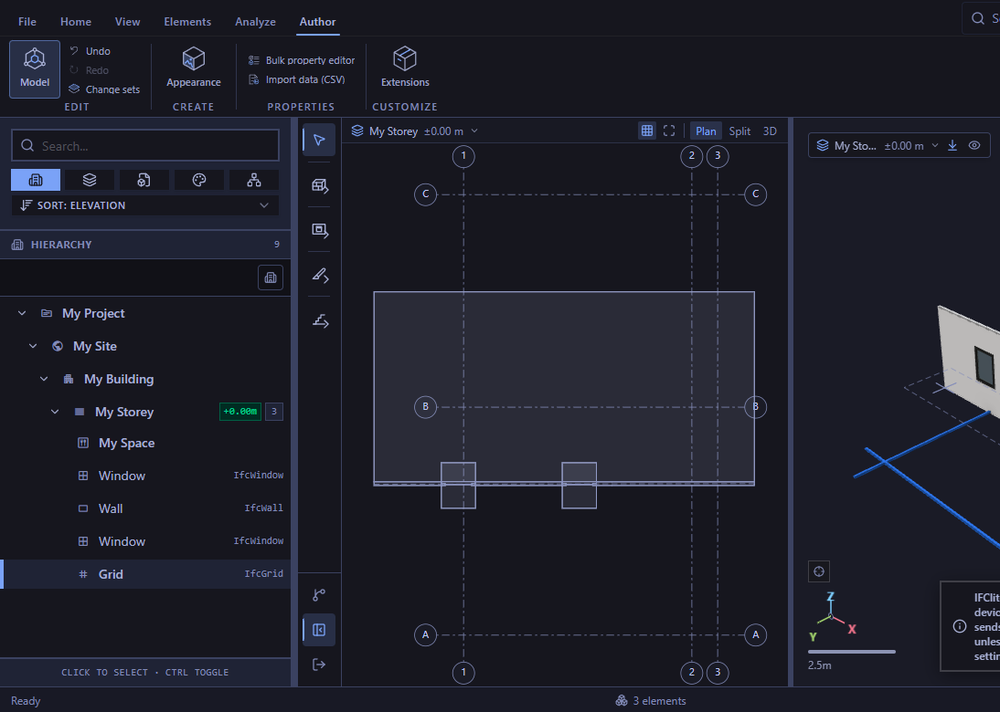

# Authored design grids in the Model plan (#6232)

The T3 collaborative browser loaded the unmodified Bonsai `hello-wall.ifc`
sample (79,592 bytes; SHA-256
`0ab20f4ea355ea9aa4fade7264b97ee9f9929addfa3961b2437c4381bd674014`)
through the viewer's canonical file-open input. The sample has storey #42.
This is a real imported model with a grid authored through the viewer,
not a claim that the original sample already contains that grid.

Using the Author ribbon and Model workspace, the browser selected Grid
from the Create menu. Two actual mouse clicks placed one `IfcGrid` #10025
with six `IfcGridAxis` entities tagged `1`, `2`, `3`, `A`, `B`, `C`.
The Plan and Fit controls framed those axes alongside the imported wall,
windows and space. All six axes and both endpoint tags are visible below.
One ribbon Undo removed the six axes and tags; one ribbon Redo restored
them. The observations and mouse coordinates are in
[browser-observations.json](./browser-observations.json).

The PNG captures 1,094 by 780 pixels of the 1,920 by 780 CSS viewport;
the complete plan pane and all its axis tags are captured. This is
functional browser evidence, with no performance timing claim.

Mounted tests separately cover one and two independently parsed models,
overlapping model-local IDs, type/host/model/entity hides, Undo/Redo,
actual IFC export and reparse, and an explicit millimetre/translated/
rotated-storey variant of this source. A real plan click at the displayed
crossing creates a column at independently calculated storey metres
`[96, 206, 0]`, preserved through Undo/Redo. Normal-sized label bubbles
receive Fit space; oversized labels may clip but cannot invert the plan
or its pointer transform.

Persisting `IfcGridPlacement` remains a separate required #6232 followup.
This plan drawing change does not complete the modelling charter.
