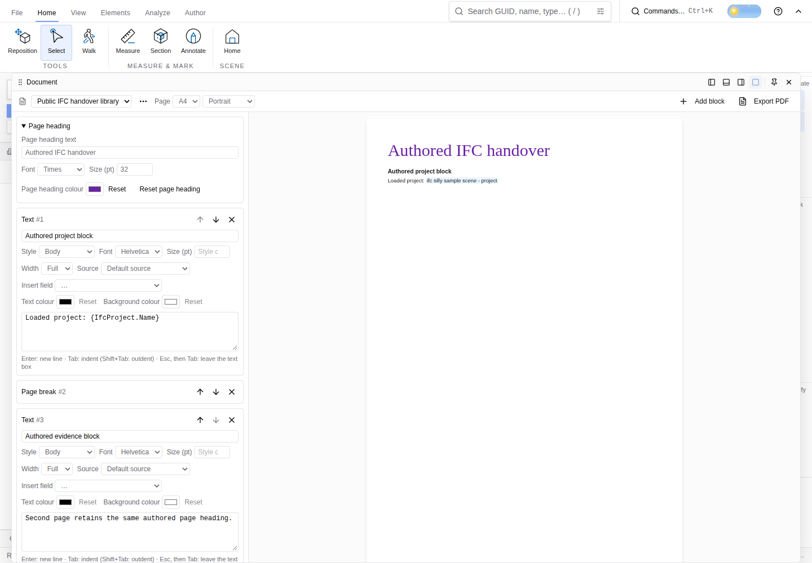
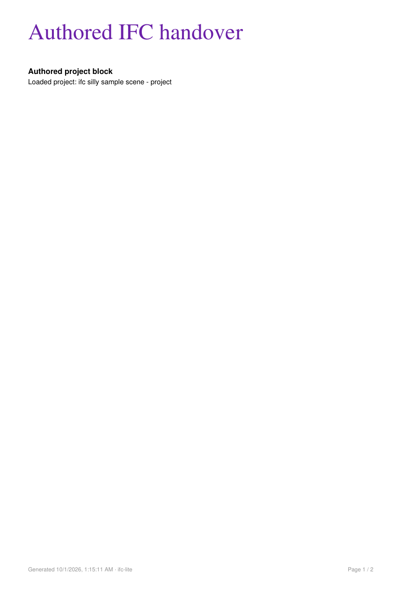
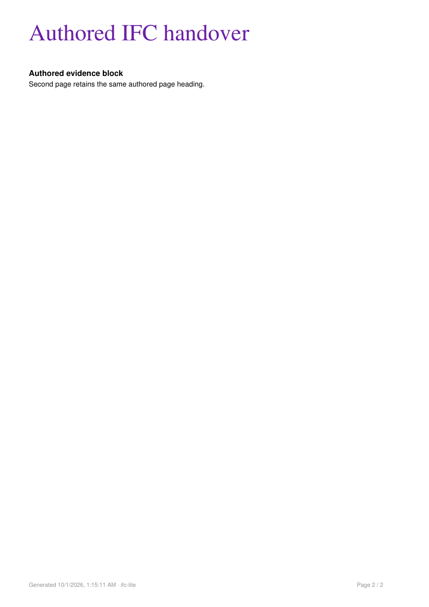

# Document page heading evidence (#6554)

Captured from source `85d23caeb76588bc8fb1ad9cc1d649e0557b9dcc`, integrated with main `cfd1f5a221e7e08c6cba18ad156bfbb6b08c23ed`. This evidence commit preserves that production and test source byte for byte.

The public `apps/viewer/public/samples/building-architecture.ifc` was loaded through the viewer's actual file input. Its SketchUp IFC4 metadata contains 444 entities; the document's `{IfcProject.Name}` field resolves to the loaded project in both preview and PDF. This run uses user-authorized Google Chrome with software WebGPU and establishes document behavior only. It does not establish 3D rendering or performance.

Open Documentation and expand **Page heading**. Set the text to **Authored IFC handover**, font to **Times**, size to **32**, and colour to **#6b21a8**. The library name remains **Public IFC handover library**. Both explicit page sections show the authored heading, and the existing authored block titles remain visible. Export PDF through its actual button and browser download event; reload and verify the controls/template retain the settings. **Reset page heading** restores the library name on both pages.

The original [downloaded PDF](document.pdf) and [document template](document.ifclite-document.json) are retained. Independent PyMuPDF inspection confirms both headings use Times-Roman at 32 points with purple ink, sit inside the page bounds, and leave the original 8-point grey Helvetica footer intact. The author viewed both rendered pages. [Raw observations](observations.json) record source, browser, model fingerprint, download hash, persisted values and reset results; [PDF inspection](pdf-inspection.json) records actual text spans and bounds.

Five mounted/import/PDF/layout checks and 83 existing document regressions pass without skips. The new titled-image layout case failed on the initial integration because a larger heading displaced the image into the footer; the shared preview/PDF image sizing now reserves the heading space.
