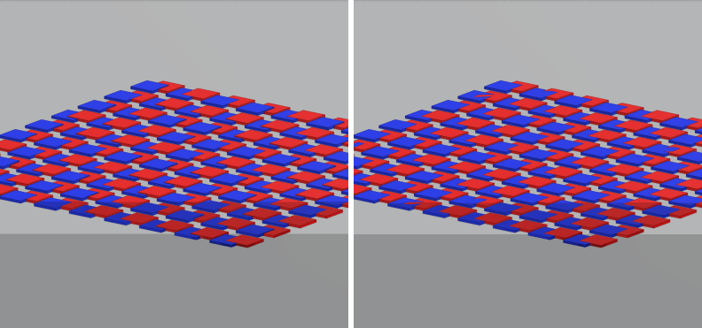

# Hidden surfaces showing through in orthographic views (#6729)

Synthetic IFC4 models rendered by the dev viewer in headless Chrome (WebGPU
over SwiftShader). Before is `main` at `a1b53db95`, after is this branch. Left
is before, right is after. The regression witness is
`tests/e2e/ortho-depth-nudge.e2e.spec.ts`; this page records the wider
measurements behind its tuning.

## Rods through a beam on a 1 km site

A 1000 m x 1000 m `IfcSlab` sets the orthographic depth range (about 1.56 km).
A 0.2 m `IfcBeam` has 40 vertical `IfcMember` rods, r = 0.07 m, running
through it, so each rod sits 3 cm behind the beam's front face.

Before, the per-entity depth nudge scaled clip z by `1 + zHash * 1e-6`, which
in orthographic depth moves a fragment by up to `255e-6 * z * range`: about
20 cm mid-scene here, nearly 40 cm near the camera. After, no surface moves
more than 2.5 cm in orthographic projection, so every rod stays hidden. The e2e
witness renders 30 mm clearance with every rod at the top of the hash range and
every beam at the bottom, from five orbit poses; on `main` it fails with 9,536
rod pixels on the beam faces.

## Coplanar plates: the trade-off

The nudge exists to rank coplanar faces of different entities. Keeping hidden
surfaces hidden caps how far it may move them, which caps how many ranking
levels fit a large depth range, and the depth noise between two triangulations
of one plane grows with how obliquely the face is seen.

100 pairs of overlapping 1 m plates with exactly coplanar tops (red `IfcPlate`,
blue `IfcSlab`), random hashes. "Wrong" counts pairs whose higher-ranked plate
loses at the overlap centre; "ties" are pairs that land on one level and are
left to draw order. Steep / oblique / grazing view.

| site | before, wrong | after, wrong | after, ties |
|---|---|---|---|
| 30 m (all 256 levels) | 0 / 14 / 35 | 0 / 15 / 34 | 0 |
| 1 km (34 levels) | 0 / 0 / 1 | 0 / 2 / 11 | about 5 |

Ordinary sites behave as before: oblique and grazing coplanar fights there are
pre-existing. On a kilometre site the old nudge ranked coplanar plates only
because it moved every surface by decimetres, which is the defect; after, a
few pairs a level or two apart swap at grazing angles. Eight depth units per
level was chosen over four because four was measurably worse on ordinary sites
(3 / 21 / 39 wrong at 30 m) for a smaller clearance bound (1 cm).

## Clip planes, annotations, selection and overrides

- The nudge never moves a vertex across the near or far plane, and a vertex
  exactly on the far plane stays unwritten. The e2e witness narrows the
  camera's scene bounds so the planes cut through the scene: a top-hash plate
  0.3 mm beyond the far plane stays clipped (an unguarded additive nudge drew
  it), one 0.3 mm inside the near plane stays drawn (`main`'s scaled nudge
  pushed it past the plane), and a plate crossing the far plane is cut within
  2 px of where the plane predicts.
- Annotation lines and text lift above the most-nudged face in orthographic
  projection. On `main`, lines lying on high-hash plates disappeared on both a
  40 m and a 1 km site; AC20-FZK-Haus's ground-level plan dimensions now all
  show, as they do in perspective.
- The selection highlight and colour overrides cover top-hash plates fully.

## Perspective is unchanged

Rendered back to back, before and after perspective frames are bit-identical:
0 changed pixels in 3 views of the rods model and 3 views of AC20-FZK-Haus,
including its annotation lines and text.
