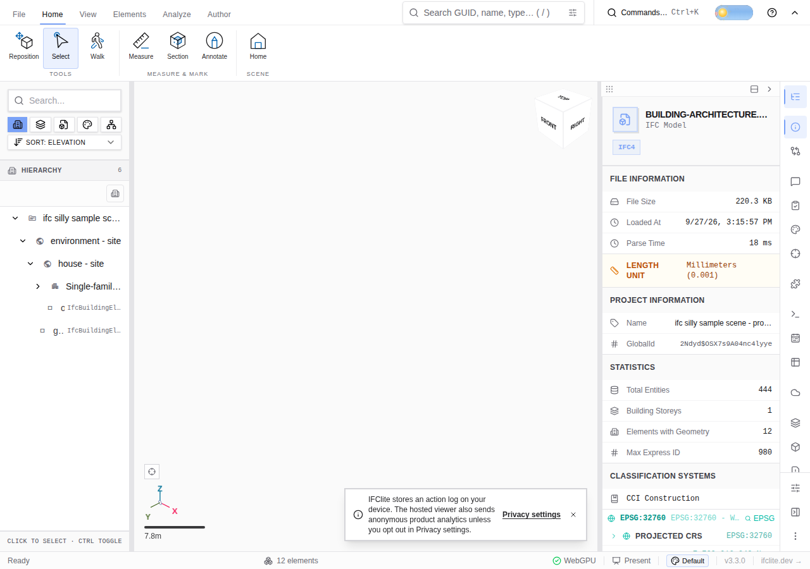

# Ribbon after retiring the classic toolbar (#5874)

Playwright loaded `/samples/building-architecture.ifc` at a 1280 × 900 viewport in Chrome with SwiftShader. The IFC file's header identifies SketchUp 2024 with IFC Manager for SketchUp 5.3.3. The viewer reported the authored model loaded; the hierarchy and model information rendered, and the page raised no uncaught errors.

The browser opened each ribbon tab and scrolled its command buttons into view. All 85 commands remained reachable: File 18, Home 7, View 19, Elements 16, Analyze 16, Author 9. Analyze also has a separate Browse panels menu trigger, which the saved Playwright witness in the final cleanup slice checks alongside those commands. The screenshot shows the Home ribbon and loaded model after the walk.

