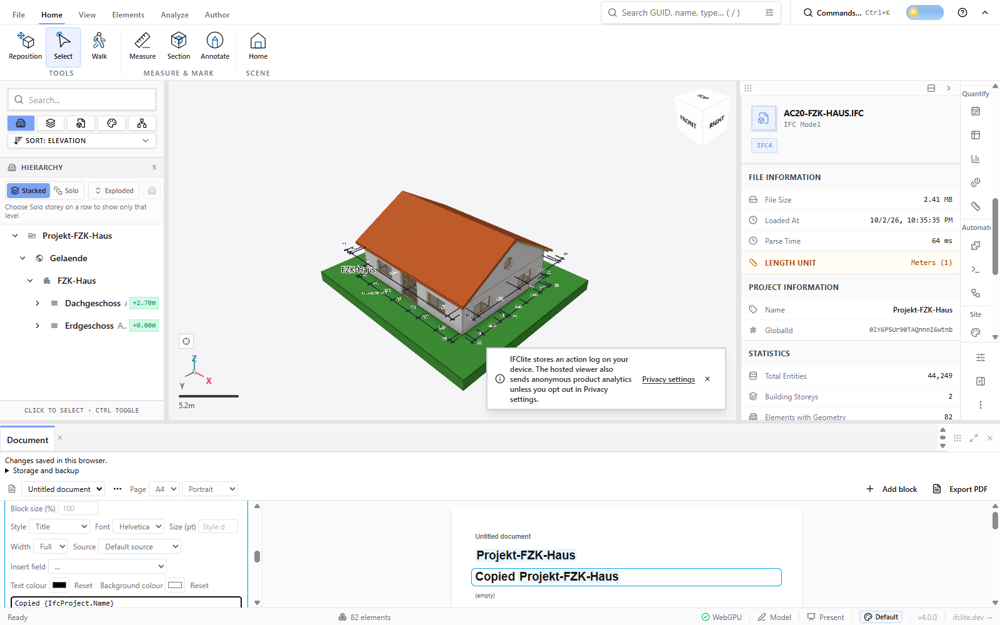
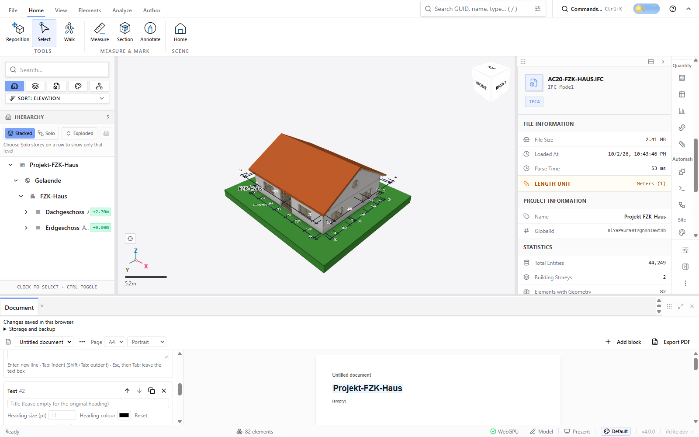

<!-- This Source Code Form is subject to the terms of the Mozilla Public
     License, v. 2.0. If a copy of the MPL was not distributed with this
     file, You can obtain one at https://mozilla.org/MPL/2.0/. -->

# Native document-copy qualification (#6689)

The unmodified production build at `5be8ed21f358b27d09174dbbeaee9d56d027edc0`
loaded the public `ara3d/AC20-FZK-Haus.ifc` through the canonical file input in
native Chrome 154.0.8037.58. The build manifest and fixture SHA-256 are in
[`qualification.json.gz`](qualification.json.gz), together with the retained
interactive observations, assertion verdict, reload identity and native download
events. Viewport: 1600 × 1000 CSS pixels, DPR 1. This is correctness evidence,
not a performance run.

Actual UI actions copied the project-name block immediately after its source,
selected the new block, and edited only the copy. Both blocks resolved the real
`Projekt-FZK-Haus` field. The saved copy survived a browser reload unchanged;
the public model was loaded again separately. Removing the copy retained the
original block, preview and durable saved document. The native downloaded
[document template](exported-copy.ifclite-document.json) matches the authored
document exactly, including independent block IDs and retained field bindings.

The first initialization attempt provided no copy proof. An initial Playwright
`saveAs` failed because its download path belonged to the WSL client. That failure
is retained in the packet. Configuring only this owned browser context with a
native Windows download directory produced an actual completed Chrome download;
no application export implementation or payload was substituted. The packet
retains the native completion event and downloaded-byte identity. Browser
reload loads the saved document, not the original model automatically.

These images demonstrate one real public authoring model. The separate 15
mounted controls cover every block kind, both table source forms, scoped model
bindings, nested identity independence, consecutive clicks and actual IndexedDB
refusal/retry. They are not additional native-model runs. Production source and
tests remain unchanged by this evidence commit; its CI must still pass before
merge. No unavailable automatic review is counted as substantive approval.
