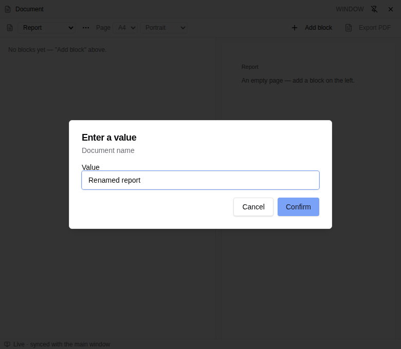
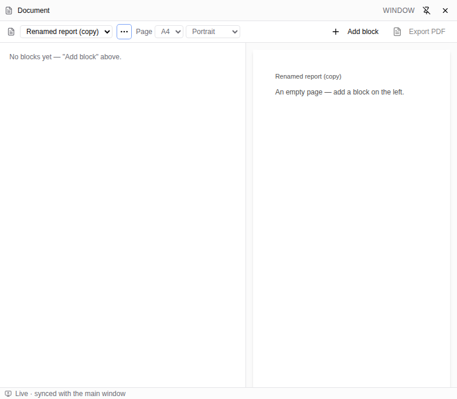

# Document rename in a popped-out window (#6488)

Browser evidence uses the committed authoring-tool sample
`apps/viewer/public/samples/building-architecture.ifc` and the actual viewer's
Document panel, window pop-out action, menu, and shared dialog host.



The browser regression submits a rename, cancels a second rename, dismisses
a third with Escape, then duplicates the document. Each transition checks
that the popup and main window release their modal pointer locks. It also
checks focus returns to Document actions and Tab/Shift+Tab stay inside the
popup prompt.



Run after building workspace dependencies:

```sh
pnpm test:e2e:ci tests/e2e/document-text.e2e.spec.ts --grep '#6488'
```

The spec owns an isolated development server/cache; the configured Playwright
preview server can use a free `PLAYWRIGHT_PORT` when other sessions are active.
The successful local run completed the browser regression without skipped
assertions. The component regression additionally covers cross-window queued
requests and cancellation when the source window closes.
