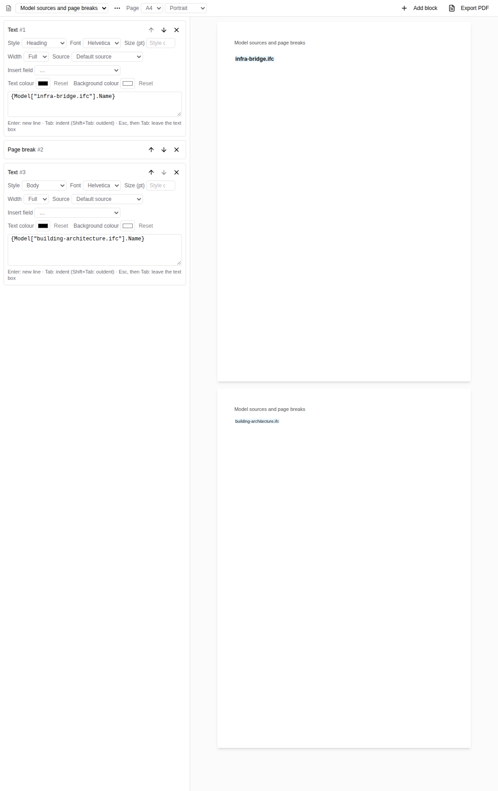

# Document model sources and page breaks (#6485)

Captured from the actual viewer with the committed
`apps/viewer/public/samples/building-architecture.ifc` and `infra-bridge.ifc`
models loaded together through the normal load/add-model controls. The author
inserts each model's Name through the Source and Insert field controls, adds a
Page break and another text block through Add block, and switches the active
model back to architecture. The bridge field remains bound to the bridge.

The screenshot shows the supported document pop-out with both authored sections.
Each inserted field stores the model filename in its path; the Source selector
chooses the source of future insertions. The downloaded PDF is the actual jsPDF
Export PDF result, with two page dictionaries and the correct filename on each
page. The browser test reopens that PDF through the production PDF-text backend
and checks both model names and exactly two nonempty pages. No drawing or PDF
backend is mocked in this run.

Reproduce with `pnpm test:e2e:ci tests/e2e/document-text.e2e.spec.ts --grep '#6485'`.
The preview separates explicit authored breaks; automatic overflow pagination
remains the PDF composer's responsibility.

[Exported two-page PDF](document.pdf)
