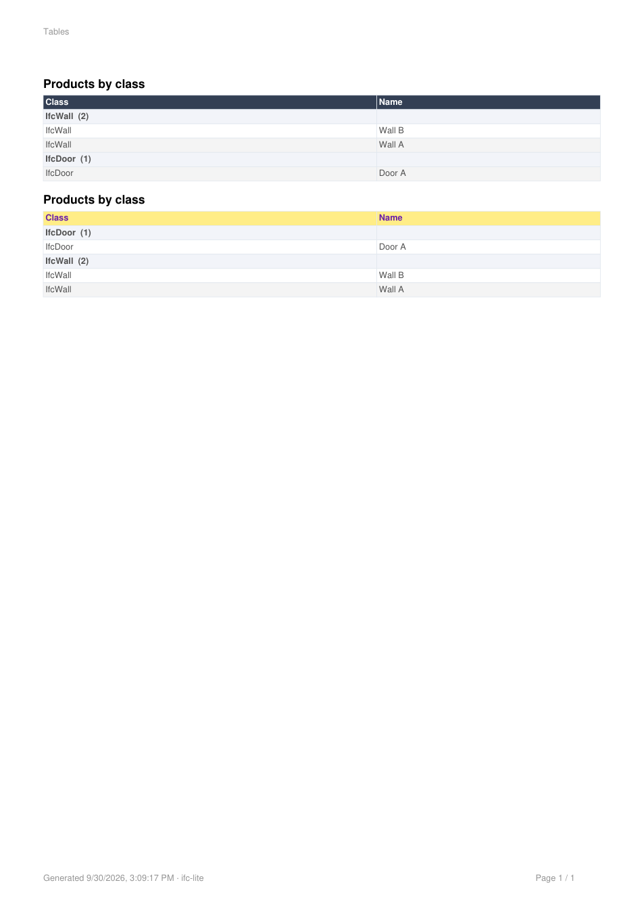

# Document table header text colour (#6543)

Captured on 2026-09-30 from the reviewed implementation at
`2f6d38f5bd8ffd81ad323f33a30b2dc81e2df954`. The publication branch rebases that
implementation onto current `main`; its production changes are identical.

The mounted `DocumentPanel.table.test.tsx` regression uses Happy DOM and a real
`IfcParser` over its inline IFC4 fixture: two walls and one door. It edits the
second table's background to `#ffee88` and header text to `#6b21a8`, checks the
rendered header, reloads the persisted document, imports it, and exports through
the production `browserReportSeams` table adapter with real jsPDF. Recording
wrappers observe calls and PDF output while forwarding to that adapter.

- [Persisted document](persisted-document.json): captured before resetting the
  palette, with both authored colours on the second block. The first block has
  no colour override and retains automatic contrast.
- [Generated PDF](document.pdf): the actual export output, 9,064 bytes and one
  page. It includes both tables, their rows and grouped headings.
- [Rendered PDF](document.png): a raster rendering of that PDF with PyMuPDF
  1.28.2. This image shows the exported page, including purple header text on
  yellow in the second table; it is not a browser screenshot.



The focused mounted run passed **13 tests, zero skipped**. Reverting the
preview call to omit `block.headerTextColor` made the same run fail with
12 passing and one failing: expected `#6b21a8`, received `#000000`. The test
also checks that resetting the text colour restores automatic contrast and
does not erase the independently authored background or group order.

Run the selected test from the repository root after building dependencies
(the publication typecheck builds them through Turbo):

```sh
pnpm typecheck
TEST_SHARD=378368 TEST_SHARDS=1000003 pnpm test --filter=@ifc-lite/viewer --only --env-mode=loose
```

The PDF and JSON were saved using temporary artifact-writing hooks during a
second passing mounted run, immediately after asserting on the actual PDF
output and persisted document. They wrote the output blob's `arrayBuffer()`
and `JSON.stringify(persisted)` and were then removed, restoring the reviewed
test source. Those hooks do not change the export adapter and are not part of
the implementation. The IFC fixture is intentionally small;
these artifacts demonstrate the table colour and persistence contract, not
geometry fidelity or a full browser acceptance run.

The publication successor passed plain root `pnpm typecheck`, including the
test-program audit (3,179 of 3,179 files). A previous full test attempt reported
an SDK failure without a retained diagnostic log; it is unclassified. No full
suite pass or base-versus-branch conclusion is claimed here.

SHA-256 provenance:

| Artifact | SHA-256 |
| --- | --- |
| `document.pdf` | `a23c5bc18a17bc4f2260f909e0026e91c4c203e9fe94cbb04da64f5f9c89a43e` |
| `document.png` | `6fc5df6f02668c286500587b16aa6d9c0bcd2dc953fe324f123df1b021f3b1a4` |
| `persisted-document.json` | `7ae928ad33f33ee70738780b054740e0ec848371ae3b2cdad87d05244677ca6a` |
