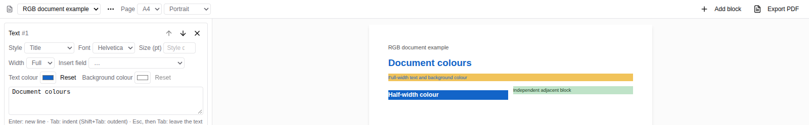

# Document text colours (#6492)

Captured from the actual viewer on the feature branch with the committed
`apps/viewer/public/samples/building-architecture.ifc` sample loaded. The document
contains custom foreground and background colours in a full-width text block and
in two adjacent half-width text blocks. The screenshot is the Document panel's
rendered DOM; the PDF is its real browser Export PDF download using jsPDF,
without mocked drawing seams. Text backgrounds use direct filled rectangles;
no SVG conversion runs for them. The exported page contains a 515.28 pt full-width
rectangle and two 252.64 pt half-width rectangles, with their authored RGB colours.

[Exported PDF](document.pdf)
