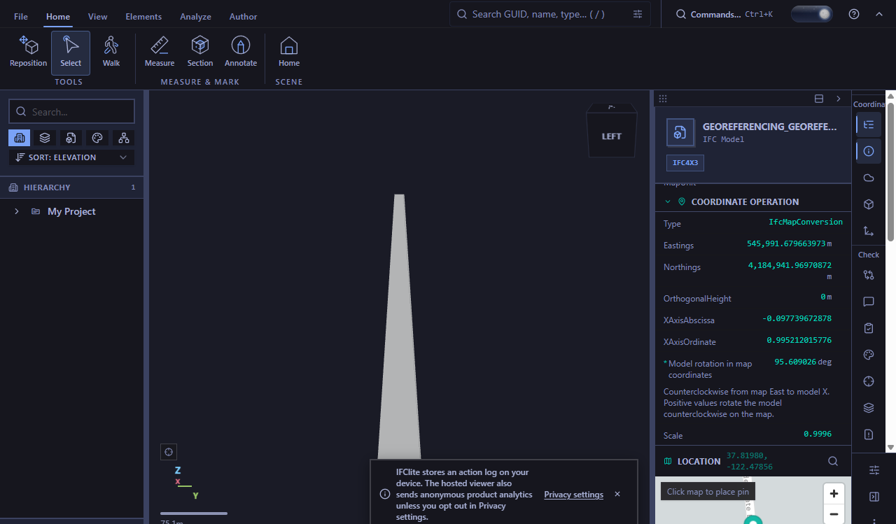
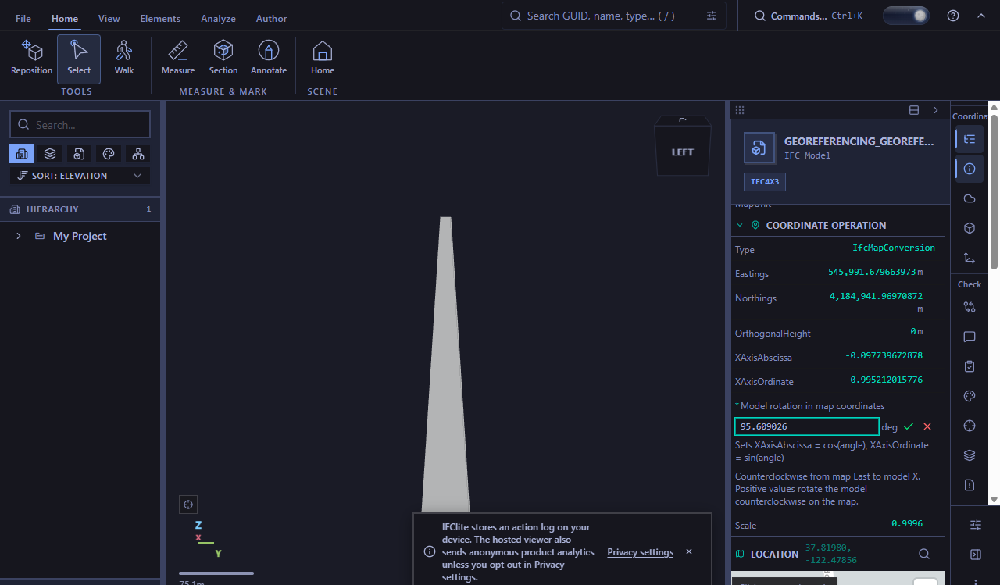
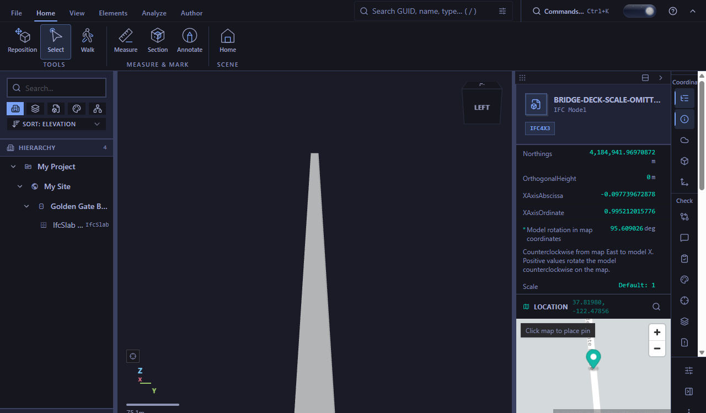

# Georeferencing convention evidence (#6639)

Captured from the running viewer using the T3 Code collaborative browser on
2026-10-01. The rotation screenshots use the unmodified corpus fixture
`tests/models/ifc5/Georeferencing_georeferenced-bridge-deck.ifc`, fetched with
`pnpm fixtures`. Its STEP header names IfcOpenShell as the producing tool.

The authored `IfcMapConversion` direction is
`(-0.0977396728779572, 0.995212015776392)`, which derives a counterclockwise
local-to-map rotation of approximately `+95.609026°`. The screenshots show that
value with the explicit convention and the unchanged authored Scale `0.9996`.

In the angle editor, the browser measured the row at 280 CSS pixels wide,
with both `clientWidth` and `scrollWidth` equal to 280. Its input bounds stayed
inside the row. The editor's `aria-describedby` resolves to the convention
and the cos/sin explanation.

The mounted `GeoreferencingPanel.rotation.test.tsx` suite independently checks
both angle signs through STEP export/reparse; preservation of non-unit and
rounded unchanged directions; omitted Scale remaining omitted after a no-op;
explicit and edited Scale values; and read-only convention guidance. These are
controlled IFC invariants, separate from the unmodified fixture screenshots.

For the default-Scale display, a controlled variant of the same bridge file
changes only the final `IfcMapConversion.Scale` argument from `0.9996` to `$`.
It was loaded as `bridge-deck-scale-omitted.ifc`; this variant is display
evidence, not a claim that the original bridge should use scale 1.

