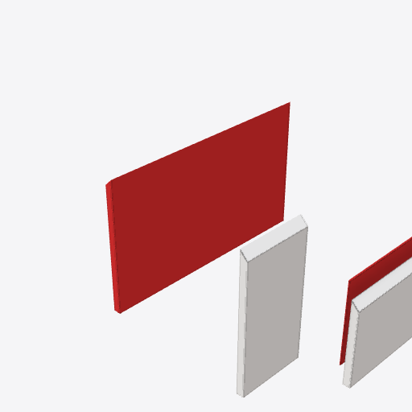
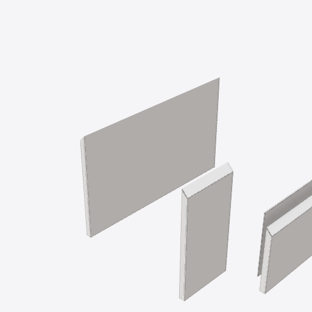
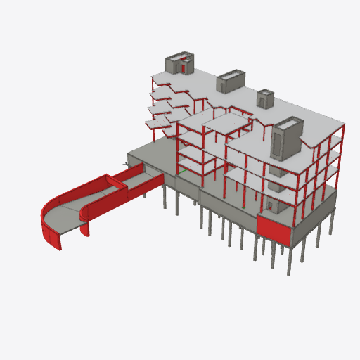

# Validation color restoration: #6490

This contribution adds real browser regression coverage and evidence. It does
not change production behavior: [#6462](https://github.com/LTplus-AG/ifc-lite/pull/6462)
already replaced **Reapply Colors** with the shared **Restore original colors** /
**Show validation colors** toggle. Its original component tests simulated the GPU
flush; these tests run the real panel, rule engine, loader and WebGPU renderer.

## What was reproduced

On main `3dfae0ecc818a0718c5a28a8d3d375c1b3a4799e`, temporarily reversing
only #6462's ten production source files reproduces the reported split:

1. Load the committed `building-architecture.ifc` from SketchUp 2024.
2. Run the actual information rule from the regression spec: `IfcWall` applies,
   and `Name` must contain `right`. Two walls pass and two fail.
3. Keep the genuine default, passed highlights off. Select **Per Spec**, then
   the specification. This paints passed walls green and failed walls red.
4. Click the genuine old **Reapply Colors** control. It calls `applyColors` with
   the default display options: passed walls regain white, failed walls stay red.

The old button reapplied validation; it did not restore the originals. This is
an actual renderer/raster witness, not a failed locator or an import error. The
matched current-code run starts from the identical mixed-color RGBA frame and
**Restore original colors** returns all four walls to white. Clearing isolation
afterward returns the complete scene to its exact pre-run RGBA bytes.

| Genuine old control | Existing current control |
| --- | --- |
|  |  |

The ten source files were restored byte for byte in `finally` after the private
counterfactual. No production changes from that experiment are committed.

## Current behavior and fixtures

The five final browser cases passed with zero skips in 1.1 minutes:

| Case | Actual checks | Failed instanced objects | Restoration |
| --- | ---: | ---: | --- |
| SketchUp, one model | 2 passed / 2 failed | 0 | Exact native RGBA bytes |
| SketchUp, two revisions | 4 passed / 4 failed | 0 | Exact native RGBA bytes |
| Revit Snowdon, one model | 88 passed / 921 failed | 282 | Exact native RGBA bytes |
| SketchUp + Revit, two models | 92 passed / 921 failed | 282 | Exact native RGBA bytes |
| Default Per Spec workflow | 2 passed / 2 failed | 0 | All four scoped walls restore; clearing isolation retains native colors |

The two-model Revit case loads SketchUp first, so the failed instances use
nonzero federated IDs. Every report reference resolves back to its original
model and EXPRESS ID through the canonical store resolver. Both ordinary failed
meshes and failed GPU instances are drawn; captured validation frames contain
additional red and green pixels, and the restored frames match the native
frames exactly. See [browser-proof.json](browser-proof.json) for measured counts,
RGBA hashes, file hashes, entity-reference samples and the actual run command.



The captures come from `Renderer.captureColorFrame`, through the existing
`rendererColorFrame` helper. They are submitted GPU color pixels, not compositor
screenshots, which SwiftShader can retain or discard. Native and restored hashes
are compared within each run; no golden image or predetermined raster is pinned.

Revit grid axes arrive asynchronously after model publication. The fixture uses
the canonical class-visibility action to hide `IfcGrid` before load and asserts
that it remains hidden after all models load. Each capture records grid
visibility; it was off in every frame of the documented run.
This holds the unrelated grid overlay constant; the tested walls, columns and
beams remain visible throughout.

The native SketchUp export is the committed `building-architecture.ifc` viewer
sample. `building-architecture-rev-b.ifc` is a derived regression fixture with
an inherited SketchUp header, not an independent native export. The Revit 2024 IFC is the
existing content-addressed [Snowdon fixture](https://github.com/LTplus-AG/ifc-lite/releases/download/fixtures-v1/fab102eb5f9152bc7053d7e4920a8b75d0d34683c834078f0735c88308eb00a4),
catalogued in `tests/models/manifest.json`; the test verifies its SHA256 before
loading it. An absent Revit fixture skips only its two cases with a `pnpm
fixtures` instruction. The shared hosted-GPU guard permits a skip only after
real device-loss evidence and a failed rendering step; this local run was strict
and all five cases actually passed.

## Run it

```sh
pnpm install
pnpm fixtures
pnpm build:e2e
pnpm exec playwright test tests/e2e/validation-colors.e2e.spec.ts --project=viewer-e2e-ci --workers=1 --reporter=line
```

The dedicated spec serves its source viewer through Vite, using fresh sibling
artifacts from the normal root build. Both canonical viewer projects include it,
so the normal hosted viewer E2E workflow executes it. The root Playwright config
also starts its normal shared preview. On this host, starting that preview first
and verifying HTTP 200 avoided a slow loopback readiness probe.

## Production timing and limits

[#6462](https://github.com/LTplus-AG/ifc-lite/pull/6462) merged at
2026-09-29 08:46:16 UTC. [#6490](https://github.com/LTplus-AG/ifc-lite/issues/6490)
was filed at 09:12:37 UTC, 26 minutes later. The preceding public nightly deploy
completed at 06:22:51 UTC. The next
[deployment run](https://github.com/LTplus-AG/ifc-lite/actions/runs/36562701476)
explicitly confirmed all three projects ready at 11:43:09 UTC for
`64c343bfea7de91b2a44a895f6302f3b1a7f70a7`, which contains #6462.

The report therefore predates the first confirmed fixed production deployment.
Deployment lag is a supported explanation, not a verified account of the
reporter's environment. The report supplies no IFC, rules or browser/GPU details;
these witnesses reproduce the old symptom and prove the bounded current cases,
without claiming to have tested the reporter's unknown model.
