# Geometry Pipeline

Detailed architecture of geometry processing in IFClite.

## Overview

The geometry pipeline transforms IFC shape representations into GPU-ready triangle meshes.

**One pipeline, two orchestrations.** Since the 2026-06 unification series
(#1080 → #1088 → #1084 → shared prepass), per-element mesh production and
prepass resolution exist exactly once, in `ifc-lite-processing`:

- **`processing::element::produce_element_meshes`** — THE per-element decision
  tree (type-product geometry #957, submesh-aware void cuts, per-item #858
  palette splits, single-mesh fallback chain). Run by the native rayon loop
  (server/CLI) and by the browser's `processGeometryBatch` per job. The only
  sanctioned behavioural fork is `TypeGeometryMode` (an export suppresses
  instanced type geometry; the viewer emits it tagged for its Model/Types
  switch).
- **`processing::prepass`** — the shared post-scan resolver (styled-item
  precedence, IfcIndexedColourMap #663/#858, the #407 material chain, voids
  with #845 aggregate propagation) plus `resolve_unit_scales` (length AND
  plane-angle, resolved once with a documented fallback ladder for
  late-in-file `IFCPROJECT`) and the flat wire codecs for the JS boundary.
  The scan loops stay per-orchestration (native scan with properties/quick
  metadata; browser `buildPrePassOnce`/`buildPrePassStreaming` with
  incremental job emission), but they only span-stash — all semantics resolve
  in the shared module.

Geometry/styling fixes belong in those two modules; re-inlining logic in
`processor.rs` or `gpu_meshes.rs` re-creates the historic both-sides drift
(#858, #913, #957, #961 each had to be fixed twice before the unification).

The per-representation processing below is shared by construction:

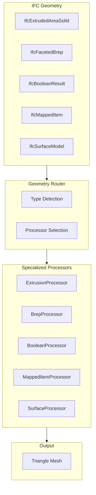

## Geometry Representation Types

### IFC Geometry Hierarchy

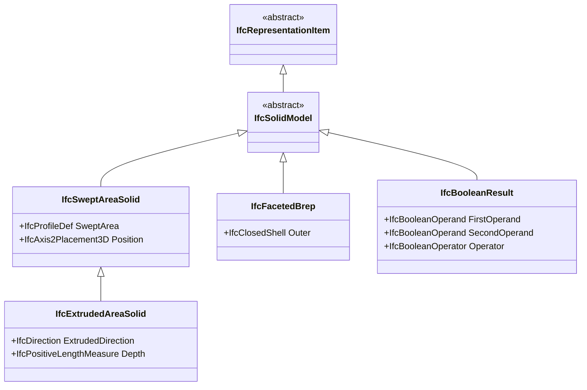

### Coverage by Type

| Geometry Type | Coverage | Notes |
|---------------|----------|-------|
| IfcExtrudedAreaSolid | Full | Most common |
| IfcFacetedBrep | Full | Face triangulation + source weld |
| IfcBooleanClippingResult | Full | Exact pure-Rust CSG kernel |
| IfcMappedItem | Full | GPU instancing |
| IfcSurfaceModel | Partial | Surface meshes |
| IfcTriangulatedFaceSet | Full | IFC4 triangles, zero-alloc fast parse |

## Extrusion Processing

### Pipeline

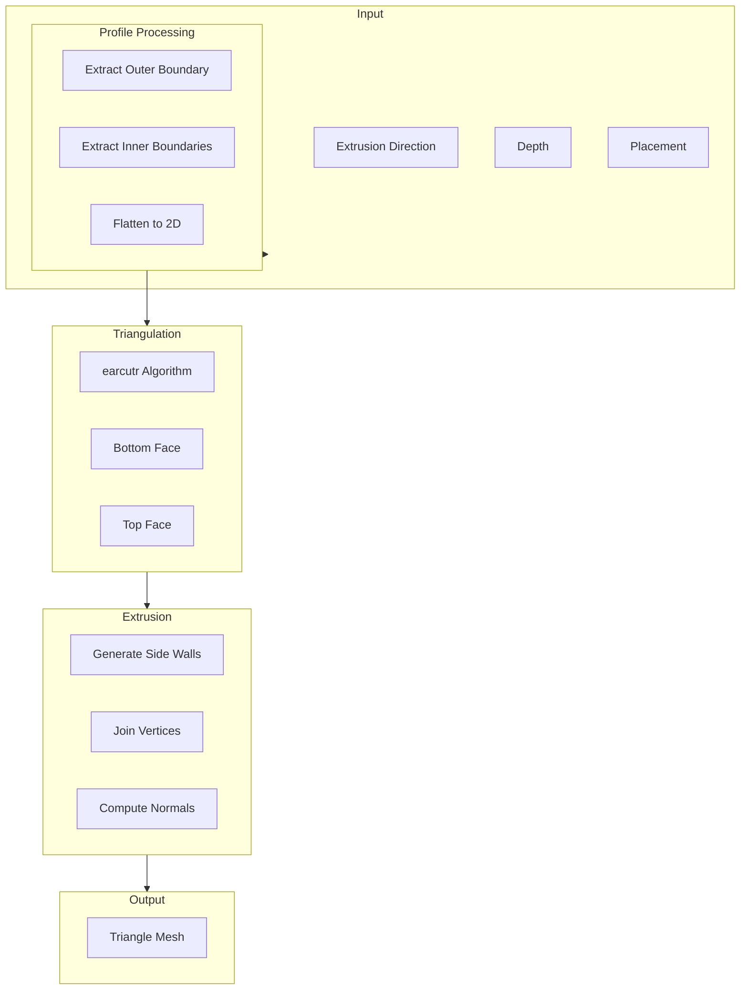

### Profile Types

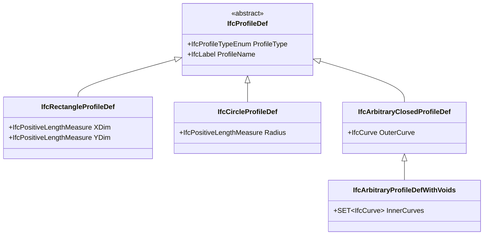

### Earcut Algorithm

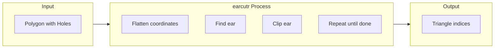

```rust
use earcutr::earcut;

fn triangulate_profile(
    outer: &[Point2],
    holes: &[Vec<Point2>]
) -> Vec<u32> {
    // Flatten to coordinate array
    let mut coords: Vec<f64> = Vec::new();
    let mut hole_indices: Vec<usize> = Vec::new();

    // Add outer boundary
    for p in outer {
        coords.push(p.x);
        coords.push(p.y);
    }

    // Add holes
    for hole in holes {
        hole_indices.push(coords.len() / 2);
        for p in hole {
            coords.push(p.x);
            coords.push(p.y);
        }
    }

    // Triangulate
    earcut(&coords, &hole_indices, 2)
        .unwrap()
        .into_iter()
        .map(|i| i as u32)
        .collect()
}
```

## Brep Processing

### FacetedBrep Pipeline

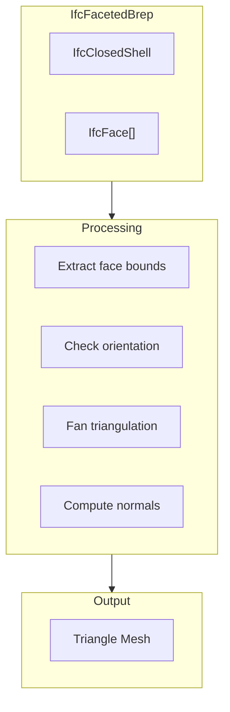

### Face Triangulation

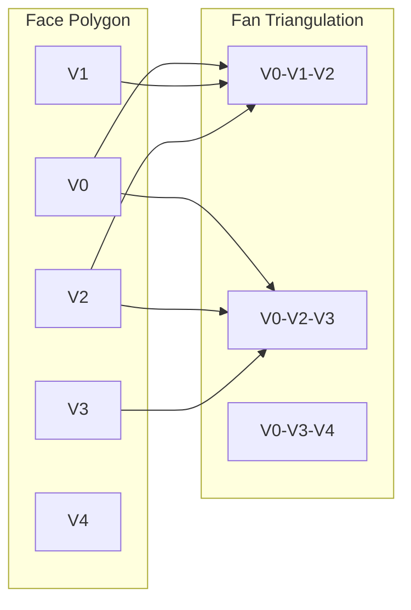

## Boolean Operations

### CSG Pipeline

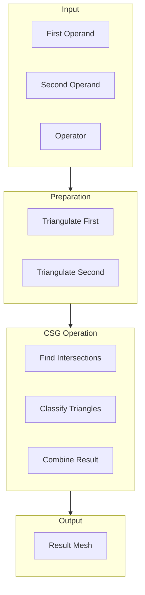

### Boolean Operators

| Operator | Description | Common Use |
|----------|-------------|------------|
| DIFFERENCE | A - B | Wall openings |
| UNION | A + B | Composite shapes |
| INTERSECTION | A ∩ B | Clipping |

### Void Cutting

Opening voids (`IfcRelVoidsElement`) go through ONE exact path: the prepass resolves the void map (including aggregate propagation), and `produce_element_meshes` cuts each host with a single exact CSG difference. All cutter prisms for a host are unioned in one arrangement (`kernel::mesh_bridge::union_many`) before the cut, cutter geometry is clamped to the host's AABB with a millimetre-scale pad, and on any kernel failure the host mesh is returned un-cut with a structured failure record. There is no approximate or AABB-clipping fallback path for voids.

## Mesh Hygiene

Every element's meshes pass through a single funnel (`build_mesh_data` in `ifc-lite-processing::element`) that applies:

- **Degenerate/sliver drops**: `drop_degenerate_triangles` and `drop_thin_triangles` remove zero-area and needle triangles at every output chokepoint (kernel output, funnel backstop), so CSG residue never reaches the GPU.
- **Source vertex weld** (`mesh_weld::weld_indexed`): collapses vertices with identical f32 position AND coinciding quantized normal (and UV). The faceted-brep mesher emits per-face geometry that duplicates every shared corner 3-6x; the weld undoes that while keeping creases split, because the normal is part of the merge key. Flat shading is preserved by construction (a cube keeps its 24 vertices), and texture seams stay split via the UV key. A naive position-only weld is deliberately NOT used, since it would smooth creases and break flat shading.

The weld and drops are deterministic across native and wasm32 targets.

## Coordinate Transformations

### Placement Stack

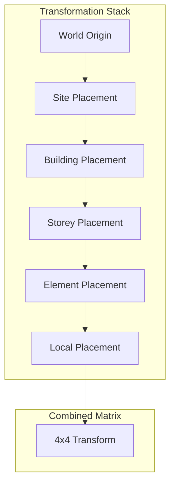

### Matrix Operations

```rust
use nalgebra::{Matrix4, Point3, Vector3};

fn compute_transform(placements: &[Placement]) -> Matrix4<f64> {
    let mut result = Matrix4::identity();

    for placement in placements {
        let local = Matrix4::new_translation(&placement.location)
            * Matrix4::from_axis_angle(&placement.axis, placement.angle);
        result = result * local;
    }

    result
}

fn transform_point(point: Point3<f64>, matrix: &Matrix4<f64>) -> Point3<f64> {
    matrix.transform_point(&point)
}
```

### Large Coordinate Handling

Two mechanisms keep f32 GPU coordinates precise (details in [Coordinate Handling](coordinate-handling.md)):

- **Model-level RTC offset**: the pre-pass samples placement translations of geometry-bearing elements and, when the per-axis median exceeds 10 km, subtracts that offset from every mesh.
- **Per-element local-frame origin**: each `MeshData` carries an f64 `origin`; positions are stored as small f32 values relative to it, so building-scale translations never get baked into f32 vertices.

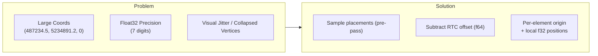

## Quality Modes

### Curve Discretization

Tessellation detail is controlled by a single `TessellationQuality` enum (`rust/geometry/src/tessellation.rs`), exposed as the wasm `setTessellationQuality` setter and the server's `tessellation_quality` query parameter. Segment counts are adaptive: a circle's base count scales with its radius (`clamp(sqrt(r) * 8, 8, 32)`), then the quality level multiplies it.

| Level | Density factor | Use Case |
|-------|----------------|----------|
| `lowest` | 0.25x | Previews, huge models |
| `low` | 0.5x | Mobile |
| `medium` | 1.0x | Default (golden-output identity) |
| `high` | 2.0x | Detailed viewing |
| `highest` | 4.0x | Minimal faceting on curved models |

## Mapped Representations

IFC reuses geometry via `IfcMappedItem` (a source `IfcRepresentationMap` plus a
per-instance placement transform). For the primary model the engine collates
congruent occurrences into **GPU instances**: the wasm
`processGeometryBatchInstanced` entry point (backed by
`rust/geometry/src/instancing` and `processors/mapped.rs`) partitions opaque
ordinary occurrences into per-template instanced shards, and the renderer
uploads each template once as `instancedTemplates` via `addInstancedShard` (see
the rendering guide), then draws every occurrence of a template in a single
instanced draw call. Instancing is enabled by default for the primary model
(`enableInstancing: target.kind === 'primary'` in the viewer loader); federated
loads keep geometry flat. Occurrences that are not eligible for instancing
(transparent glass, or non-ordinary geometry classes) fall back to being
tessellated per placement and grouped by colour into batched draw calls.

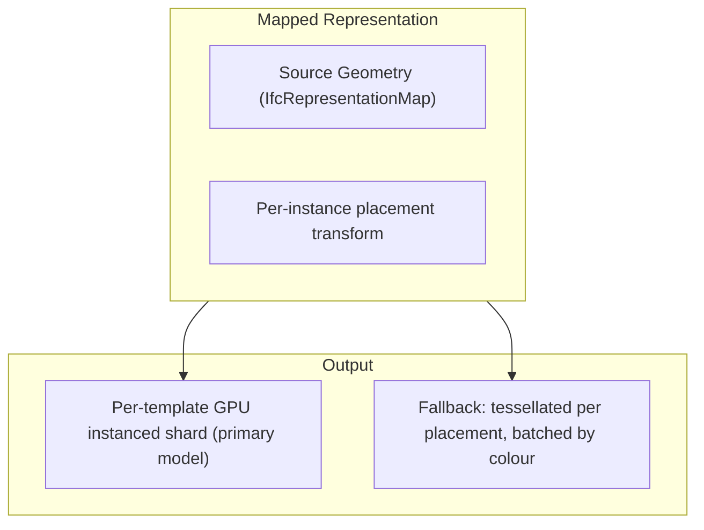

## Streaming Pipeline (Browser Worker Pool)

In the browser, `@ifc-lite/geometry` orchestrates a worker pool (`geometry-parallel.ts`):

1. A single **pre-pass worker** runs the WASM streaming scanner. It walks the file once and emits `meta` (RTC offset + unit scales, resolved early), `jobs` chunks (~every 50K entities), and `complete`.
2. On `meta`, N **geometry workers** are spawned. N is memory-budget aware (`worker-count.ts`): capped by cores, device memory, and job count (default hard cap 8), because each worker's WASM linear memory grows to roughly 1.5x the file size in the models measured (the exact ratio varies with model content).
3. Job chunks are distributed with **content-affinity routing**: jobs sharing an affinity key (identical source geometry) land on the same worker, preserving decoder-cache locality.
4. Each worker calls the synchronous WASM `processGeometryBatch` with an **adaptive job budget** (`batch-sizing.ts`): instead of a fixed job count, it targets a fixed wall-time per call and resizes from measured throughput, so dense CSG regions produce small regular heartbeats (keeping the stall watchdog fed) while light regions grow toward the maximum.

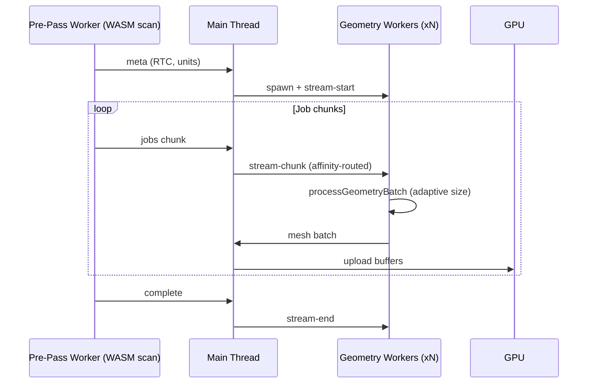

In one measured 1 GB file this dropped time-to-first-batch from roughly 17 s (full pre-pass, then meshing) to 3-5 s. Treat these as observed benchmark figures for that model and machine, not a guarantee for all files or hardware.

## CSG Kernel

ONE kernel: the in-tree **pure-Rust exact mesh-arrangement kernel**
(`rust/geometry/src/kernel/`), on every target — native (server, CLI, SDK)
and `wasm32-unknown-unknown` (viewer) alike. The kernel architecture
(exact predicate cascade, conforming arrangement, winding classification,
deterministic output ordering) is documented in the module docs under
`rust/geometry/src/kernel/`.

Key properties:

- **Exact**: every in/out and on-plane decision routes through exact
  geometric predicates (Shewchuk adaptive floats escalating to exact
  rational arithmetic), so coplanar faces, shared seams and
  flush-cap cuts are decided correctly, not by epsilon.
- **Platform-deterministic**: identical output bytes on x86_64, aarch64
  and wasm32 (pinned by the determinism manifests in
  `rust/geometry/tests/`).
- **No operand cap**: arbitrary operand sizes; cost is bounded by the
  pre-arrangement complexity budget in the void router rather than a
  hard polygon cap.
- **N-ary union**: `kernel::mesh_bridge::union_many` unions all cutter
  prisms in ONE arrangement (issue #960 segmented-roof seams).
- **Failure surface**: on any kernel failure the host mesh is returned
  un-cut and a structured `BoolFailure` record is emitted (drainable via
  `GeometryRouter::take_csg_failures`). The regression gates assert
  `total_failures == 0` on `AC20-FZK-Haus.ifc`,
  `C20-Institute-Var-2.ifc` and `AC-20-Smiley-West-10-Bldg.ifc`.

History (June 2026): two earlier kernels — the legacy BSP port of
csg.js (`bsp_csg.rs`, 128-polygon operand cap, server/wasm default) and
the Manifold C++ kernel (`manifold_kernel.rs` + `manifold-csg-sys`,
viewer/native feature) — were deleted in the kernel consolidation
once the pure-Rust kernel reached parity. With them went the whole
C++ cross-toolchain (cmake, LLVM-20/libc++, emsdk on Vercel) and the
`manifold-csg`/`manifold-csg-wasm-uu` Cargo features; the geometry crate
builds with `default = []` everywhere. There is no kernel selection —
build-time or runtime.

## Performance Metrics

| Operation | Time (typical) | Notes |
|-----------|---------------|-------|
| Profile extraction | 0.1 ms | Per entity |
| Earcut triangulation | 0.5 ms | Simple profile |
| Extrusion | 0.2 ms | Per entity |
| Boolean operation | 5-50 ms | Complex |
| Transform application | 0.01 ms | Per vertex |

### Throughput

- **Simple extrusions**: ~2000 entities/sec
- **Complex Breps**: ~200 entities/sec
- **Boolean operations**: ~20 entities/sec

## Next Steps

- [Rendering Pipeline](rendering-pipeline.md) - WebGPU rendering
- [API Reference](../api/rust.md) - Geometry API
