# Parsing Pipeline

Detailed architecture of the IFClite parsing system.

## Overview

The parsing pipeline transforms STEP/IFC files into structured data. Two independent components cooperate:

- A **fast entity scanner** (`rust/core/src/parser/scanner.rs`): a hand-rolled, memchr-accelerated byte scanner that walks the raw file once and records every entity's id, byte span, and type name. It is quote- and comment-aware and skips the STEP HEADER, but it never builds tokens.
- A **nom tokenizer** (`rust/core/src/parser/tokenizer.rs`): a zero-copy combinator lexer used only when an entity's attributes are actually decoded. String-like tokens borrow their original bytes.

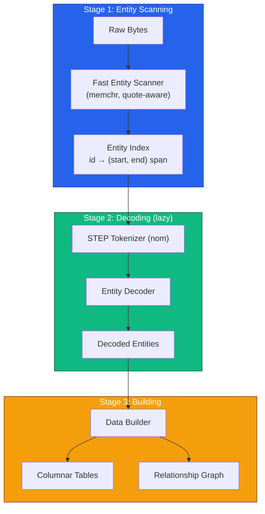

On native targets the entity index is additionally built **in parallel** (`rust/processing/src/parallel_scan.rs`): the file is split into byte ranges scanned concurrently, and a handoff-stitch pass makes the merged index byte-identical to the serial single-walk scanner. On wasm32 the serial scanner is used directly.

## Tokenization

### Token Types

The tokenizer produces structured tokens directly (there are no separate punctuation tokens; lists and typed values are parsed as nested structures):

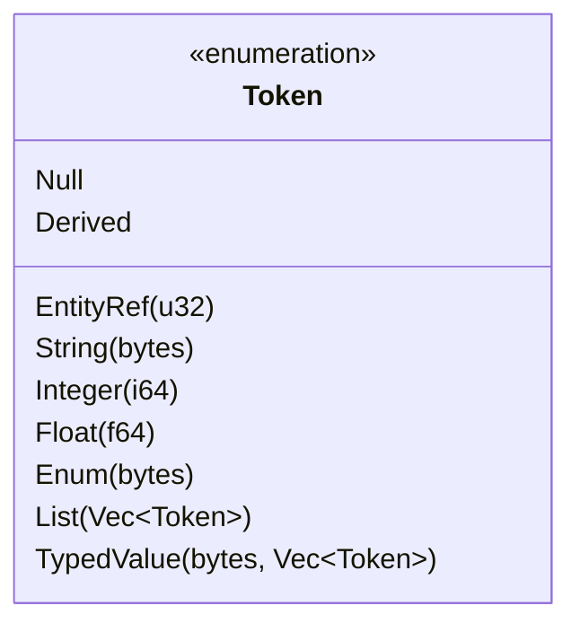

`String` and `Enum` tokens borrow their original bytes; STEP escape decoding (`\X2\`, `\S\`, ...) happens only when a value crosses a user-facing boundary.

### Lexer Architecture

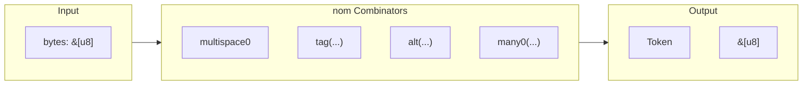

### Key Lexer Functions

```rust
// Entity reference: #123 (rust/core/src/parser/tokenizer.rs)
fn entity_ref(input: &[u8]) -> IResult<&[u8], Token<'_>> {
    map(
        preceded(char('#'), map_res(digit1, lexical_core::parse::<u32>)),
        Token::EntityRef,
    )(input)
}
```

String literals use memchr to find the closing quote (with `''` escape handling), and numbers are parsed with `lexical-core`.

### Performance Optimizations

| Optimization | Technique | Benefit |
|--------------|-----------|---------|
| Zero-copy | Store byte slices | No allocation |
| SIMD search | memchr crate | 10x faster search |
| Fast numbers | lexical-core | 5x faster parsing |
| Branch prediction | Ordered alternatives | Better CPU prediction |

## Entity Scanning

### Scanner State Machine

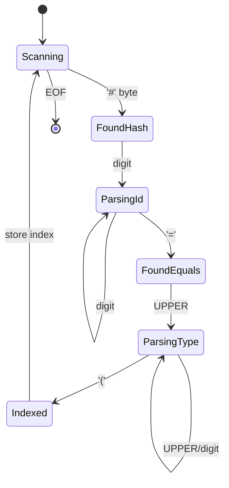

### Entity Index Structure

The entity index is deliberately minimal: a hash map from express ID to the entity's byte span in the file buffer.

```rust
// rust/core/src/decoder.rs
pub type EntityIndex = FxHashMap<u32, (usize, usize)>; // id -> (start, end)
```

The scanner also yields the entity's type name during the same walk, so callers that need type-filtered job lists (the geometry pre-pass, the RTC sampler) get it without a second pass.

### Scanning Algorithm

The real scanner (`EntityScanner` in `rust/core/src/parser/scanner.rs`) is more careful than a naive `#` hunt:

- Skips the STEP HEADER section first, so a stray `#` inside a header string cannot corrupt quote parity for the rest of the file.
- Hunts for `#` with memchr (SIMD-accelerated), then parses `#id = TYPE(...)` in place.
- Tracks quoted strings and `/* ... */` comments so `;` inside strings never terminates a record.
- Returns `(id, type_name, start, end)` per entity; `build_entity_index` inserts spans with last-wins semantics on duplicate IDs.

On native, `parallel_scan` shards this walk across all cores and stitches the shard results back into the exact serial output (same key set, same spans, same last-wins order).

## Entity Decoding

### Decoder Architecture

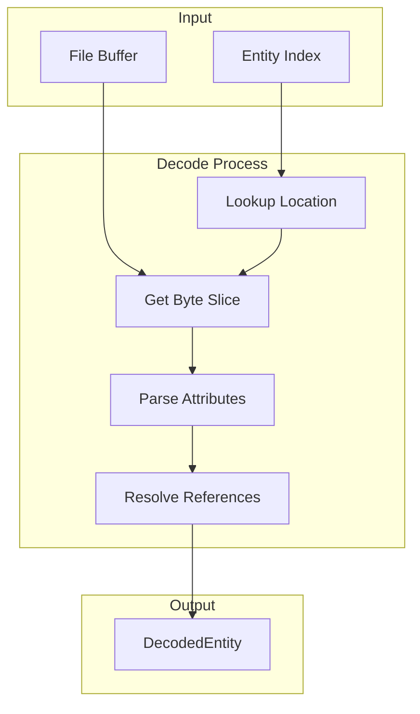

### Lazy vs Eager Decoding

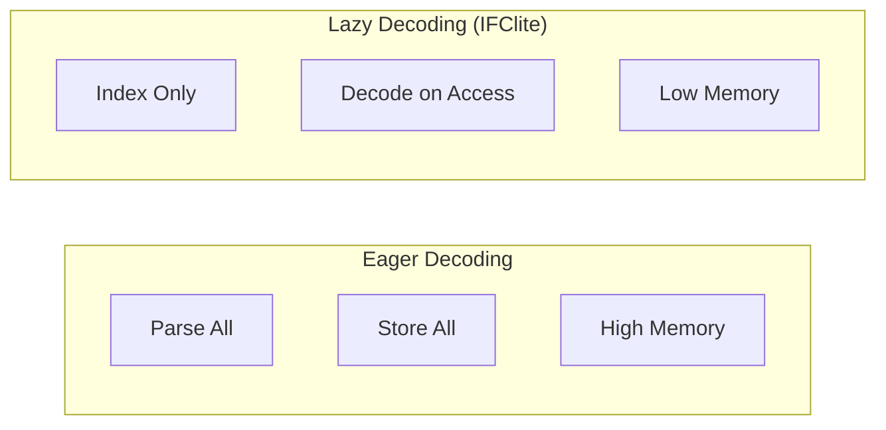

### Attribute Value Types

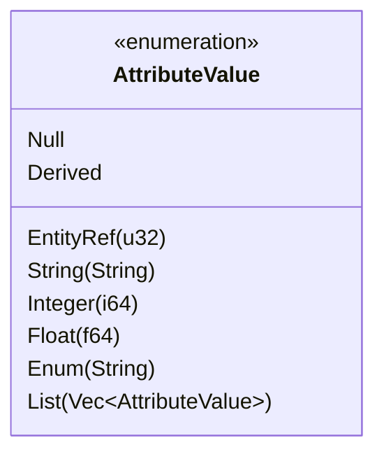

Booleans arrive as `Enum` values (`.T.` / `.F.`); typed values such as `IFCBOOLEAN(.T.)` are unwrapped during decoding. Tessellation-heavy payloads (coordinate and index lists) can bypass the token pipeline entirely via the zero-allocation fast path in `rust/core/src/fast_parse.rs`.

## Data Building

### Builder Pipeline

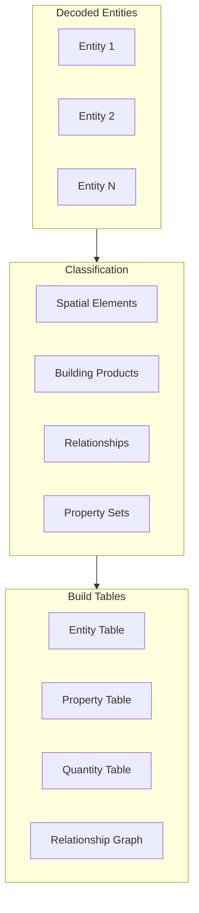

### Columnar Table Building

In the browser, the columnar tables live in `@ifc-lite/data` and are filled by the single-pass columnar parser in `@ifc-lite/parser` (`columnar-parser.ts`):

```typescript
// packages/data/src/entity-table.ts (abridged)
export class EntityTableBuilder {
  expressId: Uint32Array;
  typeEnum: Uint16Array;
  globalId: Uint32Array;        // StringTable index
  name: Uint32Array;            // StringTable index
  description: Uint32Array;
  objectType: Uint32Array;
  flags: Uint8Array;
  containedInStorey: Int32Array;
  definedByType: Int32Array;
  geometryIndex: Int32Array;
  rawTypeName: Uint32Array;     // fallback display for unknown types
  // add(...) interns strings; build() shrinks arrays to count
}
```

String-valued columns store indices into a shared deduplicating `StringTable`. Properties and quantities are NOT bulk-parsed here; the builder records `entityId -> psetIds` maps and values are decoded on access (see the on-demand extractors).

### Relationship Graph Building

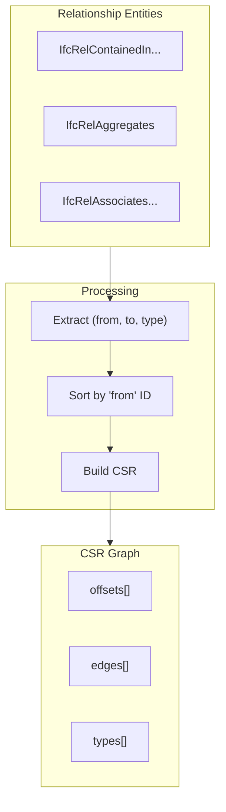

## Browser Scan Paths

The TypeScript parser (`@ifc-lite/parser`) picks the fastest available scan path at runtime (`entity-scanner.ts`):

```typescript
export type EntityScanPath = 'worker' | 'wasm' | 'tokenizer' | 'pre-scanned';
```

| Path | When | How |
|------|------|-----|
| `pre-scanned` | Geometry pre-pass already indexed the file | Reuses the WASM scan's `(ids, starts, lengths)` arrays, zero rescan |
| `worker` | Default for large buffers | Inline Web Worker runs the scan off the main thread |
| `wasm` | WASM API available | `scanEntitiesFastBytes` (memchr scanner in Rust) |
| `tokenizer` | Fallback | Pure-TS `StepTokenizer` scan |

After the scan, the columnar parser (`columnar-parser.ts`) does a single pass over the entity refs to build tables, relationships, and the spatial hierarchy, yielding to the event loop periodically so the UI stays responsive.

## Error Handling

### Error Types

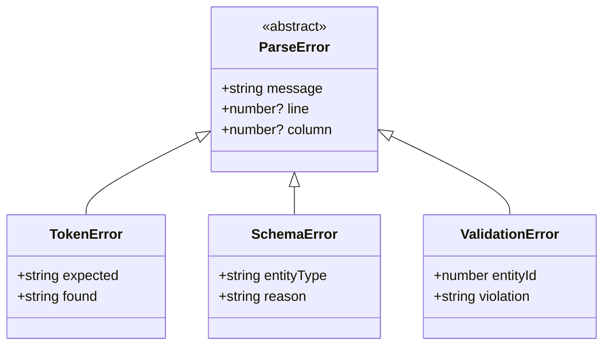

### Error Recovery

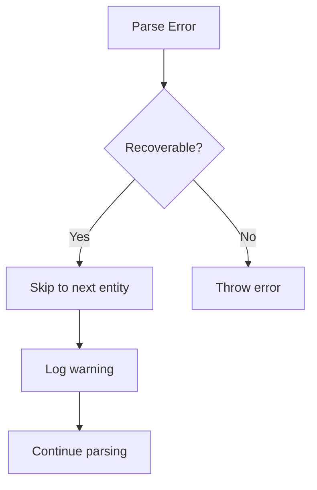

## Performance Characteristics

Indicative orders of magnitude (hardware and model dependent):

- **Entity scanning** is memchr-bound and runs at hundreds of MB/s; on native it additionally parallelizes across cores.
- **Decoding** dominates when many entities are actually materialized, which is why decoding is lazy and properties are parsed on access.
- **Full parse** (scan + columnar build) is typically tens of MB/s in the browser; STEP parse can be 25-80% of total load time on entity-heavy files, which is what motivated the fast scanner and the on-demand property model.

## Next Steps

- [Geometry Pipeline](geometry-pipeline.md) - Geometry processing
- [Rendering Pipeline](rendering-pipeline.md) - WebGPU rendering
- [API Reference](../api/rust.md) - Parser API
