# Rendering Pipeline

Detailed architecture of the WebGPU rendering system.

## Overview

The rendering pipeline (`@ifc-lite/renderer`) transforms mesh data into pixels on screen. Key design decisions:

- **Reverse-Z depth** (`depthCompare: 'greater'`, depth cleared to 0): near-uniform depth precision without a logarithmic depth trick.
- **Double-sided rendering** (`cullMode: 'none'` on every pipeline): IFC winding order is not reliably outward, so backface culling is disabled.
- **Per-entity depth nudge ("z-hash")**: the vertex shader hashes the entity ID (Knuth multiplicative hash) into a tiny deterministic depth offset, so coplanar faces from different entities never z-fight.
- **Color batching + GPU instancing**: non-instanced meshes are merged into per-color batches; repeated mapped geometry renders as instanced shards (one template, many transforms).

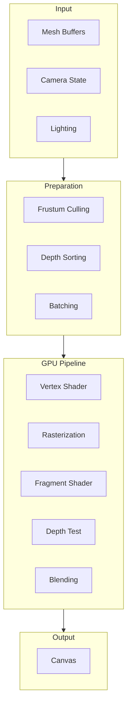

## WebGPU Architecture

### Device Initialization

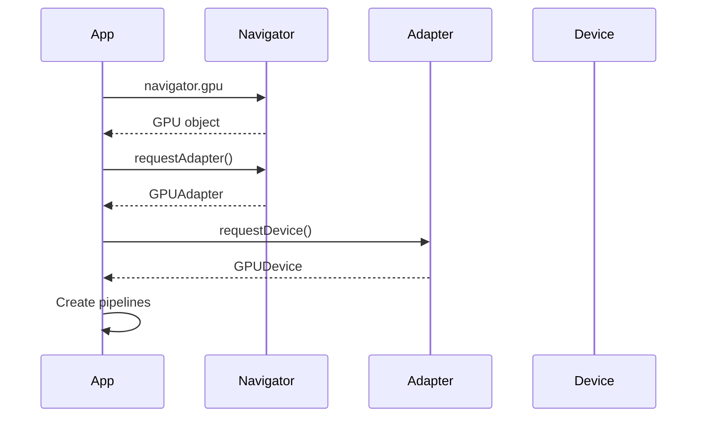

### Resource Hierarchy

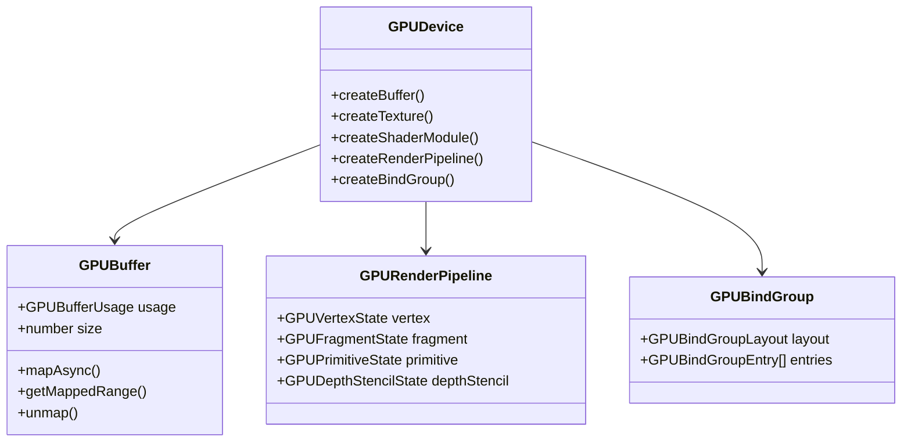

## Buffer Management

### Buffer Types

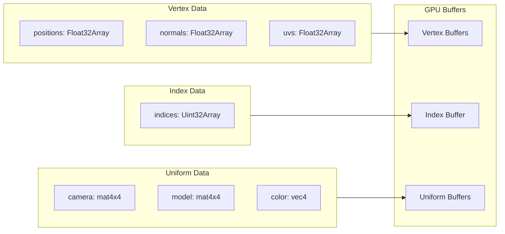

### Buffer Layout

```typescript
// Vertex buffer layout (packages/renderer/src/pipeline.ts)
const vertexBufferLayout: GPUVertexBufferLayout = {
  arrayStride: 28, // 7 * 4 bytes
  attributes: [
    { shaderLocation: 0, offset: 0,  format: 'float32x3' }, // position
    { shaderLocation: 1, offset: 12, format: 'float32x3' }, // normal
    { shaderLocation: 2, offset: 24, format: 'uint32'    }, // entityId (globalId)
  ]
};

// Interleaved vertex data
// [px, py, pz, nx, ny, nz, entityId, ...]
```

The per-vertex `entityId` is the federated global ID (`expressId + model idOffset`). It drives picking, the selection/ghost highlight, and the anti-z-fighting depth nudge; the low 24 bits are the picking ID and the high 8 bits carry a color salt used by multi-layer walls so coincident layer caps of the SAME parent entity still get distinct nudges.

## Shader Architecture

### Vertex Shader

Simplified from `packages/renderer/src/shaders/main.wgsl.ts`:

```wgsl
struct VertexInput {
    @location(0) position: vec3<f32>,
    @location(1) normal: vec3<f32>,
    @location(2) entityId: u32,
}

struct VertexOutput {
    @builtin(position) position: vec4<f32>,
    @location(0) worldPos: vec3<f32>,
    @location(1) normal: vec3<f32>,
    @location(2) @interpolate(flat) entityId: u32,
}

@vertex
fn vs_main(input: VertexInput) -> VertexOutput {
    var output: VertexOutput;

    let worldPos = uniforms.model * vec4(input.position, 1.0);
    output.position = uniforms.viewProjection * worldPos;

    // Anti z-fighting: deterministic per-entity depth nudge.
    // Knuth multiplicative hash spreads IDs across 0-255; low 24 bits
    // are the picking id, high 8 bits a colour salt for layered walls.
    let colorSalt = (input.entityId >> 24u) * 2654435761u;
    let zHash = (((input.entityId & 0x00FFFFFFu) ^ colorSalt) * 2654435761u) & 255u;
    // ... zHash scales a tiny clip-space depth offset ...

    output.worldPos = worldPos.xyz;
    output.normal = uniforms.normalMatrix * input.normal;
    output.entityId = input.entityId;
    return output;
}
```

The instanced variant (`vs_instanced`) reads the model matrix, entityId, color, and flags per occurrence from the instance buffer instead.

### Fragment Shader

```wgsl
struct Material {
    color: vec4<f32>,
    metallic: f32,
    roughness: f32,
}

struct Light {
    position: vec3<f32>,
    color: vec3<f32>,
    intensity: f32,
}

The fragment shader (simplified) shades double-sided, applies the section plane / clip box discards, and writes a SECOND render target carrying the entity ID for picking:

```wgsl
struct FragmentOutput {
    @location(0) color: vec4<f32>,
    @location(1) objectIdEncoded: vec4<f32>, // rgba8unorm, 24-bit entity id
}

@fragment
fn fs_main(input: VertexOutput) -> FragmentOutput {
    // Section plane / clip box test (discard clipped fragments)
    // ... see Section Planes below ...

    // Double-sided lighting: flip the normal toward the viewer
    var N = normalize(input.normal);
    // ... diffuse + specular + ambient shading ...

    var out: FragmentOutput;
    out.color = vec4(finalColor, materialAlpha);
    out.objectIdEncoded = encodeId24(input.entityId);
    return out;
}
```

## Render Loop

### Frame Structure

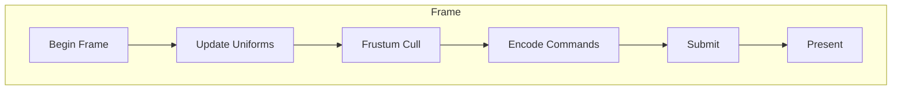

### Command Encoding

```typescript
render(): void {
  // Begin frame
  const commandEncoder = device.createCommandEncoder();

  const renderPass = commandEncoder.beginRenderPass({
    colorAttachments: [{
      view: context.getCurrentTexture().createView(),
      clearValue: { r: 0.95, g: 0.95, b: 0.95, a: 1.0 },
      loadOp: 'clear',
      storeOp: 'store'
    }],
    depthStencilAttachment: {
      view: depthTexture.createView(),
      depthClearValue: 0.0, // Reverse-Z: clear to far (0), test 'greater'
      depthLoadOp: 'clear',
      depthStoreOp: 'store'
    }
  });

  // Set pipeline
  renderPass.setPipeline(renderPipeline);

  // Draw color batches (opaque first, then transparent back-to-front)
  for (const batch of visibleBatches) {
    renderPass.setBindGroup(0, batch.bindGroup);
    renderPass.setVertexBuffer(0, batch.vertexBuffer);
    renderPass.setIndexBuffer(batch.indexBuffer, 'uint32');
    renderPass.drawIndexed(batch.indexCount);
  }

  // Draw instanced shards (one template, many occurrences)
  for (const shard of instancedTemplates) {
    renderPass.setPipeline(instancedPipeline);
    renderPass.setVertexBuffer(0, shard.vertexBuffer);
    renderPass.setVertexBuffer(1, shard.instanceBuffer);
    renderPass.setIndexBuffer(shard.indexBuffer, 'uint32');
    renderPass.drawIndexed(shard.indexCount, shard.instanceCount);
  }

  renderPass.end();

  // Submit
  device.queue.submit([commandEncoder.finish()]);
}
```

## Frustum Culling

Culling happens at two granularities: an optional spatial index answers `queryFrustum` for per-entity visibility, and each color batch / instanced shard is AABB-tested against the frustum planes before it is drawn. If culling fails, the renderer falls back to drawing everything.

### Culling Pipeline

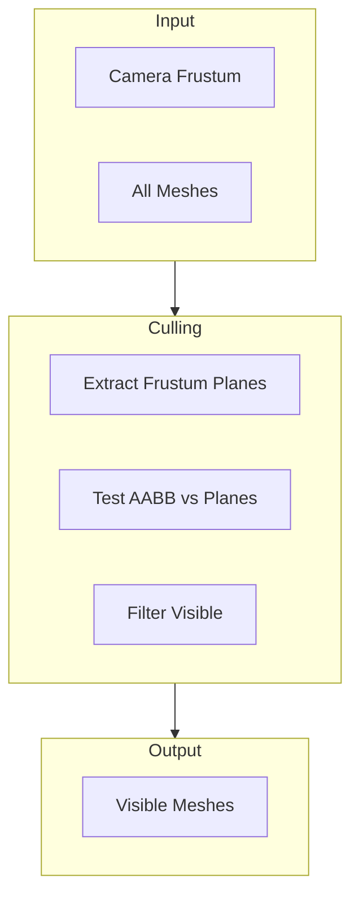

### AABB-Frustum Test

```typescript
interface Frustum {
  planes: Plane[]; // 6 planes: near, far, left, right, top, bottom
}

interface AABB {
  min: Vector3;
  max: Vector3;
}

function isVisible(aabb: AABB, frustum: Frustum): boolean {
  for (const plane of frustum.planes) {
    // Get positive vertex (furthest along plane normal)
    const pVertex = {
      x: plane.normal.x > 0 ? aabb.max.x : aabb.min.x,
      y: plane.normal.y > 0 ? aabb.max.y : aabb.min.y,
      z: plane.normal.z > 0 ? aabb.max.z : aabb.min.z
    };

    // If positive vertex is behind plane, AABB is outside
    if (dot(plane.normal, pVertex) + plane.d < 0) {
      return false;
    }
  }
  return true;
}
```

## Selection & Picking

### ID Buffer Approach

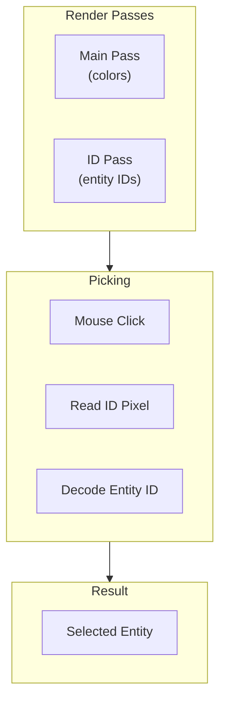

### ID Encoding

The picked ID is the 24-bit picking portion of the per-vertex `entityId` (the high 8 bits are the colour salt and are masked off), encoded into an `rgba8unorm` attachment by `encodeId24`. The pick pass (`packages/renderer/src/picker.ts`) mirrors the main pass exactly: same discards (section plane, clip box, hidden flags), plus a dedicated instanced pick pipeline for instanced shards, so anything visible is pickable and nothing else.

Alongside the ID, the pick readback samples the depth buffer and unprojects it through the inverse view-projection matrix to get the world-space hit point:

```typescript
// Reverse-Z: depth = 1 is the near plane, depth = 0 means "missed
// everything" (the clear value survived), so 0 returns null.
function unprojectPickSample(viewProj, pickX, pickY, width, height, depth) {
  if (!Number.isFinite(depth) || depth <= 0) return null;
  const ndcX = ((pickX + 0.5) / width) * 2 - 1;
  const ndcY = 1 - ((pickY + 0.5) / height) * 2;
  return transformPoint(invert(viewProj), { x: ndcX, y: ndcY, z: depth });
}
```

The decoded ID is a **global ID**; the application resolves it back to `{ modelId, expressId }` via the federation registry (see [Federation](federation.md)). A BVH-based CPU raycaster (`bvh.ts`, `raycast-engine.ts`) complements GPU picking for snapping and measurement.

## Section Planes

### Clipping Implementation

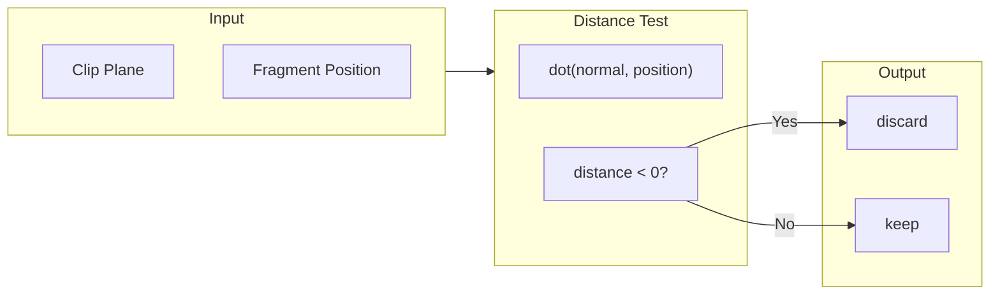

### Section Shader

The section plane rides in the shared frame uniforms (a `vec4`: xyz = normal, w = distance) with an enable bit in the flags word; a separate axis-aligned **clip box** (crop box) discards fragments outside an AABB. Both cuts apply to every model in the federated scene, and the pick pass applies the same discards.

```wgsl
// In Uniforms:
//   sectionPlane: vec4<f32>,  // xyz = plane normal, w = plane distance
//   flags: vec4<u32>,         // y = section/clip enable bits

let sectionEnabled = (uniforms.flags.y & 1u) == 1u;
if (sectionEnabled) {
    let d = dot(uniforms.sectionPlane.xyz, input.worldPos) - uniforms.sectionPlane.w;
    if (d < 0.0) {
        discard;
    }
}

// Clip box (crop box): discard fragments OUTSIDE the AABB
```

Section caps and the 2D section overlay are drawn by dedicated passes (`section-cap-style.ts`, `section-2d-overlay.ts`).

## Transparency

### Order-Independent Transparency

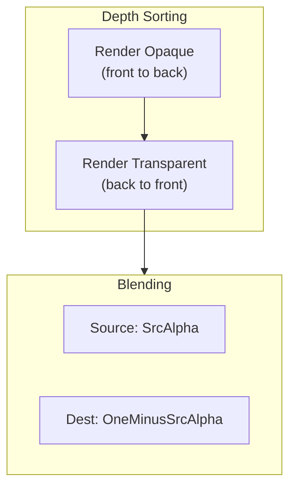

### Blend State

```typescript
const transparentPipeline = device.createRenderPipeline({
  // ...
  fragment: {
    targets: [{
      format: 'bgra8unorm',
      blend: {
        color: {
          srcFactor: 'src-alpha',
          dstFactor: 'one-minus-src-alpha',
          operation: 'add'
        },
        alpha: {
          srcFactor: 'one',
          dstFactor: 'one-minus-src-alpha',
          operation: 'add'
        }
      }
    }]
  }
});
```

## Performance Optimization

### Batching Strategy

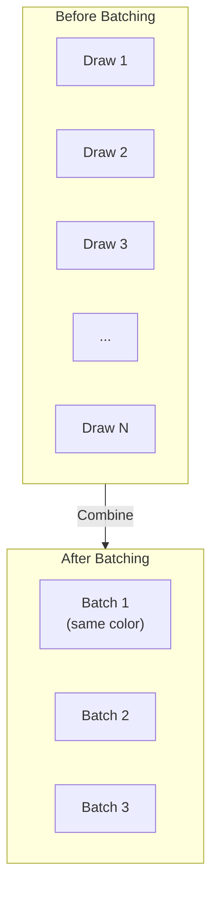

Meshes sharing a color are merged into one `BatchedMesh` (one vertex/index buffer, one draw call), reducing N per-mesh draws to roughly 100-500 batches. Per-entity state (selection, hide, ghost) still works inside a batch because the entity ID travels per vertex. A color group whose geometry would exceed the GPU's `maxBufferSize` is split into overflow buckets automatically.

### Instancing

Repeated mapped geometry (`IfcMappedItem`) arrives from the geometry pipeline as instanced shards: one template mesh plus per-occurrence data. Occurrence state (hide/select) is updated by rewriting the flags lane; if the backend rejects the instanced pipeline, the same occurrences fall back to CPU-expanded flat meshes with identical visuals (CPU parity).

```typescript
// Instance buffer layout (packages/renderer/src/pipeline.ts)
const instanceBufferLayout: GPUVertexBufferLayout = {
  arrayStride: 88, // mat4 (64) + entityId (4) + rgba (16) + flags (4)
  stepMode: 'instance',
  attributes: [
    { shaderLocation: 3, offset: 0,  format: 'float32x4' }, // instMat col0
    { shaderLocation: 4, offset: 16, format: 'float32x4' }, // col1
    { shaderLocation: 5, offset: 32, format: 'float32x4' }, // col2
    { shaderLocation: 6, offset: 48, format: 'float32x4' }, // col3
    { shaderLocation: 7, offset: 64, format: 'uint32'    }, // entityId
    { shaderLocation: 8, offset: 68, format: 'float32x4' }, // rgba
    { shaderLocation: 9, offset: 84, format: 'uint32'    }, // flags (bit 0 = selected, bit 1 = hidden)
  ]
};

// Draw instanced
renderPass.drawIndexed(indexCount, instanceCount);
```

## Frame Statistics

```mermaid
gantt
    title Frame Timeline (60 FPS = 16.67ms)
    dateFormat X
    axisFormat %Lms

    section CPU
    Update Camera     :a1, 0, 1
    Frustum Cull      :a2, 1, 2
    Sort Transparent  :a3, 2, 3
    Encode Commands   :a4, 3, 5

    section GPU
    Vertex Processing :b1, 5, 8
    Rasterization     :b2, 8, 11
    Fragment Processing :b3, 11, 14
    Present           :b4, 14, 17
```

### Performance Metrics

| Metric | Target | Notes |
|--------|--------|-------|
| FPS | 60 | Minimum for smooth |
| Draw calls | < 1000 | Per frame |
| Triangles | < 5M | Visible |
| GPU memory | < 512 MB | Total |

## Next Steps

- [Coordinate Handling](coordinate-handling.md) - RTC handling for large coordinates
- [Overview](overview.md) - System architecture
- [API Reference](../api/typescript.md) - Renderer API
