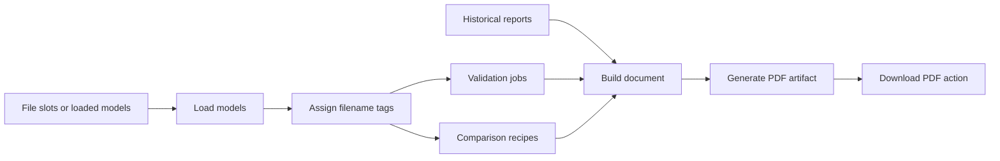
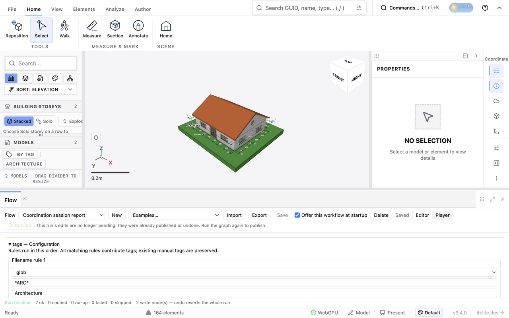
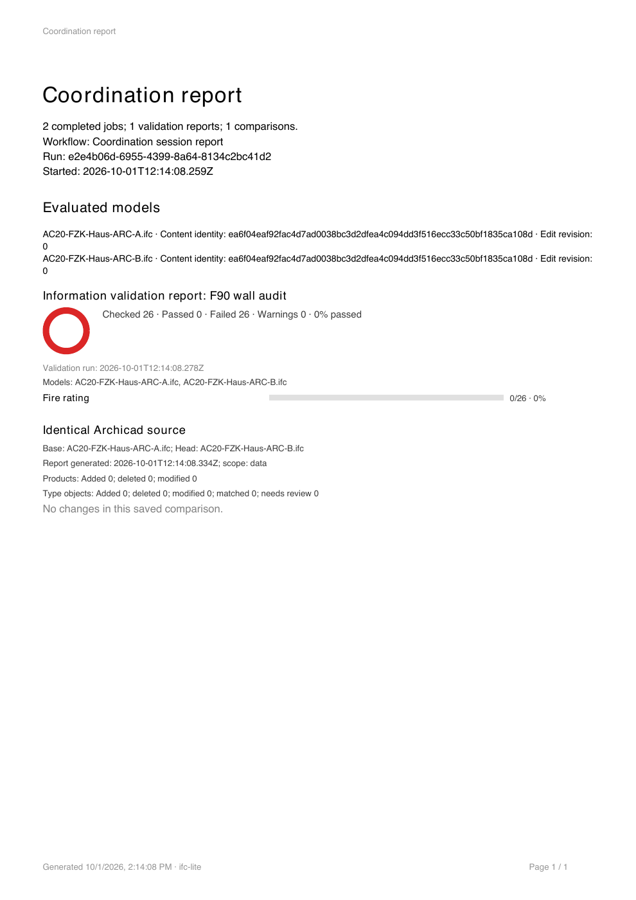

# Session automation implementation plan

Implement [the specification](session-automation-6612.md) for
[issue #6612](https://github.com/LTplus-AG/ifc-lite/issues/6612) as a stack of
cohesive changes. The completed delivery must demonstrate a fresh browser
session progressing from a prompted saved workflow through local IFC loading,
tagging, selected native checks, retained reports and a downloadable PDF.

Implementation is complete in this checkout. The design below records the
intended boundaries; the delivery evidence at the end identifies the actual
checks and browser runs. Each new production module is under 400 lines.

## Architecture and dependency direction

Keep graph execution in `@ifc-lite/flow`, portable contracts and node wrappers
in `@ifc-lite/flow-nodes`, and native orchestration in `apps/viewer`. Reuse
existing loaders, evaluators, fingerprint builders, diff engines and PDF
composition. Do not change the underlying Rust/domain algorithms.

The node package must not import viewer stores, React hooks, File, Blob, DOM
APIs or viewer report-block types. Nodes call optional host services with
portable configurations and opaque run tokens. The viewer owns actual files,
native reports, models, documents and PDF blobs. Register the new definitions
in the standard registry so CLI/MCP can describe them and report missing host
services before side effects. Unsupported services are unavailable, not noop.

Extract callable services with explicit inputs. Existing native UI hooks and
Flow use the same services; UI adapters retain colors, selection, telemetry,
cancellation epochs and cache reconciliation. Never temporarily change an
active panel's options to impersonate a Flow job.

Edges are completion barriers. The current scheduler executes a topological
order sequentially; this work does not add parallel engine execution.

## Concrete contracts

| Concern | Implementation decision |
| --- | --- |
| File slots | Add `InputKind: 'files'` and optional `FlowInput.fileSlots`: ordered `{ id, label, accept, multiple, required }` entries, legal only on files inputs. IDs are unique within a field. Resource addresses include node ID, parameter and slot ID. |
| Runtime input | Player overrides the exposed parameter with a JSON-compatible slot-to-token map. File objects stay outside persistable values; slot metadata stays in the graph. |
| Selectors | Discriminated union for qualified slot, exact original filename and normalized tag name. A caller enforces set versus exactly-one cardinality. |
| Resource definitions | Embedded parsed configuration or external slot reference. Job params store stable IDs, order, enable flags, targets and tag mappings. |
| Results | Aggregate run tokens reference immutable native snapshots keyed by job ID and result ID. Local history ID, result ID and job ID are distinct. Scalar/table summaries remain ordinary Flow outputs. |
| Provenance | Optional validated automation metadata records origin, workflow/run/job IDs, resource identity, effective options, model provenance, timestamp and execution diagnostics beside native snapshots. Imported evidence preserves its original date. |
| Template mapping | Flow params map existing native block IDs to explicit job/result IDs. Generated native documents contain resolved ordinary blocks, with no new placeholder block type. |
| Artifacts | Viewer tokens reference PDF blobs until another run, document-affecting edit, graph close or session reset invalidates them. Download can be retried without rerun. |

Use scalar/item ports for report/document/artifact tokens, any/item for the
bounded model-set payload, and table/item for summaries. Check token ownership
and payload type at every host boundary. Do not serialize files, native report
bodies or large snapshots through graph edges and logs.

Use existing capability grammar: `model.create`, `model.read`,
`storage.write:modelTags`, `storage.write:validationReports`,
`storage.write:savedComparisons`, `storage.write:documents`, and
`export.create:pdf`. The parser already supports identifier actions/targets;
no new scope is needed. Document their semantics and test parsing, exact/wildcard
grants and denials. Declaration and enforcement use the same strings.

Host requirements are `sessionModels`, `modelTags`, `validationChecks`,
`comparisonChecks`, `comparisonReports`, `reportDocuments` and `pdfArtifacts`.
Derive availability from services actually supplied to the run; do not advertise
optional services unconditionally in global `BROWSER_FEATURES`.

Information rule sets evaluate a targeted federation as one job. Native IDS
currently evaluates one model. An IDS job targeting N models therefore yields
N independently completed result records, in resolved slot order. Evaluate
cardinality separately per model; do not merge models into a fictitious IFC
or average/sum pass rates. Documents show separate model reports with a scoped
job summary.

Rule engines can return evaluator errors within a report without throwing.
Treat those as execution failures: retain completed error evidence with its
diagnostics and block automatic PDF output. Failed requirements and ordinary
not-applicable results are quality verdicts. Native bounded/truncated outputs
carry diagnostics and cannot appear as unqualified complete passes.

## Review slices and merge order

Each numbered slice targets #6612. Split an oversized slice into adjacent stack
layers above roughly 1,500 changed lines. Ship its tests, guide changes and
changeset alongside production code. Only the final layer closes the issue.
Export new symbols only with actual production consumers.

### 1 Shared native validation execution

Extract from `hooks/useIDS.ts`, `hooks/validation/useInformationValidation.ts`,
`lib/model-tags/evaluator-models.ts` and `lib/validation/reports/history.ts`
into proposed `lib/validation/run-ids-check.ts` and
`run-information-check.ts` services.

Services receive explicit documents/rule sets, target models, effective
stores/mutation views, locale, signal and progress callback; return native
reports with immutable provenance snapshots. Retain worker eligibility, source
access and property/entity-overlay projection. AbortError terminates IDS work
rather than starting main-thread fallback. Non-abortable work checks cancellation
before and after execution and retains its resources until it settles.

Native hooks call the services while keeping UI epochs, throttling, analysis
stamps, live-result publication and color behavior. Manual Save report behavior
is unchanged. No new parser/accessor/evaluator implementation.

Exit evidence: existing supersession, clear and pending-edit worker tests remain
green; behavioral tests exercise edited properties, deleted/created overlay
entities and cancellation preventing fallback or late publication.

### 2 Shared comparison execution and recipe IO

Extract from `hooks/useCompare.ts`, `hooks/compare/comparePairCache.ts`,
`lib/compare/versionedBuild.ts`, `effectiveCompareStore.ts`,
`geometryCapability.ts` and `exportReport.ts` into proposed
`lib/compare/run-comparison.ts`. Add `comparison-recipe.ts`,
`comparison-recipe-io.ts` and a small native Compare setup control.

Separate fingerprint preparation from diff construction. Pass explicit options
and accepted identities: native UI passes its pair-scoped identities, Flow
passes none. Retain effective stores, authored-key duplicate handling, geometry
content versions, alignment trust and split/merge/successor suggestions.
Keep the UI's synchronous latest-option read immediately before publication
and its cached re-diffs; protect the behavior covered by
`useCompare.midRunOptions.test.tsx` and supersession tests.

Implement version-1 `.comparison.json` boundary validation/serialization and
Save/Open comparison setup controls. Capture scope, exclusions, content matching
and authored keys; preserve portable A/B selectors. Import configures but never
runs. Distinguish recipe JSON from saved evidence and plain CompareReport JSON.
Put portable selector/config contracts in a small flow-nodes module once they
gain their first consumer; viewer report schemas stay in the viewer.

Exit evidence: native comparison regressions remain green; recipe round-trip
preserves explicit options and A/B direction. Shared execution agrees with
native results for effective edits and data/geometry scopes. Strict geometry
requirements are a Flow preflight policy; preserve native UI degradation behavior.

### 3 Run ownership and local file loading

Change `packages/flow/src/document.ts`, flow-nodes host/registry modules,
viewer `lib/flow/runner.ts`, `persistence.ts`, `player-fields.ts`,
`player-values.ts`, `components/viewer/flow/useFlowRunner.ts`,
`FlowPlayerField.tsx`, and `flowSlice.ts`/teardown. Add proposed viewer
`run-session.ts`, `run-resources.ts`, `preflight.ts`, `local-models.ts`,
`FlowFilesField.tsx` and the `session.loadModels` node wrapper.

Implement Flow v2, strict files metadata validation and v1 migration. Every
boundary migrates before validating: imports, CLI/MCP, extension contributions,
examples and saved browser entries. `loadSavedFlows` currently validates entries
directly; simply increasing FLOW_VERSION would discard v1 graphs. Preserve
damaged storage recovery and surface Flow save/import persistence failures.
Keep the existing text `file` field. Retain v1 test fixtures as migration cases.

Give each run an immutable graph/settings snapshot, controller, owner ID,
generation, model revision pins and resource map. Expose run, cancel and
readiness; keep ownership outside components that may unmount. Claim one viewer
execution lease before side effects and pass the signal through the scheduler
and every host service. Graph replacement/close and teardown invalidate the
generation; graph ID alone does not distinguish an edit to the same graph.
Preserve backend write capture, mutation provenance and tracking semantics.

Gate conflicting load, edit, tag and check entry points in execution adapters
as well as controls. Workflow calls carry the owner token; keyboard/SDK calls
cannot bypass it. External changes such as remote collaboration invalidate
affected revision pins and supersede the run before publication; do not silently
disconnect collaboration. Identify all relevant entry points in this slice.

Static preflight parses bounded resource text, validates schemas, versions,
IDs and required file slots before loading. Queue File objects through existing
`enqueueSourceLoad` → `addModel` → `useIfcLoader.loadFile`; avoid base64 copies.
Use original filenames and existing source-content hashing. Reuse only explicit
slot bindings with matching full content identity. Wait for complete data and
required geometry; an errored/cancelled model present in the Map is not success.

Trace and reuse canonical loader cancellation ownership before adding signal
parameters. Queued tasks recheck run ownership before starting. Never call a
global canceller that belongs to another load. Cancel stops later scheduling,
but holds the lease and resources until current non-abortable work drains;
another Run remains disabled. Release temporary resources/lease in finally.
Keep completed PDF blobs separately until their artifact lifetime ends; revoke
their object URLs then.

Readiness follows graph requirements. Load-first and historical-evidence graphs
can start without an active model; default-model reads still require one.
Existing tracked mutation graphs retain their content pin rules. An unbound
empty-session graph cannot invent a tracked-write pin from a filename.

Exit evidence: empty-session load, reuse with matching identity, queue recovery,
cancel while queued/loading, same-ID graph edit, resource forgery, v1 saved-flow
migration and CLI/MCP unavailable-host refusal before side effects.

### 4 Filename tags and portable rule references

Use `modelTagsSlice.ts`, `lib/model-tags/persistence.ts` and native rule/filter
contracts. Add small matcher/selector modules under flow-nodes and proposed
viewer `lib/flow/model-targets.ts`, `tag-assignments.ts`,
`rule-tag-bindings.ts`, plus `session.assignModelTags`.

Use bounded glob matching for `*`/`?`, native tag-name normalization and the
original source filename. Union all matching rules, reuse/create tag definitions
and call native assignment actions. Preview expected assignments; preserve
manual tags and warn on no match or failed definition persistence.

Collect/remap references through the typed rule/filter AST, including nested
groups and target/applicability/requirement fields. Reuse existing visitors or
add one consumed by import and execution. Never replace arbitrary fields named
`tagIds`. Unknown IDs require user name mapping. Remap a cloned definition;
preserve original JSON, model fingerprints and exact IFC names. Resolve native
targets inside the job model set; fail zero targets before evaluator execution.

Exit evidence: overlap/case/glob invariants, duplicate filenames, preserved
manual tags, idempotent rerun, fresh-browser tag IDs, nested mappings and
unchanged source definitions. Exercise one model and N models.

### 5 Checks and retained historical evidence

Depends on slices 1–4. Add validation/comparison/import aggregate node wrappers
and proposed viewer `check-jobs.ts`, `validation-host.ts`,
`comparison-host.ts`, `report-retention.ts` and bounded resource parsers.

Preflight validates enabled jobs, sources and options; dynamic targets/geometry
are rechecked after tagging. Invoke native services sequentially and retain
each completed result before the next job. No global last-result lookup,
automatic recoloring or overlay activation. Each IDS target produces its own
result. Separate quality verdicts, evaluator errors and execution exceptions.

Extend saved report envelopes with optional validated automation provenance;
old records remain readable. Keep report/document validators and serialization
consistent. Retention outcomes distinguish saved, memory-only and duplicate.
Same-result save within a run is idempotent; new runs are new evidence even if
counts match. Storage refusal preserves in-memory reports with retry/download.

Historical imports accept SavedComparison v1, deduplicate identical evidence,
re-identify colliding local library IDs and preserve original provenance. Plain
CompareReport JSON gets specific guidance. With no model loaded, imported
evidence remains usable in documents; historical IDs never select current meshes.

Aggregate execution errors fail the node and block dependent document/PDF
nodes through normal dependency propagation. Previously completed records remain
reviewable. Keep structured run diagnostics rather than parsing log strings
in UI code. Do not automatically retry partial loads/jobs.

Exit evidence: multiple enabled/disabled jobs, multi-model IDS, A/B and A/C,
no-model historical import, storage failure/retry, ID collisions and separate
rerun evidence; errors block export while completed quality failures do not.

### 6 Shared document preparation and PDF artifacts

Extract callable preparation from `DocumentPanel.tsx`, `useDocumentData.ts`,
`useDocumentTables.ts`, `lib/document/resolve-table.ts` and export snapshot
seams into proposed `lib/document/prepare-document.ts`. Add Flow document/PDF
host adapters and `report.buildDocument`/`report.exportPdf` wrappers.

Share binding, table, chart/filter, topic and snapshot preparation between UI
hooks and Flow. Hooks retain subscriptions/caching; Flow awaits required list
and filter work before calling `generateDocumentPdf`. Do not mount DocumentPanel
invisibly or poll React state to generate output.

Build a default job-ordered document with native report blocks. Custom templates
map compatible existing block IDs to result IDs and validate required mappings
before execution. Expand a multi-model IDS job into adjacent per-model blocks,
preserving presentation settings. Clone templates, create fresh document/block/
embedded-list IDs, and resolve mapped blocks to snapshots. Keep native document
version 10 unless actual persisted fields require a migration; Flow-only mapping
does not require a new native placeholder block.

Save through the native document library and expose Open in Documentation;
storage refusal leaves the document in memory with warnings. Generate one
combined PDF artifact, preserve renderer diagnostics and explicit truncation
notices, and use the existing sanitized download seam. Retry download reuses
the Blob. Failed/cancelled jobs and required mapping errors prevent automatic PDF.

Exit evidence: default/imported templates, mixed reports, native title/ring/layout
options, multi-page row limits, unresolved mappings, charts/list preparation,
warnings and download retry. Inspect rendered PDF content/layout.

### 7 Configuration forms and startup prompt

Extend existing Flow Player/Inspector/Palette/Panel/ValuePreview components,
viewer startup surfaces and catalogues. Add small components for file slots,
tag rules, enabled job lists, tag-reference mapping, template mappings,
readiness, progress/results and `FlowStartupPrompt.tsx`.

Provide usable forms for the standard workflow; raw JSON remains an advanced
option. Show resource source/type, embedded versus external mode and explicit
targets. Persist configuration in the actual graph, temporary file selections
outside it. Native Compare setup and Player share relevant editors/validators.
Outputs navigate to native libraries/documents and explicit artifact actions.
All user-facing strings are catalogued; verify labels, keyboard focus and errors.

Store one opted-in saved workflow ID with checked persistence. Prompt once
after startup state is ready; Open workflow uses the saved graph, Not now
dismisses this page session, Don't ask clears the preference. Suppress for
explicit startup navigation and defer to existing startup dialogs. Reuse
existing startup action parsing, including `useModelUrlAutoload`, rather than
independently guessing URL keys. Deleted graphs clear the preference visibly;
importing a graph never opts in. Nothing executes before Run.

Exit evidence: mounted tests prove actual control wiring, file reselection after
reload, dirty/save behavior, startup priority/dismissal/deletion, persistence
warnings, Cancel, native navigation and Download actions.

### 8 Example and complete workflow qualification

Add `09-coordination-startup.flow.json` through the existing examples loader,
with every barrier and exposed input. Include an evidence-only configuration
requiring no live model and native setup round-trip coverage. Update Flow, IDS,
model-diff, federation and documents guides, package READMEs and API samples.

Add behavioral e2e coverage under existing viewer e2e wiring: fresh startup,
real files, tag preview, enabled jobs, saved history, Documentation and PDF.
Use T3 preview tools for interactive browser inspection/recording when available.
Store real-model acceptance evidence under
`docs/architecture/evidence/session-automation-6612/` with source identification,
configuration, native/Flow results and inspected PDF; link it from the spec/PR.

AC20-FZK-Haus is a catalogued candidate for real-model smoke checks. A
nontrivial comparison needs an actual authoring-tool revision pair with known
differences: identify/fetch one from catalogue or maintainers before claiming
changed-revision acceptance. Same-file comparison proves an invariant, not
revision matching. Controlled overlay changes on a real model separately cover
effective-store regressions. Missing fixtures skip with `pnpm fixtures` guidance;
final acceptance cannot consist solely of skipped tests.

Exit evidence: demonstrate the full spec acceptance matrix, a new browser
session and inspected PDF, with native/Flow scopes/options identical and no
manually accepted identity aliases.

## Verification and repository integration

Packages keep their existing Vitest convention. Viewer tests use the mounted
happy-dom/node:test recipe. Assert service equivalence/lifecycle behavior rather
than mocks' return values or source text. Regression cases cite #6612. Add
test wiring only when a new location is not already reached by existing CI.

During slices, use root turbo commands such as
`pnpm test --filter=@ifc-lite/flow --filter=@ifc-lite/flow-nodes --filter=@ifc-lite/viewer`
and `pnpm typecheck --filter=@ifc-lite/viewer`, adding CLI/MCP/other changed
packages as needed. If the root test-program audit needs additional generated
programs, run full root typecheck rather than bypassing it. Before final
delivery run root `pnpm typecheck`, `pnpm test`, `pnpm lint` and configured
viewer e2e coverage. Inspect build failures before diagnosing source regressions.

Run applicable module-size, test-wiring, source-text, API-surface, docs sample,
generated docs, README and MkDocs navigation checks. Refresh API snapshots
and create changesets for published contract changes. Extending exported input
unions can affect exhaustive consumers; choose the appropriate 0.x minor bump.
Do not publish speculative extraction helpers. Generate ambient surfaces only
if their actual schema sources change.

The inspected main ruleset requires Build + WASM + Rust + Node, Issue queue,
PR review signal and the in-tree IfcOpenShell parity context. The current Test
workflow also wires changed-test revert evidence, Typecheck, Lint, viewer/node
tests and docs checks/strict docs build according to changed paths. Re-read
workflows/ruleset before each PR; this records the inspection, not future gate
authority. Every stack layer references #6612; register each PR with this thread.

List both documents in MkDocs navigation and link them together. The delivered
runtime includes regression tests, a changeset and an updated API snapshot.
No Rust/geometry-package edits were needed. If loader work expands into a
perf-sensitive path, follow base-versus-branch worker measurement requirements
and record the verdict in the ledger. Automation alone is not a speedup claim.

## Evidence dependency and completion

Begin with shared native execution. The external acceptance dependency is a
real changed revision pair; it does not block contract/lifecycle/UI work or
controlled-overlay tests. Trace loader cancellation ownership, startup priority
and conflicting execution entry points in their implementation slices before
editing. This plan identifies seams without claiming their modifications have
already been verified. Enforce the spec limits; reconsider only with measured
resource evidence if real deliveries cannot fit them.

The final PR records actual source models/configuration, native-versus-Flow
results, startup/session recording, PDF inspection, cancellation/storage
outcomes and check results. Partial node registration, passing mocks or a PDF
Blob alone do not close #6612: every requested stage must work through the saved
startup workflow.

## Delivery evidence — 2026-10-01

The standard registry includes all seven session/report nodes. The viewer owns
their native services, file handles, scoped models and PDF artifacts. CLI/MCP
describe the portable graph and reject unsupported session services before
model loading. The shipped example is **Coordination session report**.

The production viewer was exercised through the collaborative browser with
the real Archicad fixture `tests/models/ara3d/AC20-FZK-Haus.ifc` (2,526,544
bytes; SHA-256
`ea6f04eaf92fac4d7ad0038bc3d2dfea4c094dd3f516ecc33c50bf1835ca108d`).
Two copies, named `AC20-FZK-Haus-ARC-A.ifc` and
`AC20-FZK-Haus-ARC-B.ifc`, were selected in Player. A native Rules file checked
`IfcWallStandardCase.Pset_WallCommon.FireRating` against `F90`; a separate
data-scope comparison recipe selected those filenames.

All seven stages completed. The saved validation report checked 26 walls and
retained 26 quality failures; the saved comparison had zero changes. The native
PDF displayed both results, source hashes, edit revisions, workflow/run IDs and
report timestamps. Its rendered page was visually inspected. Repeating Run
kept the same two model IDs and generated fresh immutable evidence. A separate
single-model run checked 13 walls. This smoke test uses identical sources;
changed geometry and edited properties are covered by native regression tests,
not claimed as a real authoring-tool revision-pair acceptance run.

Opting into startup and reloading displayed the saved-workflow prompt with
zero loaded models. Opening it selected Player, left every File input empty,
and did not execute. A separate three-node historical-import/document/PDF
workflow completed with zero models loaded and preserved the archived
comparison's original generation timestamp.

Verification uses root Turbo commands: `pnpm build --env-mode=loose`,
`pnpm typecheck`, `pnpm lint`, the Flow/Flow-nodes/CLI/MCP package tests,
and all eight viewer shards via
`TEST_SHARDS=8 TEST_SHARD=N pnpm test --env-mode=loose --filter=@ifc-lite/viewer`.
Documentation samples/generated regions/navigation and a strict MkDocs build
(`uv run --with-requirements requirements-docs.txt mkdocs build --strict`),
API surface, changesets,
MPL headers, module sizes and applicable viewer guard scripts were checked.
`pnpm knip` reports repo-wide unused entries and is not a passing gate; unused
exports introduced by this implementation were removed. No Rust algorithms
changed, and no performance improvement is claimed.

Captured evidence from that production run is available in the
[native PDF](evidence/issue-6612-session/coordination-report.pdf). The images
below show the completed seven-stage workflow and its rendered report page.

