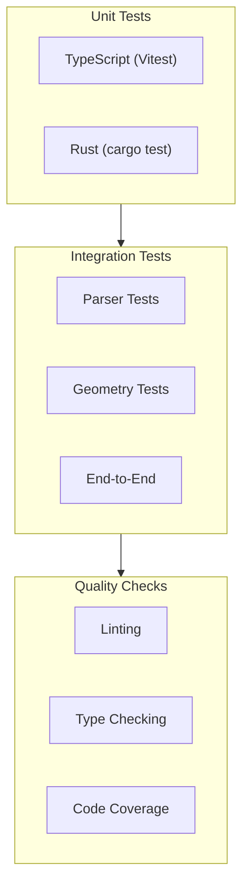

# Testing

Guide to testing IFClite.

## Overview



## Running Tests

### Test Suites

The root `package.json` wires up these suites (most need fixtures, fetched
once with `pnpm fixtures`):

| Command | What it runs |
|---------|--------------|
| `pnpm test` | All package unit tests via Turbo (`turbo test`, Vitest per package) |
| `pnpm test:e2e` | Playwright viewer end-to-end tests (project `viewer-e2e`) |
| `pnpm test:e2e:ci` | Playwright e2e, CI variant (project `viewer-e2e-ci`) |
| `pnpm test:integration` | Cross-package integration pipeline (`tests/integration.test.ts`) |
| `pnpm test:api` | Server API tests (`tests/api/`) |
| `pnpm test:wasm-contract` | Real WASM boundary contract tests (run `pnpm build:wasm` first, or it skips) |
| `pnpm test:ids-corpus` | IDS validation corpus |
| `cargo test --workspace` | All Rust tests (run from the repo root) |

### TypeScript Tests

```bash
# Run all TypeScript tests
pnpm test

# Run specific package
cd packages/parser && pnpm test

# Watch mode
cd packages/parser && pnpm exec vitest --watch

# With coverage
cd packages/parser && pnpm exec vitest run --coverage
```

### Rust Tests

The Cargo workspace root is the repo root:

```bash
# Run all Rust tests
cargo test --workspace

# Run specific crate
cargo test -p ifc-lite-core

# Run specific test
cargo test parse_entity

# With output
cargo test -- --nocapture
```

#### Fuzzing the STEP parser

The entity parser has a coverage-guided fuzz target (`rust/core/fuzz/`). It is
a standalone crate, so it is not built by `cargo build`/`cargo test` or by the
PR test workflow; a scheduled workflow (`.github/workflows/fuzz.yml`) runs it
weekly and on demand. Run it locally with
[`cargo-fuzz`](https://github.com/rust-fuzz/cargo-fuzz) (needs the nightly
toolchain, already pinned):

```bash
cargo install cargo-fuzz
cd rust/core
cargo fuzz run parse_entity -- -max_total_time=60
```

The contract under fuzz is that `parse_entity` never panics, hangs, or overflows
on arbitrary bytes (only returns `Ok`/`Err`). `tests/malformed_input.rs` pins the
same contract for specific inputs in normal CI.

## Writing Tests

### TypeScript Tests (Vitest)

```typescript
// src/__tests__/parser.test.ts
import { describe, it, expect, beforeEach } from 'vitest';
import { IfcParser } from '../parser';

describe('IfcParser', () => {
  let parser: IfcParser;

  beforeEach(() => {
    parser = new IfcParser();
  });

  describe('parse', () => {
    it('should parse a simple IFC file', async () => {
      const content = `
        ISO-10303-21;
        HEADER;
        FILE_DESCRIPTION((''), '2;1');
        FILE_NAME('test.ifc', '', '', '', '', '', '');
        FILE_SCHEMA(('IFC4'));
        ENDSEC;
        DATA;
        #1=IFCPROJECT('0001',#2,$,$,$,$,$,$,$);
        ENDSEC;
        END-ISO-10303-21;
      `;

      const buffer = new TextEncoder().encode(content).buffer;
      const result = await parser.parseColumnar(buffer);

      expect(result.entityCount).toBe(1);
      expect(result.schemaVersion).toBe('IFC4');
    });

    it('should extract entity properties', async () => {
      const buffer = await loadTestFile('test-model.ifc');
      const result = await parser.parseColumnar(buffer);

      const wallIds = result.entityIndex.byType.get('IFCWALL') ?? [];
      expect(wallIds.length).toBeGreaterThan(0);
      expect(result.entities.getGlobalId(wallIds[0])).toMatch(/^[0-9a-zA-Z_$]+$/);
    });

    it('should handle streaming geometry', async () => {
      const buffer = await loadTestFile('large-model.ifc');
      const geometry = new GeometryProcessor();
      await geometry.init();

      const batches: number[] = [];
      for await (const event of geometry.processStreaming(new Uint8Array(buffer))) {
        if (event.type === 'batch') {
          batches.push(event.meshes.length);
        }
      }

      expect(batches.length).toBeGreaterThan(0);
      expect(batches.reduce((a, b) => a + b, 0)).toBeGreaterThan(0);
    });

    it('should throw on invalid file', async () => {
      const buffer = new TextEncoder().encode('invalid content').buffer;

      await expect(parser.parseColumnar(buffer)).rejects.toThrow();
    });
  });
});
```

### Rust Tests

```rust
// src/parser/tests.rs
use super::*;

#[cfg(test)]
mod tests {
    use super::*;

    #[test]
    fn test_parse_entity_ref() {
        let input = b"#123=";
        let (_, token) = entity_ref(input).unwrap();

        assert_eq!(token, Token::EntityRef(123));
    }

    #[test]
    fn test_parse_string_literal() {
        let input = b"'Hello World'";
        let (_, token) = string_literal(input).unwrap();

        assert_eq!(token, Token::String(b"Hello World"));
    }

    #[test]
    fn test_parse_entity() {
        let input = b"#1=IFCWALL('guid',$,$,$,$,$,$,$);";
        let (id, type_name, attrs) = parse_entity(input).unwrap();

        assert_eq!(id, 1);
        assert_eq!(type_name, b"IFCWALL");
        assert_eq!(attrs.len(), 8);
    }

    #[test]
    fn test_entity_scanner() {
        let input = b"DATA;\n#1=IFCPROJECT();\n#2=IFCSITE();\nENDSEC;";
        let mut scanner = EntityScanner::new();
        let index = scanner.scan(input).unwrap();

        assert_eq!(index.len(), 2);
        assert!(index.get(1).is_some());
        assert!(index.get(2).is_some());
    }

    #[test]
    fn test_decode_entity() {
        let input = include_bytes!("../../test-data/simple.ifc");
        let scanner = EntityScanner::new();
        let index = scanner.scan(input).unwrap();
        let decoder = EntityDecoder::new(input, &index);

        let entity = decoder.decode(1).unwrap();
        assert_eq!(entity.ifc_type, IfcType::IfcProject);
    }

    #[test]
    #[should_panic(expected = "EntityNotFound")]
    fn test_decode_missing_entity() {
        let input = b"DATA;\n#1=IFCPROJECT();\nENDSEC;";
        let scanner = EntityScanner::new();
        let index = scanner.scan(input).unwrap();
        let decoder = EntityDecoder::new(input, &index);

        decoder.decode(999).unwrap(); // Should panic
    }
}
```

### Integration Tests

```typescript
// tests/integration/full-parse.test.ts
import { describe, it, expect } from 'vitest';
import { IfcParser } from '@ifc-lite/parser';
import { GeometryProcessor } from '@ifc-lite/geometry';
import { Renderer } from '@ifc-lite/renderer';
import { readFileSync } from 'fs';
import { join } from 'path';

describe('Full Parse Integration', () => {
  it('should parse and render a real IFC file', async () => {
    // Load test file. readFileSync returns a Node Buffer backed by a shared
    // pool, so `.buffer` would expose the whole pool — not just this file's
    // bytes. Copy the exact bytes into a standalone Uint8Array first.
    const filePath = join(__dirname, '../fixtures/test-model.ifc');
    const bytes = new Uint8Array(readFileSync(filePath));

    // Parse metadata
    const parser = new IfcParser();
    const store = await parser.parseColumnar(bytes);

    // Extract geometry separately
    const geometry = new GeometryProcessor();
    await geometry.init();
    const meshes = [];
    for await (const event of geometry.processAdaptive(bytes)) {
      if (event.type === 'batch') meshes.push(...event.meshes);
    }

    // Verify parsing
    expect(store.entityCount).toBeGreaterThan(0);
    expect(meshes.length).toBeGreaterThan(0);

    // Verify geometry
    const mesh = meshes[0];
    expect(mesh.positions.length).toBeGreaterThan(0);
    expect(mesh.indices.length).toBeGreaterThan(0);
    expect(mesh.indices.length % 3).toBe(0); // Valid triangles
  });

  it('should handle large files with streaming', async () => {
    const filePath = join(__dirname, '../fixtures/large-model.ifc');
    const buffer = readFileSync(filePath);

    const parser = new IfcParser();
    const store = await parser.parseColumnar(buffer.buffer);

    const geometry = new GeometryProcessor();
    await geometry.init();

    let totalMeshes = 0;
    for await (const event of geometry.processStreaming(new Uint8Array(buffer))) {
      if (event.type === 'batch') {
        totalMeshes += event.meshes.length;
      }
    }

    expect(totalMeshes).toBeGreaterThan(0);
    expect(store.entityCount).toBeGreaterThan(0);
  });
});
```

## Test Fixtures

IFC/IFCX model fixtures live under `tests/models/` but are not stored in git.
They are catalogued in `tests/models/manifest.json` (path, SHA-256, size) and
fetched on demand from a GitHub Release:

```bash
# Populate the fixtures (idempotent; skips files whose hash already matches)
pnpm fixtures

# Verify presence and hashes without downloading
pnpm fixtures:check

# List missing or out-of-date paths
pnpm fixtures:list-missing
```

Every download is verified against the manifest's SHA-256 before being
written. Tests that need a missing fixture skip cleanly rather than fail.
`tests/models/local/` is never managed by the manifest; it is reserved for
private fixtures kept on your own machine. See `tests/models/README.md` for
the maintainer flow (adding fixtures, rotating releases).

### Creating Test Data

```typescript
// tests/helpers/create-fixture.ts
export function createMinimalIfc(entities: string[]): ArrayBuffer {
  const content = `
ISO-10303-21;
HEADER;
FILE_DESCRIPTION(('Test'), '2;1');
FILE_NAME('test.ifc', '', '', '', '', '', '');
FILE_SCHEMA(('IFC4'));
ENDSEC;
DATA;
${entities.join('\n')}
ENDSEC;
END-ISO-10303-21;
  `;
  return new TextEncoder().encode(content).buffer;
}

// Usage
const buffer = createMinimalIfc([
  "#1=IFCPROJECT('proj123',$,$,$,$,$,$,$,$);",
  "#2=IFCWALL('wall123',$,$,$,$,$,$,$);"
]);
```

## Mocking

### TypeScript Mocks

```typescript
import { vi, describe, it, expect } from 'vitest';

// Mock WASM module
vi.mock('@ifc-lite/wasm', () => ({
  IfcAPI: class MockIfcAPI {
    parse() {
      return { entityCount: 10 };
    }
  }
}));

// Mock fetch
vi.stubGlobal('fetch', vi.fn(() =>
  Promise.resolve({
    arrayBuffer: () => Promise.resolve(new ArrayBuffer(0))
  })
));
```

Rust tests do not use a mocking framework; they exercise real parsers and
geometry on fixture bytes (see `rust/*/tests/`).

## Coverage

### TypeScript Coverage

```bash
# Generate coverage report (Vitest, per package)
cd packages/parser && pnpm exec vitest run --coverage

# View HTML report
open coverage/index.html
```

### Rust Coverage

```bash
# Install cargo-tarpaulin
cargo install cargo-tarpaulin

# Generate coverage
cargo tarpaulin --out Html

# View report
open tarpaulin-report.html
```

No coverage thresholds are enforced in CI; coverage reports are for local
inspection.

## Performance Tests

```typescript
// tests/performance/parse.bench.ts
import { bench, describe } from 'vitest';
import { IfcParser } from '@ifc-lite/parser';
import { readFileSync } from 'fs';

describe('Parser Performance', () => {
  const smallFile = readFileSync('fixtures/small.ifc');
  const largeFile = readFileSync('fixtures/large.ifc');

  bench('parse small file (columnar)', async () => {
    const parser = new IfcParser();
    await parser.parseColumnar(smallFile.buffer);
  });

  bench('parse large file (columnar)', async () => {
    const parser = new IfcParser();
    await parser.parseColumnar(largeFile.buffer);
  });

  bench('streaming geometry large file', async () => {
    const geometry = new GeometryProcessor();
    await geometry.init();

    for await (const event of geometry.processStreaming(new Uint8Array(largeFile))) {
      // Process batches
    }
  });
});
```

Run benchmarks:

```bash
# Vitest bench, from the package holding the .bench.ts file
pnpm exec vitest bench

# Viewer load benchmark (Playwright, project viewer-benchmark)
pnpm test:benchmark:viewer
```

## CI/CD

### GitHub Actions

The PR gate lives in `.github/workflows/test.yml`. It runs on Node 22 with
the Rust toolchain pinned by `rust-toolchain.toml`, and covers:

- WASM build (or a prebuilt-bundle fast path when no Rust code changed)
- `pnpm typecheck` and `pnpm lint`
- `pnpm test`, then `pnpm test:integration` and `pnpm test:wasm-contract`
- Playwright e2e via `pnpm test:e2e:ci`
- `cargo test` for the Rust workspace

Fixtures in CI use the same flow as local development: `pnpm fixtures` to
fetch, `pnpm fixtures:check` to verify hashes. Heavier suites (benchmarks,
determinism, fuzzing, IfcOpenShell parity) run in separate scheduled or
on-demand workflows under `.github/workflows/`.

### Fixture Strategy in CI

Fixtures come from a GitHub Release, not Git LFS (the repo no longer uses
LFS). The manifest-driven fetcher keeps CI reliable:

- Fetches are selective: only files listed in `tests/models/manifest.json`
  that are missing or hash-mismatched get downloaded.
- Every file is verified against its SHA-256 from the manifest.
- Heavy corpus and benchmark runs live in dedicated scheduled workflows, so
  normal PR validation stays cheap.

## Next Steps

- [Setup](setup.md) - Development setup
