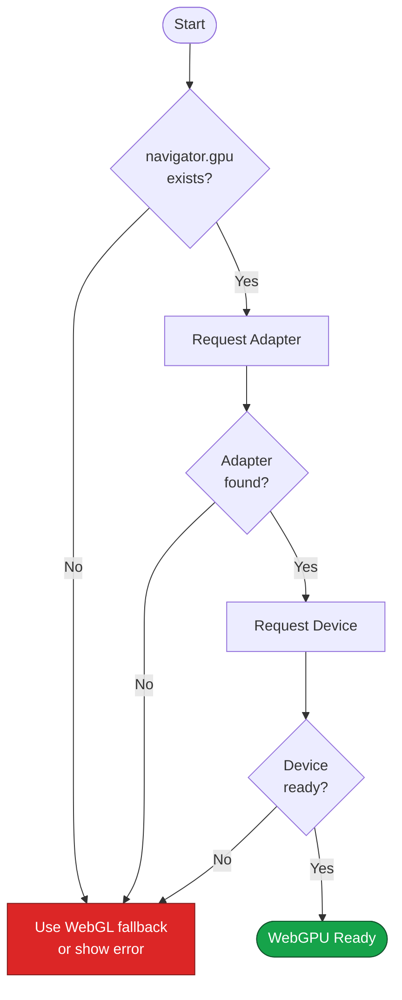
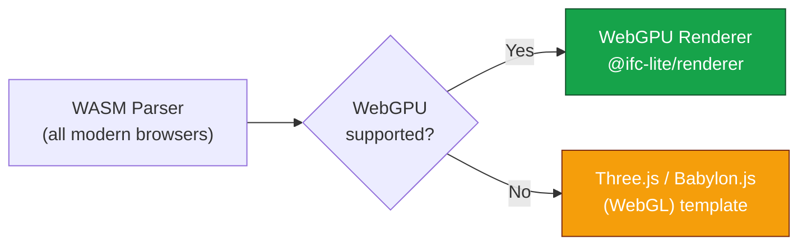

# Browser Requirements

IFClite uses modern web technologies that require recent browser versions.

## WebGPU Support

The renderer requires **WebGPU**, a next-generation graphics API.

### Supported Browsers

| Browser | Minimum Version | Status |
|---------|----------------|--------|
| Chrome | 113+ | :material-check-circle:{ .success } Stable |
| Edge | 113+ | :material-check-circle:{ .success } Stable |
| Firefox | 141+ (Windows; other platforms in later releases) | :material-check-circle:{ .success } Stable |
| Safari | 26+ | :material-check-circle:{ .success } Stable |

### Checking WebGPU Support

```typescript
async function checkWebGPU(): Promise<boolean> {
  if (!navigator.gpu) {
    console.error('WebGPU not supported');
    return false;
  }

  const adapter = await navigator.gpu.requestAdapter();
  if (!adapter) {
    console.error('No WebGPU adapter found');
    return false;
  }

  const device = await adapter.requestDevice();
  console.log('WebGPU device:', device);
  return true;
}
```

## WebGPU Detection Flow



## WebAssembly Support

The parser uses WASM for high-performance parsing.

### Required Features

| Feature | Purpose | Support |
|---------|---------|---------|
| WebAssembly | Core WASM runtime | All modern browsers |
| WASM SIMD | Vectorized operations | Chrome 91+, Firefox 89+, Safari 16.4+ |
| Streaming Compilation | Fast module loading | All modern browsers |

### Checking WASM Support

```typescript
function checkWASM(): boolean {
  // Basic WASM support
  if (typeof WebAssembly === 'undefined') {
    return false;
  }

  // Check for streaming compilation
  if (!WebAssembly.instantiateStreaming) {
    console.warn('WASM streaming not supported, using fallback');
  }

  return true;
}
```

## JavaScript Requirements

IFClite requires ES2022+ features:

- `async`/`await`
- `for await...of`
- Private class fields
- `Object.hasOwn()`
- Top-level await (in modules)

## SharedArrayBuffer (Optional)

For multi-threaded parsing with Web Workers:

```typescript
// Check if SharedArrayBuffer is available
if (typeof SharedArrayBuffer === 'undefined') {
  console.warn('SharedArrayBuffer not available, using single-threaded mode');
}
```

!!! note "Cross-Origin Isolation"
    SharedArrayBuffer requires cross-origin isolation headers:
    ```
    Cross-Origin-Opener-Policy: same-origin
    Cross-Origin-Embedder-Policy: require-corp
    ```

## Feature Detection Example

```typescript
import { IfcParser } from '@ifc-lite/parser';
import { Renderer } from '@ifc-lite/renderer';

interface BrowserCapabilities {
  webgpu: boolean;
  wasm: boolean;
  simd: boolean;
  sharedArrayBuffer: boolean;
}

async function detectCapabilities(): Promise<BrowserCapabilities> {
  // WebGPU
  let webgpu = false;
  if (navigator.gpu) {
    const adapter = await navigator.gpu.requestAdapter();
    webgpu = adapter !== null;
  }

  // WASM
  const wasm = typeof WebAssembly !== 'undefined';

  // SIMD (feature detection via compilation)
  let simd = false;
  try {
    // Try to compile a module with SIMD instructions
    const module = new WebAssembly.Module(
      new Uint8Array([0, 97, 115, 109, 1, 0, 0, 0, 1, 5, 1, 96, 0, 1, 123, 3, 2, 1, 0, 10, 10, 1, 8, 0, 65, 0, 253, 15, 253, 98, 11])
    );
    simd = true;
  } catch {
    simd = false;
  }

  // SharedArrayBuffer
  const sharedArrayBuffer = typeof SharedArrayBuffer !== 'undefined';

  return { webgpu, wasm, simd, sharedArrayBuffer };
}

// Usage
const caps = await detectCapabilities();
if (!caps.webgpu) {
  showFallbackUI();
} else {
  initializeViewer();
}
```

## Fallback Strategies



### WebGL Fallback

`@ifc-lite/renderer` is WebGPU-only, so it has no built-in WebGL renderer. For
browsers without WebGPU, scaffold a WebGL viewer with the `threejs` or
`babylonjs` template. Those render with WebGL and work in all modern browsers:

```bash
# WebGL viewer (Three.js)
npx create-ifc-lite my-viewer --template threejs

# WebGL viewer (Babylon.js)
npx create-ifc-lite my-viewer --template babylonjs
```

You can still detect WebGPU at runtime to decide which viewer to load:

```typescript
import { Renderer } from '@ifc-lite/renderer';

async function createRenderer(canvas: HTMLCanvasElement) {
  if (navigator.gpu) {
    const adapter = await navigator.gpu.requestAdapter();
    if (adapter) {
      const renderer = new Renderer(canvas); // WebGPU
      await renderer.init();
      return renderer;
    }
  }

  // No WebGPU: load a WebGL viewer built from the threejs or
  // babylonjs template instead (see the integration guides).
  console.warn('WebGPU not available, use a Three.js or Babylon.js (WebGL) viewer');
  return null;
}
```

See the [Three.js](../tutorials/threejs-integration.md) and
[Babylon.js](../tutorials/babylonjs-integration.md) integration guides.

## Mobile Support

| Platform | Browser | Status |
|----------|---------|--------|
| iOS | Safari 26+ | :material-check-circle:{ .success } |
| Android | Chrome 121+ | :material-check-circle:{ .success } |
| Android | Firefox | Not enabled by default (behind a flag) |

!!! tip "Mobile Performance"
    For mobile devices, keep parsing columnar and stream geometry in batches:
    ```typescript
    const store = await parser.parseColumnar(buffer);
    for await (const event of geometry.processAdaptive(new Uint8Array(buffer))) {
      if (event.type === 'batch') renderer.addMeshes(event.meshes);
    }
    ```

## Next Steps

- [Installation](installation.md) - Install IFClite
- [Quick Start](quickstart.md) - Get started quickly
