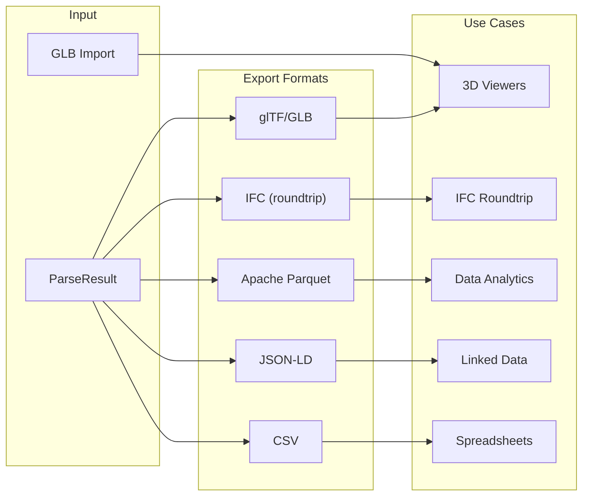
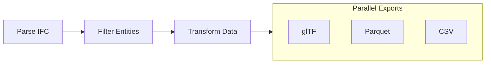

# Exporting Data

Guide to exporting IFC data in various formats.

## Textured IFC in the web viewer

Normal IFC exports, visible subsets, and Export modified IFC… package retained image
resources into `.ifczip` automatically. The archive preserves original PNG/JPEG
bytes, the IFC entry directory, and relative texture paths; authored images use
content-addressed filenames. Untextured models continue to download as `.ifc`.
SDK IFC exports and Export modified IFC… omit unreachable appearance resources
created by tracked commands, while the original session keeps those rows and
images for Undo/Redo. Imported resources are preserved; this is not general
cleanup of orphan entities from another authoring session.
The serialization helper prepares an uncommitted atomic view and preserves the
live allocator watermark. It still copies overlay/history arrays temporarily;
compact output does not imply lower peak memory. Reopened formerly active image
rows become imported source and remain outside authored-only cleanup.
Export is unavailable while images load and refuses missing or budget-omitted resources
rather than producing an apparently complete textureless file.

Merged textured-model export currently requires texture URL remapping and is
unavailable. Export each model separately to preserve its appearance. Subset
archives may retain unused images from their source model. The STEP subset
closure retains inverse texture maps for included faces, including maps created
or retargeted through pending edits.

## Upload to Cesium ion

Choose **File → Cesium ion** (also available in the command palette and mobile
export menu), select a STEP IFC model, and provide a Cesium ion token with
`assets:write` permission. The viewer uploads that model's complete IFC with
pending property, attribute, geometry, georeferencing, and schedule edits applied.
Hidden elements remain included. Uploads go directly from your browser to Cesium
ion and its temporary S3 storage; no IFClite server receives the model or token.

Use a separate write token from the token used for viewing Cesium content. The
upload token stays in memory and is cleared when the dialog closes; it is never
saved to browser storage or sent to analytics.

IFC4 and IFC4X3 uploads use the canonical compatibility exporter after applying
edits. It normalizes map units to metres. When the physical scale is one, supported
map rotation and translation move into the original root `IfcLocalPlacement`
frames; child placements, representations, openings and fills retain their
original relationships. Other supported uniform scales use mapped Body
representations under stricter ownership checks. These transformations preserve
physical map coordinates, project units, properties and authored shape data.
Ordinary IFC downloads retain their original coordinate representation. IFC2X3
uploads keep their source schema and edits without an implicit upgrade.

Unsupported coordinate consumers, ambiguous units or export warnings stop the
upload before network transfer. For a model without georeferencing, set its
location in Cesium ion. No undocumented heading or placement override is sent.
A successful upload starts tiling; follow the asset link to check its progress.

**Cancel upload** stops pending network work. An asset already created remains
in your account, including when upload or completion fails. Follow its link to
inspect or remove it before retrying. The viewer does not automatically delete
assets. IFCX, LandXML, and models with retained image resources are currently
unsupported by direct upload; textured models should be exported as IFCZIP to
retain their images.

The integration follows the [Cesium ion upload API](https://cesium.com/learn/ion/ion-upload-rest/)
and adapts the MPL-2.0 upload feature from
[GeoBIM's published IFClite fork](https://github.com/christof2304/ifc-lite/releases/tag/geobim-2026-09-24).

### Placement acceptance evidence

The catalogued `tests/models/buildingsmart/Infra-Bridge.ifc` is a real SketchUp
2024 IFC4 model with millimetre project and map units. Canonical map-unit
normalization preserves its engineering geometry and physical map coordinates.
An actual viewer upload retained an edited girder `Name`; the complete tiled
output preserved all 48 product `GlobalId` values, the other Names, and the
normalized control's geometry and tile transforms.

The catalogued `tests/models/ifc5/Georeferencing_georeferenced-bridge-deck.ifc`
is an IfcOpenShell-authored IFC4X3_ADD2 model with map rotation and scale. An
actual production SDK compatibility export and a combined viewer upload retained
an edited slab `Name` and `GlobalId`; their stored tiled geometry matches the
independently checked mapped control. The visually verified native Cesium control
places the deck north–south along Golden Gate Bridge without a display correction.
The combined upload also completed native Cesium rendering with identical geometry
and tile transforms; its screenshot capture was unavailable. These are bounded
fixture checks, not a claim that every IFC coordinate layout or authored CRS is
supported. Datum
accuracy depends on the authored CRS and the tiler's transformation.

The [acceptance evidence](https://github.com/LTplus-AG/ifc-lite/blob/9fdc6b889/docs/architecture/evidence/cesium-ion-6587/README.md)
retains original failed controls, corrected compatibility exports, independent
geometry checks, actual metadata and screenshots. Mounted regressions exercise
the selected model, pending edits, IFC2X3 schema retention, and refusal before
transport. Earlier unchanged-source failures are historical controls; they do
not establish a general provider defect.

## Quick Start: CDN Export (No Build Required)

Export IFC to GLB directly in the browser with zero setup:

```html
<!DOCTYPE html>
<html>
<head>
    <meta charset="UTF-8">
    <title>IFC to GLB Export</title>
</head>
<body>
    <input type="file" id="file" accept=".ifc">
    <div id="status"></div>

    <script type="module">
        import { GeometryProcessor } from "https://cdn.jsdelivr.net/npm/@ifc-lite/geometry/+esm";
        import initWasm from "https://cdn.jsdelivr.net/npm/@ifc-lite/wasm/+esm";

        // Initialize WASM with explicit path for CDN
        const wasmUrl = "https://cdn.jsdelivr.net/npm/@ifc-lite/wasm/pkg/ifc-lite_bg.wasm";
        await initWasm({ module_or_path: wasmUrl });

        document.getElementById("file").addEventListener("change", async (e) => {
            const file = e.target.files[0];
            if (!file) return;

            try {
                const processor = new GeometryProcessor();
                await processor.init();

                const buffer = new Uint8Array(await file.arrayBuffer());
                const result = await processor.process(buffer);

                // GLB is assembled in Rust (ifc-lite-export) over the meshes the
                // processor already produced — no re-meshing.
                const glb = processor.exportGlbFromMeshes(result.meshes);

                // Download the GLB file
                const blob = new Blob([glb], { type: "model/gltf-binary" });
                const url = URL.createObjectURL(blob);
                const a = document.createElement("a");
                a.href = url;
                a.download = file.name.replace(/\.ifc$/i, ".glb");
                a.click();
                URL.revokeObjectURL(url);

                document.getElementById("status").textContent = "Done!";
                processor.dispose();
            } catch (error) {
                document.getElementById("status").textContent = "Error: " + error.message;
            }
        });
    </script>
</body>
</html>
```

!!! note "HTTP Server Required"
    This file must be served from an HTTP server (not `file://`). Use `npx serve .` or `python -m http.server 8000`.

## Overview

IFClite supports multiple export formats, as well as GLB import for loading existing 3D assets:



## glTF / GLB Export

GLB is assembled in Rust (`ifc-lite-export`) and reached through `GeometryProcessor`
in `@ifc-lite/geometry`. (The old `GLTFExporter` class was retired.)

```typescript
import { GeometryProcessor } from '@ifc-lite/geometry';

const gp = new GeometryProcessor();
await gp.init();

// From IFC bytes (meshes internally):
const glb = gp.exportGlb(
  bytes,                 // Uint8Array of the .ifc
  true,                  // includeMetadata: expressId/ifcType/GlobalId in node extras
  new Uint32Array(),     // hidden  express-ids (empty = none hidden)
  undefined,             // isolated: undefined = no filter; a Uint32Array = keep ONLY these (empty = keep nothing)
  '',                    // hidden IFC-type CSV (e.g. 'IfcSpace,IfcOpeningElement')
  true,                  // lit: PBR materials; false = flat KHR_materials_unlit
);
await saveFile('model.glb', glb);

// Or, if you already meshed the model, skip the re-mesh:
const result = await gp.process(bytes);
const glb2 = gp.exportGlbFromMeshes(result.meshes, /* includeMetadata */ true);
```

`exportGlb` always emits a single binary **GLB** (`model/gltf-binary`). Per-element
RTC origins ride a glTF node translation so large-coordinate models stay precise.

### glTF Options

| Parameter | Meaning |
|-----------|---------|
| `includeMetadata` | Write `expressId` / `ifcType` / `GlobalId` (plus `modelId` for federated exports) into each node's `extras` |
| `hidden` | Express-ids to omit (mirrors the viewer's hide set) |
| `isolated` | `undefined` = no isolation filter (everything not hidden exports). A `Uint32Array` = an **active** allowlist: only these express-ids export, and an **empty** array exports nothing (`NO_RENDER_GEOMETRY`). Pass `undefined`, not `new Uint32Array()`, when your filter is inactive — `exportObj` follows the same contract (`isolated?`); on the Rust side this is `GltfOptions::isolated` / `ObjOptions::isolated: Option<Vec<u32>>` (`None` vs `Some(ids)`) |
| hidden-types CSV | IFC class names to drop wholesale, e.g. `IfcSpace,IfcOpeningElement` |
| `lit` | `true` (default) emits standard PBR materials that shade from normals; `false` emits flat `KHR_materials_unlit` materials |

### glTF with Metadata

```typescript
const glb = gp.exportGlb(bytes, /* includeMetadata */ true, new Uint32Array(), new Uint32Array(), '');

// With includeMetadata, each node carries identifying extras:
// {
//   "nodes": [{
//     "name": "Wall-001",
//     "extras": {
//       "expressId": 123,
//       "ifcType": "IfcWall",
//       "GlobalId": "2O2Fr$t4X7Zf8NOew3FL9r"
//     }
//   }]
// }
```

Property sets are not embedded in the GLB; export them separately (CSV, JSON-LD,
Parquet) and join on `expressId` / `GlobalId` when you need both.

## Parquet Export

Export to Apache Parquet for analytics with tools like DuckDB, Pandas, or Polars:

```typescript
import { ParquetExporter } from '@ifc-lite/export';

// The exporter needs the parsed data store. Pass a GeometryResult too if
// you also want the vertex/index/mesh tables:
const exporter = new ParquetExporter(store, geometryResult);

// Export the whole model as a single .bos archive (a ZIP of Parquet files:
// Entities, Properties, Quantities, Relationships, Strings, a Metadata.json,
// SpatialHierarchy when available, plus the VertexBuffer/IndexBuffer/Meshes
// tables when a GeometryResult was supplied; pass { includeGeometry: false }
// to skip them):
const bos = await exporter.exportBOS();
await saveFile('model.bos', bos);

// Or export one table at a time. Valid names: 'entities' | 'properties' |
// 'quantities' | 'relationships' | 'strings' | 'vertices' | 'indices' | 'meshes'.
const entitiesParquet = await exporter.exportTable('entities');
await saveFile('entities.parquet', entitiesParquet);

const propsParquet = await exporter.exportTable('properties');
await saveFile('properties.parquet', propsParquet);

const quantsParquet = await exporter.exportTable('quantities');
await saveFile('quantities.parquet', quantsParquet);
```

Pass a `MutablePropertyView` as the third constructor argument to export live
entity, relationship, property, and quantity rows, including sets on created
entities. Geometry rows still come from the supplied geometry result; use STEP
or IFC5 export when geometry payload edits must be included.

### Parquet Schema

Column names are PascalCase (ara3d BIM Open Schema style); entity types are
PascalCase class names such as `IfcWall`:

```mermaid
erDiagram
    ENTITIES {
        int64 ExpressId PK
        string GlobalId
        string Name
        string Description
        string Type
        string ObjectType
        boolean HasGeometry
        boolean IsType
    }

    PROPERTIES {
        int64 EntityId FK
        string PsetName
        string PropName
        string PropType
        string ValueString
        float64 ValueReal
        int64 ValueInt
        boolean ValueBool
    }

    QUANTITIES {
        int64 EntityId FK
        string QsetName
        string QuantityName
        string QuantityType
        float64 Value
        string Formula
    }

    RELATIONSHIPS {
        int64 SourceId FK
        int64 TargetId FK
        string RelType
        int64 RelId
    }

    ENTITIES ||--o{ PROPERTIES : has
    ENTITIES ||--o{ QUANTITIES : has
    ENTITIES ||--o{ RELATIONSHIPS : from
    ENTITIES ||--o{ RELATIONSHIPS : to
```

### Using Parquet with Python

```python
import polars as pl

# Load exported data
entities = pl.read_parquet('entities.parquet')
properties = pl.read_parquet('properties.parquet')
quantities = pl.read_parquet('quantities.parquet')

# Analyze wall areas
wall_areas = (
    entities
    .filter(pl.col('Type').str.contains('IfcWall'))
    .join(quantities, left_on='ExpressId', right_on='EntityId')
    .filter(pl.col('QuantityName') == 'NetSideArea')
    .group_by('Type')
    .agg([
        pl.count('ExpressId').alias('count'),
        pl.sum('Value').alias('total_area'),
        pl.mean('Value').alias('avg_area')
    ])
)
print(wall_areas)
```

## JSON-LD Export

Export as linked data for semantic web applications:

JSON-LD is produced in Rust (`ifc-lite-export`) via `GeometryProcessor`:

```typescript
import { GeometryProcessor } from '@ifc-lite/geometry';

const gp = new GeometryProcessor();
await gp.init();

const jsonld = gp.exportJsonld(
  bytes,                 // Uint8Array of the .ifc
  '',                    // ontology context ('' ⇒ buildingSMART IFC4 ADD2 OWL)
  true,                  // includeProperties
  false,                 // includeQuantities
  true,                  // pretty
  undefined,             // express-id isolation filter — see below
);

await saveFile('model.jsonld', jsonld);
```

The isolation filter carries a null-vs-empty distinction, the same one
`exportObj` / `exportGlb` / `exportStep` use: `undefined` means "no filter",
and an empty `Uint32Array` means "the filter is active and matched nothing",
which produces an empty `@graph`. Collapsing the two would hand a user who
asked for a subset the entire model.

### JSON-LD Structure

```json
{
  "@context": {
    "@vocab": "https://standards.buildingsmart.org/IFC/DEV/IFC4/ADD2/OWL#",
    "ifc": "https://standards.buildingsmart.org/IFC/DEV/IFC4/ADD2/OWL#"
  },
  "@graph": [
    {
      "@id": "ifc:123",
      "@type": "ifc:IfcWall",
      "ifc:expressId": 123,
      "ifc:globalId": "2O2Fr$t4X7Zf8NOew3FL9r",
      "ifc:name": "Wall-001",
      "ifc:hasPropertySets": [
        {
          "@type": "ifc:IfcPropertySet",
          "ifc:name": "Pset_WallCommon",
          "ifc:hasProperties": [
            {
              "@type": "ifc:IfcPropertySingleValue",
              "ifc:name": "IsExternal",
              "ifc:nominalValue": true
            }
          ]
        }
      ]
    }
  ]
}
```

With `includeQuantities`, each entity additionally carries `ifc:hasQuantitySets`
(`ifc:IfcElementQuantity` nodes with typed `ifc:IfcQuantity...` entries).

## CSV Export

Export tabular data for spreadsheet applications:

CSV is produced in Rust (`ifc-lite-export`) via `GeometryProcessor`. The `mode`
selects the table; `includeProperties` adds flattened `Pset_Prop` columns to the
entities view:

```typescript
import { GeometryProcessor } from '@ifc-lite/geometry';

const gp = new GeometryProcessor();
await gp.init();

// mode ∈ 'entities' | 'properties' | 'quantities' | 'spatial'
const entitiesCsv = gp.exportCsv(bytes, 'entities', ',', /* includeProperties */ true);
await saveFile('entities.csv', entitiesCsv);

const propsCsv = gp.exportCsv(bytes, 'properties');
await saveFile('properties.csv', propsCsv);

const quantsCsv = gp.exportCsv(bytes, 'quantities');
await saveFile('quantities.csv', quantsCsv);

// Spatial-hierarchy outline (expressId, globalId, name, type, parentId, level)
const spatialCsv = gp.exportCsv(bytes, 'spatial');
await saveFile('spatial.csv', spatialCsv);
```

### CSV Output Example

The `entities` mode emits the fixed columns
`expressId,globalId,name,type,description,objectType,hasGeometry`; with
`includeProperties`, each property becomes a flattened `Pset_Prop` column:

```csv
expressId,globalId,name,type,description,objectType,hasGeometry,Pset_WallCommon_IsExternal,Pset_WallCommon_FireRating
123,2O2Fr$t4X7Zf8NOew3FL9r,Wall-001,IfcWall,,,true,true,60
456,3P3Gs$u5Y8Ag9PQfx4GM0s,Wall-002,IfcWallStandardCase,,,true,false,30
```

## IFC Export

Export back to IFC format for roundtrip workflows and interoperability with other BIM tools:

```typescript
import { StepExporter } from '@ifc-lite/export';

const exporter = new StepExporter(dataStore);

// Full export (schema is required; conversion runs when it differs from the source)
const result = exporter.export({ schema: 'IFC4' });
await saveFile('model.ifc', result.content);  // result.content is a Uint8Array

// Visible-only export (exclude hidden entities)
const visibleResult = exporter.export({
  schema: 'IFC4',
  visibleOnly: true,
  hiddenEntityIds: hiddenSet,       // Set<number> of local expressIds
  isolatedEntityIds: isolatedSet,   // Set<number> | null
});
await saveFile('visible_only.ifc', visibleResult.content);
```

To bake in pending property edits, pass the `MutablePropertyView` from
`@ifc-lite/mutations` to the constructor; `applyMutations` defaults to true
when a view is provided (see the [Property Editing guide](mutations.md)):

```typescript
const edited = new StepExporter(dataStore, mutationView)
  .export({ schema: 'IFC4', applyMutations: true });
```

For quick scripts there is also `exportToStep(dataStore, options?)`, which
returns the STEP text as a string (defaults `schema` to the source model's own
schema, so a round-trip preserves it; pass `schema` explicitly to convert.
Prefer `StepExporter` and its `Uint8Array` output for very large files).

#### Map units for interoperability

STEP export preserves authored map units by default. For a consumer that needs
metre-valued map coordinates, enable `normalizeMapUnitsToMetres` on a full
IFC4 or IFC4X3 export using the source schema:

```typescript
const metreMap = new StepExporter(dataStore, mutationView).export({
  schema: 'IFC4',
  normalizeMapUnitsToMetres: true,
});
if (metreMap.stats.warnings.length) {
  throw new Error(metreMap.stats.warnings.join('\n'));
}
await saveFile('metre-map.ifc', metreMap.content);
```

The exporter resolves the emitted model after session edits, changes
`IfcProjectedCRS.MapUnit` to a separate metre unit, and scales every referencing
`IfcMapConversion.Eastings`, `Northings`, `OrthogonalHeight` and `Scale` together.
An omitted `Scale` means 1 before conversion. The engineering geometry and
`IfcProject.UnitsInContext` remain unchanged, as do rotation and
`IfcMapConversionScaled.FactorX`, `FactorY` and `FactorZ`.

A missing map unit is resolved through the source context's owning project.
Ambiguous owners, unsupported or cyclic conversion units, invalid numeric
values, unsupported coordinate operations and retained WKT unit definitions
are preserved with warnings. A CRS shared by multiple operations changes only
when all those operations can be normalized safely. Delta exports and schema
conversions reject this option. Ordinary IFC file exports retain their original
map units unless this option is enabled.

#### Map rotation and scale for interoperability

`normalizeMapGeometry` is a separate, opt-in asynchronous compatibility export.
It requires a full IFC4 or IFC4X3 export using the source schema and a metre
map unit. Enable unit normalization first when the authored map unit differs:

```typescript
const compatibleMap = await new StepExporter(dataStore, mutationView).exportAsync({
  schema: 'IFC4',
  normalizeMapUnitsToMetres: true,
  normalizeMapGeometry: true,
});
if (compatibleMap.stats.warnings.length) {
  throw new Error(compatibleMap.stats.warnings.join('\n'));
}
await saveFile('compatible-map.ifc', compatibleMap.content);
```

Canonical Rust resolves the emitted model after edits. A rigid map rotation
with exactly unit physical scale moves into the original `IfcLocalPlacement`
roots. Child placements and all representation records remain intact, including
Body, Axis, FootPrint, Box, annotations, opening/fill relationships and supported
endpoint-local connection geometry. Root frames are cloned, so shared geometry
points and directions are not mutated. TrueNorth directions, including the
implicit +Y default, rotate into the new engineering frame using cloned metadata.
This metadata adjustment covers the coordinate-operation context and contexts
reachable from represented products. Unused definition contexts retain their
original TrueNorth and representation records.

TrueNorth, when provided, must have exactly two direction ratios under the
IFC4/IFC4X3 `North2D` constraint. Malformed metadata is refused atomically;
the ordinary edited IFC content is retained without normalization patches.

Non-unit uniform physical scale uses absolute logical product placements and
scaled `IfcMappedItem` Body representations. Both paths preserve physical map
coordinates, logical placement origins, GUIDs, properties and authored units.
The remaining coordinate operation retains only project-to-metre conversion.
Exactly neutral rotation/physical scale preserves the original operation and
geometry; machine-epsilon sine roundoff with exact neutral cosine/scale also
remains untouched.

Both paths require one map conversion, one project, SI metre-based project units,
validated local 3D placements and identity 3D engineering contexts. The rigid
path also accepts identity 3D sibling contexts explicitly declared by that same
project, preserving the common Model/Plan engineering frame. Foreign contexts,
unknown placement or connection-geometry consumers, malformed metadata and
alignment/grid/structural consumers refuse atomically with explanatory warnings.
Represented products without placements are refused.

The scaled Body path additionally requires unambiguous Body ownership and type
maps reachable from actual products. It refuses voids/fills, annotations and
other coordinate consumers it cannot preserve. Its added wrapper requires fewer
than 31 existing mapped levels. The rigid path adds no wrapper: 31 mapped levels
can retain their original per-leaf styles; cycles, excessive depth and reference
work are still refused. Nonuniform scale remains unsupported.

Inspect warnings before sending the result to another service. Synchronous
export rejects this option. Ordinary exports preserve their existing coordinate
structure and bytes.

#### Which schema identifier is written

A re-export that does not change schema keeps the source file's own
`FILE_SCHEMA` identifier verbatim (`IFC4X3_ADD2`, `IFC2X3_TC1`, …). When ifc-lite
chooses the identifier itself (a schema conversion, a merged export, a model
authored with `IfcCreator`), it writes the family name, except for IFC4X3,
which it declares as **`IFC4X3_ADD2`** (ISO 16739-1:2024). ifc-lite writes the
IFC4X3_ADD2 attribute layouts, and IfcOpenShell (and so the buildingSMART
Validation Service) resolves a bare `IFC4X3` token to a later development schema
whose layouts differ, so the bare token would fail validation. The `schema`
option still takes `'IFC4X3'`; only the header token differs. ifc-lite reads
both identifiers as IFC4X3. The Rust exporter (CLI, wasm) follows the same rule.

### Visible-Only Export

When `visibleOnly` is enabled, the exporter:

1. Always includes infrastructure (units, owner history) and spatial structure
2. Checks each product entity against `hiddenEntityIds` / `isolatedEntityIds`
3. Walks `#ID` references transitively to include all dependent geometry, properties, and materials
4. Collects `IfcStyledItem` entities via reverse reference pass (preserves colors/materials)
5. Propagates visibility to openings via `IfcRelVoidsElement` (hidden slab = hidden openings)

Supports all 202 `IfcProduct` subtypes from IFC4 and IFC4X3 schemas, including infrastructure types (bridges, roads, railways, marine facilities).

### Multi-Model Merged Export

Merge multiple IFC models into a single file. The models are passed to the
constructor; `export()` (sync) or `exportAsync()` (yields to the event loop for
progress reporting, and required when any model carries pending mutation-view
edits to bake) takes the options:

```typescript
import { MergedExporter } from '@ifc-lite/export';

const exporter = new MergedExporter([
  { id: 'arch', name: 'Architecture', dataStore: store1 },
  { id: 'struct', name: 'Structure', dataStore: store2 },
]);
const result = await exporter.exportAsync({
  schema: 'IFC4',
  unitReconciliation: 'normalize',
  visibleOnly: true,
});
await saveFile('merged.ifc', result.content);
```

#### Mixed length units

When the models use different length units, `unitReconciliation` controls the
result:

| Mode | Behaviour |
|------|-----------|
| `'auto'` (default) | Unit-aware: same-unit models are unified; a differing-unit model is **federated** as its own `IfcProject` so its raw coordinates stay correctly scaled. The output then holds more than one `IfcProject` (flagged in `stats.warnings`). |
| `'normalize'` | Rescales every length-valued datum of a differing-unit model into the first model's unit, then unifies it — the output is **one single-unit `IfcProject`** that opens correctly everywhere. `stats.normalizedModelCount` reports how many models were rescaled. |
| `'assume-shared'` | Forces one project without rescaling. Use only when units are already normalised; mixing real units this way mis-scales geometry. |

#### Spatial matching strategy

By default, `IfcSite`/`IfcBuilding` are matched by Name (case-insensitive),
falling back to unifying a lone instance in each model when no name matches;
`IfcBuildingStorey` is matched by Name, falling back to Elevation (±0.5 model
units). To pin down the exact strategy — mirroring IfcOpenShell/BlenderBIM's
"Merge Projects" recipe — pass:

```typescript
import { MergedExporter } from '@ifc-lite/export';

const exporter = new MergedExporter([
  { id: 'arch', name: 'Architecture', dataStore: store1 },
  { id: 'struct', name: 'Structure', dataStore: store2 },
]);

const result = exporter.export({
  schema: 'IFC4',
  mergeSites: 'single',              // 'single' | 'by-name'
  mergeBuildings: 'by-name',         // 'single' | 'by-name'
  mergeStoreys: 'by-name-then-elevation', // 'by-name' | 'by-elevation' | 'by-name-then-elevation'
});
```

`'single'` ignores Name and unifies iff each model contributes exactly one
instance of that container type. `'by-name'` requires a Name match with no
single-instance fallback. All three fields are optional; omitting one keeps
the pre-existing combined heuristic for that container type.

#### Dropping empty containers

Matching decides which containers *are the same*; it says nothing about the ones
that end up holding nothing. `dropEmptyContainers` is the recipe's other step:

```typescript
import { MergedExporter } from '@ifc-lite/export';

const exporter = new MergedExporter([
  { id: 'arch', name: 'Architecture', dataStore: store1 },
  { id: 'struct', name: 'Structure', dataStore: store2 },
]);

const result = exporter.export({ schema: 'IFC4', dropEmptyContainers: true });
console.log(result.stats.droppedContainerCount);
```

An `IfcSite` / `IfcBuilding` / `IfcBuildingStorey` / `IfcSpace` is empty when it
contains no surviving element (`IfcRelContainedInSpatialStructure`), directly
aggregates no surviving non-spatial object, and transitively aggregates no
non-empty spatial child. `IfcProject` is never a candidate. Note this makes a
room with no element inside it a candidate: spaces are usually contained by a
storey, not by their own contents.

Emptiness is judged on the **merged** model, after visibility filtering and
spatial unification — a container that only a later model fills is kept. The
dropped containers are excluded from the merge plan rather than deleted
afterwards, so nothing is ever written referencing them: a relationship that
named one is narrowed, and one left with no subject is dropped with it. A
dropped container's own placement / representation entities are left behind
unreferenced (valid STEP, just inert). The flag is off by default, and a merge
with nothing to drop produces byte-identical output either way.

The CLI exposes the same step as `ifc-lite merge … --drop-empty-containers`, and
the native (Rust) merge as `MergedOptions::drop_empty_containers`.

`'normalize'` rescales all `IfcCartesianPoint`/`IfcCartesianPointList` coordinates,
scalar lengths (extrusion depths, profile dimensions, radii, thicknesses, storey
elevations, `IfcVector.Magnitude`, CSG primitive sizes), `IfcLengthMeasure`
property values and `IfcQuantityLength`. Areas and volumes are converted by their
own declared `AREAUNIT`/`VOLUMEUNIT` ratio. Angles, ratios, counts, unit
definitions and georeferencing offsets are left untouched. Length attributes
specific to IFC4X3 (alignment / linear referencing) may not be rescaled — a
`stats.warnings` advisory flags this.

### Anonymized Isolated Export

Some parsing or geometry bugs only reproduce on a client's actual model, which
cannot be shared for debugging. The anonymized isolated export picks the
offending object(s), expands the selection to the context a reproduction
needs (host wall, openings/fillers, the storey/building/site/project chain,
type objects, materials, aggregate parents/children), and exports **only**
that subset with every project-identifying signal removed — while keeping
the geometry-relevant local transformations (placement rotations,
non-orthogonal cuts) so the bug still reproduces:

```typescript
import { collectRelatedEntities, exportAnonymizedSubset } from '@ifc-lite/export';

// Seed selection: e.g. the window an offending model fails to parse around.
const seeds = new Set([312]); // expressId(s) of the seed entity/entities

// Expand by relationship context: host, openings/fillers, type, materials,
// and the spatial containment chain up to IfcProject (all on by default).
const related = collectRelatedEntities(store, seeds);

// Export exactly that subset, anonymized.
const result = exportAnonymizedSubset(store, related.all);
await saveFile('anonymized.ifc', result.content);

// Old GlobalId -> regenerated GlobalId, kept OUT of the exported file itself.
console.log(result.guidMap.size, result.stats.warnings);
```

`RelatedEntityOptions` toggles which relationship kinds `collectRelatedEntities`
expands (`IfcRelVoidsElement`, `IfcRelFillsElement`, `IfcRelAggregates`,
`IfcRelNests`, `IfcRelDefinesByType`, `IfcRelAssociatesMaterial`,
`IfcRelContainedInSpatialStructure`, `IfcRelDefinesByProperties`, and a
bounded `IfcRelConnectsPathElementsDepth`) and how far; `IfcProject` is
always included regardless of any toggle. `AnonymizeOptions` toggles what
`exportAnonymizedSubset` scrubs — every field defaults to the
maximally-scrubbed direction, so the call above with no options is the
intended common case:

| Kept by default | Removed/replaced by default |
|---|---|
| `PredefinedType`, enum-valued attributes | `Name`/`LongName`/`Description`/`Tag` on `IfcRoot` → `<IfcType>-<n>` pseudonym (`pseudonymizeNames`) |
| Materials, representation, styles (their geometry/colour values) | `ObjectType`, `IfcTypeObject.ApplicableOccurrence`, `IfcElementType.ElementType`, `IfcProject.Phase`, and quoted `Name`/`LongName`/`Description`/`ProfileName`/`LayerSetName`/`Category` on non-`IfcRoot` entities — surface styles, materials, layers, profiles, colours (`pseudonymizeAllNames`) |
| Units, geometric contexts, `RepresentationIdentifier` (`Body`, `Axis`) | `GlobalId` (regenerated; old→new in `result.guidMap`, never in the file) |
| `preprocessor_version` (ifc-lite) | `IfcPropertySet`/`IfcElementQuantity` (unless `keepPropertySets`) |
| `IfcApplication.ApplicationFullName` / `ApplicationIdentifier` | Root placement translation (rotation/`Axis`/`RefDirection` kept) |
| Only the storeys/buildings the selection actually sits in (siblings are not pulled in) | `IfcMapConversion*`/`IfcProjectedCRS`, `IfcSite`/`IfcBuilding` address & georeferencing fields |
| | `IfcPerson`/`IfcOrganization` fields, `IfcOwnerHistory` dates (`CreationDate` → 0, `LastModifiedDate` → `$`), `IfcApplication.Version`, STEP header author/organization/authorization/`originating_system` (`scrubOwnerHistory`) |
| | `IfcMonetaryUnit.Currency` → USD (`neutralizeCurrency`) |

The authoring tool's *name* is kept by decision (it is debugging signal) but
its version/build string is not — vendors embed the licence region there
(`26.0.0 NOR FULL`). Property/quantity *names* are kept whenever
`keepPropertySets` is on; property/quantity *values* are never scrubbed,
whether the pset is kept or dropped — a kept pset carries them exactly as
authored, and a dropped one takes its values out of the file with it. The
tool name and a kept pset's values are the residual leak surface; review a
file before sharing it externally, and never name the download after the
source model.

The `IfcPropertySet`/`IfcElementQuantity` drop holds for `includedIds`
regardless of how it was built — `collectRelatedEntities`'s
`IfcRelDefinesByProperties` walk, or an id set assembled by hand — not only
the CLI's `--keep-psets` and the viewer's "Property sets" toggle, which
couple the same option to their own selection step. A dropped id is reported
in `result.stats.droppedPropertySetIds`. The CLI equivalent is
`ifc-lite anonymize` (see the [CLI guide](cli.md)).

## IFC5 (IFCX) Export

Export a parsed model as an IFC5 IFCX document (JSON with USD-style composition):

```typescript
import { Ifc5Exporter } from '@ifc-lite/export';

// geometryResult and mutationView are optional
const exporter = new Ifc5Exporter(dataStore, geometryResult);
const result = exporter.export({
  includeGeometry: true,     // USD meshes (default true)
  includeProperties: true,   // default true
  prettyPrint: true,         // default true
});
await saveFile('model.ifcx', result.content);  // string; result.stats has counts
```

A Rust-side variant is also available as `GeometryProcessor.exportIfcx(bytes, onlyKnownProperties?, pretty?)`.

The low-level `IfcxWriter` in `@ifc-lite/ifcx` accepts an optional
`effectiveSpatialEdges` array when exporting a live `mutationView`. Supply the
complete current `IfcRelAggregates`, `IfcRelNests`, and
`IfcRelContainedInSpatialStructure` edge set as `{ sourceId, targetId,
relationshipType }` records. This replaces the parsed `spatialHierarchy` for
child links, so containment edits appear in the IFCX file. The writer reports
an error if it detects an edited spatial relationship without these edges.

## OpenUSD (.usda) Export

Export a model as a real **OpenUSD ASCII** (`.usda`) stage — distinct from IFCX, which is
USD-*flavored JSON*. The stage is Z-up (`upAxis = "Z"`, `metersPerUnit = 1`) and mirrors the
IFC spatial hierarchy as `Xform` prims, with `UsdGeomMesh` geometry, `UsdPreviewSurface`
materials, and IFC metadata (`ifc:class`, `ifc:GlobalId`, property/quantity sets) as custom
attributes. It opens in usdview, Blender, and Omniverse.

```bash
# whole-model export (entity filters do not apply to USD)
ifc-lite export model.ifc --format usd --out model.usda
```

One-call from the Rust-backed processor: `GeometryProcessor.exportUsd(bytes)` returns the
`.usda` bytes (`null` before `init()`). The MCP tool is `export_usd` (`{ model_id?, file_path }`).
Geometry that lives outside the spatial tree (opening elements, type-product meshes) is placed
under a synthetic `Unassigned` prim rather than dropped, and each mesh carries its placement as a
`double3 xformOp:translate` so georeferenced models keep full precision. The layer's
`customLayerData` records the `generator` and a deterministic `sourceFingerprint` of the input
bytes (a lineage anchor), and opening/space elements are tagged `purpose = "guide"` so they don't
occlude the default render. Repeated mapped geometry (façade panels, MEP fittings, racks) is
authored once as a referenced `class Mesh` prototype under `/World/Prototypes` and each occurrence
references it with a per-occurrence transform — a file-size win that keeps every occurrence a
distinct, queryable prim.

## Other Formats via GeometryProcessor

The Rust exporter crate backs several more one-call formats on `GeometryProcessor`:

| Method | Output |
|--------|--------|
| `exportUsd(bytes)` | OpenUSD ASCII (`.usda`) stage of the whole model |
| `exportObj(bytes, includeNormals?, hidden?, isolated?)` | Wavefront OBJ of the render geometry |
| `exportKmzFromMeshes(meshes, latitude, longitude, altitude, xAxisAbscissa?, xAxisOrdinate?, name?, altitudeMode?)` | Google Earth KMZ with a supported COLLADA `model.dae`; preserves each mesh origin and accepts IFC map-conversion grid-north components |
| `exportJson(bytes, pretty?, includeProperties?, includeQuantities?)` | Plain JSON entity dump |
| `exportStep(bytes, schema?, included?, mutationsJson?)` | STEP/IFC re-export (Rust path) |
| `exportHbjson(bytes, name)` | Honeybee HBJSON energy/daylight model built from the `IfcSpace` volumes |
| `exportDfjson(bytes, name)` | Dragonfly DFJSON energy model (extruded `Room2D` plates) built from the `IfcSpace` volumes |
| `exportMerged(buffers, schema?)` | Merge several IFC byte buffers into one STEP file (Rust path) |

Each returns a `Uint8Array` (UTF-8 for the text formats; decode with `TextDecoder`
when you need a string), except `exportDfjson`, which returns a string. Methods
return `null` if the processor is not initialized.

## GLB Import

Load existing GLB files for viewing alongside IFC models:

```typescript
import { parseGLBToMeshData } from '@ifc-lite/export';

const glbBuffer = await fetch('model.glb').then(r => r.arrayBuffer());
const meshes = parseGLBToMeshData(new Uint8Array(glbBuffer)); // MeshData[]

// Add imported meshes to the renderer
renderer.addMeshes(meshes);
```

## Custom Export

Create custom export formats:

```typescript
import {
  extractEntityAttributesOnDemand,
  extractPropertiesOnDemand,
  extractQuantitiesOnDemand,
} from '@ifc-lite/parser';

// Shape of the format you are exporting to
interface CustomFormat {
  metadata: { schema: string; timestamp: string };
  elements: Array<Record<string, unknown>>;
}

// Define custom exporter
class CustomExporter {
  export(store: IfcDataStore): CustomFormat {
    const output: CustomFormat = {
      metadata: {
        schema: store.schemaVersion,
        timestamp: new Date().toISOString()
      },
      elements: []
    };

    // Get all wall expressIds
    const wallIds = store.entityIndex.byType.get('IFCWALL') ?? [];

    for (const expressId of wallIds) {
      const entityRef = store.entityIndex.byId.get(expressId);
      if (entityRef) {
        // EntityRef has no name; resolve it from the store on demand.
        output.elements.push({
          id: expressId,
          name: extractEntityAttributesOnDemand(store, expressId).name,
          properties: extractPropertiesOnDemand(store, expressId),
          quantities: extractQuantitiesOnDemand(store, expressId)
        });
      }
    }

    return output;
  }
}

// Use custom exporter
const exporter = new CustomExporter();
const custom = exporter.export(store);
```

## Filtered Export

Export only specific entities:

The Rust exporters take an express-id **isolation set** (`isolated`) — empty means
"all visible". Build it from a query and pass it through:

```typescript
import { GeometryProcessor } from '@ifc-lite/geometry';
import { IfcQuery } from '@ifc-lite/query';

// Filter entities with query
const query = new IfcQuery(store); // store from parseColumnar()
const externalWalls = query
  .walls()
  .whereProperty('Pset_WallCommon', 'IsExternal', '=', true)
  .execute();

const isolated = new Uint32Array(externalWalls.map((w) => w.expressId));

const gp = new GeometryProcessor();
await gp.init();

// GLB of just the matched walls …
const glb = gp.exportGlb(bytes, true, new Uint32Array(), isolated, '');
// … the same `isolated` set also filters OBJ, STEP and JSON-LD:
const jsonld = gp.exportJsonld(bytes, '', true, false, true, isolated);
const step = gp.exportStep(bytes, '', isolated);
```

All four take `undefined` for "no isolation filter" and an empty
`Uint32Array` for "the filter is active and matched nothing" — the latter
exports nothing rather than everything. Pass `undefined`, not
`new Uint32Array()`, when you do not want to filter.

## Saving Edits Through the Rust Writer

`StepExporter` needs the whole file as one buffer in the JS heap, which fails
past V8's ArrayBuffer ceiling (~2 GB). `exportStep` takes the session's edits
as the mutation log `MutablePropertyView.exportMutations()` returns and writes
them natively, streaming every record the log does not touch:

```typescript
// `view` is the session's MutablePropertyView, `bytes` the source file.
const saved = gp.exportStep(bytes, '', undefined, view.exportMutations());
```

The output is byte-identical to `new StepExporter(store, view).export(...)`
for the same edits, except the GlobalIds of the records the export generates
(regenerated property and quantity sets and their relationships), which the
Rust writer derives instead of drawing at random. The shared parity fixture
`rust/export/tests/fixtures/step_log_parity_vectors.json` pins this from both
sides. The log applies property and quantity edits (create, update, delete, whole-set
deletion), root-attribute and positional edits, retypes, entity deletion (with
the same reference cleanup: list slots narrowed, relationships withheld) and
created entities, whose payloads travel in the log's `newEntities` member
(`view.getNewEntities()`), since a `CREATE_ENTITY` record carries only the id:

```typescript
const log = { ...JSON.parse(view.exportMutations()), newEntities: view.getNewEntities() };
const savedWithCreations = gp.exportStep(bytes, '', undefined, JSON.stringify(log));
```

Georeferencing edits travel in `georefMutations` (the `StepExportOptions`
shape): an existing `IfcProjectedCRS` / `IfcMapConversion` is edited in place,
a missing one is created. Like `StepExporter`, the writer refuses them for an
IFC2X3 output; an IFC2X3 model's georeferencing is its `ePSet_MapConversion` /
`ePSet_ProjectedCRS` property sets, which are ordinary property edits.

A log the TypeScript replay would throw on (an invalid class name in a retype)
is refused with an error rather than exported, and so is a log it would save
WITHOUT an edit: a mutation `type` the writer does not recognise, an attribute
edit whose value is `null` (clear an attribute with `''`), or a `CREATE_ENTITY`
whose payload is missing from `newEntities`. A log does not combine with an
isolation set. Native hosts merging several models pass one log per model to
`ifc_lite_export::export_merged_models_with_logs`, which bakes each edited model
the way `MergedExporter.exportAsync` does.

## Export Pipeline

Chain multiple exports:



```typescript
import { GeometryProcessor } from '@ifc-lite/geometry';
import { ParquetExporter } from '@ifc-lite/export';

const gp = new GeometryProcessor();
await gp.init();

// There is no single pipeline class — compose the real exporters you need.
const glb = gp.exportGlb(bytes, true, new Uint32Array(), new Uint32Array(), '');
const entitiesParquet = await new ParquetExporter(store).exportTable('entities');
const csv = gp.exportCsv(bytes, 'entities', ',', /* includeProperties */ true);

// Save all results
await saveFile('model.glb', glb);
await saveFile('entities.parquet', entitiesParquet);
await saveFile('entities.csv', csv);
```

## Next Steps

- [Query Guide](querying.md) - Filter data before export
- [API Reference](../api/typescript.md) - Complete API docs

STEP exports from an IFCXML archive keep the model entry’s directory but use an
`.ifc` suffix, so archive filenames agree with the serialized format.

### Cleaning up authored appearance resources

`planAuthoredResourceCleanup(dataStore, mutationView, candidateIds, protectedValues)` returns `{ entityIds, retainedImageUris }`: a deletion plan for explicitly owned, overlay-created appearance resource entities plus the effective image URLs that survive it. It follows the same effective positional and named reference overrides as STEP export. Source-backed resources, entities outside the candidate set, and live inverse style/texture bindings are retained. The URI set includes independent/source image entities that copy an authored URL, even after its original image entity is removed. Values and references use the existing STEP serializers, retype and attribute-override helpers, with positional overrides taking precedence as they do in the exported file. The optional `protectedValues` iterable carries entity references and saved attribute values needed by Undo/Redo; these references keep the corresponding resource graph alive.

The helper is pure: apply `entityIds` through an atomic mutation transaction, then release image bytes only after that transaction succeeds. Reconcile outside history publication and advance the model revision after deletion. It refuses oversized candidate/reference walks without returning a partial plan. This is authored-resource housekeeping, not a general imported-model cleanup pass. Non-candidate entities establish roots first; only reachable candidate payloads are read. Thus a large unreachable history-only UV array can be omitted without consuming the live-reference budget. A reached payload still receives the same depth, value, reference and byte checks. For serialization, callers can omit history protection and apply the resulting deletions to a detached atomic view without committing it; image packaging must preserve originals and include authored URLs from `retainedImageUris`, without releasing any live leases.

### Validating appearance dependencies before replay

`captureAppearanceDependencies(dataStore, mutationView, rootEntityIds)` returns a guard with `validate(currentMutationView)`. Capture the before/after views while preparing an appearance command, then validate the corresponding expected state before Undo/Redo changes IFC or GPU resources. The guard compares effective STEP records reached through geometry, placement and appearance references, including overlay-created chains and inverse `IfcStyledItem`/texture-map attachments. It uses the existing STEP writers and reference scanner, so positional overrides retain the same precedence as export. Unrelated property-set edits do not invalidate the command.

Validation is synchronous, bounded and conservative: a changed record, dependency set, or exceeded work/byte budget throws before replay. Formatting-equivalent rewrites may also require refreshing the command. Source data is assumed immutable within a model; replacement models require new guards. Capture once per command state, not during rendering. Viewer preview planning additionally needs a snapshot-time overlay checkpoint across its asynchronous export/worker interval; a replay dependency guard is not a replacement for that checkpoint.

The guard caps the source index at 200,000 entities before constructing its effective index, authored overlay entities at 100,000, traversed records at 100,000, references at two million and authored values at eight million. Exact UTF-8 accounting uses a fixed scratch buffer before allocating each encoded row. Its 192 MiB effective-row budget covers the planner's bounded 128 MiB source plus 64 MiB output, including higher-precision newly authored UVs. Immutable source records retain identity markers rather than duplicate large source strings in every history checkpoint. Material/type inheritance and material-definition representations are included; sharing a type or material does not pull peer products' geometry into the guard.

### Serializing an element subgraph for re-meshing

`serializeEntitySubgraph(dataStore, mutationView, { targets })` writes a small, standalone STEP file holding the target elements and what the mesher needs to rebuild them. That is each element's forward references, the project's units and representation contexts, and its openings and their fillings with the voiding and filling relationships. It also holds its `IfcRelAssociatesMaterial`, narrowed to the elements in the file. `remeshContextRoots(dataStore, mutationView, targets)` returns those extra roots on their own. Pass them back as `contextRoots` to add or drop context.

```typescript
import { serializeEntitySubgraph } from '@ifc-lite/export';

const sub = serializeEntitySubgraph(store, mutationView, { targets: new Set([wallId]) });
// sub.bytes: a complete STEP file; sub.ids: every express id it defines;
// sub.unreadable: ids whose effective record could not be written faithfully.
```

The cost follows the targets' own reference closure, not the model size, so it can run on every authoring commit. Queued edits and overlay-created entities are written by the same writers as `StepExporter`, and express ids are kept, overlay-allocated ones included. Styles are left out, so a caller meshing the buffer supplies the model's load-time style wire itself.

### IFCX texture portability

`Ifc5Exporter` preserves textured mesh fragments using the declared, versioned
`ifclite::appearance::v1` and `ifclite::image::v1` extension. Each fragment remains
an ordinary `usd::usdgeom::mesh` child of its original IFC owner. The extension
carries per-vertex UVs, sampler repeats, and shared top-down straight-alpha RGBA8
pixels. It does not change geometry, evaluate IFC materials, or generate UVs.

This is an IFClite extension, not an official OpenUSD material binding. The
[current buildingSMART USD schema](https://github.com/buildingSMART/ifcx.dev/blob/main/%40openusd.org/usd%40v1.ifcx)
defines mesh points and face indices but no texture binding. Readers that ignore
the extension retain standard geometry and fragment colors; they do not recover
textures. Native Rust IFCX export currently exports structural data without
geometry and is outside this mesh-transport path.

The synchronous exporter accepts decoded `MeshData.texture` pixels in headless
applications. Browser `textureBitmap` inputs are read through `OffscreenCanvas`;
unresolved images or invalid UVs raise an actionable error. Optional
`textureSources` maps exact `MeshTextureRef.url` values to `{ mimeType, bytes }`
for original PNG/JPEG assets. Originals are preserved without recompression,
separately from the decoded pixels needed for rendering; decoded IFCX originals
survive subsequent IFCX exports. The caller must supply available originals;
the exporter does not fetch external URLs. Images are deduplicated by content
and dimensions. The file budget is 512 MiB of unique pixel/resource bytes, with
16,384 pixels per dimension and 64 MiB per optional encoded original.

The current RGBA wire favors exact, wasm-free roundtrips over compressed file
size. It can make IFCX substantially larger than IFCZIP. Original source images
are archival alongside pixels, rather than a second mandatory decoder pipeline.

## Importing textured GLB captures

Use **Open** or **Add model** for an opaque textured GLB. Embedded base-colour
PNG/JPEG images and their UV seams now follow the same model load path for
primary and federated models. Original encoded images remain available to
capture authoring while the model is loaded. Node translation, rotation and
scale are applied once; UV texture transforms and repeat/clamp are preserved.

This capture slice supports albedo, not a complete glTF material renderer.
Unsupported texture alpha modes, transparent pixels, additional material maps,
compression, external resources, mirrored repeat and UV sets beyond
`TEXCOORD_0` stop import with a diagnostic rather than produce an untextured
success. Images use the existing inventory limits (32 MiB per encoded image,
8192 px maximum edge, 16 megapixels per image).
