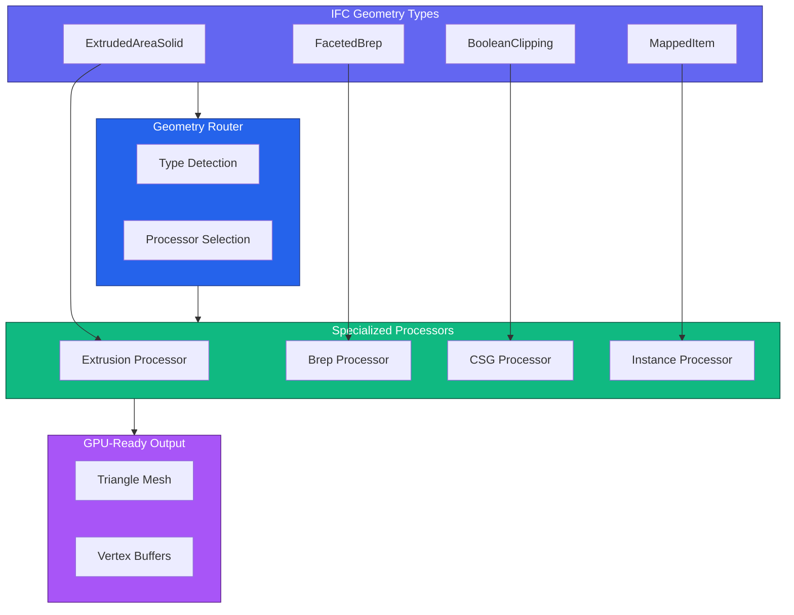
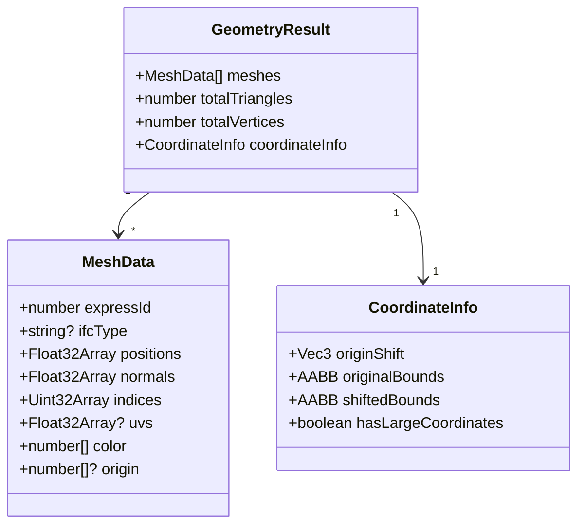
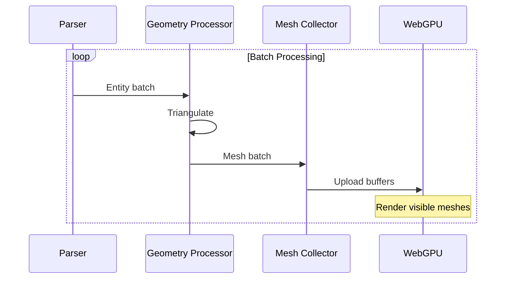
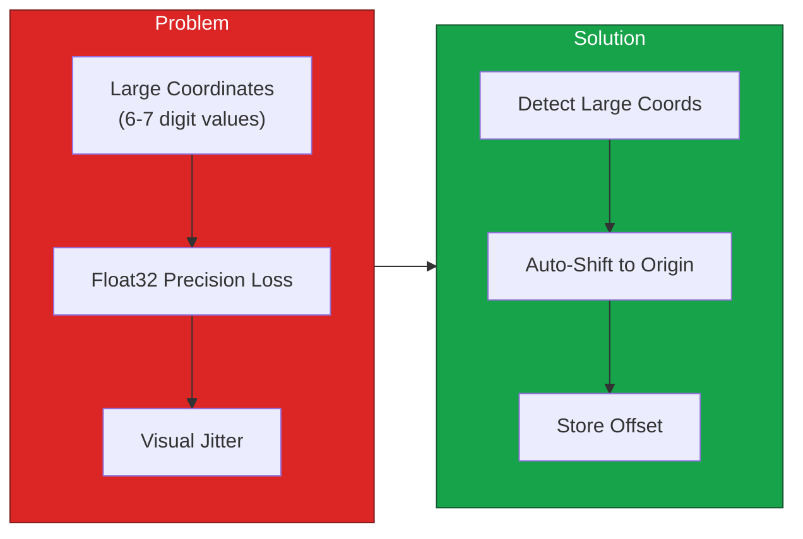
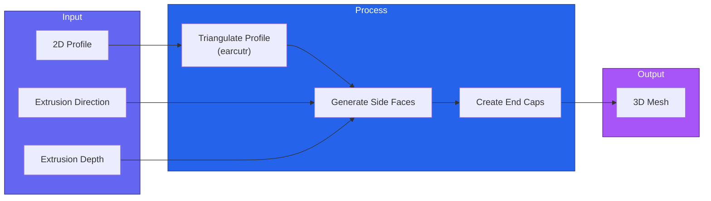
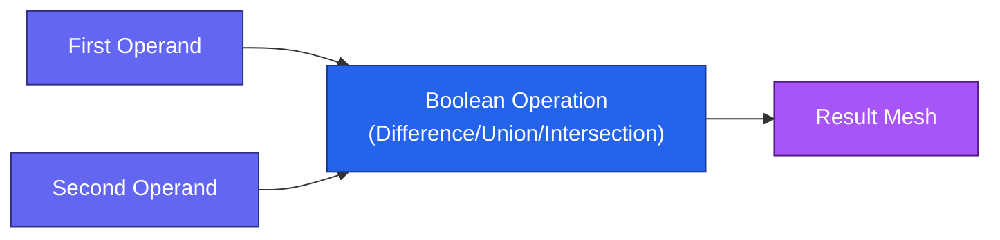

# Geometry Processing

Guide to geometry extraction and processing in IFClite.

## Overview

All geometry is produced by a single Rust pipeline (`produce_element_meshes`
in the processing crate), whether it runs through the browser WASM build, the
worker pool, or a native host. Every consumer therefore gets identical
per-element meshes, and fixes to the mesher land once for all paths.

IFClite processes IFC geometry through a streaming pipeline:



## Tessellation Quality

Curved geometry (swept pipes, cylinders, fillets, NURBS patches) is
approximated with straight segments. The detail level is selectable per
`GeometryProcessor` — no WASM rebuild needed:

| Level | Curved-surface segment density | Profile circles (opening cutters / caps) | Use case |
|-------|-------------------------------|------------------------------------------|----------|
| `'lowest'` | ×0.25 | max 8 segments | Maximum throughput, previews |
| `'low'` | ×0.5 | max 16 segments | Mobile, large federated models |
| `'medium'` (default) | ×1 — historical densities | 36 segments | General use |
| `'high'` | ×2 | 36 (never finer) | Smooth pipes / cylinders |
| `'highest'` | ×4 | 36 (never finer) | Close-up curved detail |

```typescript
import { GeometryProcessor } from '@ifc-lite/geometry';

// At construction…
const geometry = new GeometryProcessor({ tessellationQuality: 'high' });
await geometry.init();

// …or at runtime, BEFORE processing (already-emitted meshes are not
// regenerated — reload the model to apply a new level):
geometry.setTessellationQuality('low');

const result = await geometry.process(new Uint8Array(buffer));
```

The same knob exists on the raw WASM API for consumers driving
`processGeometryBatch` directly:

```typescript
import { IfcAPI } from '@ifc-lite/wasm';

const api = new IfcAPI();
api.setTessellationQuality('highest'); // applies to subsequent batches
```

**Performance trade-off.** Triangle count and processing time on
curved-heavy models scale roughly with the density multiplier: `'highest'`
can quadruple the triangles of a pipe-rack model, `'lowest'` quarters them.
Boxy architectural models (extrusions, breps) are barely affected — only
curved tessellation scales.

**Guarantees:**

- Leaving the level unset (or passing `'medium'` / `null`) produces output
  **byte-for-byte identical** to previous releases — upgrading is safe.
- Segment counts rise monotonically with the level (never fewer triangles
  at a higher level).
- Profile-plane outlines (extruded caps and opening cutters) never get
  *finer* than `'medium'` — denser opening circles only multiply earcut
  cap-bridge slivers on plates with bolt holes. They do coarsen below
  `'medium'` for preview levels.
- WASM paths only (main-thread, streaming and worker pool); the native
  Tauri pipeline does not consume the level yet.

## Mesh Data Structure



!!! warning "Winding order is not outward-guaranteed"
    Triangle winding in IFC-derived meshes is unreliable by design: source
    breps and CSG results do not guarantee outward-facing triangles. Renderers
    must draw double-sided (`cullMode: 'none'` / `DoubleSide`) and must not use
    winding for front/back-face decisions; shade with
    `abs(dot(normal, viewDir))` or depth testing instead. The bundled
    `@ifc-lite/renderer` already does this.

### Accessing Mesh Data

```typescript
import { GeometryProcessor } from '@ifc-lite/geometry';

const geometry = new GeometryProcessor();
await geometry.init();

const result = await geometry.process(new Uint8Array(buffer));

// Get all meshes
for (const mesh of result.meshes) {
  console.log(`Entity #${mesh.expressId}:`);
  console.log(`  Vertices: ${mesh.positions.length / 3}`);
  console.log(`  Triangles: ${mesh.indices.length / 3}`);
  console.log(`  Color: rgba(${mesh.color.join(', ')})`);
}

// Find mesh by entity ID
const wallMesh = result.meshes.find(m => m.expressId === wallId);

// Precomputed model bounds (from coordinate info on the result)
const bounds = result.coordinateInfo.shiftedBounds;
console.log(`Model bounds:`, bounds);
```

## Streaming Geometry

Process geometry incrementally for large files:



### Streaming Example

```typescript
import { GeometryProcessor } from '@ifc-lite/geometry';
import { Renderer } from '@ifc-lite/renderer';

const geometry = new GeometryProcessor();
await geometry.init();

const renderer = new Renderer(canvas);
await renderer.init();

// Stream geometry progressively
for await (const event of geometry.processStreaming(new Uint8Array(buffer))) {
  switch (event.type) {
    case 'start':
      console.log('Starting geometry extraction');
      break;

    case 'batch':
      // Upload meshes to GPU as they arrive
      renderer.addMeshes(event.meshes, true);  // isStreaming = true

      // Render current state
      renderer.render();
      console.log(`Meshes so far: ${event.totalSoFar}`);
      break;

    case 'complete':
      // Finalize rendering
      renderer.fitToView();
      console.log(`Complete: ${event.totalMeshes} meshes`);
      break;
  }
}
```

## Parallel and Adaptive Processing

On multi-core machines with `SharedArrayBuffer` available (a
cross-origin-isolated page), the processor can fan geometry out to a pool of
Web Workers, each with its own WASM instance processing a disjoint slice of
the element list. Batches are yielded as they arrive from any worker:

```typescript
// Explicit worker-pool streaming
for await (const event of geometry.processParallel(new Uint8Array(buffer))) {
  if (event.type === 'batch') renderer.addMeshes(event.meshes, true);
}
```

`processAdaptive()` is the recommended entry point: it picks the best path
automatically. Small files (below a 2 MB threshold by default) are processed
in one shot for instant display; larger files use the parallel worker pool
when available, falling back to single-worker streaming otherwise:

```typescript
for await (const event of geometry.processAdaptive(new Uint8Array(buffer))) {
  switch (event.type) {
    case 'batch':
      // Note: multiple meshes may share an expressId (one per material/part);
      // group by expressId for per-element rendering or picking.
      renderer.addMeshes(event.meshes, true);
      break;
    case 'complete':
      renderer.fitToView();
      break;
  }
}
```

The worker count is chosen by a cores/memory heuristic; geometry output is
identical regardless of the count (workers process deterministic, disjoint
slices).

## Coordinate Handling

IFC files often use large georeferenced coordinates that cause precision issues:



### Auto Origin Shift

The geometry processor automatically handles large coordinates:

```typescript
import { GeometryProcessor } from '@ifc-lite/geometry';

const geometry = new GeometryProcessor();
await geometry.init();

const result = await geometry.process(new Uint8Array(buffer));

// Access the computed shift from coordinate info (returned on the result)
const coordInfo = result.coordinateInfo;
if (coordInfo?.originShift) {
  console.log(`Origin shifted by:`, coordInfo.originShift);
  // { x: 487234.5, y: 5234891.2, z: 0 }
}

// Convert local coordinates back to world
function toWorldCoords(localPos: Vector3, shift: Vector3): Vector3 {
  return {
    x: localPos.x + shift.x,
    y: localPos.y + shift.y,
    z: localPos.z + shift.z
  };
}
```

## Geometry Processors

### Extrusion Processor

Handles `IfcExtrudedAreaSolid` entities:



### Brep Processor

Handles `IfcFacetedBrep` (and tessellated face-set) entities in Rust. Each
face is projected to its plane and triangulated: simple quads take a fast fan
path, faces with holes go through polygon triangulation with hole support
(falling back to a fan if that fails).

### Boolean Operations

Handles `IfcBooleanClippingResult` and opening voids (`IfcRelVoidsElement`).
Void cutting is a single exact-CSG path in the Rust kernel: boolean
differences are evaluated with exact arithmetic predicates, so opening cuts
are watertight rather than approximated.



## Batching

The renderer automatically groups geometry by colour into a small number of
batched draw calls (one `BatchedMesh` per colour group), so a model with many
repeated elements still renders in a handful of draws — no manual step:

```typescript
import { GeometryProcessor } from '@ifc-lite/geometry';

const geometry = new GeometryProcessor();
await geometry.init();

const result = await geometry.process(new Uint8Array(buffer));

// The renderer batches by colour when you load the meshes.
renderer.loadGeometry(result);
```

In addition, repeated opaque geometry (e.g. Tekla-style bolt/part repetition)
can be routed to a GPU-instancing path: the streaming batch events carry
packed instanced shards when the processor's `enableInstancing` option is on
(the default). Federated multi-model loads should pass
`enableInstancing: false`, since the renderer's instanced path is
primary-model only. See the [Rendering Guide](rendering.md) for how shards are
uploaded.

## Performance Optimization

### Memory-Efficient Processing

Use streaming for large files:

```typescript
import { GeometryProcessor } from '@ifc-lite/geometry';

const geometry = new GeometryProcessor();
await geometry.init();

// Stream geometry in batches
for await (const event of geometry.processStreaming(new Uint8Array(buffer), undefined, 50)) {
  if (event.type === 'batch') {
    renderer.addMeshes(event.meshes, true);
    console.log(`Meshes so far: ${event.totalSoFar}`);
  }
}
```

### Filtering Geometry

To only render specific entity types, filter the meshes after processing:

```typescript
import { IfcParser } from '@ifc-lite/parser';
import { GeometryProcessor } from '@ifc-lite/geometry';

const parser = new IfcParser();
const store = await parser.parseColumnar(buffer);

// Get expressIds for types you want
const wantedIds = new Set([
  ...(store.entityIndex.byType.get('IFCWALL') ?? []),
  ...(store.entityIndex.byType.get('IFCDOOR') ?? []),
  ...(store.entityIndex.byType.get('IFCWINDOW') ?? [])
]);

// Process all geometry
const geometry = new GeometryProcessor();
await geometry.init();
const result = await geometry.process(new Uint8Array(buffer));

// Filter meshes
const filteredMeshes = result.meshes.filter(m => wantedIds.has(m.expressId));
renderer.loadGeometry(filteredMeshes);
```

## Geometry Statistics

```typescript
import { GeometryProcessor } from '@ifc-lite/geometry';

const geometry = new GeometryProcessor();
await geometry.init();

const result = await geometry.process(new Uint8Array(buffer));

// Totals are precomputed on the result
console.log('Geometry Statistics:');
console.log(`  Total meshes: ${result.meshes.length}`);
console.log(`  Total triangles: ${result.totalTriangles}`);
console.log(`  Total vertices: ${result.totalVertices}`);
```

## Next Steps

- [Rendering Guide](rendering.md) - Display geometry with WebGPU
- [Parsing Guide](parsing.md) - Parse options and streaming
- [API Reference](../api/typescript.md) - Complete API docs
