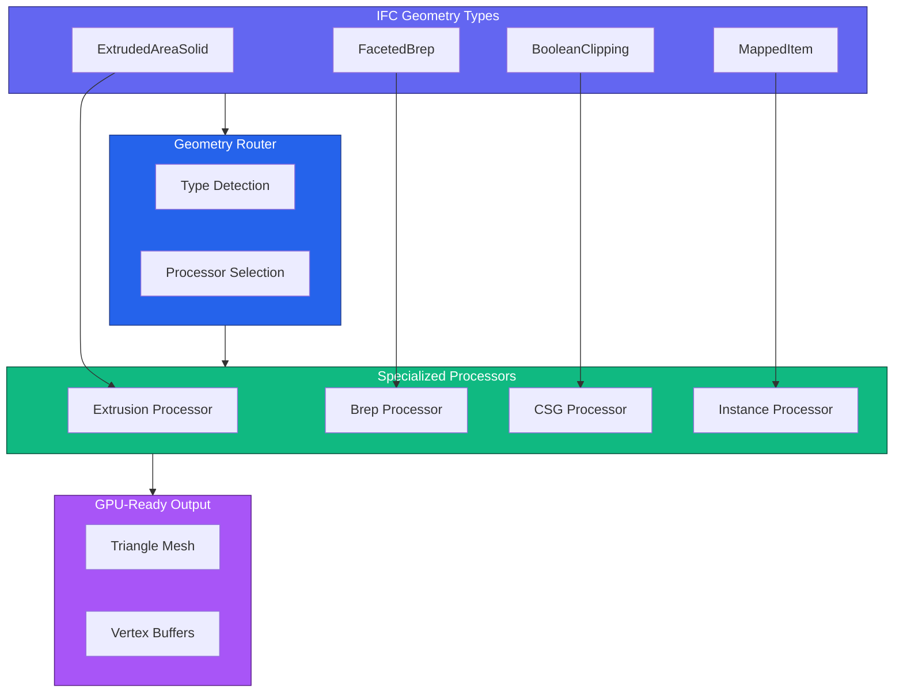
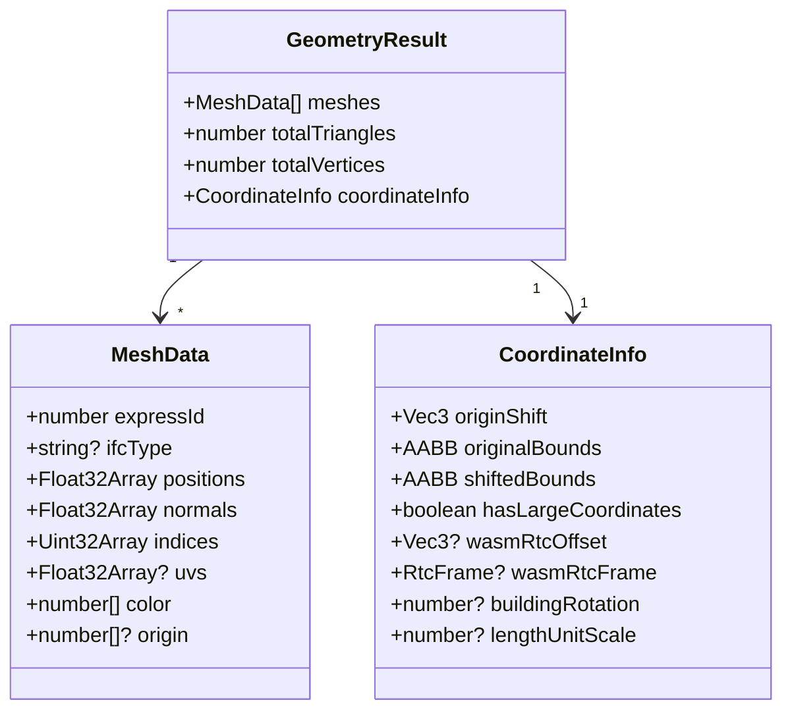
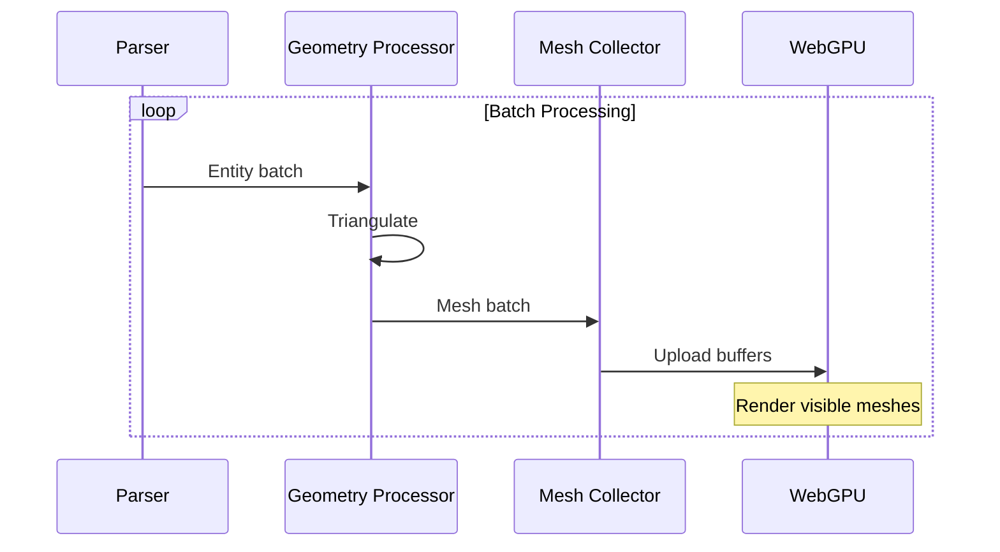
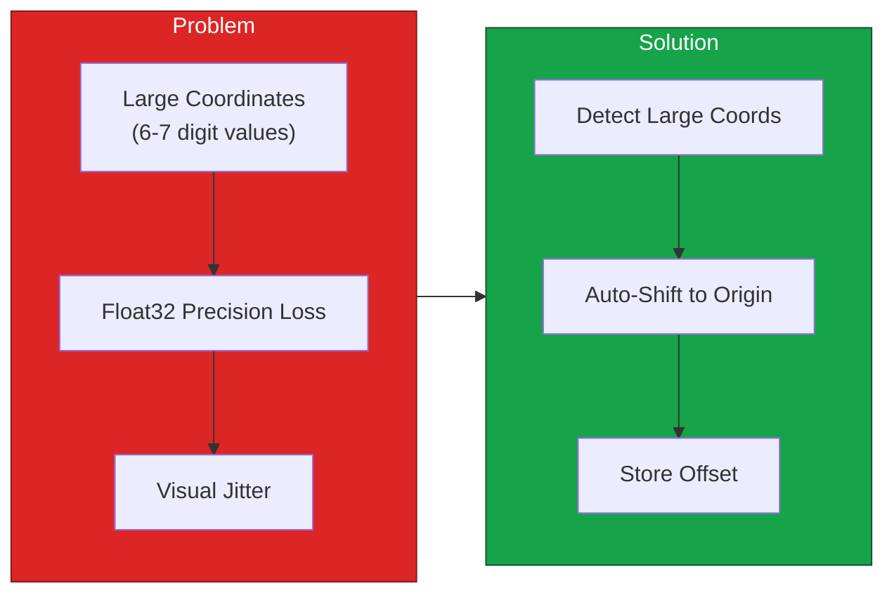
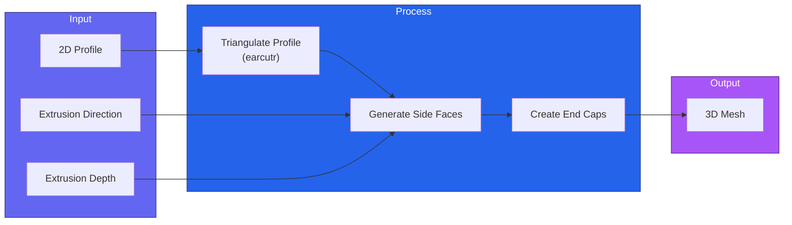
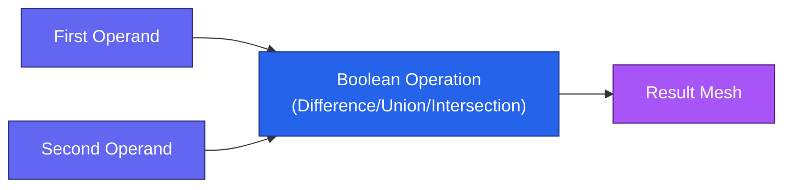

# Geometry Processing

Guide to geometry extraction and processing in IFClite.

## Overview

All geometry is produced by a single Rust pipeline (`produce_element_meshes`
in the processing crate), whether it runs through the browser WASM build, the
worker pool, or a native host. Every consumer therefore gets identical
per-element meshes, and fixes to the mesher land once for all paths.

IFClite processes IFC geometry through a streaming pipeline:


```mermaid
flowchart TB
    subgraph Input["IFC Geometry Types"]
        Extrusion["ExtrudedAreaSolid"]
        Brep["FacetedBrep"]
        Clipping["BooleanClipping"]
        Mapped["MappedItem"]
    end

    subgraph Router["Geometry Router"]
        Detect["Type Detection"]
        Select["Processor Selection"]
    end

    subgraph Processors["Specialized Processors"]
        ExtProc["Extrusion Processor"]
        BrepProc["Brep Processor"]
        CSGProc["CSG Processor"]
        MapProc["Instance Processor"]
    end

    subgraph Output["GPU-Ready Output"]
        Mesh["Triangle Mesh"]
        Buffers["Vertex Buffers"]
    end

    Input --> Router
    Router --> Processors
    Extrusion --> ExtProc
    Brep --> BrepProc
    Clipping --> CSGProc
    Mapped --> MapProc
    Processors --> Output

    style Input fill:#6366f1,stroke:#312e81,color:#fff
    style Router fill:#2563eb,stroke:#1e3a8a,color:#fff
    style Processors fill:#10b981,stroke:#064e3b,color:#fff
    style Output fill:#a855f7,stroke:#581c87,color:#fff
```

## Tessellation Quality

Curved geometry (swept pipes, cylinders, fillets, NURBS patches) is
approximated with straight segments. The detail level is selectable per
`GeometryProcessor` — no WASM rebuild needed:

| Level | Curved-surface segment density | Profile circles (opening cutters / caps) | Use case |
|-------|-------------------------------|------------------------------------------|----------|
| `'lowest'` | ×0.25 | max 8 segments | Maximum throughput, previews |
| `'low'` | ×0.5 | max 16 segments | Mobile, large federated models |
| `'medium'` (default) | ×1 — historical densities | 36 segments | General use |
| `'high'` | ×2 | 36 (never finer) | Smooth pipes / cylinders |
| `'highest'` | ×4 | 36 (never finer) | Close-up curved detail |

```typescript
import { GeometryProcessor } from '@ifc-lite/geometry';

// At construction…
const geometry = new GeometryProcessor({ tessellationQuality: 'high' });
await geometry.init();

// …or at runtime, BEFORE processing (already-emitted meshes are not
// regenerated — reload the model to apply a new level):
geometry.setTessellationQuality('low');

const result = await geometry.process(new Uint8Array(buffer));
```

The same knob exists on the raw WASM API for consumers driving
`processGeometryBatch` directly:

```typescript
import { IfcAPI } from '@ifc-lite/wasm';

const api = new IfcAPI();
api.setTessellationQuality('highest'); // applies to subsequent batches
```

**Performance trade-off.** Triangle count and processing time on
curved-heavy models scale roughly with the density multiplier: `'highest'`
can quadruple the triangles of a pipe-rack model, `'lowest'` quarters them.
Boxy architectural models (extrusions, breps) are barely affected — only
curved tessellation scales.

**Guarantees:**

- Leaving the level unset (or passing `'medium'` / `null`) produces output
  **byte-for-byte identical** to previous releases — upgrading is safe.
- Segment counts rise monotonically with the level (never fewer triangles
  at a higher level).
- Profile-plane outlines (extruded caps and opening cutters) never get
  *finer* than `'medium'` — denser opening circles only multiply earcut
  cap-bridge slivers on plates with bolt holes. They do coarsen below
  `'medium'` for preview levels.
- WASM paths only (main-thread, streaming and worker pool); the native
  Tauri pipeline does not consume the level yet.

## Mesh Data Structure


```mermaid
classDiagram
    class MeshData {
        +number expressId
        +string? ifcType
        +Float32Array positions
        +Float32Array normals
        +Uint32Array indices
        +Float32Array? uvs
        +number[] color
        +number[]? origin
    }

    class GeometryResult {
        +MeshData[] meshes
        +number totalTriangles
        +number totalVertices
        +CoordinateInfo coordinateInfo
    }

    class CoordinateInfo {
        +Vec3 originShift
        +AABB originalBounds
        +AABB shiftedBounds
        +boolean hasLargeCoordinates
        +Vec3? wasmRtcOffset
        +RtcFrame? wasmRtcFrame
        +number? buildingRotation
        +number? lengthUnitScale
    }

    GeometryResult "1" --> "*" MeshData
    GeometryResult "1" --> "1" CoordinateInfo
```

!!! warning "Winding order is not outward-guaranteed"
    Triangle winding in IFC-derived meshes is unreliable by design: source
    breps and CSG results do not guarantee outward-facing triangles. Renderers
    must draw double-sided (`cullMode: 'none'` / `DoubleSide`) and must not use
    winding for front/back-face decisions; shade with
    `abs(dot(normal, viewDir))` or depth testing instead. The bundled
    `@ifc-lite/renderer` already does this.

### Accessing Mesh Data

```typescript
import { GeometryProcessor } from '@ifc-lite/geometry';

const geometry = new GeometryProcessor();
await geometry.init();

const result = await geometry.process(new Uint8Array(buffer));

// Get all meshes
for (const mesh of result.meshes) {
  console.log(`Entity #${mesh.expressId}:`);
  console.log(`  Vertices: ${mesh.positions.length / 3}`);
  console.log(`  Triangles: ${mesh.indices.length / 3}`);
  console.log(`  Color: rgba(${mesh.color.join(', ')})`);
}

// Find mesh by entity ID
const wallMesh = result.meshes.find(m => m.expressId === wallId);

// Precomputed model bounds (from coordinate info on the result)
const bounds = result.coordinateInfo.shiftedBounds;
console.log(`Model bounds:`, bounds);
```

### Exact extrusion source definitions

`GeometryProcessor.extractExtrusionDefinitions` returns the authored
`IfcExtrudedAreaSolid` profile, direction, depth, and placement separately from
each product occurrence. It accepts raw IFC bytes and optional product STEP IDs.
Omit the IDs to inspect every product; pass an empty `Uint32Array` to select none.
The result type comes from the generated WASM binding.

```typescript
import { GeometryProcessor, type ExtrusionDefinitions } from '@ifc-lite/geometry';

async function inspectExtrusions(bytes: Uint8Array, productId: number): Promise<ExtrusionDefinitions> {
  const geometry = new GeometryProcessor();
  await geometry.init();
  try {
    const definitions = geometry.extractExtrusionDefinitions(bytes, new Uint32Array([productId]));
    if (!definitions) throw new Error('Geometry processor is not initialized');
    return definitions;
  } finally {
    geometry.dispose();
  }
}
```

Source references use exact EXPRESS keys: `SweptArea`, `Position`, and
`ExtrudedDirection` on the solid, and `Position` on the profile. `source.Depth`,
profile loop coordinates and the optional `position_matrix` and
`profile_position` retain IFC file length units. `length_unit_scale` converts
file lengths to metres; nominal area and volume remain in squared and cubed
file units. Each occurrence's column-major `world_from_source` maps solid-local
coordinates to absolute IFC Z-up metres. For a profile point, apply
`world_from_source × position_matrix × profile_position` in that order, using
identity for an absent position. The `status` field reports unsupported or
invalid sources explicitly; a missing `nominal_quantities` value is not zero.

### Drilling from a Mesh Back to its Source Item

An element's `expressId` names the wall; it does not name the piece of the wall
you just clicked. `MeshData.geometryItemId` does. It is the **STEP express id of
the `IfcRepresentationItem` the mesh was tessellated from**, so on a wall built
from several solids each mesh names its own `IfcExtrudedAreaSolid`,
`IfcFacetedBrep` or `IfcBooleanResult`. Because it is a STEP instance name, it resolves
against the same entity index as any other id, so you can read the source line
back out of the file:

```typescript
import type { MeshData } from '@ifc-lite/geometry';

/** The raw STEP text of the representation item a mesh was tessellated from. */
function sourceItemText(mesh: MeshData): string | undefined {
  // Absent is a real state; see "When it is absent" below. It is never `0`.
  if (mesh.geometryItemId === undefined) return undefined;

  // Representation items are indexed in `entityIndex.byId` like every other
  // entity. They are NOT in the entity TABLE (the columnar parser classifies
  // them as skip-category and never materialises them), so
  // `store.entities.getTypeName(...)` has nothing to return for one. Take the
  // type off the ref instead.
  const ref = store.entityIndex.byId.get(mesh.geometryItemId);
  if (!ref) return undefined;

  console.log(`#${mesh.expressId} came from #${ref.expressId} (${ref.type})`);
  return store.source.decodeUtf8(ref.byteOffset, ref.byteOffset + ref.byteLength);
}

for (const mesh of result.meshes) {
  const text = sourceItemText(mesh);
  if (text) console.log(text);
}
```

`geometryItemId` is **disjoint from `materialId`**, the other source id on
`MeshData`. `materialId` is an `IfcMaterial` express id, set on the meshes that
slice a wall or slab by material layer. The two are never both set, and they
name different classes of entity, so neither is a fallback for the other:
following `materialId` as though it were a representation item lands on the
wrong entity, which is exactly the confusion the split fixed (#3199).

#### When it is absent

`geometryItemId` is `undefined` when there is no id to carry, never `0`. STEP
instance names start at `#1`, so a zero can only be a producer's own "no
reference" sentinel, and the pipeline filters it to absent at the single place
both source ids are set.

Absence means **"no item identity is available here"**, not "this geometry has
no source item". The item existed; the mesh you are holding was merged from more
than one of them, so no single id describes it. The cases:

- **The single merged mesh fallback.** The element was emitted as one mesh for
  its whole body rather than one mesh per representation item.
- **The cached `IfcMappedItem` path.** A representation map's items were merged
  into one template, so the template names none of them individually.
- **A colour-merged batch.** Many entities' vertices share one `MeshData`,
  identified per-vertex by `entityIds`; one item id cannot name many entities'
  geometry.

A material-layer slice is a fourth kind of absence with a different reading: it
carries `materialId` instead, so the identity is present but is a material's,
not an item's.

### Canonical triangle provenance

Item-identified meshes extracted from WASM carry optional `appearanceSource`
metadata. Its `indices` reference identifies the current topology, while
`sourceIndices` identifies the canonical unsplit triangle order. At extraction,
both reference the existing mesh index array; no geometry buffer is copied.
Those shared references survive worker structured clone and buffer transfer.

Consumers that split triangles must carry a `cornerIndices` mapping from each
current triangle corner to its canonical triangle corner. A consumer that
rebuilds topology without such a mapping must discard the metadata. This is
provenance for matching authored UVs to actual geometry, not a claim that every
item is eligible for editing. Transports and caches must explicitly preserve
the array identities before a downstream authoring tool can rely on them.
Keeping a fragment may retain its original unsplit index array; callers that
release CPU geometry must release this metadata too.

## Streaming Geometry

Process geometry incrementally for large files:


```mermaid
sequenceDiagram
    participant Parser
    participant Processor as Geometry Processor
    participant Collector as Mesh Collector
    participant GPU as WebGPU

    loop Batch Processing
        Parser->>Processor: Entity batch
        Processor->>Processor: Triangulate
        Processor->>Collector: Mesh batch
        Collector->>GPU: Upload buffers
        Note over GPU: Render visible meshes
    end
```

### Streaming Example

```typescript
import { GeometryProcessor } from '@ifc-lite/geometry';
import { Renderer } from '@ifc-lite/renderer';

const geometry = new GeometryProcessor();
await geometry.init();

const renderer = new Renderer(canvas);
await renderer.init();

// Stream geometry progressively
for await (const event of geometry.processStreaming(new Uint8Array(buffer))) {
  switch (event.type) {
    case 'start':
      console.log('Starting geometry extraction');
      break;

    case 'batch':
      // Upload meshes to GPU as they arrive
      renderer.addMeshes(event.meshes, true);  // isStreaming = true

      // Render current state
      renderer.render();
      console.log(`Meshes so far: ${event.totalSoFar}`);
      break;

    case 'complete':
      // Finalize rendering
      renderer.fitToView();
      console.log(`Complete: ${event.totalMeshes} meshes`);
      break;
  }
}
```

## Parallel and Adaptive Processing

On multi-core machines with `SharedArrayBuffer` available (a
cross-origin-isolated page), the processor can fan geometry out to a pool of
Web Workers, each with its own WASM instance processing a disjoint slice of
the element list. Batches are yielded as they arrive from any worker:

```typescript
// Explicit worker-pool streaming
for await (const event of geometry.processParallel(new Uint8Array(buffer))) {
  if (event.type === 'batch') renderer.addMeshes(event.meshes, true);
}
```

`processAdaptive()` is the recommended entry point: it picks the best path
automatically. Small files (below a 2 MB threshold by default) are processed
in one shot for instant display; larger files use the parallel worker pool
when available, falling back to single-worker streaming otherwise:

```typescript
for await (const event of geometry.processAdaptive(new Uint8Array(buffer))) {
  switch (event.type) {
    case 'batch':
      // Note: multiple meshes may share an expressId (one per material/part);
      // group by expressId for per-element rendering or picking.
      renderer.addMeshes(event.meshes, true);
      break;
    case 'complete':
      renderer.fitToView();
      break;
  }
}
```

The worker count is chosen by a cores/memory heuristic; geometry output is
identical regardless of the count (workers process deterministic, disjoint
slices).

### Hung elements and abandoning a stream

A worker in the parallel pool runs one synchronous WASM call at a time. By
default, an element whose geometry never finishes stalls the stream. Pass
`hungJobTimeoutMs` (for example `DEFAULT_HUNG_JOB_TIMEOUT_MS`, 45 s) to opt in
to recovery, but only if you handle `complete.skippedHungElements`:

1. A worker silent inside a multi-element call for that budget is replaced, and that call is re-run one element per call.
   Nothing is skipped at this stage.
2. A worker silent inside a single-element call for twice that budget is
   replaced and the element is skipped.
3. Everything else the worker had queued is replayed on the replacement.

A load that skipped elements still completes. `complete.skippedHungElements`
lists their express ids and counts by IFC type, so treat such a `complete` as
a partial result: tell the user, and don't cache it as the full model. After 16
replacements the pool stops recovering, and the stream stalls as it did before
recovery existed.

The pool does not stop its workers when you stop iterating. A
generator waiting on a silent worker cannot run its cleanup from `return()`,
so pass a `signal` and abort it when you abandon the stream (cancel, timeout,
or a newer load):

```typescript
import { DEFAULT_HUNG_JOB_TIMEOUT_MS } from '@ifc-lite/geometry';

const controller = new AbortController();
for await (const event of geometry.processAdaptive(new Uint8Array(buffer), {
  signal: controller.signal,
  hungJobTimeoutMs: DEFAULT_HUNG_JOB_TIMEOUT_MS,
})) {
  if (event.type === 'batch') renderer.addMeshes(event.meshes, true);
  if (event.type === 'complete' && event.skippedHungElements) {
    const { expressIds, byType } = event.skippedHungElements;
    console.warn(`${expressIds.length} element(s) skipped`, byType);
  }
}
// Elsewhere, on cancel: controller.abort();
```

`GeometryProcessor.processParallel` (`geometry.processParallel(...)`) takes
positional arguments rather than an options object: pass `signal` and
`hungJobTimeoutMs` as its last two, after `sourceFingerprint`.

## Coordinate Handling

IFC files often use large georeferenced coordinates that cause precision issues:


```mermaid
flowchart LR
    subgraph Problem["Problem"]
        Large["Large Coordinates<br/>(6-7 digit values)"]
        Precision["Float32 Precision Loss"]
        Jitter["Visual Jitter"]
        Large --> Precision --> Jitter
    end

    subgraph Solution["Solution"]
        Detect["Detect Large Coords"]
        Shift["Auto-Shift to Origin"]
        Store["Store Offset"]
        Detect --> Shift --> Store
    end

    Problem --> Solution

    style Problem fill:#dc2626,stroke:#7f1d1d,color:#fff
    style Solution fill:#16a34a,stroke:#14532d,color:#fff
```

### Auto Origin Shift

For a georeferenced or otherwise far-from-origin model, the large offset is
usually removed by the WASM mesh pass itself and reported as
`coordinateInfo.wasmRtcOffset` — an **IFC Z-up** translation, not yet in the
mesh's Y-up axes. `originShift` (already Y-up) is a second, JS-side shift that
only fires when WASM did *not* re-base the model and it is still more than
`NORMAL_COORD_THRESHOLD_M` (10&nbsp;km) from the origin
(`packages/geometry/src/coordinate-handler.ts`). For most real georeferenced
models `wasmRtcOffset` is the one that is set and `originShift` stays
`{ x: 0, y: 0, z: 0 }` — reading only `originShift`, as the previous version of
this example did, silently drops the WASM offset and hands back render-frame
coordinates while presenting them as world coordinates.

`hasLargeCoordinates` tracks only the JS `originShift` path, so it is `false`
whenever WASM already re-based the model. `wasmRtcOffset !== undefined` alone
is not enough either, because a model shifted only by `originShift` has
`hasLargeCoordinates: true` and no `wasmRtcOffset`. To ask "was this model
shifted at all?", check both:
`coordinateInfo.hasLargeCoordinates || coordinateInfo.wasmRtcOffset !== undefined`.

`@ifc-lite/geometry/world-frame` is the one place that combines both offsets
and applies the Y-up/Z-up axis swap (`scripts/check-rtc-frame-copies.mjs`
fails CI on any hand-rolled copy of this arithmetic outside that module):

```typescript
import { GeometryProcessor, type Vec3 } from '@ifc-lite/geometry';
import { renderFrameWorldOffset, viewerToIfcAxes } from '@ifc-lite/geometry/world-frame';

const geometry = new GeometryProcessor();
await geometry.init();

const result = await geometry.process(new Uint8Array(buffer));

// Render-frame -> IFC world translation, in IFC Z-up metres. Folds in both
// wasmRtcOffset (Z-up) and originShift (Y-up) and performs the axis swap.
const offset = renderFrameWorldOffset(result.coordinateInfo);

// A point read off a mesh (positions + origin) is in the Y-up render frame.
// Convert it to IFC Z-up first, then add the offset, to get IFC world
// coordinates:
function toWorldCoords(renderFramePointYup: Vec3): Vec3 {
  const zUp = viewerToIfcAxes(renderFramePointYup);
  return {
    x: zUp.x + offset.x,
    y: zUp.y + offset.y,
    z: zUp.z + offset.z,
  };
}
```

For `coordinateInfo` `{ originShift: { x: 0, y: 0, z: 0 }, wasmRtcOffset: {
x: 2000031.105, y: 1000012, z: 500 } }` (the WASM-shifted case above),
`renderFrameWorldOffset` returns `{ x: 2000031.105, y: 1000012, z: 500 }`.
Converting a render-frame point `{ x: 12.5, y: 3.2, z: -8.1 }` (Y-up) with the
code above gives the Z-up point `{ x: 12.5, y: 8.1, z: 3.2 }` and then the
IFC world point `{ x: 2000043.605, y: 1000020.1, z: 503.2 }` (Z-up) — verified by running `world-frame.ts`'s `renderFrameWorldOffset`
and `viewerToIfcAxes` directly against this `coordinateInfo`.

The viewer, `ifc-lite clash --bcf` and `bim.bcf` in the SDK already apply this
conversion for you; see [BCF Collaboration → Coordinate
frames](bcf.md#coordinate-frames) for the equivalent viewpoint-export path.

In a federation, every model is drawn against one shared `wasmRtcOffset`, and
a model loaded before that anchor was known is moved onto it after the fact:
each mesh's `origin` and the model's `coordinateInfo` change, while its
`positions` do not. Point clouds and models with GPU-instanced geometry are
the exceptions and keep their own frame. Use `federationFrameInfo` from
`@ifc-lite/geometry/world-frame` for the federation's frame instead of any one
model's load-time `coordinateInfo`; see [Federation → Coordinates in a
Federation](federation.md#coordinates-in-a-federation).

## Geometry Processors

### Extrusion Processor

Handles `IfcExtrudedAreaSolid` entities:


```mermaid
flowchart LR
    subgraph Input
        Profile["2D Profile"]
        Direction["Extrusion Direction"]
        Depth["Extrusion Depth"]
    end

    subgraph Process
        Triangulate["Triangulate Profile<br/>(earcutr)"]
        Extrude["Generate Side Faces"]
        Cap["Create End Caps"]
    end

    subgraph Output
        Mesh["3D Mesh"]
    end

    Profile --> Triangulate
    Triangulate --> Extrude
    Direction --> Extrude
    Depth --> Extrude
    Extrude --> Cap
    Cap --> Mesh

    style Input fill:#6366f1,stroke:#312e81,color:#fff
    style Process fill:#2563eb,stroke:#1e3a8a,color:#fff
    style Output fill:#a855f7,stroke:#581c87,color:#fff
```

### Brep Processor

Handles `IfcFacetedBrep` (and tessellated face-set) entities in Rust. Each
face is projected to its plane and triangulated: simple quads take a fast fan
path, faces with holes go through polygon triangulation with hole support
(falling back to a fan if that fails).

### Boolean Operations

Handles `IfcBooleanClippingResult` and opening voids (`IfcRelVoidsElement`).
Void cutting is a single exact-CSG path in the Rust kernel: boolean
differences are evaluated with exact arithmetic predicates, so opening cuts
are watertight rather than approximated.


```mermaid
flowchart LR
    First["First Operand"]
    Second["Second Operand"]
    Op["Boolean Operation<br/>(Difference/Union/Intersection)"]
    Result["Result Mesh"]

    First --> Op
    Second --> Op
    Op --> Result

    style First fill:#6366f1,stroke:#312e81,color:#fff
    style Second fill:#6366f1,stroke:#312e81,color:#fff
    style Op fill:#2563eb,stroke:#1e3a8a,color:#fff
    style Result fill:#a855f7,stroke:#581c87,color:#fff
```

## Batching

The renderer automatically groups geometry by colour into a small number of
batched draw calls (one `BatchedMesh` per colour group), so a model with many
repeated elements still renders in a handful of draws — no manual step:

```typescript
import { GeometryProcessor } from '@ifc-lite/geometry';

const geometry = new GeometryProcessor();
await geometry.init();

const result = await geometry.process(new Uint8Array(buffer));

// The renderer batches by colour when you load the meshes.
renderer.loadGeometry(result);
```

In addition, repeated opaque geometry (e.g. Tekla-style bolt/part repetition)
can be routed to a GPU-instancing path: the streaming batch events carry
packed instanced shards when the processor's `enableInstancing` option is on
(the default). Federated multi-model loads should pass
`enableInstancing: false`, since the renderer's instanced path is
primary-model only. See the [Rendering Guide](rendering.md) for how shards are
uploaded.

### Item Ids on Instanced Occurrences

Instanced occurrences carry `geometryItemId` too, so instancing is no longer a
reason to lose the drill-to-source link. **Do not turn instancing off to get
item ids**: that trade no longer exists, and it costs you the draw-call win for
nothing.

On the wire the id rides the shard: `decodeInstancedShard` returns each
occurrence with an optional `itemId`, and the renderer's `prepareInstancedRender`
turns that into a per-template `itemIds` column parallel to `entityIds`. An
occurrence that renders flat because it fell below the instancing threshold
keeps its id as an ordinary `MeshData.geometryItemId`, so both halves of a model
answer the same question.

`DecodedInstancedShard.carriesItemIds` is how you tell **"this shard declares no
ids at all"** from **"this one piece has no item"**:

```typescript
import { decodeInstancedShard } from '@ifc-lite/geometry';

const shard = decodeInstancedShard(bytes);

if (!shard.carriesItemIds) {
  // Nothing in this shard names an item. Every occurrence's `itemId` is
  // undefined for the SAME reason, so don't report per-piece "unknown source".
} else {
  for (const occurrence of shard.instances) {
    // Here an undefined `itemId` is about this occurrence, not the shard.
    if (occurrence.itemId !== undefined) {
      console.log(`#${occurrence.entityId} <- item #${occurrence.itemId}`);
    }
  }
}
```

The flag is derived from the shard's declared instance-record stride, and the
encoder derives that stride from the data (it only widens the record when some
occurrence actually names an item), so `false` genuinely means "no occurrence
here has one", not "this build cannot see them".

!!! warning "A warm cache can show absence that is about the cache"
    Instanced shards are persisted into the binary cache as raw wire bytes and
    replayed verbatim, without a re-encode. A shard written by a build from
    before item ids shipped is a **v1 shard**: it declares the narrow stride, so
    `carriesItemIds` is `false` and every occurrence in it reports no item,
    even though the current pipeline would produce ids for that same model. The
    decoders read such a shard rather than refusing it, so a host with a warm
    cache can see absence caused by the cache rather than by the geometry.

    In this release those entries are invalidated anyway: the cache
    `FORMAT_VERSION` moves 15 → 16, so every entry misses once and re-meshes.
    That bump is not about reading old shards — it is about not handing NEW ones
    to an OLD bundle. The cache key carries `FORMAT_VERSION`, and a build from
    before this change refuses any shard version but 1 while the streaming
    loader swallows the error, which would silently drop every instanced
    occurrence under deploy skew or a rollback. After the one re-mesh, a warm
    cache holds v2 shards wherever an occurrence actually names an item. A
    batch where none does is still written at the base stride as version 1,
    so re-meshing does not turn every shard into a v2 one.

## Performance Optimization

### Memory-Efficient Processing

Use streaming for large files:

```typescript
import { GeometryProcessor } from '@ifc-lite/geometry';

const geometry = new GeometryProcessor();
await geometry.init();

// Stream geometry in batches
for await (const event of geometry.processStreaming(new Uint8Array(buffer), undefined, 50)) {
  if (event.type === 'batch') {
    renderer.addMeshes(event.meshes, true);
    console.log(`Meshes so far: ${event.totalSoFar}`);
  }
}
```

### Filtering Geometry

To only render specific entity types, filter the meshes after processing:

```typescript
import { IfcParser } from '@ifc-lite/parser';
import { GeometryProcessor } from '@ifc-lite/geometry';

const parser = new IfcParser();
const store = await parser.parseColumnar(buffer);

// Get expressIds for types you want
const wantedIds = new Set([
  ...(store.entityIndex.byType.get('IFCWALL') ?? []),
  ...(store.entityIndex.byType.get('IFCDOOR') ?? []),
  ...(store.entityIndex.byType.get('IFCWINDOW') ?? [])
]);

// Process all geometry
const geometry = new GeometryProcessor();
await geometry.init();
const result = await geometry.process(new Uint8Array(buffer));

// Filter meshes
const filteredMeshes = result.meshes.filter(m => wantedIds.has(m.expressId));
renderer.loadGeometry(filteredMeshes);
```

## Geometry Statistics

```typescript
import { GeometryProcessor } from '@ifc-lite/geometry';

const geometry = new GeometryProcessor();
await geometry.init();

const result = await geometry.process(new Uint8Array(buffer));

// Totals are precomputed on the result
console.log('Geometry Statistics:');
console.log(`  Total meshes: ${result.meshes.length}`);
console.log(`  Total triangles: ${result.totalTriangles}`);
console.log(`  Total vertices: ${result.totalVertices}`);
```

## Next Steps

- [Rendering Guide](rendering.md) - Display geometry with WebGPU
- [Parsing Guide](parsing.md) - Parse options and streaming
- [API Reference](../api/typescript.md) - Complete API docs

### Sharing the source fingerprint with a parser worker

`GeometryProcessor.processAdaptive` accepts an optional `sourceFingerprint` shared
cell. `GeometryProcessor.processParallel` takes it positionally, as the
`sourceFingerprint` argument after `workerCountOverride`. Pass the
same fresh per-load cell to `WorkerParser.parseColumnar`; its layout and lifetime
are documented in [Browser Worker Mode](./parsing.md#browser-worker-mode). Only the
parallel prepass produces this key. Other geometry paths and older WASM builds
leave the cell unavailable, and the parser computes its ordinary source key without
waiting. Geometry streaming and parser index-handoff deadlines remain unchanged.

### Polygonal annotation fills

Ordinary native and WASM geometry processing supports direct
`IfcAnnotationFillArea` items on `IfcAnnotation` products in `Annotation2D` and
`Surface2D` representations. Closed `IfcPolyline` boundaries can contain holes;
object placement and model units use the normal geometry pipeline. Auxiliary
building-type footprints remain excluded.

This initial subset accepts unstyled fills or one solid `IfcFillAreaStyle` RGB
paint, including an IFC2x3 `IfcPresentationStyleAssignment` wrapper. Mixed paint,
hatching/tiling, invalid RGB, unsupported boundaries and exhausted validation
budgets refuse the fill and report an unsupported item. Limits are 64 rings and
2,048 input vertices per fill, with a source-scoped style lookup bounded to
256 MiB of source, one million attached-style edges, 16 KiB per styled record,
and 64 styled items per geometry item. This does not enable PDF vector conversion.

### Re-meshing edited elements

`@ifc-lite/geometry/remesh` re-meshes a few elements after an edit, without reloading the model. `RemeshClient.create(config)` spawns one long-lived wasm worker. Each `remesh` request takes a standalone subgraph buffer from `serializeEntitySubgraph` (`@ifc-lite/export`) and meshes only the requested targets. It runs the load path's own calls: `buildPrePassOnce`, `processGeometryBatch`, then `convertMeshCollectionToBatch`. The request carries the RTC frame the model was meshed in and the load-time style wire, because the subgraph cannot derive either. Pass the same toggles the model was loaded with in the config, or the re-meshed element will not match its neighbours.

```typescript
import { RemeshClient, filterStyleWire } from '@ifc-lite/geometry/remesh';
import { serializeEntitySubgraph } from '@ifc-lite/export';

// Captured when the model loaded: its RTC frame and the pre-pass style wire.
declare const loadFrame: { x: number; y: number; z: number; needsShift: boolean };
declare const loadStyles: { styleIds: Uint32Array; styleColors: Uint8Array };

const client = await RemeshClient.create({
  mergeLayers: false, tessellationQuality: null, skipSmallCuts: false, rectParamFastPath: true,
});
const sub = serializeEntitySubgraph(store, mutationView, { targets: new Set([wallId]) });
const { meshes, csgFailures } = await client.remesh({
  buffer: sub.bytes, // transferred to the worker
  targets: Uint32Array.of(wallId),
  frame: loadFrame,
  ...filterStyleWire(loadStyles.styleIds, loadStyles.styleColors, sub.ids),
});
client.dispose(); // terminates the worker; in-flight requests reject
```

`client.styleWire(sourceBytes)` runs one whole-file pre-pass in the worker and returns that style wire, for a model whose load did not keep one; the viewer captures it once per model. A client whose worker fails or does not answer within `requestTimeoutMs` (default 30 s) is dead: `alive` turns false, requests still in flight and any later ones reject at once, and the caller creates a new client.

The meshes come back in the same frame and units as the load, so they can replace the element's load-time meshes directly. `scripts/lib/wasm-remesh-contracts.mjs` pins this. For each wall of several fixtures, including one with an RTC shift, it re-meshes the wall from its subgraph and checks the positions, indices, colours and origins against meshing the whole file.
