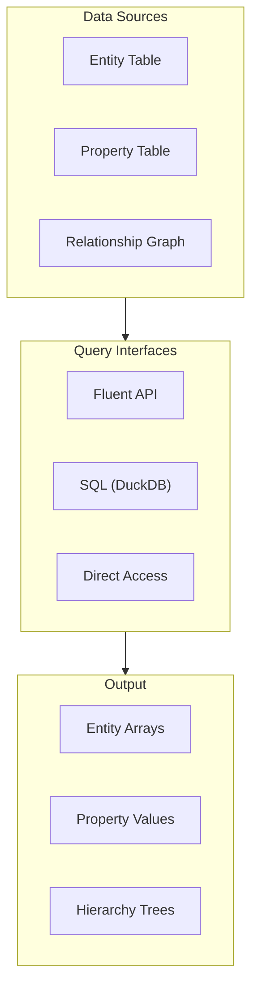
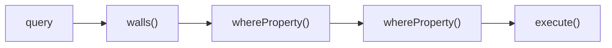
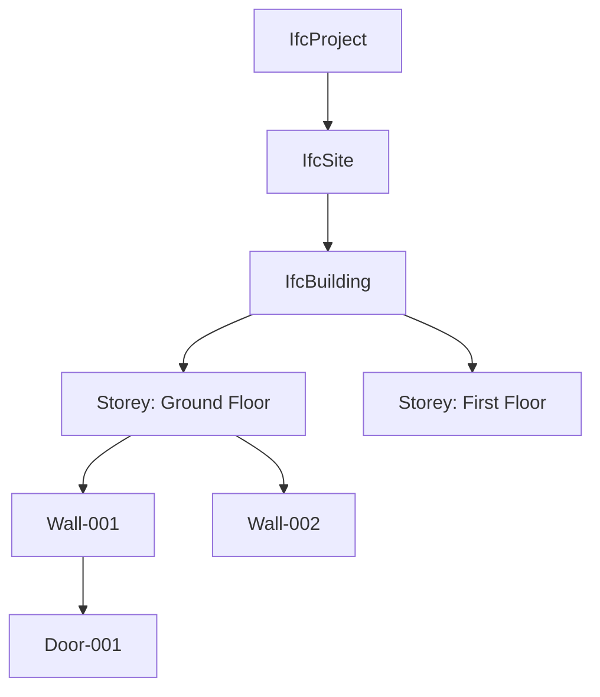
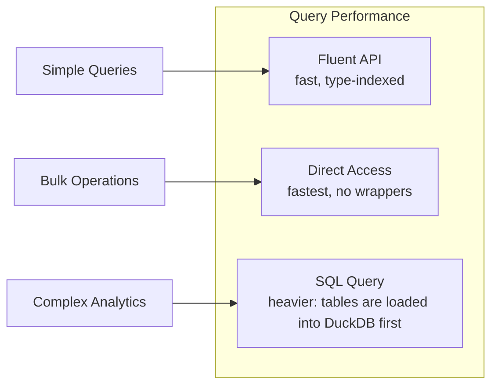

# Querying Data

Guide to querying IFC data with IFClite.

## Overview

IFClite provides multiple query interfaces:



## Fluent Query API

### Basic Queries

```typescript
import { IfcQuery } from '@ifc-lite/query';

const query = new IfcQuery(store); // store from parseColumnar()

// Get all walls
const walls = query.walls().execute();

// Get all doors
const doors = query.doors().execute();

// Get all windows
const windows = query.windows().execute();

// Get specific entity types
const beams = query.ofType('IFCBEAM').execute();
const columns = query.ofType('IFCCOLUMN').execute();
```

### Type Shortcuts

| Method | Entity Type |
|--------|-------------|
| `.walls()` | IFCWALL, IFCWALLSTANDARDCASE |
| `.doors()` | IFCDOOR |
| `.windows()` | IFCWINDOW |
| `.slabs()` | IFCSLAB |
| `.columns()` | IFCCOLUMN |
| `.beams()` | IFCBEAM |
| `.spaces()` | IFCSPACE |

### Property Filters

```typescript
// Filter by property value
const externalWalls = query
  .walls()
  .whereProperty('Pset_WallCommon', 'IsExternal', '=', true)
  .execute();

// Filter by numeric comparison
const fireRatedWalls = query
  .walls()
  .whereProperty('Pset_WallCommon', 'FireRating', '>=', 60)
  .execute();

// Filter by string pattern
const loadBearing = query
  .walls()
  .whereProperty('Pset_WallCommon', 'LoadBearing', '=', true)
  .execute();
```

### Chained Queries



```typescript
// Complex query chain
const walls = query
  .walls()
  .whereProperty('Pset_WallCommon', 'IsExternal', '=', true)
  .whereProperty('Pset_WallCommon', 'FireRating', '>=', 60)
  .whereProperty('Qto_WallBaseQuantities', 'NetArea', '>', 10)
  .execute();

// execute() returns QueryResultEntity[]; project the fields you need
const results = walls.map(w => ({ expressId: w.expressId, name: w.name, type: w.type }));

console.log(results);
// [
//   { expressId: 123, name: 'Wall-001', type: 'IfcWall' },
//   { expressId: 456, name: 'Wall-002', type: 'IfcWallStandardCase' },
//   ...
// ]
```

## Spatial Queries

### Hierarchy Navigation



```typescript
// Get all storeys (getter, returns EntityNode[])
const storeys = query.storeys;

// Get elements on a specific storey
const groundFloor = query.storeys.find(s => s.name === 'Ground Floor');
const groundFloorElements = groundFloor
  ? query.onStorey(groundFloor.expressId).execute()
  : [];

// Get the direct elements of every storey (contains() is one hop, not recursive;
// use traverse() or decomposes() to walk nested aggregation)
const buildingElements = query.storeys.flatMap(storey => storey.contains());

// Navigate up the hierarchy
const wall = query.entity(123);
const storey = wall.containedIn(); // EntityNode | null
const building = wall.building();  // walks up to the containing IfcBuilding
```

### Spatial Relationships

```typescript
// Get entities contained by a spatial container (returns EntityNode[])
const contained = query.entity(storeyId).contains();

// Get the container of an element (EntityNode | null)
const container = query.entity(wallId).containedIn();
```

## Relationship Queries

### Finding Related Entities

```typescript
// Get property sets for an entity (returns PropertySet[])
const psets = query.entity(wallId).properties();

// Get quantity sets for an entity (returns QuantitySet[])
const qtos = query.entity(wallId).quantities();

// Get openings in a wall (VoidsElement, returns EntityNode[])
const openings = query.entity(wallId).voids();

// Get filling elements (doors/windows in openings; FillsElement)
const fillings = query.entity(openingId).filledBy();
```

### Relationship Types

| Relationship | Description |
|--------------|-------------|
| `IfcRelContainedInSpatialStructure` | Element → Spatial container |
| `IfcRelAggregates` | Parent → Children (decomposition) |
| `IfcRelVoidsElement` | Element → Opening |
| `IfcRelFillsElement` | Opening → Filling (door/window) |
| `IfcRelAssociatesMaterial` | Element → Material |
| `IfcRelDefinesByProperties` | Element → Property sets |
| `IfcRelDefinesByType` | Element → Type definition |

## SQL Queries

For complex analytics, use SQL via DuckDB. SQL support is optional: install the
`@duckdb/duckdb-wasm` package in your app (it is lazy-loaded on the first `sql()`
call, so it adds nothing to your bundle until used; `sql()` throws if the package
is not installed):

```typescript
import { IfcQuery } from '@ifc-lite/query';

const query = new IfcQuery(store); // store from parseColumnar()

// sql() lazily initializes DuckDB-WASM on first call
const result = await query.sql(`
  SELECT
    e.type,
    COUNT(*) as count,
    AVG(p.value_int) as avg_fire_rating
  FROM entities e
  JOIN properties p ON e.express_id = p.entity_id
  WHERE e.type LIKE 'IfcWall%'
    AND p.pset_name = 'Pset_WallCommon'
    AND p.prop_name = 'FireRating'
  GROUP BY e.type
  ORDER BY count DESC
`);

console.table(result);
// ┌──────────────────────┬───────┬─────────────────┐
// │ type                 │ count │ avg_fire_rating │
// ├──────────────────────┼───────┼─────────────────┤
// │ IfcWallStandardCase  │ 42    │ 45              │
// │ IfcWall              │ 18    │ 30              │
// └──────────────────────┴───────┴─────────────────┘
```

### SQL Table Schema

```typescript
// Entities table
interface EntitiesTable {
  express_id: number;
  global_id: string;
  name: string | null;
  description: string | null;
  type: string;
  object_type: string | null;
  has_geometry: boolean;
  is_type: boolean;
  contained_in_storey: number | null;
  defined_by_type: number | null;
}

// Properties table
interface PropertiesTable {
  entity_id: number;
  pset_name: string;
  pset_global_id: string;
  prop_name: string;
  prop_type: string;
  value_string: string | null;
  value_real: number | null;
  value_int: number | null;
  value_bool: boolean | null;
}

// Quantities table
interface QuantitiesTable {
  entity_id: number;
  qset_name: string;
  quantity_name: string;
  quantity_type: string;
  value: number;
  formula: string | null;
}

// Relationships table
interface RelationshipsTable {
  source_id: number;
  target_id: number;
  rel_type: string;
  rel_id: number;
}
```

### Complex SQL Examples

```sql
-- Find walls with their storey names
-- ContainsElements edges run storey (source_id) -> element (target_id)
SELECT
  e.express_id,
  e.name as wall_name,
  s.name as storey_name
FROM entities e
JOIN relationships r ON e.express_id = r.target_id
JOIN entities s ON r.source_id = s.express_id
WHERE e.type LIKE 'IfcWall%'
  AND r.rel_type = 'ContainsElements'
  AND s.type = 'IfcBuildingStorey';

-- Calculate total area by entity type
SELECT
  e.type,
  SUM(q.value) as total_area
FROM entities e
JOIN quantities q ON e.express_id = q.entity_id
WHERE q.quantity_name = 'NetArea'
GROUP BY e.type
ORDER BY total_area DESC;

-- Find walls with missing fire ratings
SELECT e.express_id, e.name, e.type
FROM entities e
WHERE e.type LIKE 'IfcWall%'
  AND NOT EXISTS (
    SELECT 1 FROM properties p
    WHERE p.entity_id = e.express_id
      AND p.pset_name = 'Pset_WallCommon'
      AND p.prop_name = 'FireRating'
  );
```

## Direct Data Access

For performance-critical operations, access columnar data directly:

```typescript
import { IfcTypeEnumFromString } from '@ifc-lite/data';

// store is the IfcDataStore from parseColumnar()

// Access the entity table
console.log(`Total entities: ${store.entities.count}`);

// Iterate efficiently over the columnar express-id array
for (let i = 0; i < store.entities.count; i++) {
  const expressId = store.entities.expressId[i];
  const name = store.entities.getName(expressId);
  const type = store.entities.getTypeName(expressId);
}

// Fetch every entity of a given type
const wallIds = store.entities.getByType(IfcTypeEnumFromString('IfcWall'));

// Match entities by property value (prop, operator, value, psetName)
const externalWallIds = store.properties.findByProperty(
  'IsExternal', '=', true, 'Pset_WallCommon',
);
```

## Query Performance



### Performance Tips

1. **Use type shortcuts** for common entity types
2. **Filter early** to reduce result set size
3. **Use direct access** for performance-critical loops
4. **Use SQL** for complex aggregations
5. **Cache query results** when reusing

```typescript
// Efficient: filter by type first
const externalWalls = query
  .walls()
  .whereProperty('Pset_WallCommon', 'IsExternal', '=', true)
  .execute();

// Inefficient: scan all entities, then narrow by type in JS
const alsoExternalWalls = query
  .all()
  .whereProperty('Pset_WallCommon', 'IsExternal', '=', true)
  .execute()
  .filter(e => e.type === 'IfcWall');
```

## Next Steps

- [Export Guide](exporting.md) - Export query results
- [API Reference](../api/typescript.md) - Complete API docs
