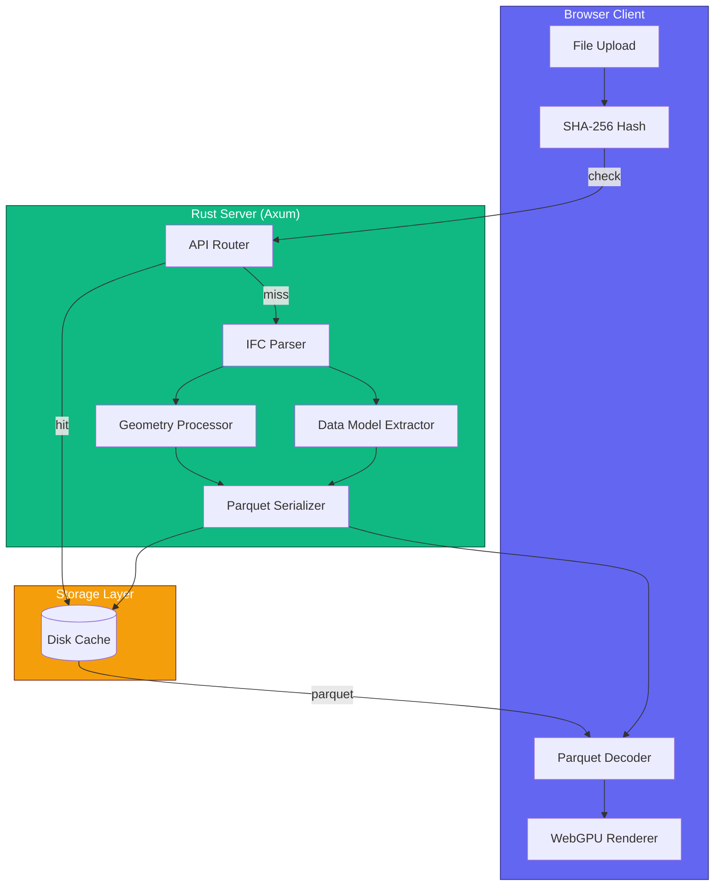
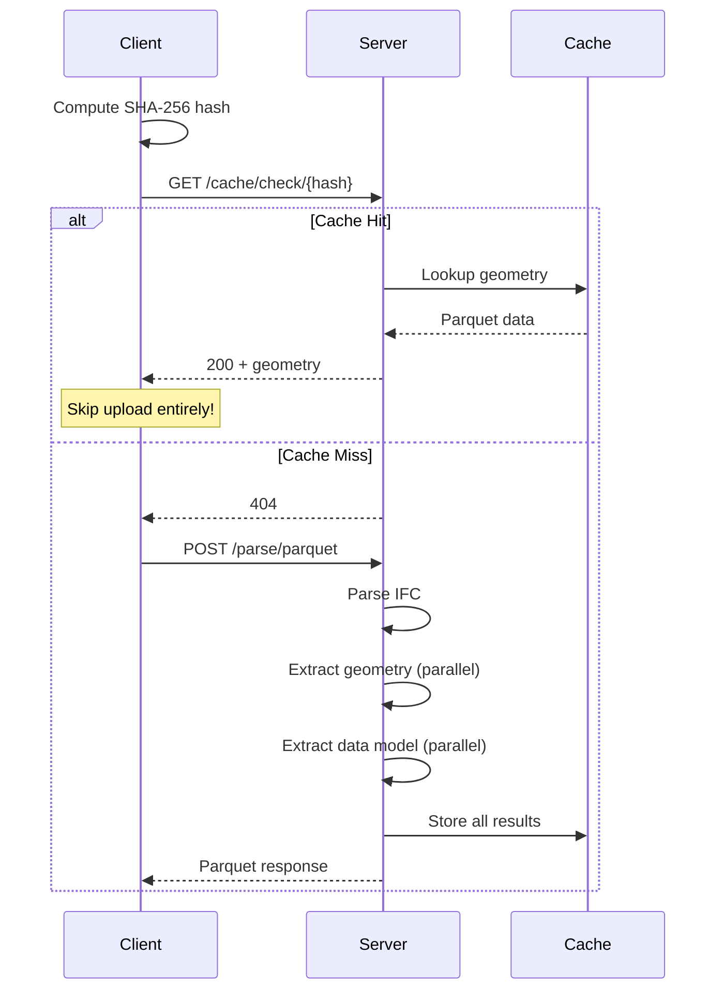
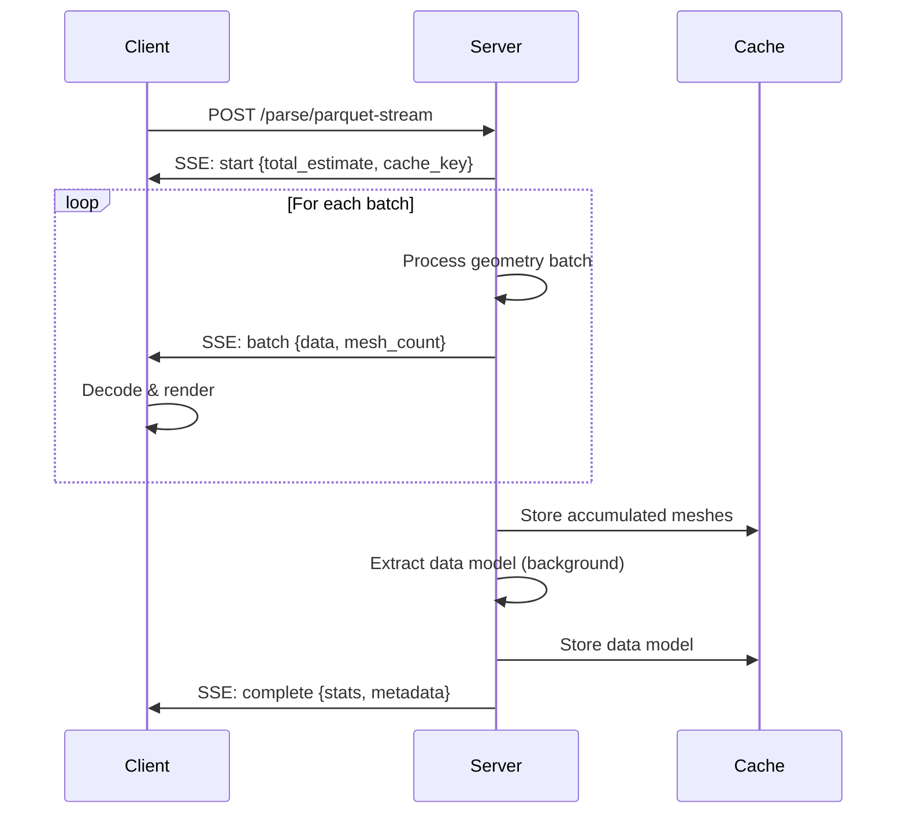

# Server Guide

This guide covers the IFClite server architecture for production deployments with intelligent caching, parallel processing, and streaming.

## Overview

The IFClite server processes IFC files on a high-performance Rust backend, providing:

- **Content-Addressable Caching** - Same file = instant response (skip upload entirely)
- **Parallel Processing** - Multi-core geometry extraction with Rayon
- **Parquet Format** - roughly 15-50x smaller payloads than JSON
- **SSE Streaming** - Progressive geometry for immediate rendering
- **Full Data Model** - Properties, quantities, and spatial hierarchy computed upfront

!!! info "Client-Side WASM Is Now the Default"
    As of the latest release, **client-side WASM parsing is the default** processing mode. The server is no longer required for basic usage and must be explicitly opted into. Use the server when you need shared caching, parallel processing for very large files, or team-wide deployments.

## When to Use Server vs Client

| Scenario | Recommendation |
|----------|----------------|
| Single file, one-time view | Client-only (`@ifc-lite/parser`) |
| Team sharing same files | Server with caching |
| Large models (100+ MB) | Server with streaming |
| Repeat access to same files | Server with caching |
| Offline/embedded apps | Client-only |
| Privacy-sensitive data | Client-only |

## Architecture



## Quick Start

### 1. Start the Server

<!-- markdownlint-disable MD046 -->
=== "Docker (Recommended)"

    ```bash
    docker run -p 3001:8080 \
      -v ifc-cache:/app/cache \
      ghcr.io/ltplus-ag/ifc-lite-server
    ```

=== "Native Binary"

    ```bash
    npx @ifc-lite/server-bin
    ```

=== "From Source"

    ```bash
    cd apps/server
    cargo run --release
    ```
<!-- markdownlint-enable MD046 -->

### 2. Connect from Client

```typescript
import { IfcServerClient } from '@ifc-lite/server-client';

const client = new IfcServerClient({
  baseUrl: 'http://localhost:3001'
});

// Health check
const health = await client.health();
console.log('Server status:', health.status);
```

### 3. Parse a File

```typescript
// Parquet format (~15x smaller than JSON)
const result = await client.parseParquet(file);

console.log(`Meshes: ${result.meshes.length}`);
console.log(`Cache key: ${result.cache_key}`);
console.log(`From cache: ${result.stats.from_cache}`);
```

## API Endpoints

### Parse Endpoints

| Endpoint | Method | Description |
|----------|--------|-------------|
| `/api/v1/parse` | POST | Full parse, JSON response |
| `/api/v1/parse/parquet` | POST | Full parse, Parquet response (~15x smaller); `?data_model_entities=rooted` writes the [rooted-only data model](#rooted-only-entities-table-opt-in) |
| `/api/v1/parse/parquet/optimized` | POST | Optimized Parquet (~50x smaller); also produces the data model, like `/parse/parquet`; `?sha256=` replays a cache hit with no upload; `?data_model_entities=rooted` writes the [rooted-only data model](#rooted-only-entities-table-opt-in) |
| `/api/v1/parse/stream` | POST | Streaming JSON (SSE) |
| `/api/v1/parse/parquet-stream` | POST | Streaming Parquet (SSE); `?sha256=` replays a cache hit with no upload; `?parquet_layout=shared-shapes&stream_shapes=cross-batch` shares shapes across batches (see [below](#sharing-across-stream-batches-opt-in)); `?data_model_entities=rooted` fills the [rooted-only data model](#rooted-only-entities-table-opt-in) |
| `/api/v1/parse/metadata` | POST | Quick metadata only (no geometry) |

All parse endpoints that return geometry also surface the 2D symbol stream
(`IfcAnnotation` + `IfcGrid`), matching `@ifc-lite/parser`. The JSON and SSE
responses carry it inline as `symbolic_data` (in the `complete` event for the
streaming variants); the binary Parquet transports expose it by cache key via
`/api/v1/parse/symbolic/{key}` (see below).

Every geometry endpoint's `ModelMetadata` carries `length_unit_scale` (factor to
convert model length values to metres, e.g. `0.001` for millimetres) and, when
the model has an `IfcMapConversion` / `IfcProjectedCRS`, a `georeferencing`
object (CRS name, datum, false eastings/northings, orthogonal height, grid-north
rotation, and a local→map 4×4 matrix) — matching `@ifc-lite/parser`. For the
JSON/SSE endpoints it's on `metadata`; for the Parquet endpoints it's in the
`X-IFC-Metadata` header.

### Cache Endpoints

| Endpoint | Method | Description |
|----------|--------|-------------|
| `/api/v1/cache/check/{hash}` | GET | Check if file is cached (200 or 404); pass the same `data_model_entities` the upload would, since a hit requires that data model |
| `/api/v1/cache/geometry/{hash}` | GET | Fetch cached geometry (no upload) |
| `/api/v1/cache/{key}` | GET | Retrieve the cached `POST /api/v1/parse` result for the `cache_key` that route returned, with `stats.from_cache: true` (404 when that route has not cached one) |
| `/api/v1/cache/{key}` | DELETE | Evict every cached representation of the source file that `cache_key` names (`200` with `{ key, deleted }`; `deleted: 0` when nothing was cached) |
| `/api/v1/parse/data-model/{key}` | GET | Fetch cached data model (200 hit; 202 a fill is running right now for this key; 404 nothing cached and nothing filling it); `?data_model_entities=rooted` fetches the rooted-only variant |
| `/api/v1/parse/symbolic/{key}` | GET | Fetch 2D symbol data (`IfcAnnotation` + `IfcGrid`) as JSON |

### Utility Endpoints

| Endpoint | Method | Description |
|----------|--------|-------------|
| `/` | GET | API information |
| `/api/v1/health` | GET | Health check (liveness; always open) |
| `/api/v1/ready` | GET | Readiness probe (503 while the memory breaker is shedding load) |
| `/api/v1/metrics` | GET | Prometheus text metrics (registered only when `IFC_METRICS_ENABLED=1`) |

!!! note "One key for `GET` and `DELETE /api/v1/cache/{key}`"
    Both methods take the same `{key}`: the request `cache_key` a parse
    returned (`result.cache_key` from `POST /api/v1/parse`, or the `cache_key`
    in a Parquet response's `X-IFC-Metadata` header). That is the file's
    SHA-256, then `-{opening_filter}`, then `-q{level}` for a non-default
    tessellation quality, e.g. `71c9…34c9-default` or `71c9…34c9-ignore_all-qhigh`.
    Both resolve it through the same function, so a key one accepts the other
    accepts, and anything else (a bare SHA-256, an internal storage key with a
    `-json-v6` or `-parquet-v8` suffix) is a `400 BAD_REQUEST` from both.
    `GET` returns the entry for that exact variant. `DELETE` removes every
    variant of that source file (all opening filters, quality levels and
    transports), since they are all derived from one file. Before #5750
    `DELETE` took the bare SHA-256 instead; pass the `cache_key` now.

    A cache `GET` decodes and re-encodes the whole stored model, so a hit holds
    a parse admission slot, like a parse does: under load it can answer
    `503 OVERLOADED` with a `Retry-After` header. A miss is answered without one.

!!! note "Optional bearer-token auth"
    When `IFC_SERVER_API_TOKEN` (or `API_TOKEN`) is set, all parse and cache
    endpoints require an `Authorization: Bearer <token>` header and return 401
    otherwise. The `/`, `/api/v1/health`, and `/api/v1/ready` probes stay open
    so health checks keep working. When unset (the default), all routes are
    open and the server logs a startup warning that it is unauthenticated.

## Client SDK

### IfcServerClient

```typescript
import { IfcServerClient } from '@ifc-lite/server-client';

const client = new IfcServerClient({
  baseUrl: 'http://localhost:3001',
  timeout: 300000  // 5 minutes (default)
});
```

### Parse Methods

#### parseParquet (Recommended)

Best for most use cases - roughly 15x smaller payloads than JSON.

```typescript
const result = await client.parseParquet(file);

// Result contains:
// - cache_key: string
// - meshes: MeshData[]
// - metadata: ModelMetadata
// - stats: ProcessingStats
// - parquet_stats: { payload_size, decode_time_ms }
// - data_model?: ArrayBuffer (properties, quantities, hierarchy)
```

#### parseParquetOptimized

Roughly 50x smaller payloads using integer quantization (0.1mm precision).

```typescript
const result = await client.parseParquetOptimized(file);

// Same as parseParquet but with:
// - Integer vertex quantization (0.1mm precision)
// - Byte colors (0-255 instead of 0-1)
// - Mesh deduplication (instancing), rotation-aware: repeated occurrences of
//   one shape at different orientations (e.g. IfcMappedItem reuse) share one
//   template mesh, placed per instance by an origin + a 3x3 rotation
```

#### Which frame the meshes are in

The one-shot parse responses and the Parquet metadata headers carry
`mesh_coordinate_space`, declaring what the server subtracted before writing
the f32 vertices:

| Value | What was subtracted |
|---|---|
| `site_local` | the `IfcSite` placement's translation, and its rotation removed (`site_transform` puts it back) |
| `model_rtc` | a detected model-level anchor, reported as `metadata.coordinate_info.origin_shift`; no rotation removed |
| `raw_ifc` | nothing; vertices are in raw IFC world space |

The field is typed `MeshCoordinateSpace | undefined` (it was `string` until
the union landed), so a `switch` over the three tiers is exhaustive and a typo
in a comparison is a compile error. Two things make absence load-bearing rather
than a nuisance:

- a server older than the tag sends nothing;
- a server that sends a value outside the three has it DROPPED by the client,
  with a console warning, rather than handed on looking like a tier. The Rust
  side spells the tag `site_local` / `model_rtc` / `raw_ifc` and its own
  deserializer rejects anything else, so a fourth value means a producer that
  hand-rolled the JSON.

So handle `undefined`; do not read it as `raw_ifc`.

**The streaming API carries no tag at all.** `parseParquetStream`'s events and
its `ParquetStreamResult` have no `mesh_coordinate_space` field, so a streamed
model gives you no way to learn which frame its vertices are in. Use one of the
one-shot methods when you need to know. This gap is tracked on issue #4611.

```typescript
import {
  asMeshCoordinateSpace,
  MESH_COORDINATE_SPACES,
  withNarrowedCoordinateSpace,
  type MeshCoordinateSpace,
} from '@ifc-lite/server-client';

const result = await client.parseParquet(file);
if (result.mesh_coordinate_space === 'site_local') {
  // `site_transform` is the IfcSite placement to put back to reach world space.
  console.log(result.site_transform);
}

// From a string you obtained elsewhere (a config value, another server):
const fromConfig: unknown = 'model_rtc';
const space: MeshCoordinateSpace | undefined = asMeshCoordinateSpace(fromConfig);

// For a wire object you parsed yourself, e.g. a cached JSON body. MUTATES the
// object and returns it with the tag retyped, dropping an unrecognised one:
const cachedBody = '{"mesh_coordinate_space":"raw_ifc"}';
const checked = withNarrowedCoordinateSpace<{ mesh_coordinate_space?: unknown }>(
  JSON.parse(cachedBody)
);

// readonly ['site_local', 'model_rtc', 'raw_ifc']
console.log(space, checked.mesh_coordinate_space, MESH_COORDINATE_SPACES);
```

#### parseParquetStream

Progressive rendering for large files (>50MB).

```typescript
import type { MeshData as ServerMeshData } from '@ifc-lite/server-client';

// Server meshes use snake_case fields (express_id); map them into the
// renderer's camelCase MeshData shape before uploading.
const toRendererMesh = (m: ServerMeshData) => ({
  expressId: m.express_id,
  ifcType: m.ifc_type,
  positions: m.positions,
  normals: m.normals,
  indices: m.indices,
  color: m.color,
});

const streamResult = await client.parseParquetStream(file, (batch) => {
  // Called for each geometry batch
  renderer.addMeshes(batch.meshes.map(toRendererMesh));
});

// Or use async iterator
for await (const event of client.parseStream(file)) {
  switch (event.type) {
    case 'start':
      console.log(`Processing ~${event.total_estimate} entities`);
      break;
    case 'batch':
      renderer.addMeshes(event.meshes.map(toRendererMesh));
      break;
    case 'progress':
      console.log(`${event.processed}/${event.total}`);
      break;
    case 'complete':
      console.log(`Done in ${event.stats.total_time_ms}ms`);
      break;
  }
}
```

#### getMetadata

Quick metadata extraction without geometry processing.

```typescript
const metadata = await client.getMetadata(file);

// Returns:
// - schema_version: string (e.g. 'IFC2X3', 'IFC4', 'IFC4X3')
// - entity_count: number
// - geometry_count: number
// - file_size: number
// - oversized_id_count?: number  // records the scan refused (#3395)
// - malformed_record_found?: boolean  // the scan stopped early (#3695)
```

The last two report that `entity_count` covers less than the file declares:
`oversized_id_count` is how many records were skipped for an instance name
too large to represent, and `malformed_record_found` means the scan hit a
record with no terminating `;` (an unterminated string or comment, or a
truncated upload) and stopped there, so the count covers only the bytes
before the break.

Both are **optional**, and absence is not the same as zero. A server older
than these fields sends neither, which means "not scanned for" — never
"clean". Branch on presence before reading the value:

```typescript
const metadata = await client.getMetadata(file);
if (metadata.malformed_record_found) {
  console.warn('This file is truncated — the counts above are partial.');
} else if (metadata.malformed_record_found === undefined) {
  console.warn('This server does not check; the counts may still be partial.');
}
```

### Cache Methods

#### Checking Cache Before Upload

`parseParquet` hashes the file client-side and checks the server cache
before uploading, so re-parsing the same file skips the upload automatically:

```typescript
// Automatic: parseParquet computes the SHA-256 and does the cache check
// internally, returning the cached result without re-uploading on a hit.
const result = await client.parseParquet(file);
```

To retrieve a previously processed result later, keep its `cache_key`. Re-calling
`parseParquet` serves the geometry straight from the cache; fetch the cached data
model (properties + spatial hierarchy) with `fetchDataModel`:

```typescript
// Geometry: re-calling parseParquet returns the cached result without re-upload.
const result = await client.parseParquet(file);

// Data model (properties + hierarchy) for a known cache key:
const dataModelBuffer = await client.fetchDataModel(result.cache_key);
```

`getCached(key)` is the lower-level lookup for the JSON `parse()` cache: pass
it the `cache_key` a `parse()` call returned and it returns that
`ParseResponse`, or `null` if the server has not cached one. It is not the
retrieval path for Parquet geometry. The same `cache_key` is what
`DELETE /api/v1/cache/{key}` takes to evict the file (see Cache Endpoints);
a bare SHA-256 is refused by both with `400 BAD_REQUEST`.

#### Fetching Data Model

Properties and spatial hierarchy are computed in parallel and cached. Both
`/parse/parquet` and `/parse/parquet/optimized` write the data model
synchronously, BEFORE their response goes out, so a fetch right after either
one returns is already a hit; only the streaming route (`/parse/parquet-stream`)
fills it in the background after its `complete` event, which is the one case
`GET /api/v1/parse/data-model/{key}` answers `202` for (a fill genuinely
running for that key — keep polling). Everything else is `404`: no data model
was ever written for that key and none is in flight, so a client should stop
polling rather than retry forever. `fetchDataModel` treats `404` as terminal:

```typescript
import { decodeDataModel } from '@ifc-lite/server-client';

const result = await client.parseParquet(file);

// After parseParquet/parseParquetOptimized this is already cached; after the
// streaming route it may still be 202 for a moment, so fetchDataModel polls
// on 202 and gives up on 404.
const dataModel = await client.fetchDataModel(result.cache_key);

if (dataModel) {
  const decoded = await decodeDataModel(dataModel);
  console.log(`Entities: ${decoded.entities.size}`);
  console.log(`Property sets: ${decoded.propertySets.size}`);
}
```

#### Rooted-only entities table (opt-in)

By default the data model's entities table carries every STEP instance in the
file. On a large model most of those rows are geometry and property plumbing
with no GlobalId (`IfcPolyLoop`, `IfcFace`, `IfcCartesianPoint`,
`IfcPropertySingleValue`, ...), and that one table can outweigh the optimized
geometry. A client that only ever looks up objects can ask for
`data_model_entities=rooted` (issue #6034): the entities table then carries

- every rooted entity (`IfcRoot` subtypes, the rows with a GlobalId), and
- every non-rooted instance another table of the same data model references by
  id: the `IfcMaterial`, layer, profile and constituent sets and usages the
  materials table names, and the `RelatingMaterial` / `RelatingClassification`
  / `RelatingDocument` of every relationship row.

So every id the relationships, property, quantity, material, classification,
document and spatial tables name still resolves in the entities table. Those
tables are byte-identical to the default payload's, `entity_id`s are unchanged,
and the kept rows stay in file order. The response header's
`data_model_stats.entity_count` still counts the whole model, in both variants.

The two variants are separate cache entries (`-datamodel-v8` and
`-datamodel-rooted-v8`), and each is served only to a request that names it, so
send the SAME value to the parse route, to `/cache/check`, and to
`GET /api/v1/parse/data-model/{key}`. A rooted parse writes only the rooted
table; fetching without the parameter afterwards asks for the full one and
gets `404`. A parse that finds its geometry cached but not the requested
variant's data model re-parses, as it does for a data model that predates the
current payload version.

```typescript
const options = { dataModelEntities: 'rooted' } as const;
const optimized = await client.parseParquetOptimized(file, options);
const rootedDataModel = await client.fetchDataModel(optimized.cache_key, options);
```

#### Fetching Symbolic Data

Symbolic fill records may include `geometry_item_id` for an unambiguous direct
fill item. Combine it with `express_id` and model identity to match a mesh;
absence means the occurrence is not qualified for that match. This provenance
supports 3D overlay routing without removing fills from 2D drawing output.

The JSON (`parse`) and streaming endpoints return the 2D symbol stream
(`IfcAnnotation` + `IfcGrid`) inline as `symbolic_data`. The binary Parquet
endpoints (`parseParquet`, `parseParquetOptimized`) can't carry it inline —
fetch it by cache key instead:

```typescript
const result = await client.parseParquet(file);

const symbols = await client.fetchSymbolic(result.cache_key);
if (symbols) {
  console.log(`Grid axes: ${symbols.grid_axes.length}`);
  console.log(`Annotations: ${symbols.polylines.length} polylines, ${symbols.texts.length} labels`);
}
```

### Utility Methods

```typescript
// Health check
const health = await client.health();

// Uploads are gzip-compressed automatically by parse()/parseParquet(),
// so no manual compression step is needed.

// Check Parquet decoder availability
const available = await client.isParquetSupported();
```

## Data Model

The server computes a complete data model including entities, property sets,
quantity sets, relationships, spatial hierarchy, and — matching `@ifc-lite/parser`
— per-element **classifications** (`IfcClassificationReference`), **materials**
(`IfcMaterialLayerSet` layers with metre thicknesses), and **documents**
(`IfcDocumentReference`). The latter three are exposed as flat, element-keyed
arrays on the decoded `DataModel` (`classifications`, `materials`, `documents`)
and decode to empty arrays when served by an older server/cache.

### Entities

One row per STEP instance in the file, or only the rooted ones plus the
instances other tables reference with `data_model_entities=rooted` (see
[Rooted-only entities table](#rooted-only-entities-table-opt-in)).

```typescript
interface EntityMetadata {
  entity_id: number;
  type_name: string;
  global_id?: string;
  name?: string;
  description?: string;
  object_type?: string;
  has_geometry: boolean;
}
```

### Properties

```typescript
interface PropertySet {
  pset_id: number;
  pset_name: string;
  properties: Property[];
}

interface Property {
  property_name: string;
  property_value: string;
  property_type: string;
}
```

### Quantities

```typescript
interface QuantitySet {
  qset_id: number;
  qset_name: string;
  method_of_measurement?: string;
  quantities: Quantity[];
}

interface Quantity {
  quantity_name: string;
  quantity_value: number;
  quantity_type: string;  // 'Area', 'Volume', 'Length', etc.
}
```

### Relationships

One row per (relating, related) pair: an `IfcRel*` record naming several
related objects is flattened into one row each, so the same `rel_id` can appear
on several rows.

```typescript
interface Relationship {
  rel_type: string;      // e.g. 'IFCRELAGGREGATES', as declared in the file
  relating_id: number;
  related_id: number;
  rel_id?: number;       // express id of the IfcRel entity
}
```

`rel_id` is what a Parquet or DuckDB export writes as `RelId`, and what
identifies the record to delete or edit. Two cases where it is not a live
express id:

- **Absent** (`undefined`) when the server predates the `datamodel-v6` payload,
  which is where the column was added. Consumers fall back to `0`; the viewer
  warns once naming the column, since every id reading 0 otherwise looks like a
  normal graph.
- **`0`** on the synthetic `TYPEHASPROPERTYSETS` rows. Those are read off
  `IfcTypeObject.HasPropertySets` to attach a type's own property sets, and no
  IFC entity declares them, so there is no id to carry.

### Spatial Hierarchy

```typescript
interface SpatialHierarchy {
  nodes: SpatialNode[];
  project_id: number;
  element_to_storey: Map<number, number>;
  element_to_building: Map<number, number>;
  element_to_site: Map<number, number>;
  element_to_space: Map<number, number>;
}

interface SpatialNode {
  entity_id: number;
  parent_id: number;
  level: number;
  path: string;
  type_name: string;
  name?: string;
  elevation?: number;
  children_ids: number[];
  element_ids: number[];
}
```

## Parquet Format

The server uses Apache Parquet for efficient binary serialization.

### Standard Format

```text
[mesh_table][vertex_table][index_table]
```

- **Mesh Table**: express_id, ifc_type, vertex/index offsets, RGBA color
- **Vertex Table**: x, y, z (Float32), nx, ny, nz (Float32)
- **Index Table**: i0, i1, i2 (Uint32 triangle indices)

#### Shared-shape layout (opt-in)

`POST /api/v1/parse/parquet` and `/parse/parquet-stream` accept
`?parquet_layout=shared-shapes`. Occurrences of one shape — repeated furniture,
pipe runs, structural members — then share a single block of vertices instead of
each carrying a full copy, and the mesh table gains nine `rot0..rot8` columns
(row-major 3x3, Float32) placing each occurrence. Sharing runs in the same two
stages `/parse/parquet/optimized` uses (issue #5130): rotation-aware
`IfcMappedItem`/`IfcRepresentationMap` placement first, then a content hash of
each remaining occurrence's vertex/index buffers, so bit-identical repeats with
no instancing metadata at all still collapse onto one shape:

```text
world_vertex = origin + R * position
```

Both values in the same Y-up metres frame as the positions. On a model with
repeats this is typically 2.4x to 4.8x smaller; a model with nothing to share is
unchanged apart from the identity rotation columns.

**It is opt-in, and it must stay that way.** The layout renders incorrectly on a
client that does not apply the rotation — every occurrence of a shared shape
lands at the template's placement — and this format carries no version marker
such a client could reject, so the server cannot produce it unless the request
says the client understands it. Omit the parameter and you get the layout above,
byte for byte.

Two further consequences:

- **`origin_x/y/z` must be read.** On the default layout from a stock server it
  is zero on every row, so a decoder could ignore it and be accidentally right.
  Under `shared-shapes` it carries the placement.
- **Send the same parameter to `/cache/check/{hash}` and
  `/cache/geometry/{hash}`.** The two layouts are cached separately
  (`-parquet-v8` / `-parquet-v9`) and never cross-serve, so a check that omits
  it answers about the other entry. `@ifc-lite/server-client` does this for you.

#### Sharing across stream batches (opt-in)

On `/parse/parquet-stream`, `shared-shapes` alone shares nothing: every batch
decodes on its own, so a shape is re-sent in every batch it occurs in, and the
streamed model is barely smaller than the default layout. Add
`&stream_shapes=cross-batch` (issue #5407) and the stream shares across batches
the way `/parse/parquet` shares across the whole model, while still streaming:

```bash
curl -N -X POST -F "file=@model.ifc" \
  "$SERVER/api/v1/parse/parquet-stream?parquet_layout=shared-shapes&stream_shapes=cross-batch"
```

A batch then carries only the shapes no earlier batch sent. Its mesh rows'
`vertex_start` / `index_start` index the vertex and index rows of the WHOLE
stream so far, so a row can point back into an earlier batch, and every `batch`
event states where its own tables start:

```json
{"type":"batch","batch_number":3,"mesh_count":1000,"data":"...","vertex_base":81234,"index_base":402111}
```

`index_base` counts indices (three per index-table row), the unit of
`index_start`. A client appends each batch's vertex and index tables at those
bases and decodes the batch's mesh rows against everything it holds. It must
refuse a batch whose base is not what it has received: that is a dropped or
reordered batch.

- **Why a second opt-in.** A client that sends only `shared-shapes` decodes each
  batch against that batch's own tables; a row pointing into an earlier batch
  would read out of range, or as another shape's vertices. The bases double as
  the server's acknowledgement: a server that predates the parameter ignores it
  and sends no bases, and each batch then decodes on its own as before.
- **Requires `parquet_layout=shared-shapes`.** Without the rotation columns
  nothing can be placed, so `stream_shapes=cross-batch` on the default layout
  answers `400`. Every other route ignores the parameter.
- **Cache.** Both stream modes fill the same `-parquet-v9` entry, a whole-model
  blob with one row group per batch, which `/cache/geometry/{hash}` serves and
  `decodeParquetGeometry` decodes either way. A cache hit replays to a
  cross-batch client batch by batch, bases included. A batch-local client
  cannot be handed rows that point backwards, so it receives an entry a
  cross-batch stream wrote as a single batch: correct, only not progressive.
- **Bounded server memory.** No occurrence outlives the batch it arrived in.
  What persists across batches is, per distinct shape, where it landed (40
  bytes, whatever the shape's size), and, per instanced representation, the one
  template mesh its later rotated occurrences are verified against, capped at
  256 MiB in total. Past the cap a representation is simply not carried forward:
  its later occurrences are shared within their batch or by content hash
  instead. Sharing degrades; correctness and the bound do not.
- **Client memory.** The client keeps the distinct shapes the stream sent,
  which is the size of the shared payload, not of the model.

`@ifc-lite/server-client`'s `parseParquetStream` sends the opt-in and decodes
both kinds of batch.

### Optimized Format

```text
[instance_table][mesh_table][material_table][vertex_table][index_table]
```

- **Instance Table**: entity_id, ifc_type, mesh_index, material_index
- **Mesh Table**: Deduplicated unique geometries
- **Material Table**: Deduplicated RGBA colors (Uint8)
- **Vertex Table**: Quantized integers (0.1mm precision)
- **Index Table**: Triangle indices

### Decoding on Client

```typescript
import {
  decodeParquetGeometry,
  decodeOptimizedParquetGeometry,
  decodeDataModel
} from '@ifc-lite/server-client';

// Standard Parquet
const meshes = await decodeParquetGeometry(parquetBuffer);

// Optimized Parquet (with vertex dequantization)
const optimizedMeshes = await decodeOptimizedParquetGeometry(parquetBuffer, 10000);

// Data model
const dataModel = await decodeDataModel(dataModelBuffer);
```

## Caching Strategy

### Content-Addressable Keys

Cache keys are derived from file content:

```
# {filter} is the opening filter (e.g. "default"); a non-default tessellation
# quality appends a "-q{level}" suffix after it
{SHA256}-{filter}-parquet-v8          # Geometry (default layout)
{SHA256}-{filter}-parquet-v9          # Geometry (parquet_layout=shared-shapes)
{SHA256}-{filter}-parquet-metadata-v5 # Metadata header
{SHA256}-{filter}-datamodel-v8        # Properties & hierarchy
{SHA256}-{filter}-datamodel-rooted-v8 # Same, rooted-only entities table (data_model_entities=rooted)
{SHA256}-{filter}-symbolic-v3         # 2D symbol stream

# POST /parse/parquet/optimized has its own pair (issue #3889): the optimized
# payload is quantized and deduplicated, so a hit on one route must never
# satisfy the other. Both pairs are built from the same geometry pipeline, so
# a bump of -parquet-v8 almost always needs a bump of -parquet-optimized-v3.
# It shares the flat route's -datamodel-v8 above rather than having a data
# model of its own: since #5129 this route writes one too, gated on
# has_current_data_model before a replay (the same #3869 rule the flat route
# already applied, now also checked by the ?sha256= probe below) so a hit
# warmed before that change re-parses instead of replaying a geometry-only
# entry with no data model behind it.
# The optimized key ignores parquet_layout: this route has only ever emitted
# one payload shape, so there is no second namespace to select between.
{SHA256}-{filter}-parquet-optimized-v3          # Optimized geometry
{SHA256}-{filter}-parquet-optimized-metadata-v3 # Optimized metadata header (v3: gained data_model_stats, #5129)
```

The two geometry keys are LAYOUTS, not versions: they coexist, and a request
reaches one or the other according to its `parquet_layout` parameter (below).
They never cross-serve, because the shared-shape layout renders incorrectly on
a client that does not know to apply its rotation columns.

The `{SHA256}` half is what a client can supply itself, and three endpoints let
it: `GET /api/v1/cache/check/{hash}`, `POST /api/v1/parse/parquet-stream?sha256=`
and (issue #5128) `POST /api/v1/parse/parquet/optimized?sha256=` (above). A
client-supplied hash is a SELECTOR for entries that already exist and nothing
more: it never causes a parse or a write, and on a request that also carries a
file body it is discarded in favour of hashing that body. Both `?sha256=`
probes additionally require it to be 64 lowercase hex characters and answer
`400` otherwise, because the value is concatenated into the keys above and a
caller-shaped hash would otherwise be a caller-shaped key. `/cache/check` and
`/cache/geometry` do not check the shape; a malformed hash there simply names a
key nobody wrote, and they answer `404`. `GET` and `DELETE /api/v1/cache/{key}`
take the whole request `cache_key` rather than the hash, and refuse anything
that is not one with `400`.

Each suffix is bumped whenever the payload it names changes shape: a column
added to or removed from its tables, or a change in what an existing column
means. Without the bump a warm cache replays the old blob, the client decodes
it cleanly as if an older server had answered, and the change is silently
absent. The keys above are built in `apps/server/src/routes/parse/cache_keys.rs`;
that module is the single definition of each one.

### Cache Flow



### Cache Benefits

| Scenario | Without Cache | With Cache |
|----------|--------------|------------|
| First load of a file | Full parse + geometry extraction | Full parse + geometry extraction |
| Repeat load of the same file | Full parse again | **Serve pre-computed Parquet from disk** |
| Upload | Always | **Skipped entirely on a hit** (hash check first) |

On a cache hit the server does no parsing at all: the response is a disk read
plus network transfer, so repeat loads are typically orders of magnitude
faster than the first load.

## Server Configuration

### Environment Variables

| Variable | Default | Description |
|----------|---------|-------------|
| `PORT` | 8080 | Server port |
| `RUST_LOG` | info (+ debug for server/http spans) | Log filter (error, warn, info, debug, trace) |
| `MAX_FILE_SIZE_MB` | 500 | Maximum upload size in MB |
| `WORKER_THREADS` | CPU cores | Parallel processing threads |
| `CACHE_DIR` | `./.cache` (`/app/cache` in Docker) | Cache directory path |
| `REQUEST_TIMEOUT_SECS` | 300 | Request timeout in seconds |
| `IFC_STREAM_IDLE_TIMEOUT_SECS` | 600 | Close a streaming connection after this many seconds with no socket-write progress; `0` disables |
| `INITIAL_BATCH_SIZE` | 100 | Streaming initial batch size |
| `MAX_BATCH_SIZE` | 1000 | Streaming maximum batch size |
| `CACHE_MAX_AGE_DAYS` | 7 | Cache retention in days |
| `CORS_ORIGINS` | localhost dev origins | Allowed CORS origins (comma-separated, `*` for all) |
| `IFC_SERVER_API_TOKEN` | unset | Optional bearer token for parse/cache routes (falls back to `API_TOKEN`) |
| `IFC_MAX_CONCURRENT_PARSES` | `WORKER_THREADS` | Parse jobs admitted at once (CPU gate) |
| `IFC_MEM_BUDGET_MB` | 70% of detected memory limit | Upload bytes admitted at once; `0` disables the memory gate |
| `IFC_ADMISSION_QUEUE_DEPTH` | 2 x `WORKER_THREADS` | Requests allowed to queue for an admission permit |
| `IFC_ADMISSION_QUEUE_TIMEOUT_SECS` | 5 | Longest a queued request waits for a permit |
| `IFC_MEM_SHED_PCT` | 85 | RSS percentage of the budget above which new parses are shed |
| `IFC_METRICS_ENABLED` | false | Expose `GET /api/v1/metrics` |

### Docker Compose

```yaml
version: '3.8'

services:
  ifc-lite-server:
    image: ghcr.io/ltplus-ag/ifc-lite-server:latest
    ports:
      - "3001:8080"
    environment:
      - RUST_LOG=info
      - MAX_FILE_SIZE_MB=500
      - WORKER_THREADS=8
      - CACHE_MAX_AGE_DAYS=30
    volumes:
      - ifc-cache:/app/cache

volumes:
  ifc-cache:
```

!!! tip "Adding Health Checks"
    For orchestration systems requiring health checks, the server exposes
    `GET /api/v1/health`. If your runtime image includes `curl` or `wget`:

    ```yaml
    healthcheck:
      test: ["CMD-SHELL", "curl -f http://localhost:8080/api/v1/health || exit 1"]
      interval: 30s
      timeout: 10s
      retries: 3
    ```

### Production Deployment

For production, consider:

1. **Reverse Proxy** - Use nginx or Traefik for SSL termination
2. **Persistent Cache** - Mount a volume for the cache directory
3. **Resource Limits** - Set memory/CPU limits based on expected file sizes
4. **Monitoring** - Enable debug logging for troubleshooting

```bash
# Railway deployment
railway up

# Fly.io deployment
fly deploy

# Kubernetes
kubectl apply -f k8s/deployment.yaml
```

## Streaming

### Dynamic Batch Sizing

The server uses dynamic batch sizing for optimal streaming:

- **Initial batch**: 100 entities (fast first frame)
- **Growth**: Increases based on processing speed
- **Maximum**: 1000 entities per batch

### Streaming Flow



### Skipping the upload on a cache hit

The cache key is the SHA-256 of the bytes the server receives, so the upload
used to finish before the cache could be consulted: a hit on a 40 MB model
still paid for 40 MB on the wire. `POST /api/v1/parse/parquet-stream` therefore
accepts the hash on its own (issue #3901):

```bash
# No body. The hash names the entry; the query names which entry.
curl -X POST "$SERVER/api/v1/parse/parquet-stream?sha256=$SHA&parquet_layout=shared-shapes"
```

- **200** with the SSE stream: everything the replay needs was cached, and it
  replays exactly the events a live parse emits, batch by batch.
- **404**: nothing cached under that key. Resend the request with the multipart
  `file` body, which is the normal path. This is the same status
  `GET /api/v1/cache/check/{hash}` uses for "upload it".
- **400**: the `sha256` value is not 64 lowercase hex characters.

Two rules keep the parameter honest:

- **A hash sent alongside a body is ignored.** The received bytes decide which
  entry is read and written, always. A client cannot store one file's geometry
  under another file's key.
- **The hash only selects.** It can not cause anything to be parsed or written;
  a key with nothing behind it is a 404, never a parse.

Send the same `opening_filter`, `tessellation_quality` and `parquet_layout` you
would send with the file. They are part of the cache identity, so a hash paired
with a different layout asks about a different entry.

`POST /api/v1/parse/parquet/optimized` accepts the same `?sha256=` parameter,
with the same two rules and the same status codes (issue #5128) — the only
difference is the response is a single body, not an SSE stream, so a hit is a
plain `200` rather than a replayed `start`/`batch`/`complete` sequence:

```bash
curl -X POST "$SERVER/api/v1/parse/parquet/optimized?sha256=$SHA"
```

Send the same `opening_filter` and `tessellation_quality` you would send with
the file, same as above — but not `parquet_layout`: that parameter is a
flat-route-only concept (above), and the optimized route ignores it, cache key
included, because it has only ever emitted one payload shape.

`@ifc-lite/server-client` does this for you: `parseParquetStream` hashes the
file locally, probes, and uploads on the 404. It also uploads when the probe is
not answered at all, which is what a server built before this change does (its
route still requires a multipart body, so a bodyless POST is rejected as a bad
boundary), when a proxy refuses the shape, when admission sheds the probe, or
when it times out. A probe gets a 5 second budget for its headers, not the
client's full request timeout, because a probe that is not fast is not worth
the upload it is delaying. Pass `{ skipCacheProbe: true }` to go straight to
the upload.

!!! note "Compressed uploads never hit the probe"

    The server keys on the bytes it parses, which is what it receives after
    unwrapping `.ifcZIP` or gzip. A probe carrying the hash of a still-packed
    file names a key nothing was written under, so it answers 404 and the
    client uploads. That is correct, just not a saving. `GET /cache/check`
    behaves the same way, for the same reason.

### Client-Side Streaming

```typescript
import type { MeshData as ServerMeshData } from '@ifc-lite/server-client';

// Server meshes use snake_case fields; map to the renderer's shape.
const toRendererMesh = (m: ServerMeshData) => ({
  expressId: m.express_id,
  ifcType: m.ifc_type,
  positions: m.positions,
  normals: m.normals,
  indices: m.indices,
  color: m.color,
});

// Using callback
await client.parseParquetStream(file, (batch) => {
  // batch.meshes are already decoded server MeshData
  renderer.addMeshes(batch.meshes.map(toRendererMesh));
});

// Using async iterator
for await (const event of client.parseStream(file)) {
  if (event.type === 'batch') {
    renderer.addMeshes(event.meshes.map(toRendererMesh));
  }
}
```

## Performance Optimization

### Server-Side

1. **Parallel Processing** - Geometry and data model extracted concurrently
2. **Rayon Thread Pool** - Utilizes all CPU cores
3. **Streaming Caching** - Meshes accumulated during stream, cached at end
4. **Lazy Data Model** - Client polls for data model while rendering geometry

### Client-Side

1. **Hash Check First** - Skip upload if file is cached
2. **Parquet Decoding** - WASM-based decoder for fast parsing
3. **Progressive Rendering** - Render batches as they arrive
4. **Background Polling** - Fetch data model while geometry renders

### Network

1. **Gzip Compression** - Applied automatically on upload by `parse()`/`parseParquet()`
2. **Parquet Format** - roughly 15-50x smaller than JSON
3. **SSE Streaming** - No polling overhead

## Error Handling

### Error envelope

Every error response, on every route and status, has the same JSON body:

```json
{ "error": "Not found: Cache key not found: 71c9…34c9-default", "code": "NOT_FOUND" }
```

`error` is a human-readable message; `code` is a stable identifier to branch
on. That covers handler failures and the responses no handler writes: a
malformed query string or non-multipart upload (`BAD_REQUEST`), a missing or
wrong bearer token (`UNAUTHORIZED`, with `WWW-Authenticate: Bearer`), an
unknown route (`NOT_FOUND`), a wrong method (`METHOD_NOT_ALLOWED`), the
request timeout (`REQUEST_TIMEOUT`), and a caught panic (`INTERNAL_ERROR`).
Before #5750 those used a `text/plain` body or no body at all.

| `code` | Status | Meaning |
|--------|--------|---------|
| `BAD_REQUEST` | 400 | Malformed request: bad query value, bad path key, not multipart |
| `MISSING_FILE` | 400 | Multipart upload with no `file` field |
| `MULTIPART_ERROR` | 400 | The multipart body could not be read |
| `UNAUTHORIZED` | 401 | Bearer token missing or wrong |
| `NOT_FOUND` | 404 | Nothing cached for this key, or no such route |
| `METHOD_NOT_ALLOWED` | 405 | Route exists, method does not (`Allow` lists the valid ones) |
| `REQUEST_TIMEOUT` | 408 | The request ran past `REQUEST_TIMEOUT_SECS` |
| `FILE_TOO_LARGE` | 413 | Upload above `MAX_FILE_SIZE_MB` |
| `OVERLOADED` | 503 | Admission queue full or memory breaker shedding; retry after `Retry-After` seconds |
| `PROCESSING_ERROR`, `PARQUET_ERROR`, `CACHE_ERROR`, `TASK_ERROR`, `INTERNAL_ERROR` | 500 | Server-side failure |

Two bodies are deliberately not the envelope: `GET /api/v1/ready` answers its
`503` with the same `{ status, version, service }` document as its `200`,
because it is a probe, and a failure after a stream has started arrives as an
SSE `error` event (below), because the `200` has already been sent.

### Server Errors

The client throws an `IfcServerError` for any non-2xx response, carrying the
HTTP `status` and the envelope's `code`:

```typescript
import { IfcServerError } from '@ifc-lite/server-client';

try {
  const result = await client.parseParquet(file);
} catch (error) {
  if (error instanceof IfcServerError) {
    if (error.code === 'FILE_TOO_LARGE') {
      console.error('File too large - increase MAX_FILE_SIZE_MB');
    } else if (error.code === 'REQUEST_TIMEOUT') {
      console.error('Timeout - try streaming for large files');
    } else if (error.code === 'OVERLOADED') {
      console.error('Server busy - retry shortly');
    } else {
      console.error(`Server error ${error.status}:`, error.message);
    }
  }
}
```

A body that is not the envelope (a proxy in front of the server answered)
still produces an `IfcServerError`, with `code` set to `HTTP_<status>`.

### Streaming Errors

A stream can fail in two different ways, and they surface differently.

The server can **report** a failure, which arrives as an `error` event:

```typescript
for await (const event of client.parseStream(file)) {
  if (event.type === 'error') {
    console.error('Stream error:', event.message);
    break;
  }
}
```

Or the stream can simply **stop** — the connection drops, or the server dies
mid-parse — in which case no `error` event is ever sent. There is nothing to
inspect in the loop, so `parseStream()` **throws** once the body ends without a
terminal event. Handle both:

```typescript
try {
  for await (const event of client.parseStream(file)) {
    if (event.type === 'error') {
      console.error('Stream error:', event.message);
      break;
    }
  }
} catch (error) {
  // "Stream ended without a complete event (connection dropped or the server
  // failed mid-parse)" — the parse did NOT finish, and no partial result
  // should be treated as one.
  console.error('Stream did not complete:', error);
}
```

Checking only for `event.type === 'error'` leaves the second case unhandled: the
loop ends early and the throw escapes uncaught. `parseStreamToParquet()` raises
the same error for the same condition.

### Connection Errors

```typescript
try {
  await client.health();
} catch (error) {
  if (error.message.includes('ECONNREFUSED')) {
    console.error('Server not running');
  } else if (error.message.includes('timeout')) {
    console.error('Server not responding');
  }
}
```

## Next Steps

- [Parsing Guide](parsing.md) - Client-side parsing details
- [Rendering Guide](rendering.md) - WebGPU rendering features
- [API Reference](../api/typescript.md) - Complete API documentation
- [Architecture](../architecture/overview.md) - System design details

Symbolic sidecars use schema-v2 cache entries and full JSON responses use v3
to refresh direct fill provenance. Existing Parquet geometry keys stay valid;
a replay needs current symbolic metadata, so stale sidecars trigger a reparse.
Older symbol JSON remains decodable with unknown item provenance.
