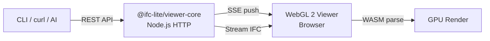

# 3D Viewer & Analysis

The `view` and `analyze` commands turn the CLI into a visual BIM analysis tool. Launch an interactive WebGL 2 viewer in the browser, then drive it from the terminal, scripts, or AI assistants via a REST API.

!!! info "Optional feature"
    The viewer is provided by `@ifc-lite/viewer-core`. All other CLI commands work without it — it only activates when you run `view` or `analyze`.

## `view` — Launch 3D Viewer

```bash
# Open a model in the browser
ifc-lite view model.ifc

# Fixed port (useful for scripting)
ifc-lite view model.ifc --port 3456

# Don't auto-open the browser
ifc-lite view model.ifc --port 3456 --no-open

# Empty scene — build geometry via API
ifc-lite view --empty --port 3456
```

**Flags:**

| Flag | Description |
|------|-------------|
| `--port <N>` | Listen on a specific port (default: random) |
| `--no-open` | Don't open the browser automatically |
| `--empty` | Start with an empty scene (no IFC file) |
| `--send <json>` | Send a command to an already-running viewer (requires `--port`) |

### Interactive Console

While the viewer is running, type commands directly in the terminal:

```
colorize IfcWall red        # Color all walls red
isolate IfcWall IfcSlab     # Show only walls and slabs
xray IfcWall 0.15           # Make walls transparent
highlight 42 43             # Highlight entities by express ID
flyto IfcDoor               # Fly camera to doors
view front                  # Switch to front view
storey                      # Color by building storey
section y center            # Add horizontal section plane
clearSection                # Remove section plane
clear                       # Remove live-created geometry
showall                     # Show all entities
reset                       # Reset colors and visibility
quit                        # Stop the viewer
```

Named colors: `red`, `green`, `blue`, `yellow`, `orange`, `purple`, `cyan`, `white`, `pink`.

### Send Commands from Another Terminal

Use `--send` to control a running viewer without opening a new one:

```bash
ifc-lite view --port 3456 --send '{"action":"colorize","type":"IfcWall","color":[1,0,0,1]}'
ifc-lite view --port 3456 --send '{"action":"setView","view":"top"}'
ifc-lite view --port 3456 --send '{"action":"isolate","types":["IfcWall","IfcSlab"]}'
```

---

## REST API

The viewer exposes a REST API on the same port. Use it from `curl`, scripts, or AI tools.

### `POST /api/command` — Send Viewer Commands

```bash
curl -X POST http://localhost:3456/api/command \
  -H 'Content-Type: application/json' \
  -d '{"action":"colorize","type":"IfcWall","color":[1,0,0,1]}'
```

Returns `{"ok": true, "action": "colorize", "clients": 1}` on success.

#### Type-Level Actions

These operate on all entities of a given IFC type:

| Action | Payload | Description |
|--------|---------|-------------|
| `colorize` | `{type, color}` | Color all entities of a type |
| `isolate` | `{types: [...]}` | Show only listed types |
| `xray` | `{type, opacity?}` | Make a type semi-transparent |
| `flyto` | `{type}` | Fly camera to a type |
| `highlight` | `{ids: [...]}` | Highlight express IDs |
| `colorByStorey` | `{}` | Auto-color by building storey |
| `setView` | `{view}` | Set camera: `front`, `back`, `left`, `right`, `top`, `bottom`, `iso` |
| `showall` | `{}` | Reset visibility |
| `reset` | `{}` | Reset all colors and visibility |

#### Entity-Level Actions

These operate on specific express IDs:

| Action | Payload | Description |
|--------|---------|-------------|
| `colorizeEntities` | `{ids, color}` | Color specific entities |
| `isolateEntities` | `{ids}` | Show only specific entities |
| `hideEntities` | `{ids}` | Hide specific entities |
| `showEntities` | `{ids}` | Show previously hidden entities |
| `resetColorEntities` | `{ids}` | Reset colors on specific entities |

#### Section Planes

| Action | Payload | Description |
|--------|---------|-------------|
| `section` | `{axis, position}` | Add section plane. Axis: `x`, `y`, or `z`. Position: number, `"center"`, or `"50%"` |
| `clearSection` | `{}` | Remove section plane |

### `POST /api/create` — Live Element Creation

Create IFC elements and inject them into the viewer in real time. Accepts a single object or an array for batch creation.

```bash
# Single element
curl -X POST http://localhost:3456/api/create \
  -H 'Content-Type: application/json' \
  -d '{"type":"wall","params":{"Height":3,"Start":[0,0,0],"End":[5,0,0]}}'

# Batch create (single HTTP call)
curl -X POST http://localhost:3456/api/create \
  -H 'Content-Type: application/json' \
  -d '[
    {"type":"wall","params":{"Height":3,"Start":[0,0,0],"End":[5,0,0]}},
    {"type":"wall","params":{"Height":3,"Start":[5,0,0],"End":[5,5,0]}},
    {"type":"slab","params":{"Width":5,"Depth":5}}
  ]'
```

Returns entity list and IFC size:

```json
{"ok":true,"count":3,"entities":[...],"ifcSize":3646}
```

All 29 element types from the [`create` command](cli.md#create-create-ifc-files) are supported. Coordinates use IFC Z-up convention.

### `POST /api/clear-created` — Remove Live Geometry

```bash
curl -X POST http://localhost:3456/api/clear-created
```

Removes all geometry added via `/api/create` from the viewer and server state.

### `GET /api/export` — Download Created Geometry

```bash
curl http://localhost:3456/api/export > created.ifc
```

Downloads all live-created geometry as a valid IFC STEP file.

### `GET /api/status` — Server Status

```bash
curl http://localhost:3456/api/status
```

```json
{"ok":true,"model":"Building.ifc","clients":1,"createdSegments":2}
```

---

## `analyze` — Visual Analysis Overlay

Query entities by type and properties, then push the results as color overlays to a running viewer. Requires a viewer to be running first.

```bash
# Start the viewer
ifc-lite view model.ifc --port 3456 --no-open &

# Find walls missing fire rating — color them red
ifc-lite analyze model.ifc --viewer 3456 \
  --type IfcWall --missing "Pset_WallCommon.FireRating" --color red

# Heatmap by slab area
ifc-lite analyze model.ifc --viewer 3456 \
  --type IfcSlab --heatmap "Qto_SlabBaseQuantities.GrossArea" --palette blue-red

# Filter by property value
ifc-lite analyze model.ifc --viewer 3456 \
  --type IfcWall --where "Qto_WallBaseQuantities.GrossSideArea>50" --color orange

# Isolate + color + fly to
ifc-lite analyze model.ifc --viewer 3456 \
  --type IfcDoor --isolate --color green --flyto
```

**Flags:**

| Flag | Description |
|------|-------------|
| `--viewer <port>` | Port of the running viewer (**required**) |
| `--type <T>` | IFC type to analyze (e.g. `IfcWall`) |
| `--missing <Pset.Prop>` | Find entities missing a property |
| `--where <expr>` | Property filter: `Pset.Prop>100`, `Pset.Prop=true` |
| `--color <name>` | Color matched entities (named or `r,g,b,a`) |
| `--heatmap <Pset.Prop>` | Color by numeric value (gradient) |
| `--palette <name>` | Heatmap palette: `blue-red`, `green-red`, `rainbow` |
| `--isolate` | Hide non-matching entities |
| `--flyto` | Fly camera to matched entities |
| `--rules <file.json>` | Run multiple rules from a JSON file |
| `--json` | Machine-readable output |

### Rules File

Run multiple analysis rules in one pass using a JSON file:

```json
[
  {
    "name": "Missing fire rating",
    "type": "IfcWall",
    "missing": "Pset_WallCommon.FireRating",
    "color": "red",
    "isolate": true
  },
  {
    "name": "Large slabs",
    "type": "IfcSlab",
    "where": "Qto_SlabBaseQuantities.GrossArea>100",
    "color": "orange"
  },
  {
    "name": "Wall area heatmap",
    "type": "IfcWall",
    "heatmap": "Qto_WallBaseQuantities.GrossSideArea",
    "palette": "blue-red"
  }
]
```

```bash
ifc-lite analyze model.ifc --viewer 3456 --rules rules.json --json
```

---

## Coordinate Convention

IFC uses **Z-up**; the WebGL viewer uses **Y-up** internally. The WASM geometry engine handles the conversion automatically during mesh parsing. When using `/api/create`, pass coordinates in IFC Z-up convention (`[x, y, z]` where Z is vertical).

## Architecture



The viewer is a self-contained WebGL 2 application served as a single HTML page. Commands flow from external tools through the REST API, get broadcast to connected browsers via Server-Sent Events (SSE), and execute in the WebGL renderer.

Key design decisions:

- **IFC streamed from disk** — large models aren't buffered in Node.js memory
- **WASM geometry engine** — parsing and mesh generation happen in the browser
- **GPU color-ID picking** — click any entity to see its express ID and type
- **Per-vertex color buffer** — real-time colorization without re-uploading geometry
- **SSE with exponential backoff** — reconnects automatically if the connection drops
- **CORS restricted to localhost** — the API only accepts requests from local origins

## Programmatic Usage (`@ifc-lite/viewer-core`)

The viewer server can be used as a library in your own Node.js tools:

```typescript
import { startViewerServer } from '@ifc-lite/viewer-core';

const viewer = await startViewerServer({
  filePath: 'model.ifc',
  fileName: 'My Model',
  port: 3456,
  onReady: (port, url) => console.log(`Viewer at ${url}`),
});

// Send commands programmatically
viewer.broadcast({ action: 'colorize', type: 'IfcWall', color: [1, 0, 0, 1] });
viewer.broadcast({ action: 'setView', view: 'iso' });

// Check connected clients
console.log(`${viewer.clientCount()} browsers connected`);

// Clean up
viewer.close();
```

**Exports:**

| Export | Description |
|--------|-------------|
| `startViewerServer(opts)` | Start the HTTP + SSE server |
| `VALID_ACTIONS` | `Set<string>` of accepted command actions |
| `getViewerHtml(modelName)` | Get the self-contained viewer HTML |
| `createStreamingViewerAdapter(port)` | SDK adapter for `bim.viewer.*` calls |
| `createStreamingVisibilityAdapter(port)` | SDK adapter for visibility calls |
| `ViewerServer` | Server instance type |
| `CreateHandler` | Handler type for `/api/create` |
