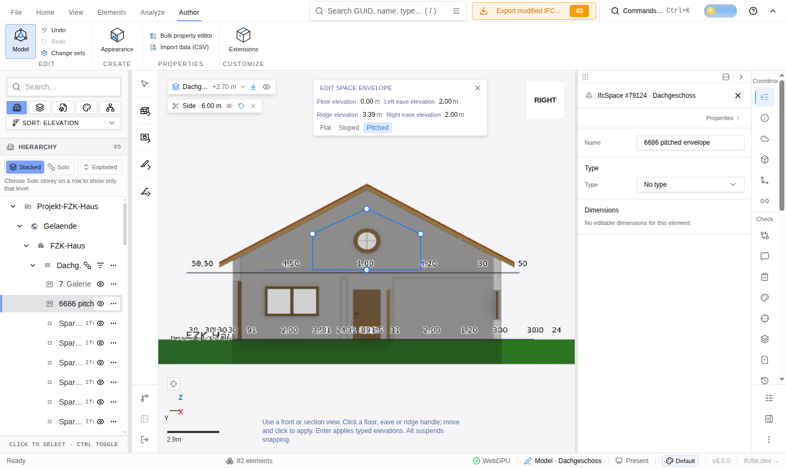

# Space envelope browser evidence (#6686)

Verified with local Google Chrome 153 in WSL, using WebGPU/SwiftShader and
the viewer dev server on port 5190. The real Archicad model was loaded through
the file input: `tests/models/ara3d/AC20-FZK-Haus.ifc`.

Created a 4 × 6 m space on Dachgeschoss, opened **Edit space envelope** from
the command palette, switched to a side section/right view and **Pitched**,
then clicked and moved the ridge handle onto the roof. The shared solver
reported a mesh `vertex` at storey-local approximately `[5, 3.38675146]`.
A second click committed the two ceiling faces. Reopening the command retained
the pitched shape, with a 3.386751461 m ridge and GrossVolume
64.641017532 m³. NetVolume remains absent because the created source had no
NetVolume establishing its provenance. `Height` is absent because IFC defines it only for constant-height
spaces. Floor areas stayed 24 m². The JSON records the actual snap,
saved planes and quantities read from the running browser.

Capture note: Chrome's screenshot compositor left the WebGPU canvas transparent,
although the renderer submitted successful draws. For this screenshot only,
the renderer's `captureColorFrame()` pixels were copied into a temporary canvas
background at the same size, retaining the browser's real editor overlay.
The building image is the actual GPU framebuffer; no geometry was illustrated
or reconstructed. This workaround is not a production change.
